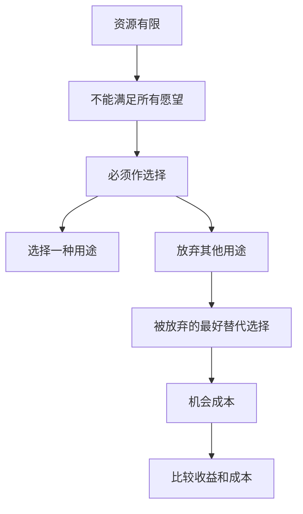

# 1.1 稀缺、选择与机会成本

来源：

- 主线：Mankiw Ch.1, Ch.2
- 补充：Mishkin《货币金融学》Ch.1；Mishkin/Eakins Ch.1；Bodie/Kane/Marcus《Investments》Ch.1

## 为什么不能什么都要

想象一个家庭正在安排一天的生活。有人要做饭，有人要打扫，有人想用车，有人要学习或工作。家庭收入也要在很多用途之间分配：房租、食物、衣服、学费、娱乐、储蓄。每一种用途都合理，但同一笔钱不能同时花两次，同一个小时也不能同时做两件事。

一个社会面对的是同一类问题，只是规模更大。社会需要有人种粮食、制造衣服、建造房屋、开发软件、提供医疗服务、维护公共安全。生产这些东西需要劳动、土地、机器、建筑、技术、管理能力和时间。无论一个社会多富裕，这些资源都不是无限的，因此社会不可能生产所有人想要的全部物品和服务。

这就是经济学的起点：稀缺。稀缺指的是社会资源有限，无法满足所有愿望。它不是贫穷的同义词。贫穷是资源很少，稀缺是资源相对于愿望和用途总是不够。一个富裕家庭仍要决定钱和时间怎么用；一个富裕国家仍要决定医生、工程师、土地、资本和财政收入投向哪里。

经济学研究的正是社会如何管理稀缺资源。这里的“管理”不是单指政府计划，也不只是企业经营，而是所有资源配置问题：生产什么，如何生产，谁来生产，生产成果由谁获得，今天用还是未来用，消费掉还是投资出去。

金融问题也从这里开始。钱只是资源配置的一种表现形式。一个人把收入存起来，就是放弃今天消费，把购买力转移到未来；一家企业借钱建厂，是把未来可能产生的收入提前转化为今天的投资；政府发债，是把未来税收能力和今天公共支出连接起来。只要资源有限，金融就不只是数字游戏，而是稀缺资源在时间和人群之间重新安排。

投资学也从同一个问题出发。投资者手里的资本有限，能承受的波动和亏损也有限。把资金买入股票，就不能同时用同一笔钱买债券、持有现金、偿还贷款或投资自己的教育；把风险预算用在一个高波动策略上，也就减少了留给其他策略的风险空间。后面学习股票、债券、基金和组合管理时，看似是在比较收益率，实质上仍是在稀缺的资本、时间和风险承受能力之间作选择。

## 选择的另一面是放弃

只要资源稀缺，选择就不可避免。选择看起来是在得到某样东西，但它同时意味着放弃其他东西。

一个学生只有一小时可用。如果这一小时用于学习经济学，就不能同时用于心理学、休息、运动、游戏或打工。表面上看，他只是“选择了经济学”；更完整地看，他也放弃了这一小时的其他可能用途。

家庭收入也一样。一美元用于食物，就不能同时用于衣服、学费、旅行或退休储蓄。社会层面也一样。更多资源用于国防，通常意味着更少资源用于消费品；更多资源用于污染治理，可能意味着企业生产成本上升；更多资源用于当前消费，可能意味着未来资本积累减少。

因此，经济学思维不是简单问“这个东西好不好”。教育好，医疗好，环境好，储蓄好，投资也好。真正的问题是：和什么相比？如果把资源用于这里，就不能用于哪里？如果今天使用，就不能留到什么时候？如果给这群人使用，就不能给谁使用？

这就是取舍。没有取舍，就没有经济问题。只要存在取舍，就必须比较不同选择的收益和代价。

## 成本不只是账单上的支出

日常生活中，人们容易把成本理解成花出去的钱。买一本书花 50 元，成本就是 50 元；买一张机票花 1000 元，成本就是 1000 元。这种理解有用，但不够完整。

经济学中的成本更宽。某件事的成本，是为了得到它而必须放弃的东西。这个被放弃的东西，就是机会成本。

上大学是最容易理解的例子。上大学的显性支出包括学费、书本费、住宿费和餐饮费。但如果只把这些账单加起来，就没有算清真正的成本。

首先，有些支出即使不上大学也会发生。人总要吃饭，也需要住处。因此，住宿和餐饮只有超过其他生活方式的那部分，才算上大学额外带来的成本。

其次，上大学占用了大量时间。上课、读书、写论文、准备考试，都意味着这些时间不能用于全职工作。对很多学生来说，放弃的工资收入可能比学费还大。它不会出现在学校账单上，却是上大学真实成本的一部分。

机会成本要求我们看见那些没有发生的选择。一个有机会进入职业体育联盟的学生，如果继续留在大学，就可能放弃一份高收入合同。继续读书也许仍然值得，因为教育有长期价值，也有个人成长意义；但如果完全不考虑被放弃的职业收入，就没有真正比较成本和收益。

## 机会成本为什么改变决策

机会成本不是一个会计技巧，而是一种决策方式。它迫使人们从“我想要什么”转向“我为了它放弃什么”。

如果一个人选择周末旅行，成本不只是车票、酒店和门票，还包括本来可以工作赚到的钱、可以陪伴家人的时间、可以休息恢复精力的机会。旅行带来的快乐可能完全值得这些成本，但只有把被放弃的选择也算进去，才算真正理解这个选择。

投资也是一样。把 1 万元放在活期账户里，显性成本似乎是零，因为钱还在账户中。但机会成本可能是放弃了定期存款、债券、基金或其他投资的收益。买一只股票，机会成本是不能同时用这笔钱买另一只股票、买债券、还贷款或保留现金。企业把利润分红给股东，股东得到现金，但企业也少了用于研发、扩张或偿债的资金。

机会成本还解释了为什么投资评价不能只问“有没有赚钱”。如果某只基金一年赚了 3%，但同一时期安全的短期国债也能赚 4%，那么投资者虽然账面上赚了钱，经济上却放弃了更好的低风险替代选择。后面会把这种思想正式写成“超额收益”：风险资产表现要和无风险利率、基准组合或同等风险的替代投资比较，而不是孤立地看正负收益。

机会成本还会随环境变化。利率上升时，持有现金的机会成本变高，因为把钱存入有息资产可以获得更多回报；利率下降时，持有现金的机会成本变低。就业机会多、工资高时，继续读书的机会成本可能上升；经济低迷、工作难找时，读书的机会成本可能下降。

所以，机会成本不是固定标签，而是和可选方案有关。最重要的问题永远是：在当前条件下，被放弃的最好替代选择是什么？

## 从稀缺到机会成本

这条链条会在后面的课程中反复出现。稀缺带来选择，选择带来放弃，被放弃的最好替代选择就是机会成本。理解这一点之后，很多金融概念会更自然：利率是推迟消费的补偿，也是借用别人资金的价格；投资收益是承担风险和放弃流动性的补偿；债券、股票、现金之间的选择，本质上都是机会成本比较。

## 小结

经济学从稀缺开始。社会资源有限，而人的愿望和资源用途很多，因此个人、家庭、企业和社会都必须选择。

选择不是单纯地得到某物，而是同时放弃其他可能。真正的成本不只是账单上的支出，还包括被放弃的时间、收入、投资机会和其他用途。这个被放弃的最好替代选择，就是机会成本。

机会成本会贯穿后面的经济学和金融学习。只要一个选择占用了时间、资金、劳动力、资本或风险承受能力，就一定存在机会成本。

## 自测问题

- 为什么稀缺不是贫穷，而是所有社会都面对的问题？
- 为什么经济学中的选择必须同时考虑“得到”和“放弃”？
- 上大学的机会成本为什么不只包括学费和生活费？
- 持有现金、买债券、买股票分别可能放弃什么机会？
