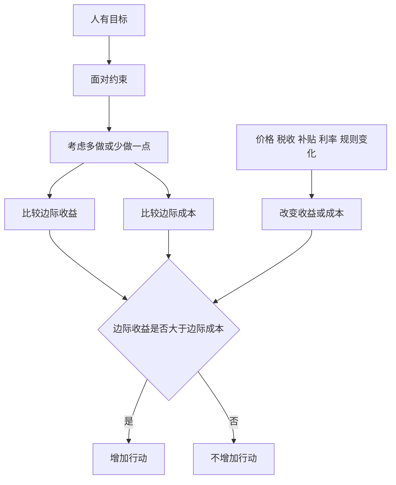

# 1.2 边际思维、激励与权衡取舍

来源：

- 主线：Mankiw Ch.1, Ch.2
- 补充：Mishkin《货币金融学》Ch.1；Mishkin/Eakins Ch.1

## 选择常常发生在“边缘”

很多选择并不是“做”或“不做”的二选一，而是“多做一点”还是“少做一点”。

学生通常不是在“完全不学习”和“一天学习二十四小时”之间选择，而是在决定今晚要不要多复习一小时。吃饭也不是在“完全不吃”和“吃到极限”之间选择，而是在决定要不要再吃一口。企业不是只问“生产还是不生产”，还要问多生产一件产品是否值得。家庭不是只问“储蓄还是消费”，还要问这个月多储蓄 1000 元是否值得。

这种在现有计划边缘上作出的小幅调整，叫边际变动。边际思维关注的不是全部行动的总收益和总成本，而是“再多一点”带来的额外收益和额外成本。

边际收益，是多做一单位带来的额外好处。边际成本，是多做一单位带来的额外代价。一个行动是否值得增加，取决于边际收益是否超过边际成本。

## 平均成本不等于边际成本

一个常见误解，是把平均成本当成决策成本。

假设你每月支付固定费用，获得一个流媒体平台的无限观看权限。这个月你看了 5 部电影，于是可以把月费除以 5，算出每部电影的平均成本。这个数字对理解过去的支出有用，但它不一定能回答今晚要不要再看一部电影。

如果月费已经支付，今晚多看一部电影并不会额外增加平台费用。此时，额外金钱成本可能是零。真正的边际成本主要是时间：看电影的两小时不能同时用于学习、工作、睡觉或陪伴家人。

这说明，边际决策要看“额外一单位”带来的成本，而不是把总成本平均分摊后机械比较。

航空公司的空座例子也一样。一架飞机飞一趟的总成本很高，把总成本平均到每个座位上，每个座位的平均成本也许很高。但如果飞机即将起飞，还有空座，一名候补乘客愿意支付低于平均成本的票价，航空公司仍然可能愿意接受。

原因在于，这个座位如果空着，飞机仍然要飞。增加一名乘客的额外成本可能只包括一点燃料、服务和饮料。只要乘客支付的价格超过这部分边际成本，接受他就可能增加航空公司的收益。

这并不意味着企业长期可以不管平均成本。长期看，收入必须覆盖总成本，否则企业无法生存。但在某个具体的短期边际决策上，关键是额外收益和额外成本。

## 为什么水便宜而钻石昂贵

边际思维还能解释一个看似矛盾的现象：水对生命至关重要，钻石不是必需品，但钻石通常比水贵得多。

如果比较“全部水”和“全部钻石”的价值，水当然更重要。没有水，人无法生存；没有钻石，人仍然可以正常生活。但市场价格通常不是在给“全部水”定价，而是在给“额外一单位水”定价。

在一般情况下，水相对充足。一个人已经有足够饮用水时，再多一杯水带来的额外好处有限。钻石很稀少，多得到一颗钻石带来的额外满足或交换价值较高。因此，额外一颗钻石的边际价值可能远高于额外一杯水。

这个例子提醒我们：很多经济现象不能只看总重要性，而要看边际重要性。价格、消费、生产、投资决策，往往都发生在边际上。

## 激励改变行为

如果人们会比较收益和成本，那么当收益或成本改变时，行为也会改变。诱导人采取某种行动的奖励或惩罚，叫激励。

价格就是最常见的激励。苹果价格上涨，消费者会倾向于少买苹果，果农会更愿意雇人采摘或扩大供给。汽油税提高，开车成本上升，人们更可能选择省油车、电动车、拼车、公共交通，或者住得离工作地点更近。

利率也是激励。利率上升，借款成本提高，买房、买车和企业投资会受到抑制；同时储蓄回报提高，储蓄更有吸引力。利率下降，借款更便宜，投资和消费可能更活跃。金融市场里的许多变化，本质上都是激励变化。

政策同样会改变激励。一个政策的直接目标可能很清楚，但人们会根据新规则调整行为。如果政策制定者只看直接效果，不看行为反应，就可能得到意外结果。

## 安全带法规中的间接后果

汽车安全带法规是理解激励的经典例子。

安全带的直接效果很容易看见：发生事故时，系安全带能降低驾驶者受伤或死亡的概率。只看这一点，强制安装和使用安全带似乎只会提高安全。

但安全带也改变了驾驶者面对的风险。事故后果变轻，驾驶者可能不自觉地开得更快，或者更不谨慎。这样一来，单次事故的伤亡率下降，但事故数量可能上升。驾驶者受到安全带保护，行人却没有同样保护，因此行人可能承担额外风险。

这不是说安全带法规一定不好，而是说明政策分析不能停在第一层。每个政策都会改变成本和收益，从而改变人的行为。真正的效果，等于直接效果加上行为调整后的间接效果。

## 边际和激励是一套思维

边际思维说明人们如何在具体选择上比较收益和成本。激励原则说明，当外部条件改变，收益和成本也会改变，于是行为跟着改变。

这套思维以后会反复出现。税收改变消费者和企业的边际成本；补贴改变某些行动的边际收益；利率改变储蓄和借款的吸引力；监管改变金融机构承担风险的成本；存款保险改变储户和银行的风险感受。

## 小结

很多选择不是全有或全无，而是在现有计划上作小幅调整。边际思维要求比较额外一单位行动带来的收益和成本。只要边际收益大于边际成本，多做一点就是有理由的；反之就不值得。

人们会对激励作出反应。价格、税收、补贴、利率和规则都会改变人们面对的成本收益，从而改变行为。理解激励，才能理解市场如何运转，也才能理解政策为什么会产生意外后果。

## 自测问题

- 为什么“平均成本高”不等于“边际上不该做”？
- 航空公司为什么可能愿意低价卖出临近起飞的空座？
- 水和钻石的例子说明了边际收益的什么特点？
- 安全带法规为什么可能产生间接后果？
- 利率上升会怎样改变借款人和储蓄者的激励？
