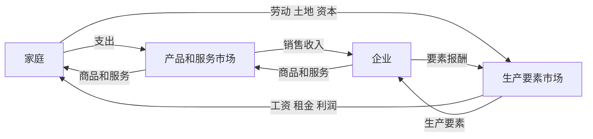

# 1.4 经济模型、假设与实证思维

来源：

- 主线：Mankiw Ch.1, Ch.2
- 补充：Mishkin《货币金融学》Ch.1；Mishkin/Eakins Ch.1；Bodie/Kane/Marcus《Investments》Ch.1

## 像经济学家一样思考是什么意思

学习经济学不仅是记住一些结论，还要学会一种看问题的方法。面对同一个现象，经济学家通常会问：关键选择是什么？约束是什么？激励如何变化？有没有可以检验的证据？哪些因素可以暂时简化，哪些因素必须保留？

这种思考方式有两面。一面像科学家：解释世界如何运转。另一面像政策顾问：讨论世界应该怎样改善。前者强调事实、理论和证据；后者还涉及价值判断。

本节先关注科学家的那一面。经济学研究的是人和社会，不能像自然科学那样随意控制实验环境，但它仍然使用科学方法：提出理论，观察数据，用证据检验理论。

## 理论要接受证据检验

假设一个国家长期物价快速上涨，同时货币数量也快速增加。一个自然的问题是：通货膨胀是不是和货币增长有关？

这时可以提出一个理论：长期高通胀往往来自货币增长过快。这个理论不能只靠直觉成立，它需要证据。可以比较不同国家、不同时期的货币增长率和通胀率。如果货币增长快的经济体经常伴随更高通胀，这个理论就更有说服力；如果两者没有稳定关系，理论就需要修改。

这就是实证思维。实证分析关心“世界是什么样的”，要求命题能够被事实支持或反驳。例如，“货币增长过快通常会推高长期通胀”是实证命题。相比之下，“政府应该把通胀控制在 2%”不仅涉及事实，也涉及政策目标和价值判断。

经济学的困难在于，很多实验不能主动设计。不能为了研究通胀就让某个国家随意印钱，不能为了研究失业就让一批人失去工作。因此，经济学常常依赖历史事件和现实数据提供的自然实验。石油危机、战争、税制改革、金融危机、货币政策转向，都可能帮助人们观察经济机制。

## 为什么模型必须简化现实

现实经济极其复杂。每个家庭、每家企业、每种商品、每项政策、每个心理反应都可能影响结果。如果试图一次性纳入所有因素，分析会变得无法进行。

模型的作用，是有意识地简化现实，保留当前问题最关键的关系。好的模型不是现实的缩小复制品，而是帮助人看清某个机制的工具。

物理学中也有类似做法。分析物体下落时，可以先假设没有空气阻力。这个假设并不完全真实，但如果空气阻力对问题影响很小，先忽略它能让规律更清楚。需要更精确时，再把空气阻力加回来。

经济模型也一样。研究国际贸易时，可以先假设只有两个国家、两种商品；研究供求时，可以先假设其他条件不变；研究银行时，可以先把资产负债表简化成少数几项。关键不是模型是否包含全部现实，而是它是否解释了当前最重要的问题。

看到一个模型时，应该问三个问题：

| 问题 | 含义 |
|---|---|
| 它想解释什么？ | 明确模型目标 |
| 它保留了哪些关键因素？ | 理解核心机制 |
| 它省略了哪些现实复杂性？ | 知道模型边界 |

## 循环流量图：经济不是孤立交易

最简单的经济模型之一，是循环流量图。它把经济简化为两类决策者：家庭和企业；两类市场：产品和服务市场、生产要素市场。

家庭在产品和服务市场购买商品，企业在这个市场出售商品。家庭支付货币，企业获得销售收入。另一方面，家庭在生产要素市场提供劳动、土地和资本，企业购买这些要素并支付工资、租金和利润。

这个模型省略了政府、金融系统、国际贸易和企业之间的复杂关系，但它揭示了一个基础事实：经济是一套循环系统。一个人的支出是另一个人的收入，一个市场的变化会传导到另一个市场。

金融系统可以放进这个循环中理解。家庭的储蓄通过银行、债券市场和股票市场流向企业；企业获得资金后购买资本设备、雇佣工人、扩大生产；未来收入再以工资、利息、股利或利润形式流回家庭。金融不是循环之外的东西，而是让购买力跨时间、跨主体流动的机制。

投资组合也可以放进这个循环中理解。家庭把工资的一部分交给养老金、基金或券商账户，这些资金再通过股票和债券进入企业、政府和金融机构。企业未来创造的利润、政府未来征收的税收、借款人未来偿还的本息，最终又以股利、利息、资本利得或养老金支付的形式回到家庭。这样看，证券不是孤立的价格曲线，而是循环流量中未来收入索取权的市场化表达。

## 生产可能性边界：稀缺、效率和机会成本在一张图里

另一个基础模型是生产可能性边界。设想一个经济只生产两种物品：汽车和电脑。现实经济当然生产成千上万种物品，但只看两种物品，可以把取舍看得更清楚。

给定资源和技术，这个经济能生产一些汽车和一些电脑。如果所有资源都用于汽车，就没有电脑；如果所有资源都用于电脑，就没有汽车；更多时候，社会会在两者之间分配资源。

生产可能性边界上的点代表有效率的生产组合。处在边界上时，想多生产一种物品，就必须少生产另一种。边界内的点代表低效率，因为资源没有被充分利用。边界外的点在当前资源和技术下不可行。

| 位置或变化 | 含义 |
|---|---|
| 边界外 | 当前资源和技术下不可行 |
| 边界上 | 可行且有效率 |
| 边界内 | 可行但低效率 |
| 沿边界移动 | 在两种产品之间取舍 |
| 边界斜率 | 一种产品的机会成本 |
| 边界外移 | 技术进步或资源增加带来增长 |

生产可能性边界通常向外弯曲，因为资源并不都同样适合所有用途。最适合造车的人转去生产电脑，效率可能不高；最适合做电脑的人转去造车，也会损失很多电脑产出。当一个经济已经大量生产汽车时，再多生产汽车通常要牺牲越来越多电脑。

这张图把前面学过的概念集中起来：稀缺决定边界存在；边界外不可行；边界上体现效率；沿边界移动体现取舍；斜率体现机会成本；边界外移体现经济增长。

## 实证判断和规范判断

经济学还要区分两类说法。

实证表述描述世界是什么样。它可以用证据检验。例如，“提高汽油税会减少汽油消费”“货币增长过快会推高长期通胀”“租金上限会影响住房供给”，这些都是关于事实关系的命题。

规范表述讨论世界应该怎样。它包含价值判断。例如，“政府应该提高汽油税”“央行应该把通胀控制在某个目标”“政府应该扩大住房补贴”，这些说法不仅需要事实分析，还需要判断目标是否值得追求。

政策争论常常把两者混在一起。有人支持最低工资，可能是因为相信它能提高低收入者福利，也可能是因为更重视公平；有人反对最低工资，可能是因为担心它减少就业，也可能是因为更重视市场自由。要讨论清楚，必须先分辨哪些分歧来自事实判断，哪些分歧来自价值判断。

## 小结

经济学通过理论、证据、假设和模型来理解现实。模型不是现实的完整复制，而是为了看清关键机制而进行的简化。

循环流量图帮助理解家庭、企业和市场之间的基本流动；生产可能性边界帮助理解稀缺、效率、取舍、机会成本和增长。实证分析回答世界如何运转，规范分析讨论世界应该怎样。

后面学习金融时，也会不断使用模型：资产负债表、债券供求、货币乘数、银行挤兑、政策传导，都是为了把复杂现实拆成可以理解的机制。

投资学同样依赖模型。现值模型把未来现金流折回今天，组合模型把风险拆成单个资产波动和资产之间的共同波动，CAPM 和多因子模型把预期收益与系统性风险联系起来。这些模型都不等于完整现实，但它们迫使我们明确假设：现金流如何产生，折现率为什么变化，风险能否分散，市场价格是否已经反映信息。学会模型思维，就是学会在使用结论之前先问模型保留了什么、忽略了什么。

## 自测问题

- 为什么经济学模型不需要完全描述现实？
- 循环流量图说明了家庭和企业之间的哪些流动？
- 生产可能性边界如何同时说明稀缺、效率和机会成本？
- 实证表述和规范表述有什么区别？
- 为什么政策争论常常既有事实分歧，也有价值分歧？
