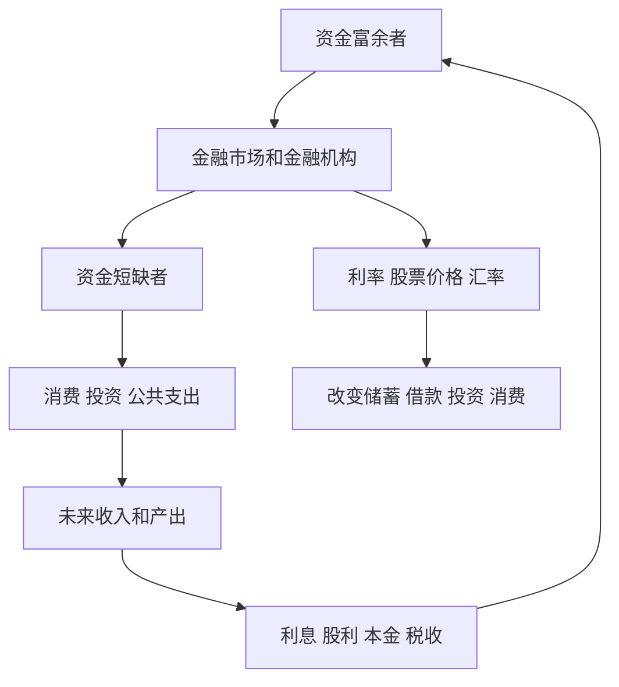

# 1.5 金融为什么是跨时间、跨主体的资源配置

来源：

- 主线：Mankiw Ch.1, Ch.2
- 补充：Mishkin《货币金融学》Ch.1；Mishkin/Eakins Ch.1

## 钱为什么要从一些人流向另一些人

一个现代经济里，有些人暂时有多余资金，有些人暂时缺少资金。一个家庭今天收入高于支出，可能想把钱存起来为未来养老；另一个家庭想买房，但不可能一次性支付全部房款。一个企业发现了有价值的投资项目，却没有足够现金建厂、买设备或研发产品。政府也可能需要在今天建设道路、学校或医院，但税收收入分布在未来很多年。

如果资金只能停留在原地，很多有价值的活动就无法发生。储户的钱可能闲置，企业的投资机会可能错过，家庭无法平滑一生中的消费，政府也难以建设长期公共项目。

金融系统的基本功能，就是让资金从暂时富余的人流向暂时短缺的人。这个过程不是简单转账，而是通过合同、价格、风险承担和信息处理完成。债券、股票、贷款、存款、基金、保险、货币政策和外汇市场，都是这个大系统中的组成部分。

从经济学角度看，金融就是资源配置。它配置的是资金、购买力、风险和未来收入。

## 跨主体配置：资金在不同人之间移动

资金富余者和资金短缺者通常不是同一个人。储户可能没有合适的投资项目，企业家有项目但缺资金；退休基金需要长期投资，政府需要长期借款；普通家庭想安全保存财富，银行可以把许多存款集中起来发放贷款。

金融市场把这些主体连接起来。债券市场让企业和政府向投资者借款；股票市场让企业出售所有权份额来筹集资金；银行把大量储户的小额存款集中起来，转化为家庭和企业贷款；共同基金把许多投资者的钱集合起来，投资于一篮子证券；保险公司把许多人的风险集中起来，向遭受损失的人支付赔偿。

这种跨主体配置能提高效率。资金如果停在没有生产性用途的人手里，社会产出不会增加；如果流向能创造产品、服务、住房、基础设施或技术进步的人手里，就可能提高未来收入和生活水平。

当然，资金流动不是无条件的。借款人必须承诺未来还款，企业必须让投资者分享未来收益，保险购买者要支付保费，银行要评估借款人信用。金融合同就是把今天的资金和未来的收入、风险、权利义务连接起来。

## 跨时间配置：今天和未来之间的交换

金融还解决另一个问题：收入和支出在时间上不匹配。

一个年轻家庭现在收入不高，但需要住房；他们可以通过按揭贷款提前使用未来收入。一个中年人当前收入较高，但未来退休后收入下降；他可以储蓄和投资，把今天的购买力转移到未来。企业今天投资设备，未来多年生产产品并获得收入；政府今天发债建设基础设施，未来通过税收偿还。

这就是跨时间配置。今天的资金和未来的收入通过金融合同连接起来。

利率是跨时间交换的核心价格。借款人今天使用别人资金，未来要支付利息；储蓄者今天推迟消费，未来获得利息作为补偿。利率高，借款成本上升，储蓄回报提高；利率低，借款更便宜，投资和消费更容易发生。

利率变化会影响许多现实决策。汽车贷款利率上升，买车成本提高；住房贷款利率上升，月供增加，房屋可负担性下降；企业贷款利率上升，某些投资项目不再值得做；债券收益率上升，储蓄者可能更愿意持有债券而不是现金。

因此，利率不是金融市场内部的抽象数字，而是连接今天和未来的价格。

## 债券和股票：两种基本融资方式

企业和政府需要资金时，常见方式有两类：借债和出售所有权。

债券是一种债务工具。发行者今天获得资金，承诺未来按约定支付利息和本金。投资者购买债券，相当于把钱借给发行者，换取未来较明确的现金流。债券适合解释“借款—还款”关系。

股票是一种所有权工具。企业发行股票，投资者购买股票后成为公司所有者之一，拥有分享公司未来收益的权利。股票没有固定还本付息承诺。企业经营好，股东可能获得股利和股价上涨；企业经营差，股东也可能承受损失。

这两种工具分配风险的方式不同。债券投资者通常优先获得约定付款，但收益相对有限；股票投资者承担更多不确定性，也可能获得更高回报。企业选择债务还是股权融资，投资者选择债券还是股票，本质上都是在收益、风险、控制权和未来现金流之间权衡。

## 金融机构为什么存在

如果资金可以通过市场直接流动，为什么还需要银行、保险公司、共同基金这些金融机构？

现实中的资金流动有很多障碍。普通储户未必知道哪家企业可靠，哪位借款人有还款能力；即使知道，也未必有能力审查财务状况、签订合同、监督资金用途、追讨还款。企业也未必能直接找到愿意出资的分散投资者。

金融机构通过专业化降低这些成本。银行吸收存款，审查借款人，发放贷款，并监督还款。共同基金帮助普通投资者分散投资。保险公司把许多人的风险集中起来，用大量保费池向少数遭受损失的人赔付。

金融机构的价值，不只是把钱从 A 移到 B，而是降低交易成本、处理信息问题、分散风险，并把大量小额资金转化为可以支持大规模投资的资金来源。

## 货币、央行和金融稳定

金融系统还离不开货币和中央银行。

货币让交易变得方便。没有货币，人们必须物物交换，交易成本会很高。货币作为交换媒介、记账单位和价值储藏工具，让现代经济中的复杂交易成为可能。

中央银行影响货币和信贷条件。通过政策利率、公开市场操作、流动性工具等方式，央行可以影响市场利率、银行放贷、资产价格和总需求。当经济过热、通胀压力上升时，央行可能提高利率；当经济衰退、信贷紧缩时，央行可能降低利率或向金融系统提供流动性。

金融危机会让这种联系变得非常清楚。当金融市场冻结、银行不愿放贷、企业无法融资、家庭无法获得信用时，问题会迅速从金融系统扩散到实体经济。企业减少投资和招聘，家庭减少消费，失业上升，收入下降。金融系统不是实体经济之外的赌场，而是现代经济的资金循环系统。

## 国际金融：资源配置跨越国界

资金和商品还会跨越国界。进口商品需要用外币支付，出口收入需要兑换成本国货币，跨国投资要面对不同货币和不同利率。外汇市场决定汇率，也就是一种货币用另一种货币表示的价格。

汇率变化会影响消费者和企业。美元贬值时，美国消费者购买欧洲商品可能更贵，但美国出口商品对外国买家可能更便宜；美元升值时，美国消费者购买进口品更便宜，但出口企业可能承受压力。

国际金融把资源配置扩展到全球。资金流向收益更高或风险更合适的国家，商品在不同国家之间交换，汇率和利率共同影响跨境资本流动、贸易和宏观经济稳定。

## 一张图看金融系统

| 经济学概念 | 金融中的表现 |
|---|---|
| 稀缺 | 资金、时间、风险承受能力有限 |
| 机会成本 | 持有现金、买债券、买股票都意味着放弃其他选择 |
| 边际思维 | 利率小幅变化可能改变借款和投资决策 |
| 激励 | 利率、监管、资产价格改变行为 |
| 效率 | 金融系统把资金导向更有生产用途的地方 |
| 公平 | 金融危机、救助和监管涉及收益与成本分配 |
| 模型 | 后续会用资产负债表、供求图、货币乘数等工具解释机制 |

## 小结

金融是经济学资源配置问题在时间、主体和风险维度上的展开。

跨主体，是因为资金从暂时富余者流向暂时短缺者。跨时间，是因为储蓄、借款、债券、股票和投资都把今天与未来连接起来。跨风险，是因为不同金融工具把未来不确定收益和损失分配给不同人。

理解稀缺、选择、机会成本、边际、激励、效率、公平和模型之后，金融就不再只是利率和资产价格的集合，而是现代经济组织资源流动的一套制度。

## 自测问题

- 为什么说金融是跨主体的资源配置？
- 为什么说金融也是跨时间的资源配置？
- 利率为什么可以理解为连接今天和未来的价格？
- 债券和股票在风险分配上有什么不同？
- 银行为什么不只是“存钱和取钱”的机构？
- 金融危机为什么会影响就业、消费和投资？
