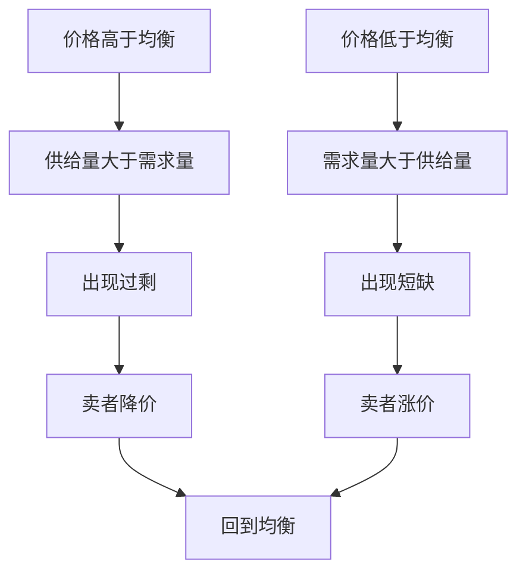

# 2.1 需求、供给与市场均衡

来源：

- 主线：Mankiw Ch.4, Ch.5, Ch.6, Ch.7, Ch.8, Ch.10, Ch.11
- 补充：Mishkin《货币金融学》Ch.1, Ch.2；Bodie/Kane/Marcus《Investments》Ch.1

## 为什么价格会自己变动

寒潮袭击佛罗里达，超市里的橙汁价格上涨；夏天新英格兰天气变暖，去加勒比海度假的需求下降，酒店价格下跌；中东战争爆发，美国汽油价格上涨，二手大型 SUV 价格下跌。这些事情看起来互不相干，但背后都有同一个机制：供给和需求。

市场经济中，大多数价格不是由某一个人随意决定的。价格来自买者和卖者的相互作用。买者愿意买多少，卖者愿意卖多少，二者共同决定成交数量和市场价格。理解供给和需求，就是理解市场经济如何把分散的选择协调起来。

这个逻辑不只适用于冰淇淋、汽油和住房，也适用于资金和证券。债券市场中，借款人想卖出债券来筹集资金，储蓄者和投资者想买入债券来获得未来付款；股票市场中，企业和原股东提供所有权份额，投资者用资金换取未来利润索取权。利率、债券价格和股票价格，都是买卖双方在市场中相互作用的结果。

市场是某种商品或服务的买者和卖者组成的群体。它不一定有固定地点。小麦市场可能有集中的交易场所，冰淇淋市场却可能分散在城市里的许多店铺。只要买者在比较选择，卖者在争取同一批顾客，他们就处在同一个市场中。

为了先看清最基本的力量，可以从竞争性市场开始。竞争性市场中，有很多买者和很多卖者，每个人对市场价格的影响都很小。单个冰淇淋店如果价格高得太多，顾客会转向其他店；单个顾客也买不了足够多，无法迫使市场降价。在这种情况下，买者和卖者都把市场价格当作给定条件，再决定自己买多少或卖多少。

## 需求：买者愿意并且能够购买多少

需求描述买者的行为。某种商品的需求量，是买者在某个价格下愿意并且能够购买的数量。

价格是影响需求量的核心因素。冰淇淋如果每球 20 美元，大多数人会少买，甚至改买冷冻酸奶或其他甜品；如果每球 0.5 美元，很多人会多买。一般来说，在其他条件不变时，价格上升，需求量下降；价格下降，需求量上升。这就是需求定律。

需求表把不同价格下的需求量列出来。需求曲线把这些价格和数量画在图上。由于价格越低，需求量通常越高，需求曲线一般向右下方倾斜。

单个买者有自己的需求，市场需求则是所有买者需求的加总。如果 Catherine 在每个价格下买一定数量的冰淇淋，Nicholas 也在每个价格下买一定数量，把两人的数量相加，就得到这个小市场的需求。现实市场有成千上万买者，市场需求就是所有买者在每个价格下愿意购买的总量。

## 需求曲线为什么会移动

需求曲线表示“在其他条件不变时，价格和需求量的关系”。如果变化的是商品自身价格，就沿着同一条需求曲线移动；如果变化的是其他影响购买意愿的因素，整条需求曲线就会移动。

收入是一个重要因素。对大多数正常物品来说，收入增加会让人们在每个价格下买得更多，需求曲线向右移动。收入下降则相反。也有一些低档物品，收入上升后需求反而减少，例如某些低价替代食品。

相关商品价格也会影响需求。如果两种商品可以互相替代，一种商品价格上升会增加另一种商品需求。冰淇淋价格上升，冷冻酸奶需求可能增加。如果两种商品经常一起使用，一种商品价格上升会减少另一种商品需求。热巧克力酱变贵，冰淇淋需求可能下降，因为搭配消费变得更贵。

偏好、预期和买者数量也会移动需求曲线。天气炎热，人们更想吃冰淇淋；预期未来价格上涨，今天可能提前购买；城市人口增加，市场需求扩大。

| 变化 | 结果 |
|---|---|
| 商品自身价格变化 | 沿需求曲线移动 |
| 收入、相关商品价格、偏好、预期、买者数量变化 | 需求曲线移动 |

这个区分非常重要。说“需求量增加”，通常指价格变化导致沿曲线移动；说“需求增加”，通常指整条需求曲线右移。

## 供给：卖者愿意并且能够出售多少

供给描述卖者的行为。某种商品的供给量，是卖者在某个价格下愿意并且能够出售的数量。

价格越高，生产和销售通常越有吸引力。冰淇淋价格高，卖者愿意增加营业时间、购买更多原料、雇更多员工；价格低，生产吸引力下降，卖者可能减少供应。一般来说，在其他条件不变时，价格上升，供给量上升；价格下降，供给量下降。这就是供给定律。

供给表列出不同价格下的供给量，供给曲线把它画出来。由于价格越高，供给量通常越高，供给曲线一般向右上方倾斜。

市场供给是所有卖者供给的加总。每个卖者在同一价格下愿意提供多少，把这些数量相加，就是市场在该价格下的总供给量。

## 供给曲线为什么会移动

和需求一样，供给曲线也有“沿曲线移动”和“整条曲线移动”的区别。商品自身价格变化，会导致沿供给曲线移动；其他因素变化，会移动整条供给曲线。

投入品价格是最常见的因素。如果牛奶、糖、店铺租金或员工工资上涨，生产冰淇淋的成本上升，在每个价格下卖者愿意供应的数量减少，供给曲线左移。技术进步则可能降低成本，使供给增加，曲线右移。

预期也重要。如果卖者预期未来价格更高，可能暂时减少当前供给，把商品留到以后出售。卖者数量增加，会使市场供给增加；卖者退出，供给减少。

| 变化 | 结果 |
|---|---|
| 商品自身价格变化 | 沿供给曲线移动 |
| 投入品价格、技术、预期、卖者数量变化 | 供给曲线移动 |

## 均衡：价格让买卖双方相遇

把需求曲线和供给曲线放在一起，就能看到市场均衡。均衡价格是让需求量等于供给量的价格，均衡数量是在这个价格下实际交易的数量。

如果市场价格高于均衡价格，卖者愿意卖的数量超过买者愿意买的数量，出现过剩。卖者发现商品卖不完，会降价争取顾客，价格向均衡下降。

如果市场价格低于均衡价格，买者愿意买的数量超过卖者愿意卖的数量，出现短缺。买者排队、抢购，卖者发现可以提高价格，价格向均衡上升。

价格因此像信号一样协调买者和卖者。它告诉买者商品稀缺程度和购买成本，也告诉卖者生产是否有利可图。竞争性市场中，价格会朝着供给量和需求量相等的方向调整。

在金融市场里，价格信号更容易被误解。股票价格上升，不只是“投资者赚钱”，也意味着企业用发行股票筹资时能用较少股份换到更多资金；债券价格下降，不只是债券持有人亏损，也意味着新借款人要给出更高收益率才能吸引资金。证券价格把资金稀缺、风险评估和未来现金流预期压缩成一个数字，因此它同时影响投资者的资产配置和企业的融资决策。

## 均衡如何回应变化

市场不会静止。天气、收入、技术、成本、偏好和政策都会变化。分析变化时，可以按三步走：

1. 判断事件影响需求曲线、供给曲线，还是两者都影响。
2. 判断曲线向左还是向右移动。
3. 比较新旧均衡，看价格和数量如何变化。

例如，夏天天气炎热，冰淇淋需求增加，需求曲线右移。在供给不变时，新均衡价格更高，交易数量更多。再如，牛奶价格上涨，冰淇淋生产成本上升，供给曲线左移。在需求不变时，新均衡价格更高，交易数量更少。

如果需求和供给同时变化，结果可能更复杂。例如天气炎热增加冰淇淋需求，同时牛奶价格上涨减少供给，价格几乎一定上升，但数量变化取决于需求增加和供给减少哪个力量更大。

同样的三步法可以用于金融事件。假设投资者突然更担心企业违约，他们对公司债的需求会下降；企业为了维持融资，也可能愿意发行更多高收益债来补现金流。需求左移和供给右移同时出现时，债券价格通常下跌，收益率上升，但成交量取决于两股力量的大小。后面分析债券市场均衡利率时，本节的供求框架会直接变成利率分析工具。

## 小结

供给和需求是市场经济的基本力量。需求描述买者在不同价格下愿意并且能够购买多少，供给描述卖者在不同价格下愿意并且能够出售多少。价格变化导致沿曲线移动，其他因素变化导致曲线移动。

市场均衡出现在需求量等于供给量的价格上。价格高于均衡会产生过剩并推动价格下降，价格低于均衡会产生短缺并推动价格上升。这个机制解释了很多商品价格和数量如何随事件变化而变化。

## 自测问题

- 市场为什么不一定需要固定地点？
- 需求量变化和需求变化有什么区别？
- 供给量变化和供给变化有什么区别？
- 价格高于均衡和低于均衡时，市场分别会发生什么？
- 如果需求增加同时供给减少，价格和数量会怎样变化？
- 为什么债券价格下降通常意味着新借款人的融资成本上升？
