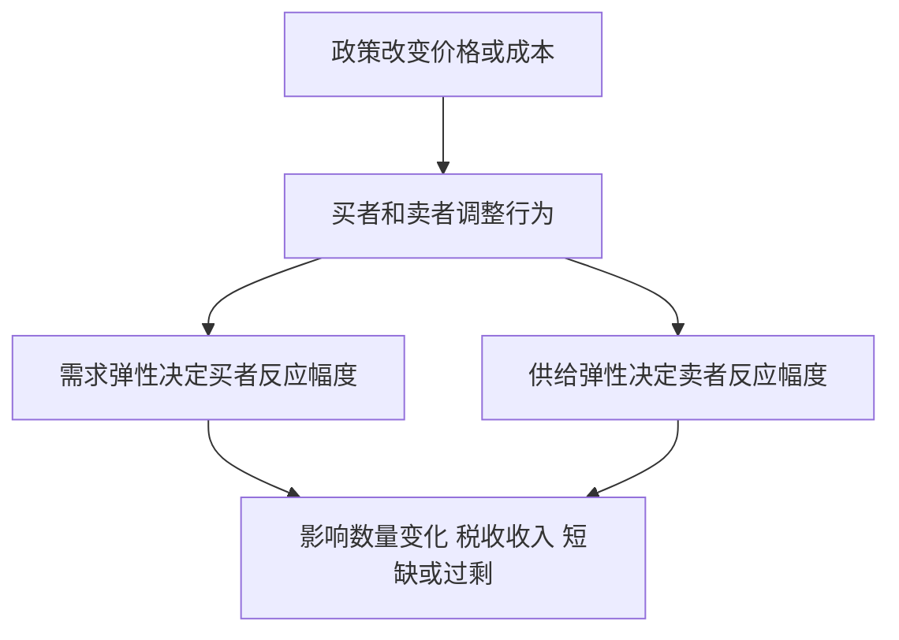

# 2.2 弹性与政策效果

来源：

- 主线：Mankiw Ch.4, Ch.5, Ch.6, Ch.7, Ch.8, Ch.10, Ch.11
- 补充：无

## 方向不够，还要知道幅度

供求模型能告诉我们方向。汽油价格上升，消费者通常会少买汽油；苹果价格下降，人们通常会多买苹果；企业成本上升，供给通常减少。但很多时候，只知道方向不够。真正重要的问题是：少买多少？多买多少？供给减少多少？

如果汽油价格上涨 10%，人们的汽油消费是只减少 1%，还是减少 20%？如果政府提高烟草税，吸烟量会明显下降，还是只是让消费者多付钱？如果最低工资提高，低技能劳动就业会减少很多，还是变化很小？

弹性就是用来回答“反应有多大”的概念。它衡量需求量或供给量对某个决定因素变化的敏感程度。

## 需求价格弹性：买者对价格有多敏感

需求价格弹性衡量的是：价格变化 1% 时，需求量会变化多少百分比。公式是：

```text
需求价格弹性 = 需求量变动百分比 / 价格变动百分比
```

如果一种商品价格上涨 10%，需求量下降 20%，需求价格弹性就是 2。这里通常取绝对值，因为需求量和价格方向相反：价格上升，需求量下降；价格下降，需求量上升。弹性越大，说明买者对价格越敏感。

如果需求量对价格变化反应很大，需求是富有弹性的。如果需求量反应很小，需求是缺乏弹性的。如果需求量变化百分比正好等于价格变化百分比，称为单位弹性。

需求弹性的大小不是随意的。它取决于消费者能不能轻易调整行为。

## 什么决定需求弹性

替代品越容易找到，需求越有弹性。黄油涨价，人们可以改买人造黄油；某一品牌矿泉水涨价，人们可以换另一个品牌。替代选择越多，消费者越容易离开原商品。

必需品通常需求较缺乏弹性，奢侈品通常更有弹性。看病价格上涨，人们可能减少一些就诊，但不会大幅放弃必要治疗；游艇价格上涨，购买量可能明显下降。不过，“必需品”和“奢侈品”并不只由商品本身决定，也取决于买者偏好。对极热爱帆船的人来说，帆船可能不像普通人眼中的奢侈品。

市场定义越窄，需求通常越有弹性。食物整体没有好替代品，需求较缺乏弹性；冰淇淋有其他甜品替代，弹性更大；香草冰淇淋还有其他口味冰淇淋替代，弹性可能更大。

时间越长，需求通常越有弹性。汽油价格刚上涨时，人们很难马上换车、搬家或改变通勤方式，所以短期需求反应较小。几年之后，人们可以买更省油的车，改用公共交通，搬到离工作地点更近的地方，需求反应会更大。

| 影响因素 | 对需求弹性的影响 |
|---|---|
| 替代品越多 | 弹性越大 |
| 越像必需品 | 弹性越小 |
| 市场定义越窄 | 弹性越大 |
| 调整时间越长 | 弹性越大 |

## 弹性和总收入

弹性还会影响卖者收入。总收入等于价格乘以销售量。

如果需求缺乏弹性，价格上升时，销售量下降得不多，总收入可能增加。比如某些必需药品价格上升，需求量可能只小幅减少，卖者收入上升。

如果需求富有弹性，价格上升时，销售量下降很多，总收入可能减少。比如某种娱乐产品涨价，消费者大量转向替代品，卖者收入反而下降。

这对政策也重要。政府对某种商品征税，如果该商品需求缺乏弹性，消费量下降不多，税收收入可能较高；如果需求富有弹性，消费者大幅减少购买，税基缩小，税收收入未必高。

## 供给弹性：卖者对价格有多敏感

供给价格弹性衡量的是：价格变化 1% 时，供给量会变化多少百分比。卖者越容易扩大或缩减生产，供给越有弹性。

有些商品短期供给很难改变。海边土地数量固定，短期几乎无法增加；某些农产品需要一个生长季才能增加产量；工厂生产能力也不是一夜之间扩建出来的。这些商品短期供给弹性较小。

时间越长，供给通常越有弹性。价格上涨后，企业可以扩建工厂、购买设备、培训工人、进入市场；价格下降后，企业可以退出或转产。因此，长期供给反应通常大于短期。

## 弹性如何影响政策效果

政策经常通过改变价格或成本影响市场。弹性决定政策效果的大小。

如果政府提高汽油税，汽油价格上升。短期内，人们很难迅速改变通勤方式，汽油需求较缺乏弹性，消费量下降有限，税收负担更多表现为消费者支付更高价格。长期看，人们可以买电动车、省油车，减少开车或搬家，需求更有弹性，消费量下降更多。

如果政府想通过香烟税减少吸烟，需求弹性也很关键。成年烟民可能较难短期戒烟，需求缺乏弹性；青少年或潜在吸烟者对价格可能更敏感，税收对他们的行为影响更大。

如果政府实行价格管制，弹性决定短缺或过剩的严重程度。租金上限在短期内可能只造成较小短缺，因为住房供给和需求短期都不容易调整；长期看，房东减少维护和建设，租户更愿意寻找更大住房，短缺可能严重扩大。



## 小结

供求模型告诉我们价格和数量变化的方向，弹性告诉我们变化的幅度。需求价格弹性衡量买者对价格变化的敏感程度，供给价格弹性衡量卖者对价格变化的敏感程度。

替代品、必需程度、市场定义和时间都会影响需求弹性；生产调整难度和时间会影响供给弹性。政策效果取决于弹性：同样的税收、价格管制或补贴，在弹性不同的市场中会产生很不同的数量变化和负担分配。

## 自测问题

- 为什么只知道需求曲线向下倾斜还不够？
- 什么因素会让需求更有弹性？
- 为什么汽油需求长期比短期更有弹性？
- 需求缺乏弹性时，涨价为什么可能提高总收入？
- 弹性为什么会影响税收和价格管制的效果？
