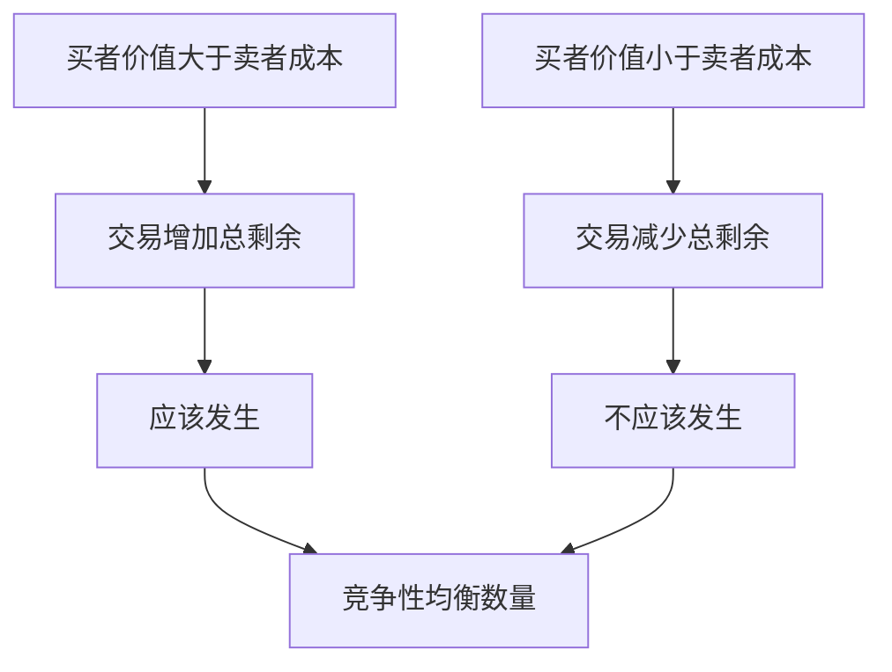

# 2.3 消费者剩余、生产者剩余与总剩余

来源：

- 主线：Mankiw Ch.4, Ch.5, Ch.6, Ch.7, Ch.8, Ch.10, Ch.11
- 补充：Mishkin《货币金融学》Ch.1, Ch.2；Bodie/Kane/Marcus《Investments》Ch.1

## 市场结果到底好不好

供给和需求告诉我们市场价格和交易数量如何形成。但这还不够。还需要问：市场形成的结果对社会来说好不好？买者得到了多少好处？卖者得到了多少好处？市场交易有没有让总福利尽可能大？

福利分析就是用来回答这些问题的工具。它不是在讲道德评价，而是先用一个简单方法衡量市场交易带来的收益。

买者参与交易，是因为商品对他有价值；卖者参与交易，是因为价格至少补偿了生产成本。只要一笔交易让买者得到的价值大于卖者的成本，就有剩余产生。市场的社会价值，首先来自这些自愿交易创造的剩余。

## 支付意愿和消费者剩余

买者对某件商品有一个最高愿意支付价格，叫支付意愿。它反映这件商品对买者的价值。

假设有人愿意为一本旧书最多支付 100 元。如果实际价格是 70 元，他买下这本书后获得了 30 元的净收益。这个净收益就是消费者剩余。消费者剩余等于买者愿意支付的金额减去实际支付的金额。

需求曲线可以理解为买者支付意愿的排列。价格较高时，只有支付意愿较高的人会购买；价格下降后，支付意愿较低的人也进入市场。因此，需求曲线下方、价格线上方的面积，代表市场中所有买者获得的消费者剩余。

消费者剩余衡量的是买者从参与市场中得到的好处。价格下降会增加消费者剩余，因为原本购买的人支付更少，同时一些新买者也进入市场并获得剩余。

## 成本和生产者剩余

卖者也有自己的最低接受价格。这个最低价格来自生产成本，包括时间、材料、机会成本和其他资源代价。

如果一个卖者生产某件商品的成本是 60 元，而市场价格是 80 元，他出售后获得 20 元净收益。这个净收益就是生产者剩余。生产者剩余等于卖者实际收到的金额减去生产成本。

供给曲线可以理解为卖者成本的排列。价格较低时，只有成本较低的卖者愿意生产；价格上升后，成本更高的卖者也愿意进入市场。因此，价格线下方、供给曲线上方的面积，代表市场中所有卖者获得的生产者剩余。

价格上升会增加生产者剩余，因为原本出售的人获得更高价格，同时一些新卖者进入市场并获得剩余。

## 总剩余：市场交易创造的总福利

把消费者剩余和生产者剩余加起来，就是总剩余。

```text
总剩余 = 消费者剩余 + 生产者剩余
```

对一笔交易来说，消费者剩余是买者价值减去价格，生产者剩余是价格减去卖者成本。两者相加，价格抵消，剩下的是：

```text
总剩余 = 买者得到的价值 - 卖者付出的成本
```

这说明市场交易的社会收益来自价值和成本之间的差额。如果一个买者愿意支付 100 元，一个卖者生产成本 60 元，那么只要他们以 60 到 100 元之间的任何价格成交，总剩余都是 40 元。价格只决定这 40 元在买者和卖者之间如何分配，不改变这笔交易创造的总剩余。

金融交易也可以这样理解。一个家庭暂时没有生产项目，但愿意把储蓄借出；一家企业有一个预期收益较高的项目，却缺少资金。只要企业愿意为资金支付的回报，高于家庭放弃当前消费和承担风险所要求的补偿，中间就有可以分享的剩余。银行、债券市场和股票市场的社会价值，不是让资金“动起来”本身，而是让资金从低价值用途流向高价值用途，从而创造总剩余。

## 市场均衡为什么能最大化总剩余

在竞争性市场中，均衡有一个重要性质：它能使总剩余最大化。

原因可以从需求曲线和供给曲线理解。需求曲线表示买者价值，供给曲线表示卖者成本。只要某一单位商品的买者价值高于卖者成本，生产并交易这一单位就会增加总剩余；如果买者价值低于卖者成本，生产这一单位反而会减少总剩余。

市场均衡数量正好把这两类交易分开：

- 在均衡数量之前，需求曲线高于供给曲线，买者价值大于卖者成本，交易值得发生。
- 在均衡数量之后，供给曲线高于需求曲线，卖者成本大于买者价值，交易不该发生。

因此，竞争性市场会让所有“价值大于成本”的交易发生，并阻止“成本大于价值”的交易发生。这样总剩余达到最大。



## 效率不等于公平

总剩余最大化说明市场结果有效率，但它不回答公平问题。一个市场可能创造很大总剩余，但剩余大部分归卖者；也可能大部分归买者。效率关心总量，公平关心分配。

例如，某种药品市场可能在供求均衡下有效率，但低收入患者仍然买不起。此时，问题不一定是市场没有创造剩余，而是剩余和购买能力的分配让人难以接受。

这也是为什么经济政策常常同时讨论效率和公平。价格管制、税收、补贴、社会保险，都可能改变消费者剩余、生产者剩余和总剩余，也可能改变不同群体之间的分配。

投资学中的“市场有效”也要放在这个框架下理解。证券价格如果能较好反映信息，资本就更容易流向有价值的项目，低质量项目更难以低成本融资；这提高的是资源配置效率。但剩余如何分配，是另一个问题：企业、原股东、新投资者、基金经理、交易平台和信息服务商，都会分享金融市场产生的收益。后面评价主动管理、基金费用和市场效率时，不能只看谁赚了钱，还要问这些收益是否来自新增价值、风险承担、信息发现，还是只是从其他交易者那里转移来的。

## 小结

消费者剩余衡量买者从交易中获得的净好处，等于支付意愿减去实际支付价格。生产者剩余衡量卖者从交易中获得的净好处，等于实际收到价格减去生产成本。二者相加得到总剩余。

竞争性市场均衡能最大化总剩余，因为它让买者价值高于卖者成本的交易发生，并阻止成本高于价值的交易发生。这说明市场有强大的效率性质，但效率不等于公平，分配问题还需要单独分析。

## 自测问题

- 支付意愿和消费者剩余有什么关系？
- 成本和生产者剩余有什么关系？
- 为什么总剩余可以写成“买者价值减去卖者成本”？
- 竞争性市场均衡为什么能最大化总剩余？
- 为什么总剩余最大不等于分配公平？
- 金融中介怎样通过把资金从低价值用途转向高价值用途创造总剩余？
