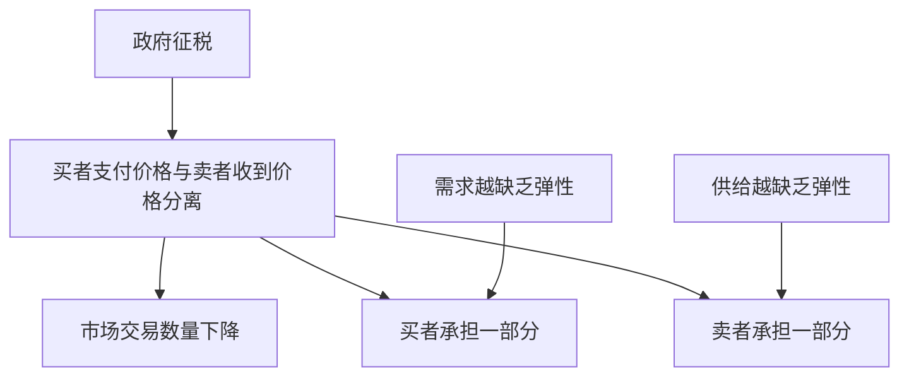

# 2.4 税收归宿、价格管制与无谓损失

来源：

- 主线：Mankiw Ch.4, Ch.5, Ch.6, Ch.7, Ch.8, Ch.10, Ch.11
- 补充：无

## 政府改变价格时，市场不会静止

供求均衡是市场力量作用的结果。但政府常常会干预市场价格和交易。房租太高时，政府可能限制租金；工资太低时，政府可能设定最低工资；为了筹集财政收入，政府会征税；为了减少某种行为，政府也可能通过税收提高价格。

这些政策都有明确目标，但市场参与者会根据新规则调整行为。价格上限会改变买者和卖者的选择，价格下限会造成另一种扭曲，税收会在买者和卖者之间打入一个楔子。理解这些政策，仍然要回到供给和需求。

## 价格上限：价格不能高于某个水平

价格上限是法律规定的最高价格。如果上限高于市场均衡价格，它没有实际约束力，因为市场本来就会在更低价格成交。如果上限低于均衡价格，它就会成为有约束力的价格控制。

有约束力的价格上限会造成短缺。价格被压低后，买者想买更多，卖者愿意供应更少，需求量大于供给量。

租金管制是常见例子。政府限制房租，目的是让住房更可负担。短期看，住房数量变化不大，租户也不容易马上搬家，短缺可能不明显。长期看，低租金减少房东维护和建造住房的激励，同时更多人想租更大或更多住房，短缺会扩大。结果可能是排队、关系分配、住房质量下降，甚至黑市交易。

价格上限的问题不只是价格低，而是价格不能完成配给功能。市场均衡价格下，愿意支付价格的人获得商品；价格被压低后，商品不够分，必须用其他方式分配，例如排队、熟人关系、歧视或行政审批。

## 价格下限：价格不能低于某个水平

价格下限是法律规定的最低价格。如果下限低于市场均衡价格，它没有实际约束力；如果下限高于均衡价格，它会造成过剩。

价格被抬高后，卖者愿意供应更多，买者愿意购买更少，供给量大于需求量。

最低工资可以看作劳动市场中的价格下限。工资是劳动的价格。如果最低工资高于均衡工资，愿意工作的人增加，企业愿意雇佣的人减少，于是出现劳动过剩，也就是失业。这个影响大小取决于劳动需求和供给弹性。对某些低技能劳动市场，最低工资可能更容易形成约束。

价格下限同样会引发非价格配给。工作岗位不够时，雇主会用其他标准筛选工人；某些人获得更高工资，另一些人可能失去工作机会。

| 政策 | 有约束力的条件 | 结果 |
|---|---|---|
| 价格上限 | 低于均衡价格 | 短缺 |
| 价格下限 | 高于均衡价格 | 过剩 |

## 税收：在买者和卖者之间打入楔子

税收既能筹集财政收入，也会改变市场结果。对某种商品征税后，买者支付的价格和卖者实际收到的价格不再相同。中间差额就是税。

如果对卖者征税，卖者每卖一单位商品都要向政府缴税。对卖者来说，生产和销售变得更不划算，供给曲线向上或向左移动。市场价格上升，交易数量下降。

如果对买者征税，买者每买一单位商品都要缴税。对买者来说，购买变得更不划算，需求曲线向下或向左移动。卖者收到的价格下降，交易数量下降。

重要的是，对买者征税和对卖者征税，最终效果本质相同。无论法律规定谁把税交给政府，税都会在买者和卖者之间形成楔子，减少交易数量。买者支付的总价格上升，卖者实际得到的价格下降，双方共同承担税负。

## 税收归宿：谁真正承担税负

税收归宿研究的是税负最终由谁承担。法律可以规定卖者缴税，也可以规定买者缴税，但市场力量决定实际负担如何分配。

关键因素是弹性。哪一方更缺乏弹性，哪一方更难逃避交易，就承担更多税负。

如果需求非常缺乏弹性，买者即使价格上升也很难减少购买，税负更多落在买者身上。比如某些必需品或成瘾品。若供给非常缺乏弹性，卖者即使收到价格下降也难以减少供给，税负更多落在卖者身上。

税收归宿说明了一个重要原则：政策的法律对象不一定是经济负担的最终承担者。给企业征税，企业可能通过提高价格把部分负担转嫁给消费者；给消费者征税，卖者也可能因需求下降而承担部分损失。

## 税收为什么造成无谓损失

税收除了转移资源给政府，还会减少市场交易。减少的交易中，有些本来对买者和卖者都有利。税收让这些交易不再发生，于是社会总剩余下降。这部分损失叫无谓损失。

在没有税时，只要买者价值高于卖者成本，交易就会发生。征税后，买者支付的价格上升，卖者收到的价格下降。某些交易原本买者价值高于卖者成本，但差额不足以支付税，于是交易消失。买者、卖者和政府都没有得到这部分潜在剩余。

税收收入本身不是无谓损失，因为它从买者和卖者转移给政府。如果政府用税收提供公共服务，这部分资源仍然被使用。无谓损失来自那些被税收阻止的有益交易。

弹性越大，无谓损失通常越大。因为买者和卖者越容易改变行为，税收造成的交易数量减少越多。弹性越小，数量变化越小，无谓损失越小。

## 小结

价格上限和价格下限都会阻止价格完成协调功能。有约束力的价格上限造成短缺，有约束力的价格下限造成过剩。短缺和过剩往往引发排队、质量下降、黑市或非价格配给。

税收在买者支付价格和卖者收到价格之间打入楔子，减少交易数量。无论税法规定谁缴税，买者和卖者通常都会分担税负。税负更多落在缺乏弹性的一方。税收还会阻止某些原本有益的交易，造成无谓损失。

## 自测问题

- 为什么价格上限只有低于均衡价格时才有约束力？
- 为什么价格下限可能造成过剩？
- 最低工资为什么可以看作劳动市场中的价格下限？
- 税收归宿为什么不取决于法律规定谁缴税？
- 税收的无谓损失来自哪里？
