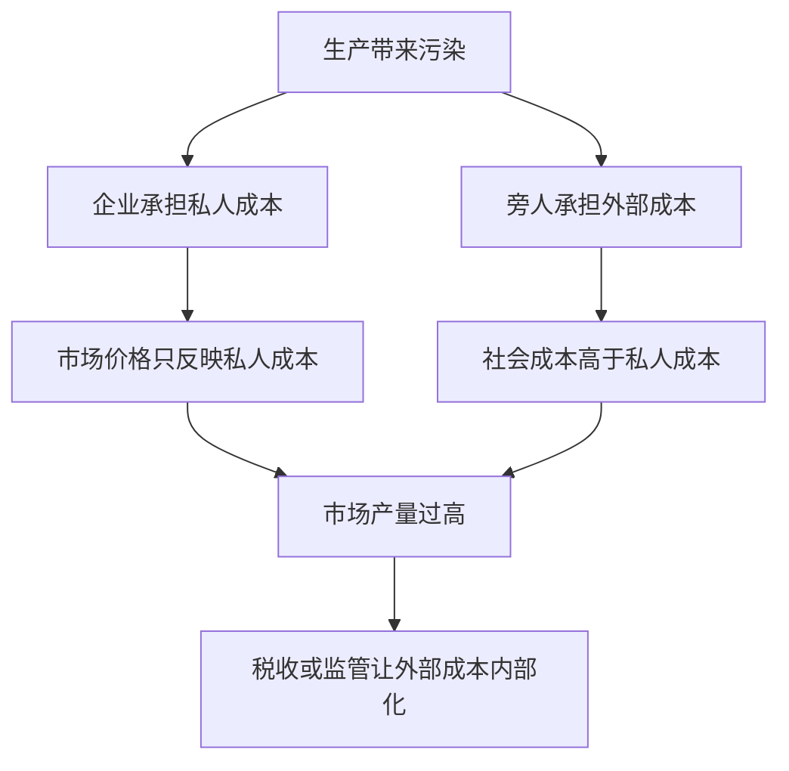

# 2.5 外部性、公共品与市场失灵

来源：

- 主线：Mankiw Ch.4, Ch.5, Ch.6, Ch.7, Ch.8, Ch.10, Ch.11
- 补充：无

## 市场为什么有时不能给出好结果

竞争性市场有很强的效率性质。只要买者价值高于卖者成本，交易就会发生；只要成本高于价值，交易就不会发生。这样市场能最大化总剩余。

但这个结论依赖一个重要前提：交易的全部成本和收益都由买者和卖者承担。如果一个人的行为影响了旁人，而这种影响没有进入市场价格，市场结果就可能偏离社会最优。

这种影响叫外部性。外部性可以是负的，也可以是正的。

## 负外部性：市场价格低估了真实成本

污染是负外部性的典型例子。工厂生产商品时排放污染，污染损害附近居民健康、降低空气质量、破坏环境。如果工厂不需要为这些损害付出成本，它在决策时只考虑自己的私人成本，而没有考虑社会成本。

社会成本等于私人成本加上旁人承受的外部成本。当存在负外部性时，供给曲线反映的是私人成本，而不是社会成本。市场均衡产量会高于社会最优产量，因为价格没有反映全部代价。

解决思路是让决策者面对真实社会成本。政府可以征收污染税、设定排放标准，或建立可交易的污染许可证。污染税的逻辑是：让排污者为外部成本付费，使私人成本接近社会成本。

## 正外部性：市场价格低估了真实收益

外部性也可能是正的。教育不仅提高个人收入，也可能让社会拥有更好的公民、更低犯罪率、更高创新能力。疫苗接种不仅保护接种者，也减少疾病传播，保护其他人。基础研究可能让发明者以外的人受益。

当存在正外部性时，个人决策只考虑私人收益，没有完全考虑社会收益。市场均衡数量会低于社会最优数量，因为价格没有反映全部好处。

政府可以通过补贴、公共供给、专利制度或公共资助来鼓励这些活动。补贴的逻辑和污染税相反：让私人收益更接近社会收益，从而增加行为数量。

## 公共品：为什么有些东西市场供给不足

外部性之后，还需要理解公共品。物品可以按两个维度分类：是否具有排他性，是否具有竞争性。

排他性指的是能否阻止不付费的人使用。竞争性指的是一个人使用是否会减少别人使用。

普通私人品既有排他性又有竞争性。一个苹果可以卖给付钱的人，一个人吃了，别人就不能吃。市场通常能有效供给私人品。

公共品既没有排他性，也没有竞争性。国防是典型例子。一个国家受到保护后，很难排除某个不付费居民享受安全；一个人享受国防保护，也不会减少另一个人享受保护。烟花表演、基础科学知识、清洁空气也有公共品特征。

公共品容易出现搭便车问题。既然不付费也能享受，人们就有动力少付或不付。每个人都希望别人出钱，自己免费受益。结果是市场供给不足。

因此，政府常常通过税收为公共品融资。税收强制每个人分担成本，再由政府提供国防、基础研究、公共卫生等服务。

## 公共资源：用的人太多

还有一类物品没有排他性，但有竞争性，叫公共资源。公共牧场、开放渔场、拥堵道路、地下水等都可能属于这一类。

因为没有排他性，很难阻止人们使用；因为有竞争性，一个人的使用会减少别人可用的数量。结果可能是过度使用。

“公地悲剧”说明了这种问题。每个牧民都想多放一头牛，因为多一头牛带来的收益归自己，但草地退化的成本由所有人共同承担。每个人都这样想，公共牧场最终被过度使用。

政府可以通过产权界定、使用收费、配额、监管等方式解决公共资源过度使用问题。核心仍然是让个人决策更接近社会成本。

## 市场失灵的共同结构

外部性、公共品和公共资源看起来不同，但都有共同结构：个人决策没有完全反映社会成本或社会收益。

| 问题 | 市场结果 | 可能政策 |
|---|---|---|
| 负外部性 | 产量过多 | 税收、监管、许可证 |
| 正外部性 | 产量过少 | 补贴、公共资助、专利 |
| 公共品 | 供给不足 | 政府提供、税收融资 |
| 公共资源 | 使用过度 | 产权、收费、配额、监管 |

金融市场中也存在类似问题。单个金融机构承担高风险时，收益可能归自己，但系统性危机的成本可能由存款人、纳税人和整个经济承担。这就是为什么金融监管常常被解释为处理外部性和系统性风险的一种制度安排。

## 小结

市场通常能有效配置私人品，但当个人决策没有反映全部社会成本或社会收益时，市场会失灵。

负外部性使市场产量过高，正外部性使市场产量过低。公共品因为搭便车而供给不足，公共资源因为使用者不承担全部社会成本而容易被过度使用。政府干预的目标，是让私人决策更接近社会最优。

## 自测问题

- 什么是外部性？负外部性和正外部性有什么区别？
- 污染为什么会导致市场产量高于社会最优？
- 教育和疫苗为什么可能具有正外部性？
- 公共品为什么会出现搭便车问题？
- 公共资源为什么容易被过度使用？
