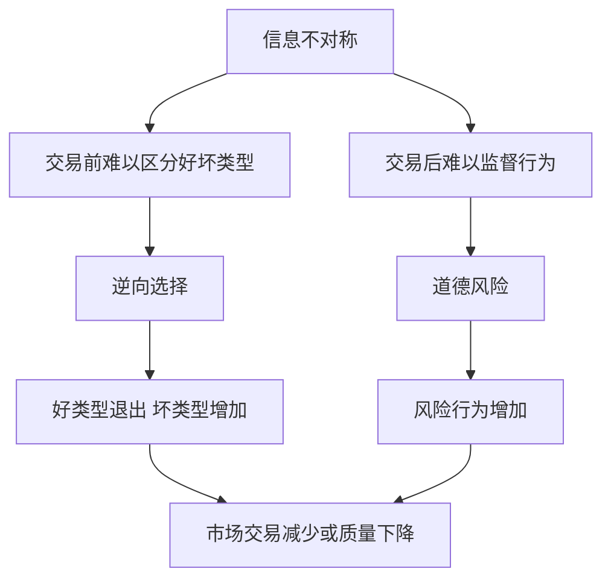

# 2.6 信息问题与金融市场的特殊性

来源：

- 主线：Mankiw Ch.4, Ch.5, Ch.6, Ch.7, Ch.8, Ch.10, Ch.11
- 补充：Mishkin《货币金融学》Ch.2；Mishkin/Eakins Ch.2；Bodie/Kane/Marcus《Investments》Ch.1

## 有些市场的问题不是价格，而是信息

供求分析假设买者和卖者知道自己需要什么，也大致知道商品质量、成本和交易条件。很多普通商品市场中，这个假设足够有用。买一杯咖啡、一件衣服、一本书，质量虽然有差异，但买者通常能观察、比较、退换或通过口碑判断。

有些市场却不是这样。买二手车时，卖者通常比买者更了解车辆状况；买保险时，投保人通常比保险公司更了解自己的行为和风险；借款时，借款人通常比贷款人更了解自己的还款意愿和项目风险；投资股票或债券时，公司管理层通常比外部投资者更了解真实经营状况。

当交易双方掌握的信息不对称时，市场可能无法像简单供求模型那样顺利运行。价格仍然重要，但价格不再足以协调全部信息。

金融教材把信息问题放在很早的位置，是因为金融交易卖的往往不是当下看得见的物品，而是未来的承诺。一个苹果今天能不能吃，买者很快能判断；一家公司十年后能不能还债、一个借款人会不会把钱投向高风险项目、一个基金经理的业绩来自能力还是运气，都要经过时间才会显现。

## 信息不对称为什么会破坏交易

信息不对称指的是交易一方比另一方掌握更多相关信息。它会造成两个典型问题：逆向选择和道德风险。

逆向选择发生在交易之前。由于信息较少的一方无法区分好坏类型，坏类型更容易进入市场，好类型反而退出。

二手车市场可以说明这个逻辑。卖者知道自己的车是好车还是坏车，买者不知道。买者担心买到坏车，只愿意支付一个平均价格。这个平均价格对坏车卖者有吸引力，却让好车卖者觉得不划算。好车退出后，市场中坏车比例上升，买者更不愿意出高价，市场质量继续下降。

贷款市场也类似。银行如果无法区分低风险借款人和高风险借款人，只能按平均风险定价。这个利率可能让低风险借款人退出，因为他们觉得太贵；高风险借款人仍然愿意借，因为他们更可能不还。结果是贷款池风险上升。

道德风险发生在交易之后。一方达成交易后，因为不完全承担后果，行为变得更冒险或更不谨慎。

保险市场很典型。一个人买了全额保险后，可能比以前更不注意防范损失，因为损失由保险公司承担。借款人拿到贷款后，可能把资金投入更高风险项目，因为成功收益归自己，失败损失部分由贷款人承担。

## 为什么金融市场特别依赖信息

金融交易的核心是今天交出资金，换取未来的偿付、收益或保险承诺。问题在于，未来本来就不确定，而资金使用者的信息通常更多。

买债券时，投资者关心发行者未来能否还本付息。买股票时，投资者关心企业未来利润。银行发放贷款时，关心借款人是否诚实、项目是否可靠、抵押品是否足够。保险公司承保时，关心投保人的风险类型和未来行为。

这些信息很难完全观察。财务报表可能滞后，管理层可能隐瞒坏消息，借款人可能夸大项目前景，投保人可能改变行为。因此，金融市场比许多商品市场更容易受到信息问题影响。

这也是金融机构存在的重要原因。银行、评级机构、审计师、保险公司、基金经理和监管机构，都在不同程度上处理信息问题。它们通过筛选、监督、披露、抵押、契约、资本要求等方式降低逆向选择和道德风险。

投资学中的分散化也不能完全消除信息问题。分散化可以降低单个证券出问题对组合的影响，却不能自动判断证券价格是否已经充分反映风险，也不能阻止系统性信息误判。2008 年前一些结构化产品看似通过分散住房贷款降低风险，但如果基础贷款质量、评级假设和房价相关性被误判，分散化本身也会被高估。信息质量决定了供求曲线和价格信号是否可信。

## 信息问题如何进入供求框架

信息问题并不推翻供求分析，而是告诉我们供求曲线背后还有更深的机制。

如果买者无法判断质量，他们的支付意愿会下降，需求曲线可能左移。二手车买者担心质量差，就不愿意出高价；投资者担心公司信息不透明，就要求更高回报或干脆不投资。

如果卖者或借款人必须证明自己可靠，交易成本上升，供给也会受到影响。企业为了发行证券要披露信息、接受审计、支付承销费用；借款人要提供抵押、财务资料和信用记录。

金融监管中的信息披露制度，就是为了让价格更准确地反映真实风险。没有足够信息，价格可能不是有效信号，而只是恐惧、误判或不完整信息的结果。

这也说明“市场价格包含信息”不是无条件真理。价格要反映信息，需要有人收集信息、分析信息、承担交易成本并把判断体现在买卖中。审计、会计准则、上市披露、分析师研究、基金尽调和监管处罚，都是让信息进入价格的制度条件。没有这些条件，价格仍会变动，却未必能有效指导资本流向。

## 为什么这一节放在供求和福利之后

供求模型先给出市场分析的基准：价格如何协调买者和卖者，均衡如何形成，税收和价格管制如何改变结果。福利分析进一步说明，竞争性市场在理想条件下能最大化总剩余。

信息问题提醒我们，这个理想结果有前提。如果买者不知道商品质量，贷款人不知道借款人风险，投资者不知道企业真实状况，保险公司不知道投保人行为，市场就可能无法实现有效交易。

金融学习尤其需要这个补充。后面讨论金融机构为何存在、银行为何重要、监管为何必要、金融危机为何发生，都会反复回到信息不对称。逆向选择解释为什么坏风险可能挤出好风险；道德风险解释为什么保险、存款保险、政府救助和有限责任可能改变行为。

## 小结

信息问题是市场失灵的重要来源。信息不对称会导致逆向选择和道德风险，使市场交易减少、质量下降或风险上升。

金融市场特别依赖信息，因为金融交易本质上是用今天的资金换取未来的承诺，而未来承诺的可靠性很难完全观察。银行、保险、审计、评级、抵押、契约和监管，都是为了缓解信息问题而存在的制度安排。

供求分析仍然重要，但在金融市场中，仅仅看价格和数量不够，还要看价格背后的信息质量。

## 自测问题

- 什么是信息不对称？
- 逆向选择为什么发生在交易之前？
- 道德风险为什么发生在交易之后？
- 为什么金融市场比普通商品市场更容易受到信息问题影响？
- 银行和监管为什么可以被理解为处理信息问题的制度？
- 为什么分散化不能替代信息质量和信息披露？
