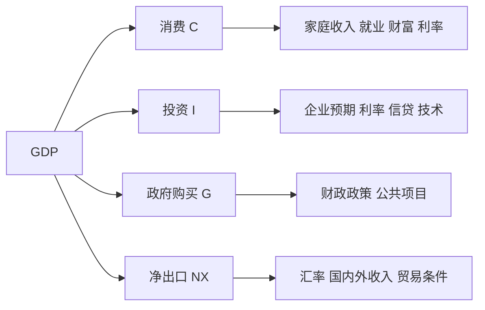

# 3.2 支出法：消费、投资、政府购买、净出口

来源：

- 主线：Mankiw Ch.24, Ch.25, Ch.29
- 补充：Mishkin《货币金融学》Ch.1 Appendix

## GDP 可以从谁在购买来理解

GDP 衡量经济中生产出来的最终物品和服务。既然每件最终产品都会被某个主体购买，就可以从支出角度把 GDP 分解为几类购买者的支出。

最常用的分解公式是：

```text
Y = C + I + G + NX
```

其中，Y 表示 GDP，C 是消费，I 是投资，G 是政府购买，NX 是净出口。这个公式不是经济理论的假设，而是会计恒等式：把所有最终产品的购买者分成家庭、企业、政府和国外部门，所有支出加起来就是 GDP。

理解这个公式，可以帮助读者看懂宏观新闻。消费疲软、投资下降、政府扩大支出、出口增长、进口增加，都会通过不同部分影响 GDP。

## 消费：家庭购买的商品和服务

消费是家庭购买的物品和服务。它通常是 GDP 中最大的一部分。

家庭购买食品、衣服、汽车、家电、理发、医疗、教育、娱乐服务，都属于消费。消费既包括耐用品，也包括非耐用品和服务。汽车和家电使用时间较长，属于耐用品；食品和燃料很快被消耗，属于非耐用品；理发、医疗、教育属于服务。

但有一个容易混淆的地方：家庭购买新住房不算消费，而算投资。原因是住房会在未来多年提供居住服务，性质上更接近资本品。租房支付的租金或自住房估算租金，反映的是住房服务，才进入消费中的住房服务部分。

消费对经济波动很重要。家庭收入增长、就业稳定、财富上升、信贷条件宽松时，消费往往更强；失业上升、资产价格下跌、利率上升时，消费可能受到压制。

## 投资：为未来生产而购买的资本

投资在日常语言中常指购买股票、基金或债券。但在 GDP 统计中，投资有更具体的含义：用于未来生产的资本品购买、住房建设和库存增加。

企业购买机器、厂房、设备、软件，属于投资。家庭购买新住房，也计入投资。企业生产出来但尚未卖出的商品进入库存，库存增加也算投资，因为这些产品是当期生产出来的，只是尚未被最终消费者购买。

买股票不计入 GDP 中的投资。因为购买股票只是资产所有权从一个人转到另一个人，并不直接代表当期新生产的物品或服务。只有企业用发行股票筹集来的资金购买新设备、建厂或研发，相关支出才会进入 GDP。

这个区别对金融学习很重要。金融投资和国民账户中的投资不是同一个概念。金融投资是购买金融资产；宏观统计中的投资是购买实物资本、住宅和库存。金融市场的重要性在于，它能把储蓄转化为宏观意义上的投资。

## 政府购买：政府直接买了什么

政府购买是政府购买的物品和服务。包括政府雇佣公务员和教师支付工资，购买军用设备，修建道路、桥梁、学校，采购办公用品等。

不是所有政府支出都计入政府购买。转移支付不计入 G。养老金、失业救济、社会保障、补贴等把收入从政府转移给个人或企业，但政府没有因此直接购买当期生产的物品或服务。转移支付会影响居民收入和消费，但不直接计入 GDP 的政府购买。

这个区分也很重要。政府扩大支出时，要看是扩大政府购买，还是扩大转移支付。前者直接进入 GDP，后者通过影响家庭和企业行为间接影响 GDP。

## 净出口：国外部门的影响

净出口等于出口减进口。

出口是外国人购买本国生产的物品和服务。它计入本国 GDP，因为这些产品在国内生产。进口是本国居民购买外国生产的物品和服务。进口要从 GDP 中扣除，因为它已经包含在消费、投资或政府购买中，但并不是国内生产。

例如，一个家庭购买进口汽车，这笔支出会先进入消费；但由于汽车不是国内生产，进口部分必须在净出口中扣除。这样 GDP 才只衡量国内生产。

净出口可以为正，也可以为负。出口大于进口时，净出口为正；进口大于出口时，净出口为负。汇率、国内收入、外国收入、贸易政策和国际竞争力都会影响净出口。

## 四个部分如何一起变化

GDP 的四个组成部分经常同时变化。利率上升可能抑制消费中的耐用品购买和企业投资；政府财政刺激可能提高政府购买，也可能通过转移支付刺激消费；本币贬值可能促进出口、抑制进口；经济衰退时，消费和投资都可能下降。



支出法不仅是统计分解，也是分析框架。看到 GDP 增长变化时，可以问：是消费带动，还是投资带动？是政府支出扩大，还是净出口改善？不同来源代表不同经济含义。

金融市场也会区分这些来源。消费强可能利好零售和服务企业；投资强可能反映企业信心和信贷扩张；政府支出扩大可能影响财政赤字和债券供给；净出口变化可能和汇率、全球需求有关。

## 小结

从支出角度看，GDP 等于消费、投资、政府购买和净出口之和。消费是家庭购买的商品和服务；投资是购买资本品、新住房和库存增加；政府购买是政府直接购买物品和服务；净出口是出口减进口。

投资在宏观统计中不是购买股票债券，而是购买实物资本、住宅和库存。政府转移支付也不直接计入政府购买。理解这些口径，才能正确解读 GDP 数据和宏观政策。

## 自测问题

- 为什么 GDP 可以写成 C + I + G + NX？
- 家庭购买新住房为什么算投资而不是普通消费？
- 买股票为什么不计入 GDP 中的投资？
- 政府转移支付为什么不直接计入政府购买？
- 进口为什么要从 GDP 中扣除？
