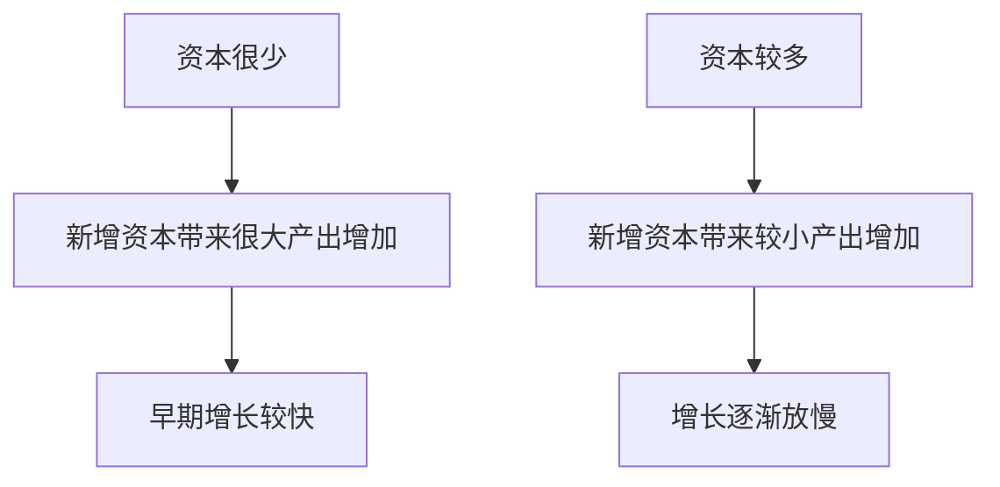

# 4.2 储蓄、投资与资本形成

来源：

- 主线：Mankiw Ch.26, Ch.27
- 补充：Mishkin《货币金融学》Ch.2；Bodie/Kane/Marcus《Investments》Ch.1, Ch.5

## 从生产率回到一个更现实的问题

上一节得出的结论很直接：长期生活水平取决于生产率，而生产率取决于劳动者能使用多少物质资本、人力资本、自然资源和技术知识。这个结论马上引出一个现实问题：如果资本能提高生产率，一个社会怎样才能拥有更多资本？

资本不是自然出现的。机器、厂房、道路、计算机、学校、医院、实验室，都需要用现实资源生产出来。一个社会如果把所有资源都用来生产当前消费品，例如食品、衣服、娱乐服务和即时消费，就没有足够资源去生产未来会用到的资本品。相反，如果它想增加资本存量，就必须把一部分当前资源从消费品生产中转移出来，用于生产资本品。

这就是储蓄、投资与资本形成之间的基本联系。**储蓄**意味着当前收入中没有被当前消费掉的部分；**投资**在宏观经济学中指购买或生产新的资本品，例如设备、建筑和住房；**资本形成**则是资本存量因为投资而增加的过程。日常语言里，人们常说“投资股票”“投资基金”，但在国民收入核算里，购买股票和债券本身不是投资，而是把储蓄提供给金融体系；真正的投资是新机器、新厂房、新住宅、新存货等实物资本的形成。

这个区分很重要。一个人买股票时，他可能认为自己在投资；但从整个经济的实物角度看，他是在购买一项金融资产。只有当企业通过发行股票筹集资金，并用这些资金建设新工厂、购买新设备或开发新生产能力时，宏观意义上的投资才发生。金融资产改变的是资金所有权和收益权，实物投资改变的是经济未来的生产能力。

## 资本形成不是免费的午餐

资本能提高未来生产率，但获得资本需要当前牺牲。原因仍然是稀缺：劳动、土地、机器、原材料和管理能力都有限。如果更多资源被用于生产资本品，就会有更少资源用于生产当前消费品。一个社会想在未来拥有更多机器和厂房，今天就不能把全部产出都用于吃穿住行和娱乐消费。

可以把这个问题想象成一个农民的选择。收获粮食以后，他可以把所有粮食都吃掉，也可以留下一部分作为种子。如果全部吃掉，当前消费最高，但下一季没有足够种子；如果留出一部分种子，当前能吃的粮食减少，但未来收成可能增加。宏观经济中的储蓄和投资也是类似的跨期取舍：今天少消费一部分资源，把它们转化为未来生产能力。

资本形成的逻辑可以用一个简单链条表示：


这条链条说明，储蓄本身不是最终目的。一个社会不是因为少消费本身而变富，而是因为少消费释放出资源，使这些资源可以转化为资本。资本再通过提高生产率，让未来产出和收入增加。如果储蓄没有被有效转化为生产性投资，或者投资项目本身浪费资源，储蓄并不会自动带来高增长。

## 储蓄率提高会发生什么

如果一个国家提高储蓄率，也就是把 GDP 中更大比例用于储蓄而不是当前消费，会有更多资源可用于生产资本品。资本存量增加后，劳动者可以使用更多机器、设备和建筑，生产率提高，实际 GDP 也会提高。

但是，储蓄率提高并不意味着增长率会永远提高。资本积累会遇到一个重要规律：**边际收益递减**。它指的是，当某种投入数量已经很多时，再增加一单位该投入带来的额外收益会变小。应用到资本上，就是资本越少的经济体，新增一台机器、一条道路或一套设备可能带来很大改善；资本已经非常充足的经济体，再增加同样一单位资本，改善幅度通常较小。

想象两个工人。第一个工人没有任何工具，只能徒手劳动。如果给他一套基本工具，他的产出可能大幅提高。第二个工人已经拥有先进机器、计算机和完善厂房，再给他多一件工具，产出增加可能有限。两者新增资本相同，但效果不同，因为初始资本水平不同。

资本边际收益递减意味着：更高储蓄率可以在一段时间内提高经济增长，因为资本存量正在增加；但随着资本越来越多，每一单位新增资本带来的额外产出逐渐下降，增长会放慢。长期看，更高储蓄率能让经济达到更高的生产率和收入水平，但不一定让增长率永久保持更高。

可以把这种关系理解为一条逐渐变平的曲线：资本较少时，多一点资本能明显提高每个工人的产出；资本较多时，多一点资本仍然有帮助，但帮助较小。



这不是说资本不重要，而是说资本积累有层次。低资本经济体最缺基本工具和基础设施，新增投资常常能迅速改善生产条件。高资本经济体已经拥有大量设备和建筑，继续投资仍然有价值，但经济增长越来越依赖技术进步、人力资本提高和资源配置效率。

## 追赶效应：为什么穷国有时增长更快

边际收益递减还带来一个重要推论：其他条件相同，起点较低的国家更容易实现较快增长。这称为**追赶效应**。穷国通常资本存量少，劳动者缺少基本设备、基础设施和生产工具，因此少量资本投入就能显著提高生产率。富国已经拥有大量资本，新增资本的边际贡献较小，所以单靠继续堆积资本不容易维持很高增长率。

这有助于理解一些历史现象。一个较贫穷的经济体如果政治稳定、教育改善、投资率较高，并能吸收现有技术，就可能在几十年里快速增长。它不一定需要从零发明所有技术；只要把富国已经使用的机器、管理方法和生产流程引入本国，就可能获得明显生产率提升。相反，一个已经很富裕的国家，要继续保持高速增长更难，因为它已经接近现有技术和资本配置的前沿。

追赶效应不是自动保证。穷国只是“有潜在空间”，并不等于一定会追赶。资本形成需要储蓄，投资需要安全的产权和稳定的制度，技术吸收需要教育和管理能力，金融体系需要能把资金导向有效项目。如果这些条件缺失，低起点也可能长期停留在低收入状态。

用学生进步作比喻也很直观。一个学期开始时成绩较差但后来认真学习的学生，成绩提升幅度可能很大；原本成绩已经很好的学生，也许仍然进步，但提高幅度通常较小。获得“进步最大”说明增长快，但不等于水平最高。国家增长也是如此：快速增长可能反映追赶过程，但最终生活水平还要看积累后的产出水平。

## 国内储蓄不是唯一资金来源

资本形成通常依赖国内储蓄，但国内储蓄不是唯一来源。一个国家也可以通过国外投资增加资本存量。国外投资主要有两种形式。

第一种是**外国直接投资**。例如一家外国汽车公司在本国建设并经营工厂，这个工厂属于外国企业所有和管理，但它增加了本国境内的资本存量，雇用本国劳动者，使用本国土地和服务，生产本国 GDP 中的一部分。

第二种是**外国证券投资**。例如外国投资者购买本国公司的股票或债券，本国公司再用筹集到的资金建设新工厂或购买设备。这时资金来自外国储蓄，但项目由本国企业经营。

这两种方式都能增加本国资本存量，从而提高本国劳动者生产率和工资水平。但它们对不同收入指标的影响不完全一样。GDP 衡量一国境内生产的收入，不管收入归本国居民还是外国居民；GNP 衡量本国居民获得的收入，不管收入来自国内还是国外。如果外国公司在本国建厂，工厂产出计入本国 GDP，但部分利润会汇回外国所有者，所以本国居民获得的收入增加可能小于本国境内产出的增加。

即便如此，国外投资仍然可能促进发展。它不仅带来资金，还可能带来技术、管理经验和国际市场联系。对资本稀缺的国家来说，允许有效的国外投资进入，可能是加快资本形成和技术学习的一种方式。

| 资金来源 | 资本是否增加 | 收益归属 | 对长期增长的意义 |
| --- | --- | --- | --- |
| 国内储蓄融资投资 | 境内资本增加 | 主要归国内居民 | 同时提高 GDP 和居民未来收入基础 |
| 外国直接投资 | 境内资本增加 | 部分利润归外国所有者 | 提高境内生产率，也可能带来技术和管理经验 |
| 外国证券投资 | 境内资本增加 | 取决于证券收益归属 | 通过金融资产把外国储蓄转化为本国投资 |

这张表说明，资本形成的核心不是“钱从哪里来”这个表面问题，而是资源是否真正进入了能提高生产能力的投资项目，以及新增产出如何在国内外居民之间分配。

## 国民收入账户中的储蓄和投资

为了准确讨论储蓄和投资，需要回到国民收入账户。先从封闭经济开始，也就是暂时假设没有国际贸易和国际借贷。现实国家大多是开放经济，但封闭经济假设能先把基本关系讲清楚。

GDP 的支出恒等式是：

```text
Y = C + I + G + NX
```

其中 `Y` 是 GDP，`C` 是消费，`I` 是投资，`G` 是政府购买，`NX` 是净出口。封闭经济没有进出口，所以 `NX = 0`，恒等式变为：

```text
Y = C + I + G
```

把消费和政府购买移到左边：

```text
Y - C - G = I
```

左边 `Y - C - G` 是一个经济体在支付消费和政府购买之后剩下的总收入，这部分称为**国民储蓄**，记作 `S`。因此：

```text
S = I
```

这句话容易被误解。它不是说每个人自己的储蓄都等于自己的投资，也不是说储蓄者和投资者一定是同一个人。它说的是，在整个封闭经济中，国民储蓄总量必然等于实物投资总量。原因来自会计定义：没有被家庭消费、没有被政府购买的产出，最终会以投资形式出现。

国民储蓄还可以分成私人储蓄和公共储蓄。设 `T` 为政府从家庭收取的税收减去转移支付后的净税收，则：

```text
S = (Y - T - C) + (T - G)
```

其中 `Y - T - C` 是**私人储蓄**：家庭得到收入、缴税并消费之后剩下的部分。`T - G` 是**公共储蓄**：政府税收收入扣除政府购买后的剩余。如果 `T > G`，政府有预算盈余，公共储蓄为正；如果 `G > T`，政府有预算赤字，公共储蓄为负。

| 概念 | 表达式 | 含义 |
| --- | --- | --- |
| 国民储蓄 | `S = Y - C - G` | 总收入中没有用于消费和政府购买的部分 |
| 私人储蓄 | `Y - T - C` | 家庭税后收入中没有消费的部分 |
| 公共储蓄 | `T - G` | 政府税收扣除政府购买后的余额 |
| 封闭经济投资 | `I` | 新资本品、新住房和存货等实物投资 |
| 封闭经济恒等式 | `S = I` | 整体经济中储蓄必然等于投资 |

这个会计关系为下一节可贷资金市场做准备。`S = I` 告诉我们储蓄和投资在总量上必须相等，但它没有解释二者怎样相等。现实中，一些人想把收入留到未来使用，另一些企业和家庭想借钱建设工厂、购买设备或建造住房。金融体系和利率机制正是连接这两类人的制度安排。

## 容易混淆的“投资”

储蓄和投资最容易混淆的地方，是日常语言和宏观经济学语言不同。

设想 Larry 收入高于消费，把剩下的钱存入银行，或者买了一家公司发行的债券或股票。日常语言里，他可能说自己“做了投资”。但在国民收入账户中，Larry 的行为是储蓄。他没有直接购买新机器、新厂房或新住房；他只是把未消费的收入提供给金融体系。

再设想 Moe 从银行贷款建造一套新住房，或者 Curly 公司发行股票后用筹集的资金建新工厂。它们的行为才是宏观意义上的投资，因为经济中出现了新的实物资本。新住房会提供居住服务，新工厂会提高未来生产能力。

这并不是说 Larry 的行为不重要。恰恰相反，如果没有 Larry 这样的储蓄者，Moe 和企业就更难获得资金来投资。区别在于：储蓄是资金来源，投资是资金用途；金融资产是连接二者的契约，实物资本才直接进入未来生产能力。

从投资学角度看，Larry 买股票、债券或基金，是在选择自己如何持有对未来产出的索取权。Moe 和企业进行实物投资，是在决定未来产出能力怎样扩大。二者通过金融市场连接起来：储蓄者获得风险和收益不同的金融资产，企业获得购买资本品的资金。好的资本配置要求这两端都成立：储蓄者愿意承担与回报匹配的风险，资金使用者也确实把资金投向能提高未来现金流的项目。


这条链条也说明，个人层面的“我买了股票”不能直接等同于宏观层面的“经济投资增加”。如果只是二级市场上股票从一个投资者转手给另一个投资者，公司没有获得新资金，也没有因此新增资本品，宏观投资不一定增加。只有当金融交易最终支持了新的实物资本形成，才与 GDP 账户中的投资相连。

这一区分也能帮助理解二级市场的价值。二级市场买卖股票通常不直接增加当期实物投资，但它提高了金融资产的流动性，让初始投资者更愿意在一级市场提供资金；它还通过价格反映市场对项目质量和未来现金流的判断，影响企业后续融资成本。也就是说，二级市场不是 GDP 投资本身，却会影响储蓄能否顺畅转化为未来的资本形成。

## 小结

资本形成是长期增长的关键环节。因为资本是被生产出来的生产要素，一个社会要增加资本存量，就必须把一部分当前资源从消费转向投资。储蓄释放资源，投资形成资本，资本提高未来生产率和生活水平。

储蓄率提高可以在一段时间内推动更快增长，但资本存在边际收益递减。资本少的经济体新增资本收益较大，资本多的经济体新增资本收益较小。因此，较贫穷国家在条件合适时可能增长更快，这就是追赶效应；但追赶需要储蓄、投资、制度、教育和技术吸收等条件配合。

国民收入账户把这些关系表达为封闭经济中的 `S = I`。国民储蓄是收入扣除消费和政府购买后的剩余，它可以分为私人储蓄和公共储蓄。宏观经济学中的投资指新增实物资本，而不是个人购买股票、债券或基金。金融体系的重要性在于，它把一个人的储蓄转化为另一个人的投资。

## 自测问题

- 为什么资本形成要求社会牺牲一部分当前消费？
- 储蓄、投资和资本形成分别是什么意思？它们之间是什么关系？
- 为什么宏观经济学中的“投资”不同于日常说的“买股票、买基金”？
- 边际收益递减怎样影响储蓄率提高后的长期增长效果？
- 什么是追赶效应？为什么它不是穷国自动变富的保证？
- 外国直接投资和外国证券投资有什么区别？它们为什么都可能增加一国资本存量？
- 在封闭经济中，为什么 `S = I` 是一个会计恒等式？它没有解释的问题是什么？
- 二级市场买卖股票为什么通常不直接增加 GDP 投资，却仍可能影响资本形成？
