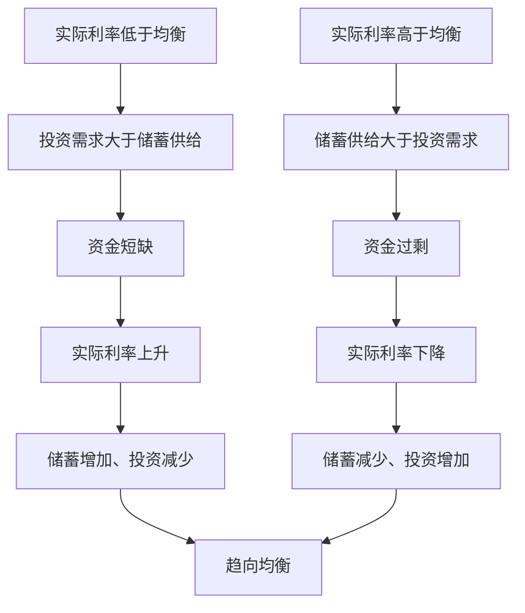

# 4.3 可贷资金市场与实际利率

来源：

- 主线：Mankiw Ch.27
- 补充：Mankiw Ch.26；Mishkin《货币金融学》Ch.1, Ch.2

## 储蓄为什么会等于投资

上一节得到一个会计恒等式：在封闭经济中，国民储蓄等于投资，写作 `S = I`。但会计恒等式只说明两个总量在定义上相等，并没有解释这个相等怎样在现实中实现。

现实中，储蓄者和投资者通常不是同一批人。一个家庭可能收入超过消费，把钱存入银行或购买债券；一家企业可能想建新厂房，却没有足够自有资金；一个年轻家庭可能想买新房，需要按揭贷款；政府预算也可能影响社会可用资金。问题是：这些分散决策怎样被协调起来？谁决定有多少资金流向投资？什么价格让愿意储蓄的人和愿意借款投资的人达成一致？

为了回答这个问题，可以暂时把复杂金融体系简化为一个市场：**可贷资金市场**。这个市场不是指现实中某一个具体交易大厅，而是一个宏观模型。它把所有想储蓄并贷出资金的人放在供给一边，把所有想借款进行投资的人放在需求一边。模型的目的不是描述每一家银行、每一种债券或每一只基金的细节，而是抓住储蓄和投资之间最重要的价格机制：利率。

可贷资金指的是人们选择储蓄并愿意贷出的收入，以及借款者希望借入来为新投资项目融资的资金。在这个简化模型中，所有储蓄都进入同一个市场，所有投资者都从这个市场借款，市场上只有一个利率。现实当然更复杂：有长期利率和短期利率，有安全债券和高风险债券，有银行贷款、公司债、股票融资和基金。但简化模型能先说明一个核心逻辑：利率如何协调储蓄和投资。

## 供给来自储蓄

可贷资金市场的供给来自储蓄者。储蓄者是那些收入超过当前消费、愿意把一部分购买力留到未来使用的人。他们可以直接把钱借给借款者，例如购买公司或政府发行的债券；也可以间接提供资金，例如把钱存入银行，再由银行贷款给企业和家庭。无论直接还是间接，资金来源都是储蓄。

储蓄者为什么愿意把钱贷出去？因为他们希望将当前收入转化为未来购买力。一个家庭今天少消费一部分收入，可能是为了以后买房、支付教育费用、应对风险或退休生活。如果把钱贷出去能获得利息，未来可支配资源会增加，储蓄的吸引力也会上升。

因此，在可贷资金市场中，利率越高，储蓄越有吸引力，可贷资金供给量通常越大。利率可以理解为储蓄者放弃当前消费所获得的回报。当前消费和未来消费之间有取舍，而利率改变了这种取舍的价格。

当然，现实中储蓄对利率的反应可能受收入、税收、风险偏好、退休制度和家庭预期影响。但在这个基础模型里，先抓住最主要的方向：较高利率提高储蓄回报，供给曲线向右上方倾斜。

## 需求来自投资

可贷资金市场的需求来自想借款进行投资的家庭和企业。这里的投资仍然是宏观意义上的投资：购买新设备、建设新厂房、建造新住房、增加存货等。家庭借款购买新住房，企业借款购买机器或建设工厂，都属于对可贷资金的需求。

借款者为什么在意利率？因为利率是借款成本。一个企业是否建设新工厂，取决于项目预期收益是否足以覆盖融资成本。如果利率较低，更多项目看起来值得做；如果利率较高，一些边际项目会放弃。家庭买房也类似，较高按揭利率会提高购房成本，使一些家庭推迟或取消购房。

因此，在可贷资金市场中，利率越高，借款投资越昂贵，可贷资金需求量通常越小。需求曲线向右下方倾斜。它表达的是：当借款成本下降时，更多投资项目能通过收益检验；当借款成本上升时，只有收益足够高的项目还会继续。

这也能把本章和上一节连接起来。资本形成需要投资，投资需要资金，资金的价格是利率。利率不是一个孤立的金融数字，而是影响资本形成、生产率和长期生活水平的重要价格。

## 实际利率才是关键价格

日常新闻里常见的是**名义利率**，也就是借款合约或银行产品上直接写出来的利率。例如一年期贷款利率为 6%，这通常是名义利率。但储蓄者和借款者真正关心的是购买力，而不是货币数字本身。

如果名义利率是 6%，而通货膨胀率是 4%，储蓄者一年后多拿到的货币购买力大约只增加 2%。借款者虽然名义上支付 6% 利息，但如果物价和收入也上涨，实际负担也要扣除通胀影响。这个扣除通胀后的利率称为**实际利率**：

```text
实际利率 = 名义利率 - 通货膨胀率
```

可贷资金市场中真正调节储蓄和投资的是实际利率。储蓄者关心的是未来能买到多少真实物品和服务；投资者关心的是借入资金后，将来需要用多少真实产出去偿还。通货膨胀会改变货币单位的购买力，所以名义利率不能准确衡量储蓄的真实回报和借款的真实成本。

这也是为什么金融知识必须和宏观知识连在一起。利率看似金融变量，但它的真实含义取决于物价水平；投资看似企业决策，但它会影响资本形成和长期 GDP；储蓄看似家庭选择，但它构成社会可用于投资的资金来源。

## 利率怎样让供给和需求相等

像其他市场一样，可贷资金市场由供给和需求共同决定均衡。供给来自储蓄，需求来自投资，实际利率是这个市场的价格。

如果实际利率低于均衡水平，借款投资的人很多，愿意储蓄并贷出资金的人较少，市场出现资金短缺。借款者为了获得资金，会愿意支付更高利率；较高利率一方面鼓励更多储蓄，另一方面抑制一部分投资需求。这个过程会推动市场接近均衡。

如果实际利率高于均衡水平，愿意储蓄的人很多，愿意借款投资的人较少，市场出现资金过剩。贷出资金的人为了找到借款者，会接受较低利率；较低利率一方面减少储蓄供给，另一方面刺激更多投资需求。这个过程也会推动市场接近均衡。



这套机制说明，`S = I` 不只是一个会计结果。在市场机制下，实际利率会调整，使储蓄者愿意提供的资金量和投资者愿意借入的资金量相等。利率就像牛奶市场里的价格一样，协调供给者和需求者，只不过这里交易的是跨时间的购买力。

## 储蓄激励：供给曲线移动

可贷资金模型的一个用途，是分析政策或事件怎样影响储蓄、投资和利率。第一类例子是储蓄激励。

如果税法减少对储蓄收益的征税，例如允许更多退休账户享受税收优惠，家庭在任一给定利率下都更愿意储蓄。因为政策直接改变的是储蓄者的激励，所以它影响可贷资金供给，而不是直接影响投资需求。

供给增加意味着供给曲线向右移动。新的均衡中，实际利率下降，可贷资金均衡数量增加。较低利率降低借款成本，企业和家庭更愿意借款进行投资，投资增加。换句话说，鼓励储蓄的政策如果确实提高储蓄，会通过更多可贷资金、较低利率和更多投资来促进资本形成。

这个逻辑也提醒我们，储蓄政策的最终效果取决于行为反应。如果税收优惠主要给了原本就会储蓄的人，而没有明显增加总储蓄，那么对投资和增长的影响可能有限。模型告诉我们方向，但现实政策效果还要看人们是否真的改变储蓄行为。

## 投资激励：需求曲线移动

第二类例子是投资激励。例如政府给企业购买新设备或建设新工厂提供投资税收抵免。这样的政策不是直接鼓励家庭储蓄，而是让企业在任一给定利率下都更愿意进行投资。

因此，投资激励影响的是可贷资金需求。需求曲线向右移动后，实际利率上升，可贷资金均衡数量增加。较高利率会鼓励更多储蓄，增加资金供给；同时，由于政策提高了投资回报，企业仍愿意借入更多资金进行投资。

这个例子能帮助区分两种“投资增加”的路径。鼓励储蓄是从供给边进入市场，先增加可贷资金供给，压低利率，再带动投资；鼓励投资是从需求边进入市场，先增加借款需求，推高利率，再引出更多储蓄。两种政策都可能提高均衡投资量，但对利率的影响方向相反。

| 变化 | 首先影响 | 曲线移动 | 实际利率 | 均衡投资 |
| --- | --- | --- | --- | --- |
| 储蓄激励增强 | 储蓄者 | 供给右移 | 下降 | 增加 |
| 投资激励增强 | 借款投资者 | 需求右移 | 上升 | 增加 |
| 投资前景变差 | 借款投资者 | 需求左移 | 下降 | 通常减少 |
| 家庭更谨慎、储蓄增加 | 储蓄者 | 供给右移 | 下降 | 取决于需求，通常可贷资金更多 |

表中最后两行也说明，利率下降不一定总是好消息。利率下降可能来自储蓄增加，也可能来自投资需求疲弱。分析利率变化时，不能只看价格本身，还要问是哪条曲线移动。

## 政府预算赤字与挤出

第三类例子是政府预算赤字。政府支出超过税收时，会出现预算赤字。政府通常通过发行债券借款来弥补赤字。国民储蓄等于私人储蓄加公共储蓄，而公共储蓄等于 `T - G`。当政府预算赤字扩大时，公共储蓄为负，国民储蓄下降。

在可贷资金模型中，国民储蓄是可贷资金供给的来源。因此，预算赤字减少可贷资金供给，供给曲线向左移动。新的均衡中，实际利率上升，可贷资金均衡数量下降。较高利率使一些家庭放弃购房，使一些企业放弃建厂或购买设备。政府借款导致私人投资减少，这种现象称为**挤出**。

挤出的逻辑可以这样理解：社会可用于投资的真实资源有限。如果政府通过借款吸收了一部分储蓄，而政府支出没有相应形成能够提高生产率的资本，那么私人部门可获得的投资资金就减少。利率上升是这种稀缺性的价格表现。

预算赤字不一定在所有情况下都同样有害。战争、严重衰退或公共投资可能让政府借款具有特殊理由。但基础模型给出的长期警告很清楚：持续降低国民储蓄的财政政策，会减少可用于私人投资的资金，抬高实际利率，压低资本形成，从而削弱未来生产率和 GDP。

预算盈余则方向相反。政府税收超过支出时，公共储蓄为正，国民储蓄增加，可贷资金供给增加，实际利率下降，投资受到刺激。更高投资会带来更多资本积累，长期有利于生产率提高。

## 金融市场为什么连接现在和未来

可贷资金市场看起来只是一个供求模型，但它有一个特殊之处：它连接现在和未来。普通商品市场通常协调的是当前生产者和当前消费者；可贷资金市场协调的是当前收入和未来消费、当前储蓄和未来回报、当前借款和未来生产能力。

储蓄者把今天不用的购买力交给金融体系，是为了未来获得更多购买力。借款者今天取得资金，是为了现在投资，未来用新增资本生产物品和服务并偿还借款。实际利率正是在这两种跨期选择之间形成的价格。

因此，金融市场运行是否顺畅，不只影响今天谁能借到钱，也影响未来资本存量、生产率和生活水平。如果金融体系无法把储蓄导向有价值的投资项目，即使社会有人愿意储蓄，资本形成也会受阻。如果利率无法反映真实稀缺和风险，投资也可能被错误引导。

这一节只建立最简模型。下一节会打开模型背后的机构层面：现实中的债券市场、股票市场、银行和基金怎样把储蓄者与借款者连接起来。

## 小结

可贷资金市场是理解储蓄和投资协调机制的基础模型。供给来自储蓄，需求来自借款投资，实际利率是市场价格。实际利率上升会鼓励储蓄、抑制投资；实际利率下降会降低储蓄回报、刺激投资需求。

名义利率是货币数字上的利率，实际利率是扣除通货膨胀后的真实回报或真实借款成本。因为储蓄者和投资者关心的是未来购买力，所以可贷资金市场应理解为由实际利率调节。

政策和事件可以通过移动供给或需求影响均衡。储蓄激励增加可贷资金供给，通常降低利率并提高投资；投资激励增加可贷资金需求，通常提高利率并提高投资；政府预算赤字减少国民储蓄，抬高利率并挤出私人投资。这个模型把金融变量和长期增长联系起来：利率影响投资，投资影响资本形成，资本形成影响未来生产率。

## 自测问题

- 可贷资金市场为什么是一个简化模型？它想解释什么核心机制？
- 可贷资金供给为什么来自储蓄？需求为什么来自投资？
- 为什么调节储蓄和投资的是实际利率，而不是名义利率？
- 如果实际利率低于均衡水平，可贷资金市场会怎样调整？
- 储蓄激励和投资激励分别移动哪条曲线？为什么它们对利率的影响方向不同？
- 政府预算赤字为什么会减少国民储蓄？它怎样挤出私人投资？
- 为什么说金融市场连接现在和未来？
