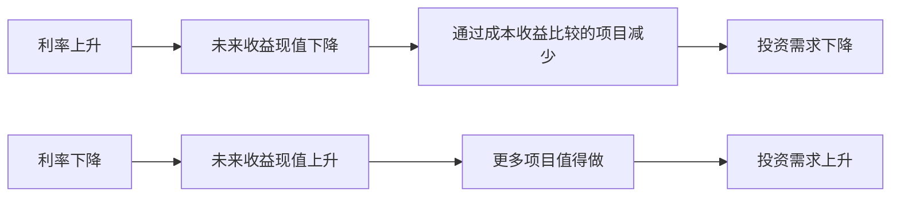

# 4.5 现值、风险与基础金融决策

来源：

- 主线：Mankiw Ch.28
- 补充：Mishkin《货币金融学》Ch.2；Bodie/Kane/Marcus《Investments》Ch.5

## 为什么同样的钱在不同时间不等值

金融决策经常要求人在今天和未来之间做比较。今天拿到 100 元，和 10 年后拿到 100 元，价值一样吗？直觉上不一样，因为今天拿到的钱可以存入银行、购买债券，或者用于其他能带来回报的用途。即使什么都不做，今天的钱也给人更多选择权。

如果选择变成“今天拿 100 元，或者 10 年后拿 200 元”，问题就没那么直观了。10 年后的 200 元看起来更多，但要判断它是否真的更好，必须把未来金额换算成今天的价值。这就是**现值**要解决的问题。

**现值**是指：在给定利率下，为了在未来得到某一笔钱，今天需要拥有多少钱。换句话说，它把未来的钱折算回今天。这个过程叫**贴现**。贴现不是说未来的钱不重要，而是承认今天的钱可以通过利息增长，因此未来金额必须和今天金额放在同一个时间点上比较。

如果利率为 `r`，今天的 100 元在 `N` 年后的未来值是：

```text
未来值 = 100 × (1 + r)^N
```

反过来，如果 `N` 年后会收到 `X` 元，它今天的现值是：

```text
现值 = X / (1 + r)^N
```

这里的 `(1 + r)^N` 是复利因子。利息不仅作用在本金上，也作用在以前产生的利息上。时间越长、利率越高，复利的力量越大；相应地，未来金额折算到今天时，现值越低。

## 用现值判断投资项目

现值的意义不只是做数学练习，它直接解释企业为什么会在利率变化时改变投资决策。

设想一家汽车公司考虑建新工厂。建厂今天需要花费 1 亿美元，预计 10 年后能带来 2 亿美元收益。这个项目是否值得做，不能只看 2 亿大于 1 亿，因为 2 亿发生在未来。正确做法是把未来 2 亿按适当利率折算成今天的现值，再和今天的 1 亿成本比较。

如果利率较低，未来收益的现值较高，项目更容易通过。假设利率为 5%，10 年后 2 亿美元的现值约为 1.23 亿美元，高于今天 1 亿美元成本，项目值得做。若利率升至 8%，同样未来收益的现值约为 0.93 亿美元，低于今天成本，项目就不值得做。

这正好解释了可贷资金市场中投资需求曲线为什么向下倾斜。利率越高，未来收益贴现得越厉害，许多投资项目的现值低于当前成本，企业就会减少投资。利率越低，更多项目的现值超过成本，企业愿意扩大投资。



这个逻辑还适用于个人选择。例如彩票中奖者可以选择未来 50 年每年领取一笔钱，也可以选择今天一次性领取较少金额。表面上，分期总额可能更大；但如果把未来每一笔付款折现到今天，现值可能低于一次性领取金额。真正比较的不是名义总额，而是同一时间点上的价值。

## 名义金额、实际金额和贴现率必须一致

做现值计算时，要注意使用哪种利率。若未来金额是按货币数字写死的，例如“10 年后支付 200 元”，应该用名义利率贴现。若未来金额是按购买力表示的，例如“10 年后支付相当于今天 200 元购买力的金额”，则应该用实际利率贴现。

原因在于通货膨胀会改变货币购买力。名义利率包含通胀补偿，实际利率扣除了通胀影响。现金流和贴现率必须口径一致，否则会把通胀影响算错。

| 未来金额口径 | 应使用的贴现率 | 原因 |
| --- | --- | --- |
| 固定货币金额 | 名义利率 | 金额本身没有扣除通胀 |
| 按今天购买力表示的金额 | 实际利率 | 金额已经以实际购买力衡量 |

这条规则把金融计算和宏观变量连接起来。利率不是孤立的数字，它和物价水平、通胀预期、实际购买力密切相关。前面学习名义变量和实际变量，在这里有了直接用途。

## 复利为什么让小差异变大

复利会让看似很小的增长率差异在长期累积成巨大差异。一个常用经验法则是**70 法则**：如果某个变量每年增长 `x%`，它大约需要 `70 / x` 年翻一番。

如果一个经济体人均收入每年增长 1%，翻一番大约需要 70 年；如果每年增长 3%，翻一番大约只需要 23 年。每年差 2 个百分点，短期看不惊人，但经过几十年会形成完全不同的生活水平。这也是长期增长如此重要的原因。

复利同样适用于储蓄账户。假设一笔钱每年获得 7% 回报，大约 10 年翻一番。若持续 200 年，就会经历很多轮翻倍。时间越长，后期增长越大，因为利息也在继续产生利息。

复利让人理解两个金融事实。第一，越早储蓄，时间越有力量；第二，长期增长率的小差异不能轻视。无论是个人储蓄、企业投资，还是国家增长，时间都会放大回报率差异。

## 风险不能被忽略

到目前为止，现值计算看起来像是确定的：未来会收到多少钱，利率是多少，然后折现即可。但现实金融决策很少完全确定。企业建厂后可能需求不足，股票价格可能下跌，借款者可能违约，个人也可能遭遇疾病、事故或收入中断。

理性面对风险，不是完全避免风险，而是在决策中把风险纳入考虑。滑雪可能摔伤，开车可能发生事故，持有股票可能亏损；但人们不会因此完全不滑雪、不出门、不储蓄投资。关键是理解风险的性质，并选择适当方式管理风险。

大多数人具有**风险厌恶**。风险厌恶不是简单地说人们不喜欢坏事，而是说同样金额的损失带来的痛苦，通常大于同样金额收益带来的快乐。设想有人抛硬币：正面你赢 1000 元，反面你输 1000 元。即使胜负概率相同，很多人也不愿接受这个赌局，因为损失 1000 元造成的效用下降，大于赢得 1000 元带来的效用上升。

风险厌恶背后是财富的边际效用递减。一个人财富越多，每多 1 元带来的额外满足越小；财富减少时，失去的那部分钱可能对应更高边际效用。因此，同样金额的亏损和盈利在心理和福利上并不对称。

## 保险：把风险分散给更多人

保险是管理风险的一种方式。购买保险的人支付保费，保险公司承诺在某些不利事件发生时赔偿一部分或全部损失。汽车保险、火灾保险、健康保险、寿险和年金，都可以理解为风险转移和分散的合同。

保险并不消灭风险。买火灾保险不会让房子更不容易着火；买健康保险也不会让疾病从世界上消失。保险的作用，是把个体独自承担的大额风险，分摊给大量投保人和保险公司股东。一个家庭单独面对房屋烧毁风险时，后果可能毁灭性；如果许多家庭共同分担这种风险，每个人承担的不确定性就小得多。

但保险市场有两个经典问题。第一是**逆向选择**：风险高的人更愿意购买保险，风险低的人可能觉得保费太贵而不买。若保险公司无法区分高风险和低风险客户，保险池中高风险者比例上升，保费会被推高。第二是**道德风险**：人们买了保险后，可能降低谨慎程度，因为部分损失由保险公司承担。例如有保险的人可能不如以前小心防范某些风险。

保险公司通过筛查、定价、免赔额、共付比例和合同限制来缓解这些问题，但无法完全消除。理解这两个问题，有助于以后学习金融机构为什么需要信息收集、风险定价和监管。

## 分散化：不要把命运押在单一资产上

金融风险管理中最实用的一条原则，是不要把所有鸡蛋放在一个篮子里。用金融语言说，就是**分散化**：把一个大的单一风险，替换成许多较小且不完全相关的风险。

一个典型反面例子是，员工把大量退休储蓄集中持有自己所在公司的股票。如果公司倒闭，他们可能同时失去工作和退休资产。单一公司风险非常集中，而个人一生积蓄很难承受这种集中风险。

分散持有许多公司的股票和债券，可以降低**公司特有风险**。某家公司管理失败、产品滞销或财务造假，可能严重打击该公司股票；但如果投资组合中有许多不同公司，这类单一公司事件对总资产影响会变小。

不过，分散化不能消除所有风险。经济衰退、金融危机、利率大幅变化或整体市场下跌，会同时影响许多公司。这类影响整个市场的风险称为**市场风险**。分散化可以显著降低公司特有风险，但无法消除市场风险。

| 风险类型 | 来源 | 分散化能否消除 |
| --- | --- | --- |
| 公司特有风险 | 单家公司经营、管理、产品或财务问题 | 可以大幅降低 |
| 市场风险 | 整体经济、利率、金融危机、系统性冲击 | 不能完全消除 |

这也解释了共同基金和指数基金为什么重要。它们让普通储蓄者用较小金额持有大量证券，从而比单独购买少数股票更容易实现分散化。

## 风险与收益的取舍

风险管理不是把风险降到零。许多低风险资产收益也低，许多高预期收益资产伴随更高风险。金融决策中的核心取舍，是在风险和收益之间选择适合自己的组合。

历史上，股票的平均实际收益率高于短期政府债券和银行储蓄，但股票价格波动也更大。风险厌恶的人之所以仍愿意持有股票，是因为他们希望获得更高预期回报；如果股票没有更高预期回报，很多人就不会愿意承担这种波动。

一个人把储蓄全部放在安全资产中，预期收益较低，波动也较小；把更多储蓄放入股票等风险资产，预期收益可能提高，但资产价值也会更不稳定。没有一个适合所有人的固定答案。年轻人、收入稳定者、风险承受能力高者，可能愿意承担更多风险；接近退休、收入不稳定或对损失非常敏感的人，可能选择更保守的组合。

关键是理解：高预期收益通常不是免费午餐，而是承担风险的补偿。金融决策不能只问“收益率是多少”，还要问“为这个收益率承担了什么风险”。

因此，投资学通常会把收益拆成安全收益和风险溢价。安全收益可以近似理解为投资者放弃当前消费、持有低风险资产所得到的时间补偿；风险溢价则是投资者为了持有股票、长期债券、信用债或其他风险资产而要求的额外预期收益。一个资产看起来收益率高，可能是因为它真的被低估，也可能只是因为它承担了更大的经济周期、利率、信用或流动性风险。

## 资产价值来自未来收益

有了时间价值和风险概念，就能初步理解资产估值。买股票时，买的不是一张纸，而是企业未来收益的一部分。股票价值取决于未来可能获得的现金流，例如股利，以及未来出售股票时可能得到的价格。这些未来收益需要用现值方法折回今天，并根据风险调整。

如果股票价格高于人们根据未来收益估算出的价值，可以说价格偏高；如果价格低于估算价值，可以说价格偏低。研究企业财务报表和未来前景以估计价值的过程，称为基本面分析。

不过，判断价值并不容易。企业未来利润取决于产品需求、资本质量、竞争程度、工会力量、客户忠诚度、监管环境、技术变化和整体经济状况。许多投资者都在分析这些信息，资产价格往往已经反映了大量已知信息。因此，本节只建立最基本思想：资产价值来自未来收益的现值，而未来收益存在风险。

更完整的股票估值、有效市场和行为金融问题，会在后面股票市场章节继续学习。

这里也能看出宏观变量为什么进入资产估值。生产率影响长期现金流增长，储蓄和投资影响实际利率，通胀影响名义折现率，就业和经济周期影响企业利润与违约风险。证券估值不是孤立的公式练习，而是把宏观经济、金融体系和投资风险放进同一个现值框架中。

## 小结

现值让我们能比较不同时间点上的钱。今天的钱比同样数量的未来钱更有价值，因为今天的钱可以赚取利息。未来金额折算到今天，需要除以复利因子；利率越高、时间越长，现值越低。企业投资项目是否值得做，取决于未来收益的现值是否超过当前成本。

复利会放大长期差异。个人储蓄和国家增长都受这个机制影响。每年看似很小的增长率差异，经过几十年会造成巨大结果。

金融决策还必须处理风险。风险厌恶来自财富边际效用递减。保险通过分散风险帮助个人应对大额损失，但受逆向选择和道德风险限制。分散化可以降低公司特有风险，但不能消除市场风险。更高预期收益通常伴随更高风险，投资者需要在风险和收益之间取舍。

资产估值把时间和风险结合起来。股票、债券或投资项目的价值，本质上取决于未来收益的现值，并且未来收益越不确定，决策时越需要考虑风险补偿。

## 自测问题

- 为什么今天的 100 元比 10 年后的 100 元更有价值？
- 现值公式 `X / (1 + r)^N` 中，利率和时间分别怎样影响现值？
- 为什么利率上升会减少企业愿意进行的投资项目？
- 名义金额和实际金额在贴现时为什么要使用不同利率？
- 风险厌恶为什么可以用边际效用递减来解释？
- 保险怎样分散风险？逆向选择和道德风险为什么会限制保险市场？
- 分散化能消除哪类风险？为什么不能消除市场风险？
- 为什么说更高预期收益通常是承担更高风险的补偿？
- 为什么一个资产的高收益率可能只是风险溢价，而不一定代表“便宜”？
