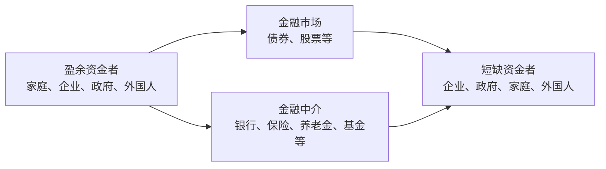

# 5.1 金融市场的功能

来源：

- 主线：Mishkin《货币金融学》Ch.2
- 补充：Mishkin/Eakins Ch.2；Mankiw Ch.27

## 一个发明家和一个储蓄者为什么需要彼此

设想有一位发明家设计出一种低成本家用机器人，它能打扫房屋、清洗汽车、修剪草坪。这个发明如果投入生产，家庭会更省事，企业可能赚钱，社会也会多一种有用产品。问题是，发明家没有足够资金把机器人真正生产出来。

另一边，有一位退休储蓄者多年积累了不少储蓄。他暂时没有创业项目，也不打算自己建工厂。如果发明家和储蓄者无法相遇，结果会很浪费：发明家的好项目无法启动，储蓄者的钱也不能产生回报，社会失去一种可能提高生活质量的产品。

金融市场和金融中介的基本功能，就是让这两类人相遇。更一般地说，它们把资金从**盈余资金者**手中转移到**短缺资金者**手中。盈余资金者是那些收入超过当前支出、愿意把一部分收入留到未来使用的人；短缺资金者是那些当前支出计划超过当前收入、需要外部资金的人。

这不是只发生在个人之间。企业可能有新产品、新工厂或新设备投资机会，却缺少资金；地方政府可能要修路、建学校，但当前税收不够；年轻家庭可能想买房买车，但还没有积累足够储蓄。与此同时，另一些家庭、企业、政府或外国投资者可能正好有多余资金，希望获得回报。

金融市场的第一项功能，就是把这些分散的资金供给和资金需求连接起来。

## 资金流动背后的基本图景

金融体系中的资金流动可以用一个简单图景理解。左边是愿意储蓄并贷出资金的人，右边是需要借入资金来支出或投资的人，中间是金融市场和金融中介。

这里有两条基本路线。第一条是直接融资：借款者在金融市场中直接向储蓄者出售证券，例如债券或股票。第二条是间接融资：储蓄者先把资金交给金融中介，金融中介再把资金贷给或投资于资金需求者。下一节会专门展开直接融资和间接融资的区别；本节先抓住共同点：两条路线都在完成资金从盈余者到短缺者的转移。

这条资金流动不是单纯的“钱换位置”。当资金流向有生产机会的人，社会真实资源也跟着重新配置。发明家获得资金后，可以购买机器、雇佣工人、租用厂房、生产机器人；企业获得资金后，可以建设新生产线；家庭获得住房贷款后，可以提前享受住房服务，并在未来逐步偿还。

## 为什么储蓄者和投资者常常不是同一人

如果每个有储蓄的人都刚好有最好的投资机会，金融市场就没那么重要。但现实恰恰相反：有钱的人未必有项目，有项目的人未必有钱。

一个学生或年轻工作者可能没有储蓄，却希望通过教育贷款积累人力资本。一个木匠可能知道买一套新工具可以大幅提高效率，却没有足够现金。一个创业者可能有新产品想法，却还没有利润。相反，一个退休家庭可能有大量储蓄，但不想也不能亲自经营企业。

如果没有金融市场，储蓄者只能把钱闲置起来，最多保留现金；有投资机会的人无法获得资金。这样一来，储蓄者失去利息收入，投资者失去生产机会，社会也失去潜在产出。

用木匠的例子可以看清楚。假设你今年存下 1000 元，但没有合适投资项目，只能让钱闲置。木匠 Carl 可以用这 1000 元购买新工具，每年多赚 200 元。如果你把钱借给他，并收取每年 100 元利息，你比闲置资金多得 100 元，木匠扣除利息后仍多赚 100 元。双方都变好，社会生产也提高了。

这个例子说明，金融市场不是零和游戏。只要资金从低生产用途流向高生产用途，借贷双方都可能受益，社会整体效率也会提高。

## 金融市场提高资本配置效率

经济学中的资本，既可以指金融财富，也可以指用于生产更多财富的实物资本。金融市场之所以重要，是因为它帮助社会把资本配置到更有价值的用途。

没有金融市场时，资金的使用受个人初始财富限制。谁刚好有钱，谁才能投资；谁缺钱，即使有好项目也无法实施。这样的配置很低效，因为它没有按照项目质量和生产潜力分配资源。

有金融市场时，资金可以从没有生产性用途的人流向有生产性用途的人。储蓄者获得利息、股利或资本收益；借款者获得当前资金；社会获得更多产出。这就是金融市场促进经济效率的基本机制。

这种效率提升也解释了为什么金融市场失灵会带来严重后果。如果金融市场无法把储蓄送到有投资机会的人手中，资本形成会下降，企业扩张受阻，生产率提高放慢。金融危机期间常见的“信贷紧缩”，本质上就是这条资金输送渠道受损：即使有企业想投资，也可能借不到钱。

## 金融市场也改善消费者福利

金融市场的作用不只限于企业投资。它也让家庭能更好地安排一生中的消费。

年轻人刚开始工作时，收入可能不错，但储蓄不多。如果必须等到完全攒够钱才能买房，他可能要多年后才享受到住房服务。金融市场允许有储蓄的人把资金借给年轻家庭，年轻家庭现在买房，未来用收入偿还本金和利息。贷款人获得回报，借款人更早享受住房，双方都可能受益。

类似地，学生贷款帮助年轻人先接受教育，再用未来更高收入偿还；汽车贷款让家庭提前获得交通服务；企业发行债券或股票让消费者更早享受新产品。这些例子有一个共同点：金融市场让人们把收入和支出的时间重新安排。

这也是金融市场连接现在和未来的原因。储蓄者把今天不消费的收入转化为未来购买力；借款者把未来收入的一部分提前用于今天的支出或投资。利率就是这种跨时间交换的价格。

## 证券为什么同时是资产和负债

直接融资中，借款者通常通过出售**证券**取得资金。证券也叫金融工具，是对发行者未来收入或资产的索取权。它对买方是资产，因为买方未来有权取得利息、股利、本金或其他收益；对发行方是负债或权益义务，因为发行方未来要支付现金流或分享收益。

债券是典型债务证券。企业发行债券时，承诺在未来按约定支付利息和本金。股票则代表对企业利润和资产的部分所有权。企业发行股票时，不承诺固定还款，而是让投资者分享企业未来收益和风险。

理解“同一张证券对双方意义不同”很重要。金融资产不是凭空创造社会财富的纸片，它是一种索取权安排。它让资金提供者愿意把当前购买力交出去，也让资金需求者获得使用真实资源的能力。金融市场的功能，正是在这些索取权安排中，把储蓄转化为支出和投资。

## 盈余者和短缺者不只是一类人

通常来说，家庭是最重要的盈余资金者，因为许多家庭会把收入的一部分储蓄起来，用于未来消费、养老、教育或应急。但企业、政府和外国人有时也会成为盈余资金者。例如一家企业可能暂时现金充裕，地方政府可能有财政盈余，外国投资者可能希望把资金投向本国资产。

短缺资金者也不只有企业。企业经常借款或发行股票债券来建设工厂、购买设备、研发产品。政府可能借款建设基础设施或弥补预算赤字。家庭会借款买房、买车或支付教育费用。外国企业和政府也可能从本国金融市场筹资。

| 角色 | 常见主体 | 为什么提供或需要资金 |
| --- | --- | --- |
| 盈余资金者 | 家庭、企业、政府、外国人 | 当前收入超过支出，希望获得未来回报 |
| 短缺资金者 | 企业、政府、家庭、外国人 | 当前支出或投资计划超过自有资金 |
| 金融市场 | 债券市场、股票市场等 | 让资金需求者直接向资金供给者融资 |
| 金融中介 | 银行、保险公司、养老金、基金等 | 先从储蓄者取得资金，再转给借款者 |

这个表说明，金融体系不是某个单一机构，而是一组把资金供求联系起来的市场和机构。不同主体在不同时间可能处于不同位置：今天的储蓄者未来可能成为借款者，今天的借款企业未来也可能成为资金提供者。

## 金融市场为什么对经济健康关键

一个运行良好的金融体系会带来几类好处。

第一，它提高生产效率。资金流向有盈利机会和生产能力的项目，资本形成增加，未来产出提高。企业能够扩张，技术能够商业化，基础设施能够建设。

第二，它改善资源配置。没有金融市场时，投资取决于谁手里有钱；有金融市场时，资金更可能流向预期回报更高、风险更可控的用途。虽然金融市场不会完美判断所有项目，但它提供了筛选和定价机制。

第三，它改善家庭福利。家庭可以借款提前购买住房、汽车或教育，也可以储蓄为未来消费做准备。金融市场让一生中的收入和支出不必在每一年严格相等。

第四，它影响宏观稳定。金融市场如果运转顺畅，储蓄能够流向投资，经济更容易维持资本形成；如果金融市场崩溃，企业融资困难、家庭信贷收缩、投资下降，经济可能陷入严重衰退。

因此，金融市场不是脱离实体经济的独立世界。它的最终意义在于影响真实资源如何配置、资本如何形成、产品和服务能否被生产出来，以及家庭能否更好地安排当前和未来生活。

## 本章接下来怎样展开

理解金融市场的功能以后，才能进一步理解金融系统的结构。接下来几节会按照原书的逻辑逐步拆开这个系统。

首先，要区分直接融资和间接融资。直接融资中，借款者在金融市场上直接出售证券；间接融资中，金融中介站在储蓄者和借款者之间。

其次，要区分债务市场和股权市场，并认识主要金融工具。债券、股票、抵押贷款、商业票据等工具，本质上是不同形式的资金契约。

再次，要区分一级市场和二级市场、交易所市场和场外市场、货币市场和资本市场。这些分类不是为了记名词，而是为了理解不同市场怎样服务于不同期限、不同风险和不同融资需求。

最后，要看金融中介和监管。金融中介为什么存在？为什么银行、保险公司、基金和养老金可以降低交易成本、分担风险、处理信息问题？为什么金融体系需要监管？这些问题会在后面章节继续展开。

## 小结

金融市场的核心功能，是把资金从盈余资金者转移到短缺资金者。盈余资金者收入超过当前支出，希望把购买力转到未来；短缺资金者当前支出或投资计划超过自有资金，需要外部资金。

这种资金转移提高经济效率，因为储蓄者和有生产性投资机会的人往往不是同一批人。金融市场让储蓄不再闲置，让有价值的投资项目获得资金，从而促进资本形成、生产率提高和长期增长。

金融市场也改善家庭跨期消费安排。它让年轻家庭可以提前买房，让学生可以先接受教育，让储蓄者获得未来回报。金融市场连接现在和未来，利率是这种跨期交换的重要价格。

金融体系运行良好时，社会资源更容易流向高价值用途；金融体系失灵时，储蓄到投资的通道受阻，投资下降，经济增长和宏观稳定都会受到影响。

## 自测问题

- 盈余资金者和短缺资金者分别是什么意思？常见主体有哪些？
- 为什么有储蓄的人和有投资机会的人通常不是同一批人？
- 木匠借钱买工具的例子怎样说明金融市场能让双方都受益？
- 证券为什么对购买者是资产，对发行者是负债或权益义务？
- 金融市场怎样提高资本配置效率？
- 金融市场为什么不仅服务企业，也改善消费者福利？
- 为什么金融市场失灵会影响实体经济和长期增长？
