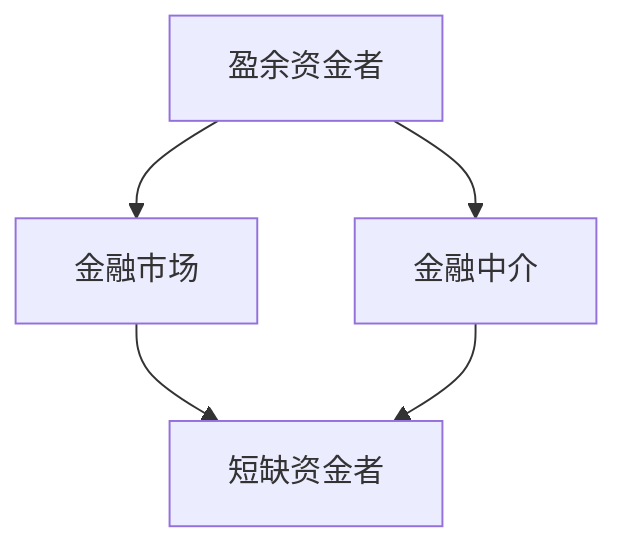

# 5.2 直接融资与间接融资

来源：

- 主线：Mishkin《货币金融学》Ch.2
- 补充：Mishkin/Eakins Ch.2；Mankiw Ch.27

## 同一笔资金可以走两条路

上一节已经看到，金融体系的基本任务是让资金从盈余资金者流向短缺资金者。现在要进一步问：这笔资金具体怎样流动？

资金流动可以分成两条路线。第一条路线是**直接融资**：借款者直接在金融市场中向贷款者出售证券，取得资金。第二条路线是**间接融资**：贷款者先把资金交给金融中介，金融中介再把资金提供给借款者。

这两条路线都能把储蓄转化为投资或支出，但它们的组织方式不同。直接融资中，储蓄者直接持有借款者发行的证券；间接融资中，储蓄者持有金融中介发行的负债或份额，而金融中介持有借款者的贷款或证券。

这张图看起来简单，却是理解后面整个金融体系的基础。债券、股票、银行贷款、存款、基金、保险、养老金，表面形式很多，但都可以先放进这两条路线中理解。

## 直接融资：借款者向市场出售证券

直接融资发生在借款者直接通过金融市场向储蓄者融资时。借款者出售证券，储蓄者购买证券。证券是对借款者未来收入或资产的索取权，它对购买者是资产，对发行者是负债或所有权义务。

例如一家汽车公司想建设电动车工厂，需要大量资金。它可以在金融市场上发行债券。购买债券的人把资金交给公司，公司承诺在未来按约定支付利息并偿还本金。这里公司是资金需求者，债券购买者是资金供给者，金融市场让双方直接连接。

同一家公司也可以发行股票。股票购买者把资金交给公司，换取公司未来利润和资产的一部分索取权。公司不承诺固定还本付息，但股东可以分享企业成功带来的收益，也承担企业失败带来的损失。

直接融资的关键，是借款者通过出售金融工具取得资金。债券和股票都是金融工具，但权利结构不同：债券强调还本付息，股票强调所有权和剩余收益。

## 证券对双方的含义不同

理解直接融资时，要特别注意证券的双重身份。同一张证券，对买方和卖方的意义相反。

如果你购买某公司债券，这张债券是你的资产，因为它代表未来收取利息和本金的权利；但对公司来说，它是负债，因为公司承担未来支付义务。如果你购买某公司股票，股票对你是资产，因为它代表所有权和未来收益索取权；对公司原有所有者来说，发行股票意味着企业所有权被分出一部分。

| 证券类型 | 对购买者 | 对发行者 | 资金性质 |
| --- | --- | --- | --- |
| 债券 | 资产，未来收取利息和本金 | 负债，未来还本付息 | 债务融资 |
| 股票 | 资产，拥有部分企业和利润索取权 | 出让部分所有权 | 股权融资 |

这个表有助于避免一个常见误解：金融资产并不是凭空创造出的真实资源。它是一种关于未来现金流、收益和风险的契约安排。直接融资之所以有用，是因为这种契约让资金供给者愿意把当前购买力交给资金需求者。

## 间接融资：中介站在两边之间

间接融资中，储蓄者不直接把钱借给最终借款者，而是先把资金交给金融中介。金融中介再用这些资金贷款或购买证券。银行是最直观的例子。

一个家庭把钱存进银行。对家庭来说，银行存款是资产，因为银行承诺未来支付本金和利息，并提供取款或支付服务。对银行来说，存款是负债，因为银行欠存款人钱。银行再用这些资金向企业发放贷款，或购买政府债券。对银行来说，贷款和债券是资产，因为它们会带来利息收入；对借款企业或政府来说，它们是负债。

资金最终从储蓄家庭流向企业或政府，但中间经过银行。储蓄者面对的是银行，借款者面对的也是银行。银行承担筛选借款者、设计合同、监督还款和管理风险的工作。

共同基金、保险公司、养老金也属于金融中介。它们具体形式不同，但共同点是：先从资金供给者那里取得资金，再以贷款、证券投资或其他方式把资金提供给资金需求者。

## 为什么间接融资如此重要

新闻报道往往更关注股票市场和债券市场，因为它们价格变动频繁、容易被报道。但从企业融资角度看，金融中介在许多国家比证券市场更重要。即使在证券市场发达的经济体，企业也大量依赖银行和其他中介融资；在一些国家，间接融资的重要性更高。

原因不是企业不想直接面对市场，而是直接融资有很多障碍。小额储蓄者通常没有能力评估每一个借款者，也没有能力设计复杂合同；小企业和个人借款者通常也没有名气和规模，难以直接向公众发行证券。金融中介正是为了解决这些障碍而存在。

间接融资重要，主要因为金融中介能处理三类问题：交易成本、风险分担和信息成本。

## 交易成本：小额借贷为什么需要中介

**交易成本**是完成金融交易所花费的时间和金钱。借贷看起来只是“把钱给出去再收回来”，但现实中需要寻找借款者、判断信用、写合同、约定利率、安排还款时间、处理违约。

继续木匠 Carl 的例子。你有 1000 元，Carl 买新工具后每年能多赚 200 元。你愿意借给他并收取 100 元利息，双方都能受益。但为了保护自己，你可能需要请律师写贷款合同，明确利息、还款时间和违约处理。如果合同成本是 500 元，这笔交易就不划算了。结果是，你不愿贷款，Carl 买不到工具，双方都失去机会。

金融中介能降低交易成本，原因之一是规模经济。银行可以请专业律师设计标准贷款合同，并在大量贷款中重复使用。假设一份严密合同成本 5000 元，但能用于 2000 笔贷款，那么每笔贷款分摊的合同成本只有 2.5 元。单个储蓄者无法承担的成本，金融中介可以通过规模化大幅降低。

交易成本降低以后，小额储蓄也能进入金融体系，小额借款也更容易发生。金融中介还提供流动性服务，例如银行存款既能赚取一定利息，又能方便支付账单、转账或取现。这些服务让储蓄者更愿意把资金交给中介。

## 风险分担：把不适合个人承担的风险重新包装

金融中介还能帮助分担风险。许多投资项目收益不确定，普通储蓄者可能不愿直接承担这些风险。金融中介可以发行储蓄者更愿意持有的资产，再用筹集来的资金购买风险更高的资产或发放贷款。

这个过程有时被称为**资产转换**。银行发行相对安全、流动性较强的存款，同时持有期限较长、风险较高的贷款。保险公司收取保费，再承担投保人的特定风险。共同基金把资金投向一组证券，让投资者持有一个分散组合。金融中介把资产的风险、期限和流动性特征重新组合，使它们更适合不同人的需要。

分散化也是风险分担的重要方式。单个投资者如果只买一家公司的证券，风险很集中；金融中介可以把许多资产放在一个组合中，再把组合份额卖给众多投资者。只要这些资产收益不完全同涨同跌，整体风险就会低于单一资产风险。

风险分担不等于风险消失。风险仍然存在，只是由更能承担或更愿意承担的人分担，并通过大量资产和大量参与者分散开来。

## 信息成本：借款者通常知道得更多

金融交易中还有一个更深的问题：**信息不对称**。借款者通常比贷款者更了解自己的项目、还款能力和真实风险。贷款者如果信息不足，可能无法区分好借款者和坏借款者。

信息不对称会在交易前造成**逆向选择**。最急于借钱的人，可能正是风险最高的人。设想你有两位亲戚想借钱。一位谨慎，只有在投资项目很稳妥时才借；另一位喜欢冒险，刚看到一个快速致富计划，急需借钱。谁更可能主动来借钱？往往是后者。但你最不愿意借给的也正是后者。如果你无法区分两人，就可能干脆谁都不借，连好的借款机会也被放弃。

信息不对称还会在交易后造成**道德风险**。借款者拿到钱以后，可能从事比贷款者预期更冒险的行为，因为收益主要归自己，损失可能部分由贷款者承担。例如企业借到钱后，可能改变项目用途，投入高风险项目。

金融中介通过专业化缓解这些问题。银行长期收集借款者信息，评估收入、资产、经营记录和还款能力；贷款后还会监督借款行为，设置抵押品、限制性条款和还款安排。中介不能完全消除信息问题，但比单个小储蓄者更有能力处理它们。

## 直接融资和间接融资的比较

直接融资和间接融资不是谁完全替代谁，而是服务不同场景。

大型企业、政府和知名机构更容易直接进入债券市场和股票市场，因为投资者能获得更多公开信息，证券发行规模也足够大，值得承担发行和信息披露成本。小企业、普通家庭和信息较不透明的借款者，更依赖银行等金融中介。

直接融资通常让资金供给者直接持有最终借款者的证券，收益和风险更直接；间接融资让储蓄者面对中介，中介承担筛选、监督、风险转换和流动性服务。

| 比较维度 | 直接融资 | 间接融资 |
| --- | --- | --- |
| 资金路径 | 储蓄者通过金融市场直接购买借款者证券 | 储蓄者把资金交给中介，中介再投向借款者 |
| 典型工具 | 债券、股票 | 存款、贷款、基金份额、保险合同 |
| 适合对象 | 大企业、政府、信息较透明的发行者 | 小企业、家庭、信息较难判断的借款者 |
| 主要优势 | 直接连接市场，融资规模可大 | 降低交易成本、分担风险、处理信息问题 |
| 主要难点 | 信息披露和发行成本较高 | 中介本身需要稳健经营和监管 |

理解这个比较后，金融体系的结构就清楚多了。不是所有融资都通过股票市场，也不是所有融资都通过银行。不同制度安排解决不同问题。

## 金融中介为什么不是多余环节

从表面看，间接融资多了一个中间人，好像会增加成本。但金融中介之所以存在，正是因为它能降低总成本。

如果没有银行，成千上万储蓄者需要逐一寻找借款者、审查信用、写合同、监督还款。每个人重复做这些事，成本极高。银行集中处理这些工作，利用专业化和规模经济降低成本。储蓄者付出一部分收益让渡，换来便利、流动性和风险管理；借款者支付利息，换来可获得的资金。

同样，共同基金并不是简单“转手买股票”。它让普通投资者用较小金额获得分散组合，降低个人直接构建组合的成本。保险公司也不是凭空消除风险，而是通过大量保单和精算定价，把个体难以承受的大额风险转化为可管理的保费。

因此，金融中介不是金融体系中的多余层级，而是处理交易成本、风险和信息问题的制度安排。

## 小结

资金从盈余者到短缺者有两条基本路线。直接融资中，借款者在金融市场上直接出售证券给资金供给者；间接融资中，金融中介先从储蓄者那里取得资金，再把资金提供给借款者。

直接融资的典型工具是债券和股票。债券代表还本付息的债务关系，股票代表企业所有权和利润索取权。证券对购买者是资产，对发行者则是负债或权益义务。

间接融资之所以重要，是因为金融中介能降低交易成本、提供流动性服务、分担和转换风险、缓解信息不对称。交易前的信息问题会带来逆向选择，交易后的信息问题会带来道德风险。银行、基金、保险公司等中介通过专业化和规模经济缓解这些问题。

直接融资和间接融资共同构成金融体系的基本资金通道。理解这两条通道，才能继续理解债务市场、股权市场、金融工具和金融监管。

## 自测问题

- 直接融资和间接融资的资金路径分别是什么？
- 为什么证券对购买者是资产，对发行者是负债或权益义务？
- 为什么大型企业更容易直接融资，而小企业更依赖金融中介？
- 交易成本怎样阻碍小额借贷？金融中介如何降低交易成本？
- 什么是风险分担和资产转换？银行存款和贷款怎样体现这一点？
- 信息不对称为什么会导致逆向选择和道德风险？
- 为什么金融中介不是多余环节，而是金融体系的重要组成部分？
