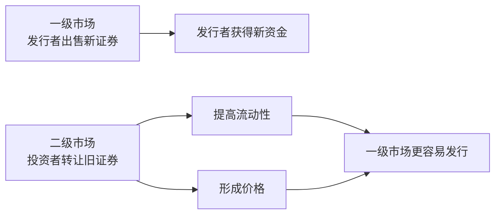
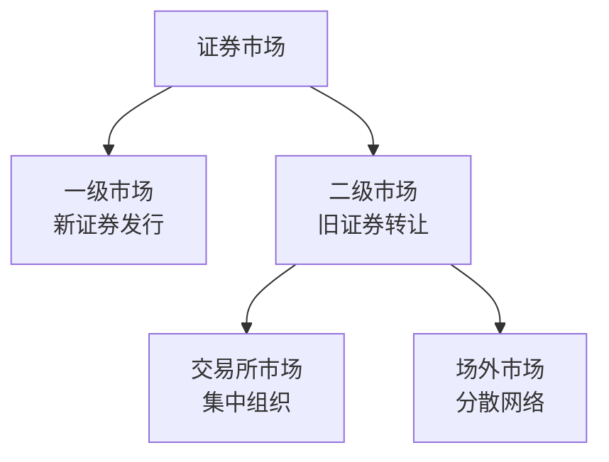

# 5.4 一级市场、二级市场、交易所市场与场外市场

来源：

- 主线：Mishkin《货币金融学》Ch.2
- 补充：Mishkin/Eakins Ch.2；Mankiw Ch.27

## 证券市场要先区分“发行”和“转让”

上一节讲了债务工具和股权工具。现在进一步看：这些证券是在什么市场中被卖出的？

理解证券市场时，第一件事是区分两类交易。第一类是企业或政府第一次把新证券卖给投资者，从而取得资金。第二类是投资者之间买卖已经发行过的证券。前者是**一级市场**，后者是**二级市场**。

这个区分很重要，因为只有一级市场交易会让证券发行者直接获得新资金。二级市场交易虽然每天更常见，也更容易出现在新闻里，但多数情况下只是投资者之间转让证券，发行企业或政府并不直接取得新资金。

举例说，一家公司首次发行新债券，投资者把钱交给公司，公司拿到资金建厂，这是一级市场。如果几年后这位投资者把债券卖给另一位投资者，钱从第二位投资者流向第一位投资者，公司本身没有再收到钱，这是二级市场。

## 一级市场：新证券第一次出售

**一级市场**是新发行证券出售给最初购买者的市场。企业、政府或其他机构想筹集资金时，会在一级市场发行债券、股票或其他证券。资金从投资者流向发行者，发行者获得新的金融资本。

一级市场往往不如二级市场为公众熟悉，因为证券首次发行通常由专业机构组织，不一定像股票日常交易那样公开可见。投资银行在一级市场中常扮演重要角色。它帮助发行者设计发行方案、评估发行价格、承销证券，并把证券销售给投资者。

承销可以理解为投资银行帮助发行者完成初次出售。投资银行可能先承诺以一定价格买下证券，再转售给公众或机构投资者。这样发行者能更确定地获得资金，投资银行则承担销售风险并获得报酬。

一级市场对实体经济很直接。企业通过发行股票或债券筹资，才能建设工厂、购买设备、研发产品；政府通过发行债券筹资，才能弥补预算缺口或建设公共项目。因此，一级市场是储蓄转化为新投资和新支出的直接入口之一。

## 二级市场：已发行证券的再出售

**二级市场**是已经发行的证券被再次买卖的市场。投资者买卖股票、债券、外汇、期货或期权，多数发生在二级市场。公众熟悉的股票市场，通常主要指二级市场。

在二级市场中，证券发行者通常不直接取得资金。如果一个人买入某公司已经发行的股票，付款对象是卖出股票的投资者，而不是公司。公司只有在新股首次发行或增发时，才直接取得资金。

这并不意味着二级市场不重要。相反，二级市场有两个关键功能。

第一，它提高证券的**流动性**。流动性指资产能否比较容易、快速地转换成现金。如果投资者知道自己以后可以把债券或股票卖出去，就更愿意在一级市场购买这些证券。证券越容易转让，投资者越愿意持有，发行者未来融资也越容易。

第二，二级市场形成证券价格。一级市场的投资者不会无视二级市场价格。如果某家公司股票在二级市场上价格较高，它以后发行新股时通常能以较高价格筹集更多资金；如果二级市场价格很低，发行新股会更困难。债券也类似，二级市场价格和收益率会影响新债发行条件。

这说明，二级市场虽然不直接给发行者带来每一笔交易资金，却通过流动性和价格影响一级市场，从而间接影响企业和政府融资。

## 为什么二级市场价格会影响一级市场

设想一家公司计划发行新股票。如果市场上同类公司的股票价格较高，投资者愿意为未来利润支付更高价格，这家公司发行新股时也更容易筹到资金。反过来，如果二级市场价格低迷，投资者对公司未来盈利不乐观，企业发行新股就可能必须接受较低价格，甚至推迟融资。

债券也是如此。已经发行债券在二级市场上的价格和收益率，会影响新债券投资者要求的利率。如果市场认为某类债券风险上升，新发行债券就需要提供更高收益率才能卖出。发行者的融资成本因此上升。

因此，二级市场不是与实体融资无关的“旧证券买卖场”。它通过价格信号告诉发行者和投资者：资金愿意以什么条件进入某类项目或某类借款者。价格不是完美信息，但它是金融体系配置资本的重要信号。

## 交易所市场：集中组织的二级市场

二级市场可以按组织方式分为交易所市场和场外市场。

**交易所市场**是买卖双方或其代理人在集中组织的场所或系统中交易证券的市场。纽约证券交易所是股票交易所的典型例子。交易所通常有上市规则、信息披露要求和交易规则。证券在交易所挂牌后，投资者可以通过规定程序买卖。

交易所市场的特点，是交易活动集中，规则相对统一，价格信息较容易被观察。对投资者来说，集中市场能降低寻找交易对手的成本；对发行公司来说，在知名交易所上市也可能提高证券知名度和流动性。

这里需要注意，本课程只需要理解交易所作为一种集中组织的二级市场形式，不进入交易执行层面的技术细节。

## 场外市场：分散但相互连接的市场

**场外市场**不是把所有买卖双方集中到一个交易所，而是由分散在不同地点的交易商或机构通过通信网络联系，完成证券买卖。许多政府债券、部分股票、外汇工具和短期金融工具都可以在场外市场交易。

场外市场并不意味着混乱或不重要。相反，一些场外市场规模很大，尤其是政府债券市场。它们通过分散机构之间的报价、联系和交易形成市场。由于参与者可以相互比较价格，场外市场也可以具有较强竞争性。

交易所市场和场外市场的区别，主要是组织形式不同，而不是谁一定更高级。某些证券适合集中交易，某些证券则长期通过分散网络交易。对宏观金融理解而言，关键是二者都属于二级市场，都能提高证券流动性并形成价格。

| 分类维度 | 类型 | 核心含义 | 对融资的意义 |
| --- | --- | --- | --- |
| 是否新发行 | 一级市场 | 新证券首次出售 | 发行者直接获得资金 |
| 是否新发行 | 二级市场 | 已发行证券再出售 | 提供流动性和价格信号 |
| 组织方式 | 交易所市场 | 集中组织交易 | 降低搜寻成本，提高可见度 |
| 组织方式 | 场外市场 | 分散机构网络交易 | 服务大量债券和其他工具 |

## 经纪人和交易商在二级市场中的作用

二级市场需要有人帮助买卖双方连接。经纪人和交易商是常见角色。

**经纪人**代表投资者寻找交易对手。可以把经纪人理解为撮合买方和卖方的代理人。买方想买，卖方想卖，经纪人帮助双方达成交易，并从服务中获得报酬。

**交易商**则以自己的账户买卖证券，连接愿意买和愿意卖的人。交易商持有一定证券并报出交易条件，使其他投资者更容易完成买卖。这里不展开交易商如何报价或如何管理库存，只需要理解它们帮助二级市场运转，降低投资者转让证券的难度。

经纪人和交易商的存在，再次说明金融市场不是自然自动运行的抽象空间。市场需要制度、规则、参与者和信息网络来降低交易成本。

## 四个市场概念不要混在一起

一级市场、二级市场、交易所市场、场外市场是两个不同维度的分类，容易混淆。

一级和二级，是按证券是否首次发行来分。交易所和场外，是按二级市场的组织方式来分。也就是说，交易所市场和场外市场主要是在二级市场内部讨论的分类。

一家公司发行新股票，这是一级市场；股票发行后在纽约证券交易所交易，是二级市场中的交易所市场；某些债券发行后在分散机构网络中买卖，是二级市场中的场外市场。

把这个层级分清以后，后面学习债券市场、股票市场、货币市场和资本市场时，就不会把“证券是什么”“证券在哪里首次发行”“证券发行后如何转让”混成一个问题。

## 小结

一级市场是新证券首次出售的市场，发行者在这里直接获得资金。企业发行股票、公司债，政府发行债券，都可以通过一级市场筹资。投资银行常帮助发行者完成初次销售和承销。

二级市场是已发行证券再出售的市场。二级市场交易通常不让发行者直接取得新资金，但它非常重要：它提高证券流动性，让投资者更愿意在一级市场购买证券；它形成证券价格，影响发行者未来融资条件。

二级市场可以按组织方式分为交易所市场和场外市场。交易所市场集中组织交易，规则和价格信息较集中；场外市场通过分散机构网络交易，许多债券和其他金融工具在场外市场交易。两种形式都服务于证券流动性和价格形成。

理解这些分类，是为了看清金融系统如何运作：一级市场解决“谁获得新资金”，二级市场解决“证券能否转让和如何定价”，交易所与场外市场则说明二级市场可以有不同组织形式。

## 自测问题

- 一级市场和二级市场的根本区别是什么？
- 为什么只有一级市场交易会让发行者直接获得新资金？
- 二级市场既然不直接给发行者钱，为什么仍然重要？
- 流动性为什么会影响投资者是否愿意购买新发行证券？
- 二级市场价格怎样影响企业未来融资条件？
- 交易所市场和场外市场的区别是什么？
- 为什么说“一级/二级”和“交易所/场外”是两个不同分类维度？
