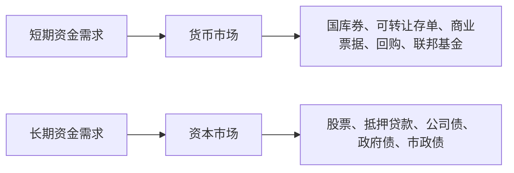

# 5.5 货币市场与资本市场

来源：

- 主线：Mishkin《货币金融学》Ch.2
- 补充：Mishkin/Eakins Ch.2；Mankiw Ch.27

## 按期限理解金融市场

金融市场可以按很多方式分类。上一节按“是否首次发行”和“市场组织方式”区分了一级市场、二级市场、交易所市场和场外市场。本节换一个维度：按金融工具期限区分**货币市场**和**资本市场**。

这里的“货币市场”不是买卖货币本身的市场，也不是普通人日常买东西的市场。它指交易短期债务工具的金融市场。通常，原始期限少于一年的债务工具属于货币市场。

**资本市场**则交易长期债务工具和股权工具。通常，原始期限一年或一年以上的债务工具，以及没有到期日的股票，都属于资本市场。

这个分类的核心是时间。短期资金需求和长期资金需求不同，短期金融工具和长期金融工具的风险、流动性和使用者也不同。企业临时有一笔闲置现金，希望几周或几个月后还能方便使用，通常会关注货币市场。保险公司、养老金这类长期资金机构，则更可能持有长期债券和股票等资本市场工具。

| 分类 | 主要工具 | 期限特征 | 常见用途 |
| --- | --- | --- | --- |
| 货币市场 | 短期债务工具 | 通常少于一年 | 临时融资、短期资金管理、流动性管理 |
| 资本市场 | 长期债务和股权 | 一年或更长，股票无到期日 | 长期投资、住房融资、企业扩张、政府长期融资 |

## 货币市场为什么强调短期和流动性

货币市场工具期限短，因此价格通常比长期工具波动小。原因在于，期限越短，未来利率、通货膨胀、信用状况变化的时间越少，投资者面临的不确定性也通常较低。

货币市场工具还通常更重视流动性。流动性是指资产能否比较容易地转换成现金。企业和银行经常有短期资金余缺：今天暂时多出一笔现金，几周后可能要支付工资、采购款或到期债务。它们希望这笔钱在短期内仍能保持安全和可用，同时获得一定利息。因此，货币市场为短期资金管理提供了场所。

货币市场并不等于没有风险。短期债务也可能违约，金融危机时短期融资也可能突然收缩。但相对于长期债券和股票，货币市场工具通常期限更短、价格波动较小，因而被广泛用于流动性管理。

## 国库券：短期政府债务工具

国库券是政府发行的短期债务工具，常见期限为一个月、三个月或六个月。它们通常不按普通债券那样定期支付利息，而是以低于到期支付金额的价格出售。投资者买入时支付较低价格，到期时收到较高面值，二者差额就是收益。

例如，一张到期支付 10000 元的短期国库券，可能今天以 9000 元出售。投资者今天支付 9000 元，几个月后收到 10000 元。虽然中间没有单独利息支付，但折价买入和面值兑付之间的差额起到了利息作用。

国库券通常被认为是货币市场中流动性最高、信用风险最低的工具之一。政府通常有征税能力，也有较强偿债能力，因此短期政府债务违约概率较低。银行、企业、金融机构和部分家庭都会持有国库券。

## 可转让存单、商业票据和回购

货币市场中还有几类重要工具。

**可转让存单**是银行向存款者出售的债务工具。银行承诺支付一定利息，并在到期时偿还本金。普通定期存款通常不方便转让，而可转让存单可以在二级市场出售，因此更适合大额资金持有人和机构投资者。

**商业票据**是大型银行或知名企业发行的短期债务工具。信誉较好的企业可以通过发行商业票据获得短期资金，用于库存、应收账款或其他短期支出。由于商业票据通常没有抵押，发行者信用非常重要。

**回购协议**可以理解为以证券为抵押的短期借款。借款方出售某种证券并约定很快买回，买回价格略高于卖出价格。经济实质上，资金提供者把钱借给借款方，证券作为抵押品，价格差额相当于利息。回购期限通常很短，常用于金融机构和大型企业的短期资金安排。

这些工具形式不同，但共同点是：期限短、金额通常较大、参与者多为机构，主要服务短期融资和流动性管理。

## 联邦基金：银行之间的隔夜资金

联邦基金是银行之间短期借贷的资金，通常是隔夜借款。名字中有“联邦”，但这类贷款不是政府直接发放，也不是中央银行直接借给银行，而是银行把自己在中央银行账户中的准备金借给其他银行。

银行为什么需要这种市场？银行每天的存款流入、贷款发放和支付清算都会改变准备金余额。有的银行当天准备金不足，有的银行准备金富余。准备金不足的银行可以向准备金富余的银行借入隔夜资金。

联邦基金利率是银行间隔夜借款利率，常被视为银行体系资金松紧程度的重要指标，也和货币政策密切相关。后面学习中央银行和货币政策时，会更详细讨论这个利率。

在本节中，只要先把联邦基金放入货币市场理解：它是极短期资金市场的一部分，帮助银行管理短期流动性。

## 资本市场为什么面向长期融资

资本市场交易长期债务和股权。与货币市场相比，资本市场工具期限更长，价格波动通常更大，投资者承担的不确定性也更多。

长期融资适合长期资产。企业建设工厂、购买大型设备、开发长期项目，不可能靠每天滚动的短期借款来稳定融资；家庭购买住房，也需要几十年期抵押贷款；政府建设道路、学校和基础设施，通常也需要长期债务融资。

资本市场因此和长期资本形成联系更直接。股票、公司债、长期政府债券、抵押贷款等工具，把长期资金导向企业、家庭和政府的长期支出或投资。

## 股票：没有到期日的股权工具

股票是资本市场中最重要的股权工具。它代表对公司净收入和资产的索取权。股票没有到期日，股东持有的是企业所有权的一部分。

股票市场规模庞大，也最受公众关注。股票价格波动会影响家庭财富、企业融资条件和投资者预期。企业股票价格高时，发行新股更容易筹集资金；股票价格低时，股权融资成本上升。

但要注意，股票市场中的新股发行数量通常只是股票总市值的一小部分。大量股票交易发生在二级市场，主要是投资者之间转让所有权。股票市场重要，不仅因为它直接融资，也因为它通过价格反映企业未来利润预期。

## 抵押贷款和抵押贷款支持证券

抵押贷款是家庭或企业购买土地、住房或其他建筑物时取得的贷款，所购资产本身通常作为抵押品。住房抵押贷款是资本市场中规模很大的债务形式，因为住房价值高、还款期限长。

抵押贷款通常由银行、储蓄机构、保险公司等金融机构提供。后来，越来越多抵押贷款被打包成**抵押贷款支持证券**。这种证券类似债券，其现金流来自一组抵押贷款的利息和本金支付。投资者购买证券后，间接持有许多住房贷款的现金流。

抵押贷款支持证券能把住房贷款从单个金融机构资产负债表中转移到更广泛投资者手中，从而扩大住房融资来源。但这类工具也会带来复杂风险。2007-2009 年全球金融危机中，抵押贷款相关证券和更复杂结构性产品发挥了重要作用。这里暂时只需要认识它们属于资本市场工具，更深入的危机机制会在后面金融危机章节展开。

## 公司债、政府债和市政债

**公司债**是企业发行的长期债务工具。典型公司债会定期支付利息，到期偿还面值。有些公司债还可以转换为股票，称为可转换债券。可转换特征让债券持有人在公司股票上涨时分享部分上升收益，因此企业可能用较低利率发行这类债券。

**长期政府证券**是政府为财政赤字或长期项目发行的债务工具。由于政府信用通常较高，且市场规模大，长期政府债券往往流动性较强。它们不仅为政府融资，也为整个金融体系提供重要的长期利率参考。

**州和地方政府债券**也叫市政债，用于为学校、道路和其他大型公共项目融资。一些国家或地区会给予市政债利息税收优惠，因此它们可能以较低利率发行。购买者通常包括银行、保险公司和高收入个人。

这些债券都属于资本市场工具，但发行者、信用风险、税收待遇和用途不同。理解这些差异，是后面学习债券市场和利率风险的基础。

## 消费贷款和商业贷款

资本市场还包括银行和其他金融机构向消费者和企业发放的较长期贷款。消费者贷款用于购买汽车、耐用品或其他消费支出；商业贷款用于企业运营、设备购置或扩张。

这些贷款不一定像股票和债券那样在公开市场频繁交易，但它们仍是金融体系把资金转向家庭和企业支出的重要方式。银行在这些贷款中承担评估信用、设定合同和监督还款的作用。

从宏观角度看，贷款和证券一样，都是资金从盈余者流向短缺者的通道。区别在于，贷款更多通过金融中介安排，证券更多通过金融市场发行和交易。

## 货币市场和资本市场如何配合

货币市场和资本市场不是彼此替代，而是服务不同期限的资金需求。

企业可能同时使用两个市场。它可能发行商业票据管理短期现金流，也可能发行长期债券建设新工厂，还可能发行股票扩大资本金。银行可能在货币市场借入短期资金，同时持有长期贷款和债券。政府可能发行短期国库券管理财政现金流，也发行长期债券为长期支出融资。

两类市场共同构成金融体系的期限结构。短期市场帮助经济处理流动性，长期市场帮助经济形成资本。理解这一区分，有助于后面学习利率、债券、银行和货币政策。

## 小结

货币市场和资本市场按金融工具期限划分。货币市场交易短期债务工具，通常期限少于一年，强调流动性和短期资金管理；资本市场交易长期债务和股权工具，服务长期融资和资本形成。

货币市场主要工具包括国库券、可转让存单、商业票据、回购协议和联邦基金。它们多由政府、银行、大企业和金融机构使用，用于短期融资、临时资金安排和流动性管理。

资本市场主要工具包括股票、抵押贷款、抵押贷款支持证券、公司债、长期政府债、市政债、消费贷款和商业贷款。它们期限更长，风险和价格波动通常更大，但与住房、企业扩张、公共项目和长期投资关系更直接。

货币市场支持短期资金流动，资本市场支持长期资本形成。一个完整金融体系需要二者配合，才能同时满足流动性管理和长期投资融资。

## 自测问题

- 货币市场和资本市场按什么标准区分？
- 为什么货币市场工具通常更强调流动性？
- 国库券为什么通常被视为重要的短期安全工具？
- 商业票据和可转让存单分别是谁发行、用于什么目的？
- 回购协议为什么可以理解为有抵押的短期贷款？
- 股票、抵押贷款、公司债和政府债为什么属于资本市场工具？
- 货币市场和资本市场分别怎样服务短期资金管理和长期资本形成？
