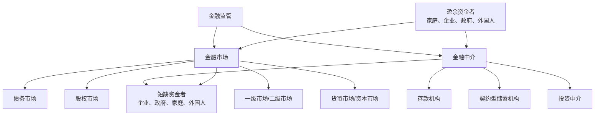

# 5.6 金融中介、监管与金融系统地图

来源：

- 主线：Mishkin《货币金融学》Ch.2
- 补充：Mishkin/Eakins Ch.2；Mankiw Ch.27；Bodie/Kane/Marcus《Investments》Ch.1, Ch.2

## 为什么最后要回到金融中介

第五章前几节已经把金融系统拆成几组基本概念：金融市场把资金从盈余者转给短缺者；资金可以直接融资，也可以间接融资；工具可以是债务，也可以是股权；市场可以按发行阶段、组织方式和期限分类。

现在要把这些概念重新合在一起。现实金融系统不是一堆孤立名词，而是一张资金流动网络。金融中介、金融市场和金融监管共同决定资金能否安全、有效地从储蓄者流向有投资机会的人。

金融中介之所以值得单独强调，是因为在许多国家，企业和家庭取得资金时大量依赖中介，而不是直接进入证券市场。银行、保险公司、养老金、共同基金、货币市场基金、金融公司等机构，都在用不同方式连接储蓄者和借款者。

## 金融中介的三项核心作用

金融中介站在储蓄者和借款者之间。它从储蓄者那里取得资金，再把资金贷给或投资于借款者。这个过程看似多了一层，但它能解决直接金融中很难处理的三类问题：交易成本、风险分担和信息不对称。

第一，金融中介降低交易成本。单个储蓄者很难自己寻找借款人、审查信用、写合同、监督还款。银行和其他中介通过专业化和规模经济，把这些工作集中处理。标准化合同、专业律师、信用审查系统和长期客户关系，都能降低每一笔交易的平均成本。

第二，金融中介分担和转换风险。储蓄者可能想要安全、流动性强的资产，借款者需要长期、有风险的资金。银行把存款转化为贷款，保险公司把个人风险汇聚成保险池，基金把许多证券组合成投资份额。中介不是消灭风险，而是把风险重新组合，使它更适合不同主体承担。

第三，金融中介缓解信息不对称。借款者通常比贷款者更了解自己的项目和风险。中介通过筛选、监督、抵押、契约限制和持续关系，减少逆向选择和道德风险。它们比普通小额储蓄者更有能力判断谁是好借款者、谁可能违约、借款后是否改变用途。

这三项功能共同解释了为什么间接融资在现实中如此重要。

## 三类主要金融中介

金融中介可以分成三大类：存款机构、契约型储蓄机构和投资中介。

**存款机构**通常被简单称为银行。它们接受个人和机构存款，并发放贷款。商业银行、储蓄贷款协会、互助储蓄银行和信用合作社都属于这一类。银行尤其重要，因为它们不仅做金融中介，还创造存款，而存款是货币供给的重要组成部分。后面学习货币和银行时，会反复回到这一点。

**契约型储蓄机构**通过长期合同定期取得资金，再把资金投资出去。寿险公司、财产和意外保险公司、养老金和政府退休基金属于这一类。保险公司通过保费取得资金，并在事故、疾病、死亡或其他约定事件发生时赔付。养老金通过雇主和雇员缴费积累资金，用于未来退休支付。由于它们的负债往往较长期、可预测，通常能持有长期债券、股票和抵押贷款等资产。

**投资中介**包括金融公司、共同基金、货币市场共同基金、对冲基金等。金融公司可以通过发行商业票据或其他方式筹资，再向消费者或企业贷款。共同基金向公众出售份额，用所得资金购买股票和债券。货币市场基金投资短期货币市场工具，为投资者提供较高流动性。对冲基金通常面对更专业或更高净值投资者，投资范围更广、风险也可能更高。

| 中介类型 | 主要资金来源 | 主要资金用途 | 基本功能 |
| --- | --- | --- | --- |
| 存款机构 | 存款 | 企业贷款、消费贷款、抵押贷款、政府证券 | 支付、存款、贷款和货币创造 |
| 契约型储蓄机构 | 保费、养老金缴费 | 债券、股票、抵押贷款 | 长期风险分担和退休储蓄 |
| 投资中介 | 基金份额、商业票据、合伙份额 | 股票、债券、贷款、货币市场工具等 | 集合资金、分散投资、提供融资 |

这个分类不是为了死记机构名称，而是为了理解不同中介的资产负债结构。金融机构从哪里取得资金，决定了它能承受什么期限和风险；它把资金投向哪里，决定了它在金融体系中承担什么功能。

从投资者角度看，中介质量会直接影响最终净回报。基金管理费、银行存贷利差、保险费用、销售佣金和交易成本，都会从资产组合的总收益中扣除。更重要的是，中介可能存在代理问题：管理人可能追求规模而不是收益，银行可能承担过高杠杆，基金可能为了短期排名承担隐蔽风险，保险或养老金可能出现资产负债期限错配。

所以，通过中介投资并不意味着风险消失。中介可以帮助投资者分散风险、降低交易成本、处理信息问题，但仍会留下市场风险、信用风险、流动性风险、操作风险和代理成本。理解中介的资产负债表、收费方式和监管约束，是投资者保护自己的一部分，也是金融监管要处理的核心问题之一。

## 信息问题为什么会引出监管

金融系统受到严格监管，根本原因之一仍然是信息不对称。投资者和存款人通常无法完全知道证券发行者、银行或其他金融机构的真实风险。如果信息不足，金融市场会出现逆向选择和道德风险，资金可能流向高风险甚至欺诈性项目，好的项目反而融资困难。

监管的第一个目标，是增加投资者可获得的信息。证券发行公司通常被要求披露销售、资产、利润和其他重要信息。信息披露让投资者更容易判断企业价值和风险，也减少发行者隐瞒坏消息、误导投资者的空间。

监管还限制内部人利用特殊信息损害普通投资者。公司高管、大股东等内部人可能掌握市场尚不知道的信息，如果他们利用这些信息交易，普通投资者会觉得市场不公平，从而减少参与。限制内部交易和要求信息披露，都是为了改善市场信息环境。

信息监管并不保证投资者不会亏损。它的目标不是替投资者做决定，而是让投资者在更充分、更可靠的信息基础上做决定。

## 金融恐慌为什么需要稳健监管

监管的第二个目标，是维护金融中介稳健，防止金融恐慌。金融中介的特殊性在于，它们往往以公众资金为负债，持有较长期、较复杂或较有风险的资产。普通存款人很难判断一家银行资产质量到底如何。

如果公众怀疑金融机构整体不安全，就可能同时要求取回资金。即使一些机构本来是稳健的，也可能因为大量提款和市场恐慌受到冲击。这样的连锁反应就是金融恐慌。金融恐慌会让公众遭受损失，也会破坏储蓄向投资的通道，损害整个经济。

为了降低这种风险，监管通常包括几类做法。

第一，限制进入。建立银行或保险公司不能像开普通商店一样随意，通常需要获得牌照，并满足资本、人员和资质要求。

第二，要求披露和检查。金融中介的账簿、资产质量和风险暴露需要按规定报告，并接受监管机构检查。

第三，限制资产和业务。监管者可能限制某些机构持有过多高风险资产，或限制它们从事某些高风险活动。目的不是消灭风险，而是防止公众资金承担过度风险。

第四，存款保险。政府可以为一定限额内的银行存款提供保险，使普通存款人在银行倒闭时不会损失全部资金。存款保险有助于减少挤兑恐慌，但也可能带来道德风险，因此需要配合监管和审查。

第五，竞争和利率方面的限制在历史上也曾出现。虽然这些限制的合理性和效果会有争议，但它们反映了监管者试图维护金融系统稳定的政策思路。

## 金融系统地图

把本章内容合在一起，可以得到一张金融系统地图。

这张图把前面几节的概念放在一起。资金可以通过金融市场直接流动，也可以通过金融中介间接流动。金融市场内部又可以按工具、发行阶段、组织方式和期限分类。金融中介内部则可以按负债来源和资产用途分类。监管覆盖市场和中介，试图改善信息、降低恐慌风险、维护系统稳健。

这张图不是为了把金融系统一次性学完。它的作用是给后续课程一个地图。接下来学习货币、利率、银行、央行、债券、股票、基金、保险和金融危机时，都可以把具体内容放回这张图中定位。

## 监管的代价与边界

监管有必要，但并不意味着监管越多越好。信息披露、资本要求、业务限制、存款保险和检查制度都可能带来成本。企业和金融机构需要投入资源合规，过度限制可能降低创新和竞争，存款保险如果设计不好也可能鼓励机构承担过多风险。

因此，金融监管面对的是权衡。监管太少，信息不对称和恐慌风险可能损害市场效率；监管太多，金融体系可能变得僵化，融资成本上升。好的监管要在信息、稳定、竞争和效率之间寻找平衡。

本章只是建立监管的基本理由。更完整的金融监管经济学，会在银行监管和金融危机章节继续展开。

## 小结

金融中介通过降低交易成本、分担风险和缓解信息不对称，在金融体系中发挥核心作用。它们让小额储蓄者也能把资金提供给有投资机会的人，让借款者更容易获得资金。

主要金融中介包括存款机构、契约型储蓄机构和投资中介。存款机构以存款为主要资金来源并发放贷款；契约型储蓄机构通过保费和养老金缴费取得长期资金；投资中介集合资金并投资于证券、贷款或其他资产。

金融监管主要有两个基本理由：增加投资者可获得的信息，以及维护金融中介和金融体系稳健。信息披露和限制内部交易有助于缓解逆向选择和道德风险；牌照、检查、资产限制和存款保险有助于降低金融恐慌风险。

第五章的总体地图是：资金从盈余者流向短缺者，可以走金融市场，也可以走金融中介；金融市场按工具、期限和组织方式分类；金融中介按资金来源和资产用途分类；监管为整个系统提供信息和稳定性基础。

## 自测问题

- 金融中介为什么能降低交易成本？
- 什么是资产转换？银行存款和贷款怎样体现资产转换？
- 存款机构、契约型储蓄机构和投资中介分别有哪些典型例子？
- 金融监管为什么要增加投资者可获得的信息？
- 为什么通过金融中介投资并不意味着风险消失？
- 为什么信息不对称会削弱金融市场效率？
- 什么是金融恐慌？为什么它会伤害实体经济？
- 金融监管需要在什么目标之间做权衡？
- 你能用一张图说明资金如何通过金融市场和金融中介流动吗？
