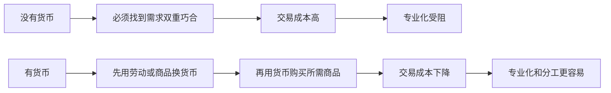
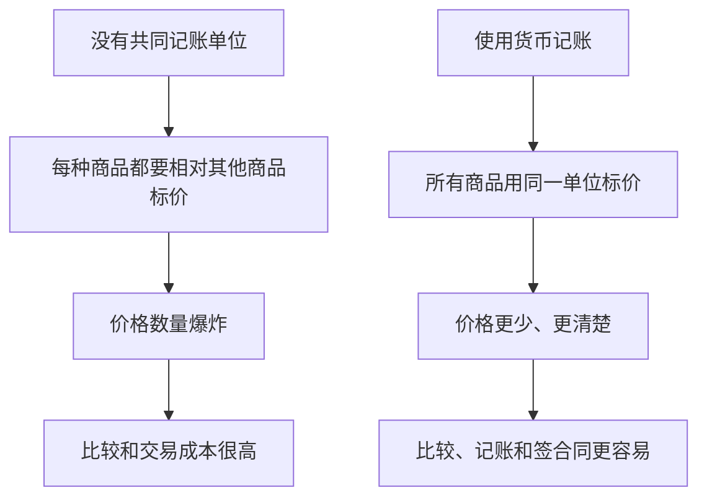

# 6.1 货币的定义与三大职能

来源：

- 主线：Mishkin《货币金融学》Ch.3
- 补充：Mankiw Ch.30；Mishkin/Eakins Ch.1 中加密货币案例；Bodie/Kane/Marcus《Investments》Ch.1, Ch.2

## 货币为什么需要精确定义

日常生活中，“钱”这个词用得很宽。有人说“他很有钱”，可能指他有现金，也可能指他有房子、股票、公司股权和其他资产。有人说“这份工作钱很多”，通常是在说收入高。还有人把银行卡余额、现金、工资、财富都混在一起叫钱。

经济学不能这样含糊。研究货币、银行和金融市场时，必须先弄清“货币”到底指什么。否则，后面讨论货币供给、通货膨胀、中央银行、银行存款和支付体系时，就会把不同概念混成一团。

经济学中的**货币**，是指在购买物品和服务、偿还债务时被普遍接受的东西。纸币和硬币当然是货币，因为商店接受它们，债权人也接受它们。支票账户存款也可以是货币，因为人们可以用支票、借记卡或转账从账户中支付。某些储蓄存款如果能很快、很容易地转为现金或支票账户存款，也会在较宽口径中接近货币。

这个定义的重点不是“它看起来像不像钱”，而是“它能不能被普遍接受为支付手段”。历史上，不同社会使用过不同形式的货币：金银硬币、私人银行发行的纸币、政府纸币、银行存款、支票和电子支付。形式会变，功能不变。

## 货币不是财富，也不是收入

先排除两个常见混淆。

第一，货币不等于财富。**财富**是一个人拥有的全部价值储藏，包括现金、银行存款、债券、股票、房屋、土地、汽车、艺术品和其他资产。货币只是财富的一部分，而且通常是最容易用于支付的那一部分。一个人可能非常富有，但手里现金很少，因为财富主要体现在房产和股票上；另一个人可能持有较多现金，但总体财富并不高。

第二，货币不等于收入。**收入**是在一段时间内赚到的钱，是一个流量概念。说一个人收入 1 万元，必须说明是每月、每年还是每天。货币则是某一时点上持有的存量。说一个人口袋里有 1000 元，不需要再问“每多长时间”，因为这是某一时刻的持有量。

可以用表格区分三者：

| 概念 | 经济含义 | 时间属性 | 例子 |
| --- | --- | --- | --- |
| 货币 | 普遍接受的支付手段 | 存量 | 现金、可用于支付的存款 |
| 财富 | 所有价值储藏的总和 | 存量 | 现金、股票、债券、房产、汽车 |
| 收入 | 一段时间内获得的 earnings | 流量 | 月工资、年利润、日收入 |

这个区分很基础，但非常重要。后面说“货币供给增加”，不是说社会财富自动增加；说“收入增加”，也不是说每个人手里立即持有更多货币。货币、财富和收入可以相互转化或相关，但不是同一个概念。

## 货币的第一项职能：交换媒介

货币最能区别于其他资产的职能，是**交换媒介**。交换媒介指买方购买物品和服务时交给卖方、卖方愿意接受的东西。现金、支票账户支付、借记卡支付能发挥这种作用，是因为它们被广泛接受。

要理解交换媒介为什么重要，可以先想象没有货币的易货经济。易货经济中，人们直接用物品和服务交换物品和服务。一个经济学老师如果想吃饭，就必须找到一个农民；这个农民不仅要有老师想吃的食物，还必须刚好想听经济学课。否则交易不能发生。

这种困难叫**需求的双重巧合**：你必须找到一个人，他拥有你想要的东西，同时也想要你能提供的东西。现实中，这种巧合很难。老师可能花大量时间寻找“想学经济学的农民”，而不是专心教学。甚至她可能不得不放弃教学去种地，因为交易太困难。

货币解决了这个问题。老师可以先给任何愿意付钱的人上课，收到货币后，再拿货币去向任何卖食物的人购买食物。农民不需要想听经济学，老师也不需要生产农民想要的其他东西。货币把一次困难的物物交换，拆成两次简单的货币交易。

这里的**交易成本**，指完成交易所花费的时间、精力和资源。货币作为交换媒介，降低交易成本，使人们能专门从事自己擅长的活动。老师专心讲课，农民专心种地，工人专心生产，医生专心看病。分工越复杂，货币越重要。

## 什么东西适合成为交换媒介

不同社会使用过许多不同东西作为货币。贝壳、珠串、烟草、威士忌、香烟、金银、纸币，都曾在特定环境中发挥货币作用。这些形式看似差异很大，但能充当货币的东西通常要满足几个条件。

第一，容易标准化。人们要能判断它的价值和真伪。如果每一单位都差异很大，就难以交易。

第二，被广泛接受。货币的价值很大程度来自别人也愿意接受它。如果只有少数人接受，交换媒介功能就弱。

第三，容易分割。交易金额大小不同，货币必须能找零或拆分。不能分割的物品很难适应复杂交易。

第四，便于携带。如果交换媒介太重、太大或运输困难，交易成本仍然很高。

第五，不容易变质。会迅速腐烂或损坏的东西，很难长期充当支付手段和价值储藏。

| 条件 | 为什么重要 |
| --- | --- |
| 标准化 | 便于识别价值和真伪 |
| 广泛接受 | 让持有人相信以后能再花出去 |
| 可分割 | 适应不同交易金额 |
| 易携带 | 降低交易和运输成本 |
| 耐久 | 能跨时间保存购买力 |

这些条件解释了为什么金银长期适合作为货币，也解释了为什么现代社会转向纸币、银行存款和电子支付。形式变化背后，是降低交易成本和提高支付便利性的持续努力。

## 货币的第二项职能：记账单位

货币的第二项职能是**记账单位**。记账单位指用来标价、记账和记录债务的共同尺度。就像长度用米衡量，重量用千克衡量，经济价值可以用货币单位衡量。

如果没有共同记账单位，价格会变得非常复杂。假设经济中只有三种商品：桃子、经济学课和电影票。人们需要知道桃子相对于经济学课的价格、桃子相对于电影票的价格、经济学课相对于电影票的价格。三种商品还勉强可以处理。

但商品越多，价格数量会迅速增加。如果有 10 种商品，需要知道 45 个相对价格；如果有 100 种商品，需要 4950 个相对价格；如果有 1000 种商品，需要 499500 个相对价格。超市里如果每件商品都要用其他所有商品标价，购物几乎无法进行。

货币把所有商品价格统一表示为同一种单位。桃子多少钱，电影票多少钱，经济学课多少钱，都用同一货币单位标价。这样，1000 种商品只需要 1000 个货币价格，而不是近 50 万个相对价格。

记账单位职能看似没有交换媒介那么直观，但对复杂经济非常关键。企业要计算成本和收入，家庭要比较商品价格，银行要记录债务，政府要编制预算，都需要统一价值尺度。没有货币作为记账单位，市场经济的信息处理成本会大幅上升。

## 货币的第三项职能：价值储藏

货币的第三项职能是**价值储藏**。价值储藏指把购买力从收入获得时转移到未来支出时。人们通常不会在收到收入的瞬间把所有钱花完，而是把一部分购买力保留到以后使用。货币可以承担这个功能。

但货币不是唯一的价值储藏。股票、债券、房屋、土地、艺术品、珠宝都可以储藏财富。许多资产作为价值储藏甚至比货币更有吸引力：债券可能支付利息，股票可能升值，房屋还能提供居住服务。

既然如此，人们为什么还愿意持有货币？答案是**流动性**。流动性指资产转化为交换媒介的容易程度和速度。货币本身就是交换媒介，因此是流动性最高的资产。你不需要先把现金卖掉再买东西，也不需要先把支票账户存款转换成其他资产。

其他资产转换成货币往往有成本。卖房需要时间、经纪费用，也可能为了快速出售而降价。卖股票通常比卖房容易，但仍可能面对价格波动和交易成本。货币的优点不是收益最高，而是最方便用于支付。

这就形成一个取舍：货币流动性强，但作为价值储藏不一定收益高；其他资产收益可能更高，但流动性较低或风险较大。

从投资学角度看，货币是投资组合中的流动性资产。它通常不是为了赚取高收益而持有，而是为了满足交易、应急和再配置需要。家庭保留一部分现金或活期存款，是为了应对失业、医疗、搬家或短期账单；机构投资者保留现金，是为了赎回、保证金、再平衡和等待投资机会。货币的收益低，实质上是流动性服务的价格：你放弃一部分预期回报，换取随时支付和不必被迫卖出风险资产的能力。

这也解释了为什么“持有货币”不是愚蠢行为。若只看长期平均收益，股票和长期债券可能更有吸引力；但如果明天就要付款，或者市场下跌时需要现金，低风险高流动性的货币资产就有独立价值。经济学把它称为流动性需求，金融学把它放进银行和支付体系，投资学则把它视为资产配置中的现金头寸和风险管理工具。

## 通货膨胀会削弱货币的价值储藏功能

货币作为价值储藏的好坏，取决于价格水平。价格水平上升，货币购买力下降；价格水平下降，货币购买力上升。如果所有价格翻一倍，同样数量货币能买到的物品和服务大约减少一半。

在温和通胀下，人们仍然愿意持有一定货币，因为货币流动性很高。但在极端通胀下，货币会迅速失去价值，人们会尽量减少持有货币的时间。

恶性通货膨胀是极端例子。价格每月以非常高速度上升时，工资刚发下来就可能很快贬值。人们会急着把货币换成商品，因为晚一点花出去就买不到同样东西。此时货币作为价值储藏的功能严重受损，甚至交换媒介功能也会被削弱，社会可能退回到更多以物换物或使用替代支付物的状态。

这说明三大职能并不是彼此完全分离。如果货币不能较好储藏价值，人们也会不愿意接受它作为交换媒介；如果物价波动过大，货币作为记账单位也会变得不稳定。稳定的货币价值，是货币顺利发挥功能的重要条件。

## 三大职能如何共同定义货币

货币之所以特殊，不是因为它一定由纸做成，也不是因为它一定由政府发行，而是因为它同时承担三项职能：交换媒介、记账单位和价值储藏。

交换媒介解决交易问题，让人们不必寻找需求双重巧合；记账单位解决计价问题，让复杂经济可以用统一尺度比较价值；价值储藏解决跨期问题，让购买力可以从现在转移到未来。

| 职能 | 要解决的问题 | 如果缺失会怎样 |
| --- | --- | --- |
| 交换媒介 | 如何方便地买卖物品和服务 | 交易成本高，分工受阻 |
| 记账单位 | 如何统一衡量价值和记录债务 | 价格数量庞大，比较困难 |
| 价值储藏 | 如何把购买力保留到未来 | 人们不愿持有货币，支付体系不稳定 |

其他资产可能具备其中某一项职能。例如房屋可以储藏价值，但不能方便地买菜；股票可以储藏财富，但日常交易中不直接作为记账单位；债券可以带来利息，但不能像现金和存款那样普遍支付。货币的特殊性在于，它是最普遍的交换媒介，并通常同时充当记账单位和高度流动的价值储藏。

## 小结

经济学中的货币，是在购买物品和服务、偿还债务时被普遍接受的东西。它不同于财富，也不同于收入。财富是全部资产的总和，收入是一段时间内获得的流量，货币则是某一时点上可用于支付的存量。

货币有三项基本职能。作为交换媒介，它降低交易成本，避免需求的双重巧合，使专业化和分工更容易。作为记账单位，它提供统一价值尺度，减少经济中需要比较的价格数量。作为价值储藏，它把购买力从现在转移到未来，但这一职能会受到通货膨胀削弱。

货币的形式会变化，但功能逻辑保持稳定。金银、纸币、银行存款、支票和电子支付之所以能在不同时代发挥货币作用，是因为它们在不同程度上满足了支付、计价和储藏购买力的需要。

## 自测问题

- 经济学中货币的定义是什么？为什么不能简单等同于纸币和硬币？
- 货币、财富和收入有什么区别？哪个是流量，哪个是存量？
- 什么是需求的双重巧合？货币如何解决这个问题？
- 为什么货币作为交换媒介能促进专业化和分工？
- 如果没有货币作为记账单位，一个有 1000 种商品的经济会遇到什么问题？
- 为什么人们愿意持有货币，即使它不是收益最高的价值储藏？
- 为什么投资组合中仍然需要现金或货币性资产，即使它们长期收益较低？
- 通货膨胀怎样削弱货币的价值储藏功能？为什么恶性通胀会影响交易？
