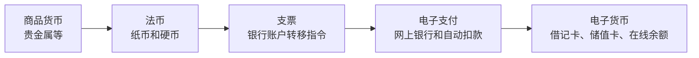

# 6.2 商品货币、法币、支票与电子支付

来源：

- 主线：Mishkin《货币金融学》Ch.3
- 补充：Mankiw Ch.30；Mishkin/Eakins Ch.1 中加密货币案例

## 支付体系为什么会演化

上一节从功能角度定义货币：货币是被普遍接受的支付手段，并承担交换媒介、记账单位和价值储藏三项职能。现在换一个角度看：这些职能在历史上由什么具体形式承担？

**支付体系**是经济中完成交易的方法。人们怎样付款，商家怎样收款，债务怎样清偿，银行怎样转移账户余额，都属于支付体系。支付体系变化时，货币的具体形式也会变化。

早期社会使用贵金属或其他有价值商品作为主要支付手段。后来，纸币和支票进入支付体系。现代经济中，借记卡、网上银行、自动扣款、移动支付和电子货币又进一步改变交易方式。形式不断变化，背后的推动力却相对稳定：降低交易成本、提高安全性、提高便利性，并在更复杂经济中保持支付可靠。

本节按支付体系演化的顺序，理解几类货币或支付形式：商品货币、法币、支票、电子支付和电子货币。

## 商品货币：本身有价值的货币

要让某种东西成为货币，关键是别人愿意接受它。最自然的候选物，是本身就有价值、很多人都愿意持有的商品。由贵金属或其他有价值商品构成的货币，称为**商品货币**。

金银是典型商品货币。即使不当作货币，金银也有装饰、工业或其他用途，因此具有内在价值。历史上，许多社会使用金银硬币作为主要支付手段。烟草、威士忌、贝壳、珠串、香烟等也曾在特定环境中发挥类似作用。战俘营中香烟可以成为交换媒介，是因为吸烟者想要它，不吸烟者也知道别人会接受它。

商品货币的优点是容易让人相信其价值。它不是单靠政府命令获得价值，而是因为这种商品本身有用途或稀缺性。人们接受它，不只是因为别人接受，也因为它本身可以被消费、收藏或再交换。

但商品货币有明显缺点。贵金属很重，运输和保管成本高。小额交易需要分割和验成色，大额交易更麻烦。如果买房必须搬运大量金属货币，交易会非常不方便。商品货币还会占用真实资源：社会要开采、铸造、鉴定和保护这些金属，而这些资源本可以用于其他生产。

商品货币适合相对简单的支付体系，但随着交易规模扩大和金融体系发展，它的成本越来越明显。

## 法币：靠制度和信任流通的纸币

支付体系下一步，是纸币。纸币比金属轻得多，携带和运输都更方便。早期纸币常常承诺可以兑换成金属硬币或固定数量的贵金属。后来，纸币逐渐演变为**法币**。

法币是没有内在价值、由政府规定为法定偿债货币的纸币或货币形式。它不能兑换成固定数量的黄金或白银，但法律规定它可以用于清偿债务。人们接受法币，是因为他们相信别人也会接受它，也相信发行制度能维持它的价值。

法币有很大便利。纸币和硬币比贵金属容易携带，支付成本较低。政府也可以根据制度安排统一货币单位，降低经济中计价和结算的复杂性。现代国家几乎都使用法币制度。

但法币能否成功，取决于信任。第一，人们要相信发行机构不会让货币价值迅速崩溃。第二，防伪技术要足够强，使伪造货币困难。第三，社会需要形成接受习惯。政府法令很重要，但不是唯一因素；如果公众认为某种官方货币不可靠，可能会转向外币、商品或其他替代支付手段。

法币说明，货币的价值不一定来自材料本身。纸币材料价值很低，但只要社会普遍接受、法律制度支持、发行管理可信，它就能发挥货币职能。

## 支票：不用搬运现金也能付款

纸币和硬币比贵金属轻便，但仍有问题。大量现金容易被盗，运输成本也高。大额交易用现金支付既不安全也不方便。现代银行发展后，支票成为支付体系的重要创新。

**支票**是账户持有人给银行的一项指令：请银行把自己账户中的资金转给收款人。当你开出支票并交给对方，对方把支票存入银行，银行系统最终完成账户之间的资金转移。

支票的优点很多。第一，它减少携带大量现金的需要。大额付款可以通过一张支票完成。第二，它降低运输成本。两个人或两家机构之间如果有多笔往来付款，支票清算可以相互抵消，不必每次搬运现金。第三，它可以按任意金额开具，只要不超过账户余额。第四，支票记录本身提供了付款凭证，有助于记账和证明交易。

支票也有缺点。第一，支票从一个地点转移到另一个地点需要时间，尤其在跨地区支付时更明显。第二，存入支票后，银行可能需要几天才允许使用资金，因为要完成清算和确认。第三，处理纸质支票需要大量人工、系统和银行流程，成本不低。

支票是支付体系从“实物货币移动”转向“账户余额转移”的关键一步。它让银行存款更像货币，因为存款可以通过支票直接用于支付。

## 电子支付：让账户转移更快、更便宜

计算机和互联网降低了处理信息的成本，也推动支付体系继续演化。**电子支付**指通过电子方式完成付款，而不是邮寄或递送纸质支票。

过去，人们支付账单可能要填写支票、装入信封、贴邮票并寄出。现在，可以登录银行网站或应用，点击几步完成转账。水电费、房贷、信用卡账单等经常性付款，还可以设置自动扣款。支付指令通过电子系统传输，速度更快，成本更低。

电子支付的经济意义，是进一步降低交易成本。对个人来说，它减少时间和邮寄成本；对银行和企业来说，它减少纸质处理、人工核对和运输成本；对整个经济来说，它让资金结算更快，减少支付过程中的摩擦。

电子支付并不一定创造一种全新的货币。很多电子支付只是让已有银行存款更方便地转移。付款时，背后发生的是银行账户余额减少和收款账户余额增加。变化的是支付技术，不一定是货币本身。

## 电子货币：只以电子形式存在的购买力

电子支付技术不仅可以替代支票，也可以替代现金。**电子货币**指只以电子形式存在、可用于支付的货币或类货币安排。最早、最常见的形式之一是借记卡。

借记卡外观类似信用卡，但经济性质不同。使用借记卡付款时，资金直接从银行账户转到商户账户。它更像电子化支票或电子化现金：支付发生时，账户余额立即减少。借记卡提高了现金支付的便利性，尤其在超市、餐馆和日常消费场景中。

另一类形式是储值卡。简单储值卡可以预先充值固定金额，例如交通卡、电话卡或预付卡。更复杂的智能卡可以内置芯片，记录余额，并在需要时从银行账户加载价值。在一些经济体中，手机也可以具备类似智能卡功能。

还有一类电子现金用于互联网支付。消费者先把资金转入某个在线支付账户，再用这个账户向商家付款。商家收到的是电子账户中的资金转移，而不是纸币或支票。

这些形式共同说明，货币越来越脱离具体纸张和金属，转向账户记录、电子指令和数字余额。但只要它能被普遍接受为支付手段，并能稳定地代表购买力，就仍然在发挥货币功能。

## 为什么无现金社会来得很慢

既然电子支付更方便，为什么现金没有消失？原因在于，支付体系不仅追求效率，还要考虑成本、安全、隐私和习惯。

第一，建立全面电子支付系统需要大量基础设施：计算机系统、通信网络、读卡设备、支付清算系统、网络安全设施。这些建设和维护都很昂贵。

第二，电子支付有安全风险。账户可能被盗用，数据库可能被攻击，诈骗和身份盗用可能造成损失。防范这些问题需要持续投入技术和监管资源。

第三，电子支付留下数据痕迹。每一笔消费都可能被记录、分析和追踪。对一些人来说，现金的匿名性和隐私保护仍然有价值。

第四，现金在某些场景中更可靠。断电、网络故障、灾害、系统维护或小额交易环境下，现金仍有优势。部分人群也可能因为年龄、收入、地区或技术条件限制，不能完全依赖电子支付。

因此，电子支付会继续增长，但现金短期内不一定消失。支付体系通常是多种工具并存，而不是一种工具完全替代另一种工具。

## 信用卡为什么不是货币

讨论电子支付时，很容易把信用卡当成货币。信用卡确实可以用来买东西，但它不是货币本身，而是一种延期付款工具。

使用信用卡买饭时，发卡银行先替你向餐馆付款。你之后再偿还银行，可能还要支付利息。真正清偿债务时，你通常会用银行存款转账或支票支付信用卡账单。也就是说，信用卡本身不是最终支付手段，它只是让付款延后。

借记卡不同。借记卡付款时，资金直接从你的银行账户划出。账户中的存款属于货币衡量范围，借记卡只是访问这笔存款的工具。

| 工具 | 付款时发生什么 | 是否本身算货币 |
| --- | --- | --- |
| 现金 | 直接交付通用支付手段 | 是 |
| 支票 | 指示银行转移存款 | 背后的存款算货币 |
| 借记卡 | 立即从银行账户扣款 | 背后的存款算货币 |
| 信用卡 | 银行先垫付，持卡人以后还款 | 不是货币，是延期付款安排 |

这个区别在后面衡量货币供给时非常重要。货币衡量关注的是可用于支付的资产，而不是所有能帮助购买东西的信用工具。

## 支付形式演化的主线

从商品货币到法币，从现金到支票，再到电子支付和电子货币，支付体系演化的主线是降低交易成本。

商品货币解决了易货经济中的需求双重巧合，但运输和保管成本高。法币减轻了重量，依赖法律和信任发挥作用。支票减少了携带现金和搬运现金的需要，让银行存款进入支付体系。电子支付降低了纸质处理成本，让账户转移更快。电子货币和借记卡进一步把支付嵌入日常消费场景。

每一步都不是完全替代前一步。现代经济中，现金、存款、支票、借记卡、电子转账和在线支付往往同时存在。不同支付工具适合不同场景。

## 小结

支付体系是经济中完成交易的方法。货币形式随着支付体系演化而变化，但核心目标一直是降低交易成本、提高支付便利性和安全性。

商品货币由本身有价值的商品构成，例如金银。它容易让人相信其价值，但运输和保管成本高。法币没有内在价值，依靠政府法定地位、社会信任和防伪能力流通。支票让人们不用携带大量现金也能转移银行存款，提高了大额支付效率。

电子支付和电子货币进一步降低纸质处理成本，使账户资金能更快、更便捷地转移。借记卡、储值卡和在线支付账户都体现了支付体系的电子化。但现金并没有因此立即消失，因为电子支付也面临基础设施成本、安全风险、隐私问题和使用习惯限制。

信用卡虽然常用于购买商品，但不是货币本身。它是延期付款工具，真正的最终支付通常来自银行存款。这个区分为后面学习 M1、M2 和货币衡量打基础。

## 自测问题

- 什么是支付体系？为什么支付体系演化会改变货币形式？
- 商品货币为什么容易被接受？它的主要缺点是什么？
- 法币为什么没有内在价值却能流通？
- 支票如何降低携带和运输现金的成本？
- 电子支付相比支票主要节省了哪些成本？
- 借记卡和信用卡在经济性质上有什么区别？
- 为什么电子支付发展很快，但现金并没有完全消失？
