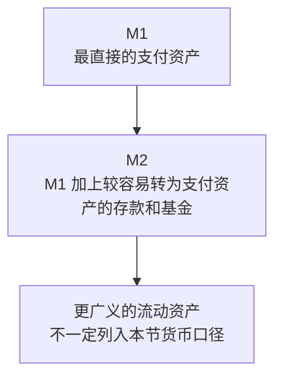

# 6.4 M1、M2 与货币衡量口径

来源：

- 主线：Mishkin《货币金融学》Ch.3
- 补充：Mankiw Ch.30；Mishkin/Eakins Ch.1 中加密货币案例；Bodie/Kane/Marcus《Investments》Ch.2

## 为什么“货币是什么”还不够

前面已经把货币定义为经济中被普遍接受的支付手段，并说明它承担交换媒介、记账单位和价值储藏三项职能。这个定义抓住了货币的本质，但还不能直接用于统计。

原因很简单：如果只说“凡是被普遍接受用于支付的东西都是货币”，我们仍然不知道统计部门应该把哪些资产加进货币供给。现金当然应该算。可以开支票的银行存款也应该算。那储蓄存款算不算？小额定期存款算不算？货币市场基金算不算？信用卡额度算不算？如果不先划清边界，就无法回答“经济中有多少货币”这个问题。

货币衡量要做的事情，就是把行为上的定义变成可操作的统计口径。统计口径必须明确：哪些资产包括在内，哪些资产排除在外，为什么这样划分。

这里会遇到一个根本困难：金融创新不断创造新资产。有些资产不像现金那样能直接付款，但又很容易、很快、成本很低地转成现金或支票存款。它们到底有多像货币？这个问题没有永远不变的答案。因此，中央银行和统计机构通常会使用多个货币总量，而不是只使用一个数字。

这些货币总量也叫**货币 aggregates**，中文常译为货币总量或货币口径。最常见的是 M1 和 M2。

## 衡量货币的核心标准：流动性

要理解 M1、M2，先要理解**流动性**。流动性指一种资产转化为支付手段的容易程度。越容易、越快速、成本越低地用于支付，流动性越高。

现金的流动性最高，因为它本身就是支付手段。支票账户存款也非常接近现金，因为可以通过支票、借记卡或电子转账直接付款。储蓄存款流动性稍低，因为它通常不是为了日常交易而持有，但可以比较快地转到交易账户或取出。定期存款流动性更低，因为提前支取可能受到期限和费用限制。

货币统计就是沿着流动性从高到低划圈。最窄的口径只包括最接近支付手段的资产；较宽的口径再加入一些不那么直接、但可以较快变成支付手段的资产。

可以把它想成同心圆：

这个图只表达一个原则：M1 是更窄、更流动的口径；M2 是更宽、包含更多近似货币资产的口径。

## M1：最接近日常支付的钱

M1 是较窄的货币口径，重点衡量最具流动性的资产。它包括可以直接用于交易或几乎立即用于交易的资产。

按本书所采用的口径，M1 主要包括：

| M1 组成部分 | 含义 | 为什么算入 M1 |
| --- | --- | --- |
| 公众手中的现金 | 非银行公众持有的纸币和硬币 | 可以直接支付 |
| 活期存款 | 企业等主体持有、可开支票的存款 | 可以通过支票或转账支付 |
| 其他可支票存款 | 家庭等主体持有的可支票账户，包括部分付息账户 | 可以直接作为支付账户使用 |
| 旅行支票 | 可用于支付的特定票据工具 | 可直接用于交易，虽然现代重要性下降 |

这里有两个细节需要注意。

第一，M1 中的现金指非银行公众手中的现金，不包括银行金库和自动取款机中的现金。原因是，货币统计关注公众可用于购买商品和服务的支付手段。银行内部持有的现金还没有进入公众交易过程。如果把银行持有的现金也计入，再把公众存款计入，就容易混淆银行体系内部资产和公众手中的支付资产。

第二，M1 中的存款强调“可交易性”。如果一个账户可以直接开支票、刷借记卡、电子转账，用来完成日常付款，它就具有很强的货币性。人们持有这类存款，不只是为了储蓄，更是为了交易便利。

M1 把现金和可支付存款放在一起，反映了现代支付体系的现实：人们并不只用纸币买东西。银行存款通过支票、借记卡和电子支付系统，已经成为日常交易的重要支付手段。

## 现金统计中的一个现象：很多美元不在日常钱包里

货币统计有时会出现看似奇怪的数字。按统计口径计算，流通中的美元现金折合到每个人头上，可能远高于普通人钱包中的现金。大多数人并不会随身带着几千美元现金，那么这些现金在哪里？

一个解释是，现金在某些活动中具有匿名性。支票和电子支付会留下记录，而现金交易更难追踪。因此，一些地下经济活动或不愿留下交易记录的主体，会更偏好现金。

另一个解释是，美元在美国之外也被大量持有。在一些高通胀或货币信用较弱的国家，人们可能持有美元作为价值储藏手段。对这些人来说，美元现金不是为了美国国内日常消费，而是为了保护购买力或应对本国货币不稳定。

这个例子说明，货币统计不是简单观察普通人的钱包。流通中现金的持有人、用途和地点可能非常复杂。理解统计口径时，必须区分“现金在哪里”和“现金是否属于公众持有的货币”。

## M2：把近似货币也纳入

M2 是比 M1 更宽的货币口径。它包括 M1，再加入一些流动性略低但仍然容易转化为现金或交易存款的资产。

按本书所采用的口径，M2 包括：

| M2 组成部分 | 含义 | 与 M1 的关系 |
| --- | --- | --- |
| M1 | 现金、可支票存款等最流动资产 | M2 的基础 |
| 小额定期存款 | 面额较小、到期前取出可能受限制的存款 | 不能像现金一样直接支付，但可较快转为支付资产 |
| 储蓄存款和货币市场存款账户 | 可存取、通常用于储蓄和资金管理的账户 | 流动性高于长期投资，低于交易账户 |
| 零售货币市场基金份额 | 家庭持有、具有一定支票功能或较强流动性的基金份额 | 接近货币，但不是最直接的交易货币 |

M2 的思想是：有些资产虽然不是日常付款的第一工具，但非常接近货币。储蓄存款不能像现金那样递给商家，也不像支票账户那样专为交易设计，但通常可以快速转到交易账户。小额定期存款有到期限制，却仍然比长期债券、股票或房地产更容易变成支付手段。货币市场基金份额也常被视为高度流动的短期资金管理工具。

因此，M2 试图衡量“可直接支付的钱”加上“很容易变成钱的资产”。它比 M1 更能反映家庭和企业手中较广义的流动购买力。

货币市场基金份额特别值得连接投资学理解。它们通常投资短期、高流动性、信用质量较高的债务工具，因此看起来很像现金管理工具。但它们本质上仍是基金份额，而不是银行存款。投资者获得的是一组短期证券组合的份额，收益来自这些证券，风险则包括信用风险、流动性风险、赎回压力和基金规则变化。它们被放入较宽货币口径，是因为流动性高、接近支付资产，而不是因为它们完全等同于现金。

## 信用卡额度为什么不算货币

衡量货币时，一个常见误解是把信用卡额度算作钱。信用卡确实能买东西，但它不是货币。

如果你用信用卡购买一件商品，银行或发卡机构先替你付款，你之后再偿还账单。信用卡提供的是信用，也就是借款能力。它让付款时间后移，但没有给你增加一项已经持有的支付资产。

货币统计关注的是资产，而不是信用额度。银行存款是你的资产，可以用于付款；信用卡额度是你可以借入资金的能力，不是你已经拥有的资金。等你还信用卡账单时，最终通常还是要动用银行存款或其他资产。

这个区分非常重要。一个人有 1000 元银行存款和 10000 元信用卡额度，并不意味着他持有 11000 元货币。他只持有 1000 元可支配的货币资产，另外 10000 元是潜在借款能力。

## 为什么不只用一个货币口径

如果 M1 更接近交易支付，为什么还要用 M2？如果 M2 更宽，为什么不只用 M2？答案在于，经济中的“货币性”不是黑白分明的。

M1 的优点是清晰。它包含最直接用于交易的资产，因此和支付活动关系密切。缺点是，金融创新可能让很多接近货币的资产被排除在外。例如，某些储蓄账户或货币市场账户虽然不属于最窄口径，但可以很快转成交易资金。如果只看 M1，可能低估经济中的流动购买力。

M2 的优点是覆盖更广。它加入一些高度流动的储蓄和短期资金工具，更能反映公众可迅速动用的购买力。缺点是，越往外扩，资产和日常支付之间的距离越远，口径也越不纯粹。

因此，多个口径各有用途。窄口径更强调交易媒介，宽口径更强调流动资产。经济学家和政策制定者需要同时观察它们，而不是机械地认为某一个永远正确。

## M1 和 M2 不一定给出同一幅图景

如果 M1 和 M2 总是同方向、同比例变化，那么选择哪个口径就不太重要。但现实中，它们并不总是同步。某些时期，M1 增长很快，M2 增长较慢；另一些时期，M2 增长而 M1 放缓。不同口径可能给货币状况和政策效果提供不同信号。

原因在于，公众会在不同资产之间调整。家庭和企业可能把资金从交易账户转入储蓄账户，也可能从储蓄账户转回交易账户。银行产品和监管规则变化，也会改变某些账户的吸引力。金融创新还会创造新的近似货币资产，使旧口径越来越难完整反映现实。

这会给货币政策带来困难。假设政策制定者看到 M1 快速增长，可能认为货币供给扩张很快；但如果 M2 没有明显增长，说明资金也许只是从较广义的流动资产转到了交易账户。反过来，如果 M2 增长很快而 M1 不变，可能表示公众持有更多近似货币资产，但日常交易账户没有同步扩大。

所以，货币衡量不是纯粹技术细节。它会影响人们判断货币政策是否宽松、经济中的流动性是否充足、未来通胀和产出是否可能变化。

对金融市场来说，M1 和 M2 的变化还会影响对利率和风险资产的判断。广义流动性充裕时，短期利率可能承受下行压力，银行和基金体系中的可投资资金增加，债券、股票和房地产估值都可能受到影响。但这不是机械关系：如果 M2 上升只是因为资金从交易账户流入储蓄账户，含义不同；如果货币增长伴随信贷扩张、资产价格上涨和杠杆提高，金融稳定风险也会增加。货币总量是资产市场分析的线索，不是单独的投资结论。

## 从统计口径看现代货币的边界

M1、M2 的划分说明，现代货币有一个从核心到边缘的结构。

核心部分是现金和交易存款，最直接承担交换媒介功能。外围部分是储蓄存款、小额定期存款和货币市场基金等，它们不一定直接付款，但可以较快转为付款能力。再往外，是股票、债券、房地产等资产。它们可能是财富的重要组成部分，却通常不被算作货币，因为转成支付手段需要更多时间、成本和价格风险。

可以这样理解：

| 类型 | 是否通常计入货币 | 原因 |
| --- | --- | --- |
| 现金 | 是 | 直接支付 |
| 可支票存款 | 是 | 可直接用于交易 |
| 储蓄存款 | 通常计入较宽口径 | 可较快转为支付资产 |
| 小额定期存款 | 通常计入较宽口径 | 流动性较强但不如交易账户 |
| 信用卡额度 | 否 | 是借款能力，不是资产 |
| 股票和长期债券 | 否 | 是财富资产，但价格波动和转换成本较高 |
| 房地产 | 否 | 价值大但流动性低，不能直接支付 |

这张表也帮助区分货币、财富和收入。货币是可用于支付的资产；财富是一个人在某个时点拥有的资产总和；收入是单位时间内获得的流量。一个人可能很富有，却持有很少货币；也可能收入很高，但如果刚把收入用于还债，当前货币余额并不高。

## 小结

货币的行为定义说明，货币是被普遍接受的支付手段。但要衡量经济中有多少货币，还需要明确统计口径。由于资产的流动性有高有低，货币统计通常使用多个口径。

M1 是较窄口径，包含最具流动性的资产，例如公众手中的现金、活期存款、其他可支票存款和旅行支票。M2 是较宽口径，包含 M1，再加入小额定期存款、储蓄存款、货币市场存款账户和零售货币市场基金份额等近似货币资产。

信用卡不是货币，因为它代表借款能力，而不是已经持有的支付资产。股票、长期债券和房地产可以是财富的一部分，但通常不算货币，因为它们不能低成本、稳定、迅速地直接用于支付。

M1 和 M2 的变化不一定完全同步。不同货币口径可能给经济状况和政策效果提供不同信号。因此，货币衡量不是机械统计，而是理解现代金融体系和货币政策的重要基础。

## 自测问题

- 为什么“被普遍接受的支付手段”这个定义还不足以直接衡量货币？
- 什么是流动性？它为什么是划分 M1、M2 的关键？
- M1 通常包括哪些资产？为什么银行金库中的现金不等同于公众手中的现金？
- M2 比 M1 多包括哪些资产？这些资产为什么被称为近似货币？
- 为什么货币市场基金份额接近货币，但仍不能简单等同于银行存款？
- 为什么信用卡额度不算货币？
- 如果 M1 和 M2 给出不同信号，政策判断会遇到什么困难？
