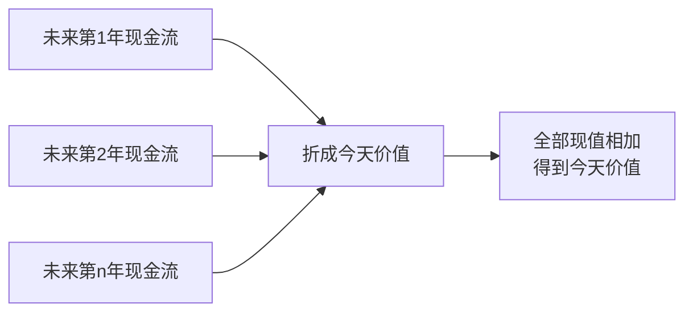

# 7.2 现值、贴现与跨期价值

来源：

- 主线：Mishkin《货币金融学》Ch.4
- 补充：Mishkin/Eakins Ch.3；Mankiw Ch.28；Bodie/Kane/Marcus《Investments》Ch.14, Ch.18

## 为什么未来的一元不等于今天的一元

利率问题的起点，是一个朴素但非常重要的判断：一年后的 1 元，不如今天的 1 元值钱。原因不是人们任性偏爱现在，而是今天的 1 元可以立即使用，也可以投入一个能赚取利息的账户，到未来变成超过 1 元的金额。

假设今天有 100 元，年利率是 10%。如果把它借出或存入能获得同样利率的账户，一年后会变成 110 元。再把 110 元继续按 10% 投出去，第二年会变成 121 元。第三年会变成 133.10 元。时间越长，利息也会继续生利息。

这个过程叫**复利**。复利说明，今天的一笔钱在未来会增长：

```text
今天的金额 × (1 + 利率)^年数 = 未来金额
```

用 100 元和 10% 利率表示：

```text
1 年后：100 × (1 + 0.10) = 110
2 年后：100 × (1 + 0.10)^2 = 121
3 年后：100 × (1 + 0.10)^3 = 133.10
```

所以，如果未来三年后有人承诺支付 133.10 元，而你确信这笔钱一定会支付，那么在 10% 利率下，它和今天的 100 元是等价的。今天的 100 元可以滚到未来 133.10 元；未来的 133.10 元也可以折回今天 100 元。

这就是现值概念的入口。

## 现值：把未来现金流折回今天

**现值**，也叫**贴现值**，是未来一笔现金流按某个利率折算到今天的价值。它回答的问题是：未来某一笔钱，今天值多少钱？

如果未来第 n 年会收到一笔现金流 CF，利率为 i，那么它的现值 PV 是：

```text
PV = CF / (1 + i)^n
```

这个公式只是复利公式反过来。复利是从今天走向未来，贴现是从未来退回今天。


举一个简单例子。两年后收到 250 元，年利率是 15%。这笔未来现金流今天值多少钱？

```text
PV = 250 / (1 + 0.15)^2
PV = 250 / 1.3225
PV = 189.04
```

也就是说，在 15% 利率下，两年后的 250 元等价于今天的 189.04 元。因为如果今天有 189.04 元，并能每年赚 15%，两年后就会增长到 250 元。

这里的关键不是背公式，而是理解公式的含义：利率越高，未来现金流折回今天越不值钱；时间越远，未来现金流折回今天也越不值钱。

## 贴现：时间和利率共同压低未来价值

贴现有两个核心因素：时间和利率。

第一，时间越远，现值越低。10% 利率下，一年后的 110 元今天值 100 元；两年后的 121 元今天也值 100 元；三年后的 133.10 元今天仍值 100 元。虽然未来金额越来越大，但它们都只是今天 100 元经过复利后的结果。如果未来支付没有随着时间增长，就会越远越不值钱。

第二，利率越高，现值越低。假设两年后收到 250 元。如果利率是 5%，现值约为 226.76 元；如果利率是 15%，现值约为 189.04 元；如果利率是 25%，现值只有 160 元。利率高意味着今天的钱有更高投资机会，因此同样的未来付款在今天看来价值更低。

| 未来现金流 | 年数 | 利率 | 现值 |
| --- | --- | --- | --- |
| 250 | 2 年 | 5% | 约 226.76 |
| 250 | 2 年 | 15% | 约 189.04 |
| 250 | 2 年 | 25% | 160.00 |

这张表说明，现值不是未来金额本身，而是未来金额在特定利率和特定时间下的今天价值。离今天越远、贴现率越高，现值越小。

## 为什么彩票广告里的总额会误导

现值最容易改变人的直觉。假设你中了一个 2000 万美元的彩票大奖，广告说未来 20 年每年支付 100 万美元。听起来你赢了 2000 万美元，但从现值角度看，并不是这样。

如果利率是 10%，第一笔今天支付的 100 万美元就值 100 万美元；一年后支付的 100 万美元，今天只值：

```text
1,000,000 / (1 + 0.10) = 909,090
```

两年后支付的 100 万美元，今天只值：

```text
1,000,000 / (1 + 0.10)^2 = 826,446
```

越往后的 100 万美元，现值越低。把 20 年每年 100 万美元的现值加总，大约只有 940 万美元。你当然仍然赢得了一大笔钱，但从今天价值看，并不是广告中说的 2000 万美元。

这个例子说明，不能把不同时间收到的钱直接相加。今天的 100 万美元和 20 年后的 100 万美元不是同一价值。只有先把每一笔未来现金流折算成现值，才能相加比较。

很多金融产品都会遇到同样问题。养老金、年金、房贷、债券、分期付款、项目投资收益，都不是只看总金额，而要看现金流发生在什么时候。

## 现值让不同现金流可以比较

现值最重要的作用，是把不同时间的现金流放到同一个时点比较。

假设有两个选择：

| 选择 | 现金流 |
| --- | --- |
| A | 今天收到 100 元 |
| B | 一年后收到 110 元 |

如果利率是 10%，A 和 B 等价。因为今天 100 元一年后能变成 110 元。

如果利率是 5%，B 更好。因为一年后 110 元折回今天是：

```text
110 / 1.05 = 104.76
```

它比今天 100 元更值钱。

如果利率是 20%，A 更好。因为一年后 110 元折回今天是：

```text
110 / 1.20 = 91.67
```

它不如今天 100 元。

同一组现金流，在不同利率下比较结果可能不同。利率就是把未来和今天连接起来的换算标准。

这一点对投资决策尤其关键。一个项目未来能产生收入，但项目今天需要投入成本。只有把未来收入折成现值，才能判断它是否超过今天成本。如果未来收入现值大于成本，项目才有经济吸引力；如果未来收入现值小于成本，项目看起来就不划算。

这就是净现值思想。项目的价值不是未来收入名义总和，而是未来现金流现值减去今天投入成本。净现值为正，说明项目在补偿资金机会成本之后仍创造价值；净现值为负，说明项目即使未来有收入，也不足以弥补今天投入和承担风险的代价。经济学中的投资需求、公司金融中的资本预算、投资学中的证券估值，本质上都在使用这套比较。

## 多笔现金流的现值：逐笔折现再相加

很多金融工具不是只支付一次，而是在多个时间点支付。债券可能每年付息，到期还本；房贷需要每月还款；彩票奖金可能分 20 年支付。处理这种问题时，原则很简单：每一笔现金流按自己的时间折现，然后把现值相加。

假设某项工具未来三年分别支付 100、100、110，利率为 10%。它的现值是：

```text
PV = 100/(1.10) + 100/(1.10)^2 + 110/(1.10)^3
```

第一笔一年后收到，除以 1.10；第二笔两年后收到，除以 1.10 的平方；第三笔三年后收到，除以 1.10 的三次方。时间越远，折现次数越多。

这个方法看似机械，却是债券定价的核心。任何债务工具都可以看成未来现金流的集合。只要知道每笔现金流的金额、时间和适用利率，就可以计算它今天的价值。



这也是为什么本章先讲现值，再讲不同债务工具。没有现值，就无法比较“到期一次还本付息”的贷款和“每期固定还款”的贷款，也无法比较“每年付息”的债券和“低价买入、到期收面值”的债券。

## 贴现率不是随意选择的数字

公式中的利率 i 常被称为贴现率。它不是装饰性参数，而是决定现值的关键。贴现率反映资金的机会成本，也反映可替代投资机会。

如果市场上安全资产能提供 10% 收益，那么一年后确定收到 110 元就和今天 100 元相当。如果市场上安全资产只能提供 2% 收益，那么一年后 110 元非常有吸引力，今天价值会更高。相反，如果市场上同等风险资产能提供 20% 收益，那么一年后 110 元就不值今天 100 元。

在更复杂的金融分析中，贴现率还会反映风险。风险更高的未来现金流，通常需要更高贴现率；贴现率越高，现值越低。这一点会在后面学习风险结构、股票估值和投资决策时反复出现。

本节先抓住最基本原则：贴现率是比较今天和未来的尺度。只要尺度改变，现值就会改变。

因此，选择贴现率本身就是经济判断。确定性很高的政府短期债务，可以接近用无风险利率折现；信用风险较高的公司债，需要加入违约补偿；股票现金流更不确定，通常要使用更高的权益资本成本。若把高风险现金流用低贴现率折现，现值会被高估；若把稳定现金流用过高贴现率折现，又会低估长期资产价值。现值公式简单，难点常常在于现金流预测和贴现率选择。

## 现值和价格的关系

金融资产价格本质上是未来现金流的现值。债券承诺未来支付利息和本金，股票代表未来可能分得股利或享有企业价值，贷款代表未来还款。投资者今天愿意为这些资产支付多少，取决于未来现金流折回今天后值多少。

对债券来说，这个关系最清楚。债券未来付款通常比较明确：什么时候付息，什么时候还本。把这些未来付款逐笔折现，再相加，就得到债券今天的价值。市场价格可能因为供求、风险和信息变化而波动，但现值逻辑提供了理解价格的基础。

这也解释了利率和资产价格为什么关系紧密。当利率上升，同样未来现金流的现值下降，债券价格下降；当利率下降，现值上升，债券价格上升。

所以，现值不是一个孤立数学技巧，而是金融市场定价语言。学习它，是为了看懂贷款、债券、股票和投资项目如何被估值。

## 小结

现值回答的是：未来现金流今天值多少钱。由于今天的钱可以赚取利息，未来的一元通常不如今天的一元值钱。复利把今天金额推到未来，贴现把未来金额折回今天。

现值公式是 `PV = CF / (1 + i)^n`。其中 CF 是未来现金流，i 是利率或贴现率，n 是距离现在的期数。时间越远、利率越高，现值越低。多笔现金流要逐笔折现，再把现值相加。

彩票分期支付的例子说明，不能把不同时间的钱直接相加。未来 20 年每年 100 万美元的名义总额是 2000 万美元，但按 10% 利率折成今天价值，大约只有 940 万美元。金融分析必须关注现金流发生的时间。

现值是债券定价和利率衡量的基础。下一节会把现值用于四类信用市场工具：简单贷款、固定支付贷款、息票债和贴现债。

## 自测问题

- 为什么一年后的 1 元通常不如今天的 1 元值钱？
- 复利和贴现分别是在做什么方向的计算？
- 现值公式中，利率和时间如何影响现值？
- 为什么分 20 年支付的 2000 万美元彩票奖金，今天价值低于 2000 万美元？
- 多笔未来现金流应该如何计算现值？
- 净现值为什么能把经济学的投资决策和金融资产估值连接起来？
- 为什么现值是债券定价和投资决策的基础？
