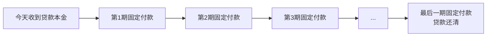
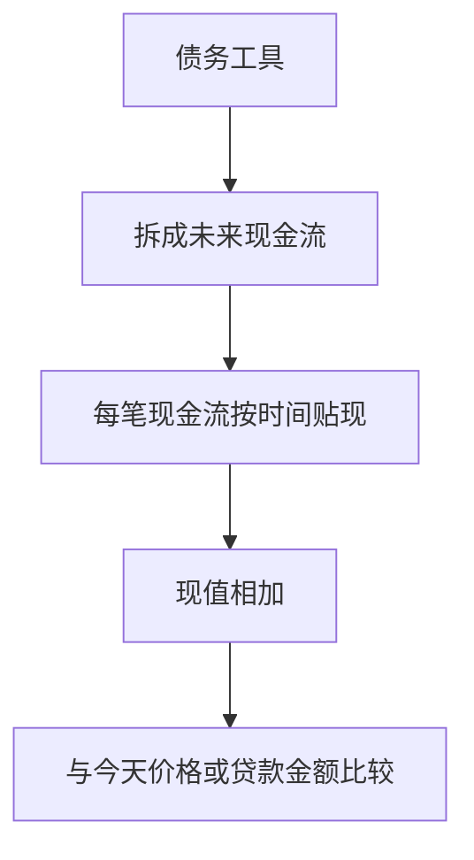

# 7.3 简单贷款、固定支付贷款、息票债、贴现债

来源：

- 主线：Mishkin《货币金融学》Ch.4
- 补充：Mishkin/Eakins Ch.3；Mankiw Ch.28；Bodie/Kane/Marcus《Investments》Ch.14, Ch.16

## 为什么要按现金流形态区分债务工具

债务工具的共同点，是今天一方提供资金，未来另一方按约定还款。但“未来怎么还”有很多形式。有的到期一次还本付息，有的每期还一部分，有的每年付利息、到期还本金，有的平时不付利息、到期只还面值。

这些差异看起来只是合同细节，实际上决定了利率如何衡量、价格如何计算、风险如何表现。学习债券和贷款时，不能只问“利率是多少”，还要先问“现金流怎样发生”。

**现金流**就是某项金融工具在不同时间点支付或收到的金额。金融资产的价值来自未来现金流。不同工具之所以难比较，是因为现金流的时间和形态不同。现值提供了统一方法，但在使用现值之前，必须先看清每类工具的现金流结构。

本节按本章主线介绍四类基本信用市场工具：简单贷款、固定支付贷款、息票债和贴现债。

## 简单贷款：到期一次还本付息

**简单贷款**是最容易理解的债务工具。贷款人今天把一笔本金借给借款人，借款人在到期日一次性归还本金，并额外支付利息。

假设你借给朋友 100 元，期限一年。一年后朋友还给你 110 元。其中 100 元是本金，10 元是利息。利息除以本金，就是 10%。

```text
今天：贷款人付出 100
一年后：贷款人收回 110 = 100 本金 + 10 利息
```

简单贷款的现金流只有两端：今天放款，到期收款。因为结构简单，利率也容易理解。贷款人放弃今天的 100 元，换来一年后的 110 元；借款人今天得到 100 元，承诺一年后支付 110 元。

许多短期商业贷款可以近似看作简单贷款。企业今天借入一笔资金，用于购买存货、支付工资或周转经营，到期归还本金和利息。

简单贷款适合作为利率入门例子，是因为它把利息暴露得最清楚。但现实中，很多贷款不会等到最后一天才一次性还清，而是要求借款人定期付款。这就进入第二类工具。

## 固定支付贷款：每期支付相同金额

**固定支付贷款**也叫完全摊还贷款。贷款人今天提供资金，借款人在贷款期限内每期支付相同金额，直到贷款完全还清。每期付款中既包含利息，也包含一部分本金。

房贷和汽车分期贷款常常属于这一类。假设你借款 100000 元买房，期限 20 年，贷款合同要求你每年支付固定金额。你不是到第 20 年一次性还本金和利息，而是每年都还一笔相同款项。随着时间推移，债务逐渐减少，最终还清。

固定支付贷款的关键，是“每期支付额相同”，但每期付款的内部构成会变化。贷款初期，未偿本金较多，利息部分较大；后期未偿本金减少，利息部分下降，本金偿还部分提高。

可以用一个简化图表示：



固定支付贷款比简单贷款复杂，因为它有许多笔未来现金流。计算这种贷款的利率或固定付款时，必须把每一期付款分别折现，再让所有现值之和等于今天的贷款金额。

例如，一笔 1000 元、25 年期贷款，每年支付 126 元。判断这笔贷款的利率，不能只用一年利息除以本金，因为每年都在还款，未偿本金不断变化。正确方法是把 25 笔 126 元分别折现，然后使这些现值之和等于今天借出的 1000 元。

因此，固定支付贷款展示了一个重要原则：只要现金流不是一次性发生，就必须逐笔处理时间价值。

## 息票债：定期付息，到期还本

**息票债**是债券市场中非常重要的一类工具。它在到期日前定期向债券持有人支付固定利息，到期时再偿还面值。

假设一只债券面值为 1000 元，期限 10 年，每年支付 100 元利息。到第 10 年，债券持有人除了收到当年的 100 元利息，还会收回 1000 元面值。

```text
第1年：收到 100
第2年：收到 100
...
第10年：收到 100 + 1000
```

这里的 100 元就是**息票支付**。历史上，债券凭证上会附有一张张息票，持有人剪下息票交给发行人领取利息，所以称为息票债。现在虽然不再真的剪纸质息票，但术语保留下来。

息票债有几个关键术语。

| 术语 | 含义 |
| --- | --- |
| 面值 | 到期时偿还的本金金额，常见为 1000 元或其整数倍 |
| 到期日 | 债券偿还面值的日期 |
| 息票支付 | 每期支付给债券持有人的固定利息金额 |
| 息票率 | 年息票支付除以面值 |
| 发行人 | 借款主体，可以是政府、政府机构或公司 |

如果面值 1000 元，每年息票支付 100 元，息票率就是 10%。注意，息票率不是债券投资者实际获得的全部回报，也不一定等于市场利率。息票率只是合同规定的年利息支付占面值的比例。

息票债的现金流结构比固定支付贷款略不同。固定支付贷款每期付款相同，并逐渐还本金；息票债通常每期只支付利息，到期日才偿还面值。也就是说，息票债的本金主要集中在最后一期偿还。

这会影响债券价格对利率变化的敏感度。因为远期现金流占比越高，利率变化对现值影响越大。这个问题会在 7.5 和 7.6 中展开。

## 贴现债：低价买入，到期收面值

**贴现债**也叫零息债。它没有定期利息支付，而是以低于面值的价格出售，到期时支付面值。投资者的收益来自买入价格和到期面值之间的差额。

假设一只一年期贴现债面值 1000 元，现在价格 900 元。你今天花 900 元买入，一年后收到 1000 元。中间没有任何利息支付。收益是 100 元，来自价格从 900 元走向到期面值 1000 元。

```text
今天：支付 900 买入
一年后：收到 1000 面值
中间：没有息票支付
```

美国国库券、储蓄债券以及长期零息债都可以作为贴现债的例子。贴现债的现金流结构非常简单：买入时支付价格，到期时收到面值。

贴现债虽然没有名义上的“利息支付”，但并不意味着没有利息。利息隐含在贴现中。你用 900 元买到未来 1000 元，差额 100 元就是持有到期的收益来源。

贴现债也清楚展示了债券价格和收益之间的关系。面值固定为 1000 元时，买入价格越低，未来从价格上升到面值的空间越大，收益率越高；买入价格越高，收益率越低。这一点会在到期收益率中正式计算。

## 四类工具的现金流对比

四类工具可以放在一张表中比较。

| 工具 | 今天发生什么 | 持有期间发生什么 | 到期时发生什么 | 常见例子 |
| --- | --- | --- | --- | --- |
| 简单贷款 | 贷款人借出本金 | 通常没有中间付款 | 借款人还本付息 | 短期商业贷款 |
| 固定支付贷款 | 贷款人发放贷款 | 借款人每期支付相同金额 | 最后一期后贷款还清 | 房贷、汽车贷款 |
| 息票债 | 投资者购买债券 | 定期收到固定息票 | 收到最后息票和面值 | 国债、公司债 |
| 贴现债 | 投资者以低于面值价格买入 | 没有定期利息 | 收到面值 | 国库券、零息债 |

这张表说明，债务工具的核心差别不是名字，而是现金流时间。金融分析首先要把工具拆成现金流，再用现值方法比较。

从投资学角度看，现金流时间还决定风险暴露。固定支付贷款不断摊还本金，贷款人较早收回一部分资金；息票债定期付息但本金集中到期；贴现债所有现金流都在最后，价格对利率变化尤其敏感。也就是说，同样面值、同样到期日的工具，可能因为中间现金流不同而具有不同久期、再投资风险和流动性需求。

从金融机构角度看，这些差异会进入资产负债管理。银行持有固定支付贷款，现金流逐步回收；保险公司和养老金可能偏好长期债券匹配未来负债；短期国库券和贴现工具更适合短期现金管理。债务工具不是一组孤立名称，而是把融资需求、投资期限和风险管理连接起来的现金流设计。

## 为什么不能用同一种简单利率处理所有工具

简单贷款可以直接用利息除以本金得到利率。但固定支付贷款、息票债和贴现债不能这么粗糙处理。

固定支付贷款中，每期付款包含本金和利息。随着本金偿还，真正被借用的未偿本金在减少。如果简单把所有付款相加再除以最初本金，会忽略时间顺序和本金变化。

息票债中，投资者可能不是按面值买入，而是按市场价格买入。如果一只面值 1000 元、每年付息 100 元的债券，市场价格是 900 元，投资者的收益率显然高于 10% 息票率；如果价格是 1100 元，收益率又低于 10%。因此，息票率不能直接等同于市场利率。

贴现债没有显性利息支付。如果只寻找“每年付息多少”，会误以为它没有收益。但它通过低价买入、到期收面值提供收益。

因此，统一衡量利率的办法必须满足两个条件：第一，能处理不同时间的现金流；第二，能把当前价格或贷款金额与未来付款联系起来。到期收益率正是为此引入。

## 现值如何统一四类工具

四类工具虽然形式不同，但都可以转化成同一个问题：未来现金流的现值是否等于今天的价格或贷款金额。

简单贷款只有一笔未来现金流，所以现值计算最简单。

固定支付贷款有许多笔相同付款，每一笔都要按对应期数折现。

息票债有一串息票支付，再加上到期面值，也要逐笔折现。

贴现债只有到期面值这一笔未来现金流，价格就是这笔面值的现值。



这就是债券和贷款分析的共同语言。只要能列出现金流，就可以计算现值；只要知道今天价格，就可以反推出让现值等于今天价格的利率。

## 小结

信用市场工具的差异，主要体现在现金流时间和形式上。简单贷款到期一次还本付息；固定支付贷款每期支付相同金额，逐渐还清本金；息票债定期支付固定利息，到期偿还面值；贴现债没有定期利息，以低于面值价格买入，到期支付面值。

这些工具不能只用表面利率比较。固定支付贷款有多期付款，息票债有息票和面值，贴现债把收益隐藏在买入价格与面值差额中。要比较它们，必须把未来现金流折成现值。

本节的目标是看清现金流结构。下一节会进一步引入到期收益率：它是使未来现金流现值等于当前价格或贷款金额的利率，也是衡量债务工具利率的核心概念。

## 自测问题

- 什么是现金流？为什么债务工具要先按现金流结构分析？
- 简单贷款的现金流为什么最容易理解？
- 固定支付贷款的每期付款为什么不能简单看作纯利息？
- 息票债的面值、息票支付和息票率分别是什么意思？
- 贴现债没有定期利息，为什么仍然有收益？
- 为什么不同现金流结构会带来不同的利率风险和再投资风险？
- 为什么四类工具最终都可以用现值方法统一分析？
