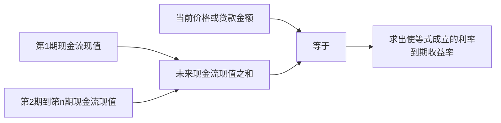

# 7.4 到期收益率与债券定价

来源：

- 主线：Mishkin《货币金融学》Ch.4
- 补充：Mishkin/Eakins Ch.3；Mankiw Ch.28；Bodie/Kane/Marcus《Investments》Ch.14

## 为什么需要到期收益率

上一节看到，债务工具的现金流形态差异很大。简单贷款到期一次还本付息，固定支付贷款每期还相同金额，息票债定期付息并到期还本，贴现债没有定期利息而是低价买入、到期收面值。如果每种工具都用不同方式描述利率，投资者就很难比较。

**到期收益率**解决这个问题。它是使债务工具未来所有现金流的现值，等于该工具今天价值的利率。换句话说，它回答的是：用哪个利率折现未来付款，正好能得到今天的贷款金额或债券价格？

这个定义有两个关键点。

第一，到期收益率不是随便报出的利率，而是由当前价格和未来现金流共同决定的利率。价格变了，到期收益率也会变。

第二，到期收益率把所有未来现金流都放进计算，而不只看下一期利息。因此，它比只看息票率或当期收益率更完整。

经济学家通常把到期收益率视为衡量债务工具利率的最准确方法，因为它直接建立在现值逻辑上：今天的价格应当等于未来现金流按某个利率折现后的总和。

投资者还要知道，到期收益率是一个“内部收益率”概念，不是无条件承诺的实际收益。它隐含几个前提：发行人按时支付所有现金流，投资者按当前价格买入，持有到到期日，并且中间收到的息票能够以合适利率再投资。只要持有期改变、信用状况改变、利率路径改变或债券带有提前赎回等条款，实际实现的回报就可能偏离买入时的到期收益率。

## 到期收益率的共同公式思想

不管债务工具形式如何，到期收益率的计算都遵循同一原则：

```text
今天的价格或贷款金额 = 未来现金流的现值之和
```

如果未来只有一笔现金流，公式很简单。如果未来有多笔现金流，就把每笔现金流逐一折现后相加。未知数就是使两边相等的利率。



这套逻辑适用于四类工具。差别只在于现金流怎么列。

## 简单贷款的到期收益率

简单贷款最直接。假设今天借出 100 元，一年后收回 110 元。到期收益率就是让一年后 110 元折回今天等于 100 元的利率：

```text
100 = 110 / (1 + i)
```

解出：

```text
i = 10%
```

这和简单利率相同。因为简单贷款只有一笔未来付款，利息也清楚显示为 10 元。对于这种工具，简单利率和到期收益率是一回事。

这个例子虽然简单，但它展示了到期收益率的本质：不是先说利率是多少，而是从今天的金额和未来付款反推出利率。

## 固定支付贷款的到期收益率

固定支付贷款每期付款相同，因此要把每一期付款都折现。

假设贷款金额为 LV，每期固定付款为 FP，期限为 n 年，到期收益率为 i。今天贷款金额等于未来每期固定付款的现值之和：

```text
LV = FP/(1+i) + FP/(1+i)^2 + FP/(1+i)^3 + ... + FP/(1+i)^n
```

这里的 LV 是今天借出的贷款金额，FP 是每期付款。i 是未知数。给定贷款金额、期限和每期付款，就可以解出到期收益率；给定贷款金额、期限和利率，也可以解出每期应付金额。

房贷就是典型例子。借款人今天获得一笔贷款，未来多年每月或每年支付固定金额。银行或房贷经纪人计算月供时，本质上就是在解这个现值方程：所有未来月供折现后，必须等于今天的贷款金额。

例如，一笔 100000 元、20 年期贷款，年利率为 7%。如果每年支付一次，要让 20 笔未来付款的现值等于 100000 元，每年付款大约为 9439.29 元。这个数字不是凭经验估出来的，而是由现值方程决定。

固定支付贷款说明，到期收益率不仅用于债券，也用于贷款。它把未来一串固定还款和今天的贷款本金联系起来。

## 息票债的价格和到期收益率

息票债的现金流包括两部分：每期息票支付和到期面值。假设债券价格为 P，每年息票支付为 C，面值为 F，期限为 n 年，到期收益率为 i。它的价格满足：

```text
P = C/(1+i) + C/(1+i)^2 + ... + C/(1+i)^n + F/(1+i)^n
```

前面的一串 C 是每年的息票支付，最后的 F 是到期偿还的面值。到期那一年，投资者通常同时收到最后一次息票和面值。

举例来说，一只面值 1000 元、期限 10 年、每年支付 100 元息票的债券。如果到期收益率是 12.25%，期限剩 8 年，那么用 12.25% 折现未来 8 次 100 元息票和最后 1000 元面值，可以得到债券价格约 889.20 元。

反过来，如果市场上这只债券价格就是 889.20 元，而未来现金流已知，投资者也可以反推出到期收益率为 12.25%。这说明债券价格和到期收益率是同一个现值关系的两种表达：知道收益率可以算价格，知道价格也可以算收益率。

息票债有三个重要结论。

第一，如果债券价格等于面值，到期收益率等于息票率。面值 1000 元、每年付息 100 元的债券，如果价格也是 1000 元，到期收益率就是 10%。

第二，如果债券价格低于面值，到期收益率高于息票率。因为投资者不仅得到息票，还会在到期时从较低买入价回到面值，获得资本增值。

第三，如果债券价格高于面值，到期收益率低于息票率。因为投资者虽然收到较高息票，但到期只收回面值，会发生资本损失。

可以这样整理：

| 债券价格状态 | 与面值关系 | 到期收益率与息票率关系 |
| --- | --- | --- |
| 平价债券 | 价格 = 面值 | 到期收益率 = 息票率 |
| 折价债券 | 价格 < 面值 | 到期收益率 > 息票率 |
| 溢价债券 | 价格 > 面值 | 到期收益率 < 息票率 |

这三个结论非常重要。它们帮助初学者避免把息票率误认为市场利率。息票率是合同写好的付款比例，到期收益率则由当前价格和全部未来现金流共同决定。

## 永续债和当期收益率

息票债中有一个特殊情形：永续债。永续债没有到期日，不偿还本金，而是永远支付固定息票。历史上英国财政部曾发行过这类债券，虽然在现代市场中并不常见，但它有助于理解债券价格和利率。

如果永续债每年支付 C，价格为 P，到期收益率为 i，那么：

```text
P = C / i
```

也可以写成：

```text
i = C / P
```

假设永续债每年支付 100 元。如果利率是 10%，价格就是：

```text
P = 100 / 0.10 = 1000
```

如果利率上升到 20%，价格变成：

```text
P = 100 / 0.20 = 500
```

这个例子非常直观地展示了利率上升会压低价格。未来每年仍然支付 100 元，但当市场要求 20% 收益时，投资者只愿意支付 500 元。

永续债公式还引出**当期收益率**。当期收益率等于年度息票支付除以当前价格：

```text
当期收益率 = 年度息票支付 / 当前价格
```

对于长期债券，当期收益率有时可以近似描述利率，因为很远期的本金现值较小，债券行为接近永续债。但它仍然不是完整的到期收益率，因为它忽略了到期面值带来的资本利得或损失。

## 贴现债的到期收益率

贴现债没有定期息票，只在到期时支付面值。它的到期收益率计算类似简单贷款。

假设一只一年期国库券面值为 1000 元，当前价格为 900 元。一年后收到 1000 元。到期收益率 i 满足：

```text
900 = 1000 / (1 + i)
```

解出：

```text
i = (1000 - 900) / 900 = 11.1%
```

对于一年期贴现债，可以直接写成：

```text
i = (F - P) / P
```

其中 F 是面值，P 是当前价格。收益来自到期面值与当前价格之间的差额。

这个公式清楚说明：面值固定时，当前价格越高，到期收益率越低；当前价格越低，到期收益率越高。价格从 900 元上升到 950 元，未来仍然只收到 1000 元，收益空间缩小，到期收益率自然下降。

贴现债还提醒我们，债券不一定通过显性利息支付收益。没有息票并不等于没有利率，利率可以隐藏在买入价格和到期面值的差额中。

## 债券定价的统一视角

现在可以把四类工具放回同一个框架：

| 工具 | 未来现金流 | 到期收益率如何得到 |
| --- | --- | --- |
| 简单贷款 | 到期一次还本付息 | 使到期付款现值等于今天贷款金额 |
| 固定支付贷款 | 每期固定付款 | 使所有固定付款现值之和等于贷款金额 |
| 息票债 | 定期息票 + 到期面值 | 使所有息票和面值现值之和等于当前价格 |
| 贴现债 | 到期面值 | 使面值现值等于当前价格 |

这张表背后只有一个原则：债务工具今天的价值等于未来现金流的现值。到期收益率就是让这个等式成立的利率。

因此，债券定价并不是神秘的市场技巧，而是现值逻辑的直接应用。给定未来现金流和要求的收益率，可以算出合理价格；给定未来现金流和市场价格，可以反推出市场隐含的收益率。

这也说明，市场价格本身包含信息。两只期限相同、息票相同的债券，如果到期收益率不同，通常意味着投资者在价格中反映了信用风险、流动性、税收待遇、嵌入期权或供求差异。到期收益率是比较债券的起点，但不是终点。真正的投资分析还要问：这个收益率高，是因为机会被低估，还是因为风险确实更高？

## 小结

到期收益率是使债务工具未来现金流现值等于今天价格或贷款金额的利率。它是衡量债务工具利率的核心概念，因为它完整考虑了所有未来现金流的时间和金额。

简单贷款中，到期收益率等于简单利率。固定支付贷款中，到期收益率使所有固定付款现值之和等于贷款金额。息票债中，到期收益率使所有息票支付和到期面值的现值之和等于债券价格。贴现债中，到期收益率来自面值和当前价格之间的差额。

息票债的息票率不等于到期收益率。债券平价时，二者相等；债券折价时，到期收益率高于息票率；债券溢价时，到期收益率低于息票率。永续债和当期收益率提供了理解长期债券的简化视角，但完整分析仍要回到到期收益率。

## 自测问题

- 什么是到期收益率？它为什么被认为是衡量利率的重要方法？
- 为什么简单贷款的简单利率等于到期收益率？
- 固定支付贷款的每期付款为什么要逐笔折现？
- 息票债价格由哪些现金流的现值组成？
- 为什么债券折价时到期收益率高于息票率？
- 到期收益率作为内部收益率，隐含了哪些持有和再投资假设？
- 贴现债没有息票，为什么仍然可以计算到期收益率？
