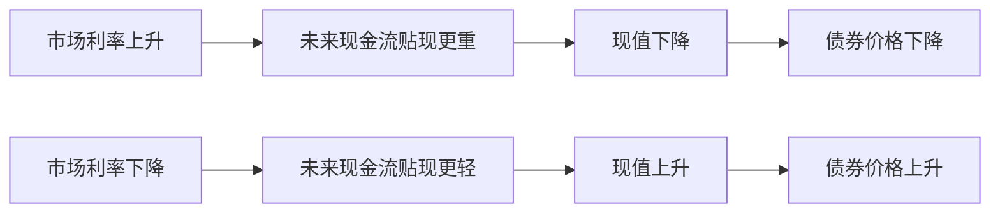

# 7.5 债券价格和利率的反向关系

来源：

- 主线：Mishkin《货币金融学》Ch.4
- 补充：Mishkin/Eakins Ch.3；Mankiw Ch.28；Bodie/Kane/Marcus《Investments》Ch.14, Ch.16

## 一个必须牢牢记住的关系

债券市场中最重要的基础关系之一是：债券价格和利率反向变动。利率上升，债券价格下降；利率下降，债券价格上升。

这句话经常被当作结论背诵，但真正重要的是理解它为什么成立。它不是市场口诀，也不是某种经验规律，而是现值逻辑的直接结果。债券承诺未来支付现金流。当市场要求的利率变化时，同一组未来现金流折回今天的价值就会变化。

如果利率上升，未来现金流折现时除以更大的数，现值下降，债券价格下降。如果利率下降，未来现金流折现时除以较小的数，现值上升，债券价格上升。

可以把债券想成一台产生未来现金流的机器。机器未来产出的金额固定时，投资者要求的收益率越高，今天愿意为这台机器支付的价格越低；要求的收益率越低，今天愿意支付的价格越高。

## 从息票债公式看反向关系

息票债价格等于未来息票支付和到期面值的现值之和：

```text
P = C/(1+i) + C/(1+i)^2 + ... + C/(1+i)^n + F/(1+i)^n
```

其中 P 是债券价格，C 是每年息票支付，F 是面值，n 是到期期限，i 是到期收益率。

当 i 上升时，公式中每一个分母都会变大。分母变大，每一笔未来现金流的现值都会变小。所有现值加起来，债券价格 P 就下降。

当 i 下降时，每一个分母都会变小。未来现金流折回今天的价值上升，债券价格 P 就上升。

这个逻辑不依赖某一只债券的特殊情况。只要债券未来现金流基本固定，利率与价格就会反向运动。



## 面值、息票率和到期收益率的关系

用面值 1000 元、息票率 10%、期限 10 年的债券可以看清价格和收益率的关系。这只债券每年支付 100 元息票，到期还 1000 元面值。

如果债券价格等于 1000 元，它的到期收益率就是 10%。原因很直观：你支付 1000 元，每年拿 100 元，到期收回 1000 元，这和把 1000 元放进一个每年给 10% 利息、期末本金仍为 1000 元的账户很相似。

如果市场要求的到期收益率高于 10%，例如接近 12% 或 13%，这只每年只付 100 元的债券就不够有吸引力。为了让投资者获得更高收益率，价格必须低于 1000 元。低价买入后，投资者除了拿 100 元息票，还能在到期时从较低买入价回到 1000 元面值，获得额外收益。

如果市场要求的到期收益率低于 10%，这只每年付 100 元的债券就很有吸引力。投资者愿意支付高于面值的价格购买它。高价买入后，到期只收回 1000 元面值，会发生资本损失，但较高息票可以弥补一部分，使总收益率降到市场要求的水平。

| 当前价格 | 与面值关系 | 到期收益率 | 直觉 |
| --- | --- | --- | --- |
| 1000 | 等于面值 | 等于 10% 息票率 | 息票正好反映市场要求 |
| 低于 1000 | 折价 | 高于 10% 息票率 | 息票 + 到期回到面值的收益 |
| 高于 1000 | 溢价 | 低于 10% 息票率 | 息票较高，但到期面值低于买入价 |

这张表帮助区分三个概念。面值是到期偿还金额，息票率是合同利息占面值的比例，到期收益率是当前价格与未来现金流共同决定的市场利率。

## 为什么旧债券会因为新利率而变价

初学者常问：债券合同不是已经写好了每年付多少利息、到期还多少本金吗？既然现金流固定，为什么利率变化会影响价格？

答案是，市场比较的是替代机会。

假设你持有一只面值 1000 元、每年付息 100 元的旧债券。买入时市场利率是 10%，这很合理。后来市场利率上升到 20%。现在新发行的类似债券可能让投资者投入 1000 元，每年得到 200 元。你的旧债券仍然只每年付 100 元。如果你想把旧债券卖给别人，对方不会愿意用 1000 元买入，因为同样 1000 元可以买到收益更高的新债券。

为了让旧债券变得有吸引力，它的价格必须下降。价格下降后，100 元息票相对于买入价格的比例上升，到期收回 1000 元面值也提供资本增值。这样，旧债券才能给新买家提供接近市场要求的收益率。

反过来，如果市场利率下降到 5%，新债券每年只提供较低利息，而旧债券仍然每年支付 100 元。旧债券更有吸引力，投资者愿意出高价买入。价格上升后，旧债券的到期收益率被压低到接近市场水平。

所以，债券价格变化不是因为合同现金流变了，而是因为这些固定现金流相对于新的市场利率变得更有吸引力或更没有吸引力。

这个逻辑也能帮助理解更广泛的资产价格。债券现金流最固定，所以利率变化和价格变化的关系最清楚；股票、房地产和基础设施项目的现金流不固定，但它们也要被折现。利率上升时，远期现金流的现值下降，长期增长型资产和长久期债券往往更敏感。区别在于，股票现金流预期本身也会随经济景气和利润变化而变，不像高质量债券那样只看贴现率。

## 永续债把反向关系显示得最清楚

永续债每年支付固定金额，没有到期日。它的价格公式是：

```text
P = C / i
```

如果每年支付 100 元，市场利率为 10%，价格是：

```text
P = 100 / 0.10 = 1000
```

如果市场利率上升到 20%，价格变成：

```text
P = 100 / 0.20 = 500
```

同样每年 100 元现金流，利率翻倍，价格减半。这个例子非常直接地说明，价格和利率方向相反。

永续债公式虽然是特殊情形，却提供了很强的直觉。未来固定现金流越像一条长期收入流，利率变化对它今天价值的影响越明显。长期债券也有类似特征，因为远期现金流占比较高，价格对利率更敏感。

## 贴现债也遵循同一关系

贴现债没有息票，到期只支付面值。以一年期贴现债为例，面值 F，当前价格 P，到期收益率 i：

```text
i = (F - P) / P
```

如果面值是 1000 元，价格是 900 元：

```text
i = (1000 - 900) / 900 = 11.1%
```

如果价格上升到 950 元：

```text
i = (1000 - 950) / 950 = 5.3%
```

价格越高，未来从当前价格上升到面值的空间越小，收益率越低。价格越低，未来上升到面值的空间越大，收益率越高。

贴现债没有息票，因此排除了“是不是因为利息支付变化”的干扰。面值固定，价格变化直接改变收益率。这说明反向关系并不只适用于息票债，而是所有固定现金流债务工具的共同逻辑。

## 利率上升为什么会带来资本损失

债券价格和利率反向变动，对持有者有直接影响。如果你已经买入一只债券，之后利率上升，债券价格下降。即使债券继续支付息票，你如果在价格下降后卖出，就会遭受资本损失。

资本损失是资产价格下降造成的损失。它不一定表现为现金立刻流出，但它意味着你持有的资产市场价值减少。如果你必须卖出，损失会实现；即使不卖，它也反映了你相对于其他投资机会的处境变差。

这就是为什么长期债券虽然定期支付利息，却不是短期内完全安全的资产。债券承诺未来付款，但市场价格会随利率变化而波动。期限越长，远期现金流越多，利率变化对价格影响往往越大。

这一点会在下一节回报率和利率风险中展开。这里先记住：对已经持有债券的人来说，利率上升不是好消息，因为它会降低旧债券价格；利率下降则会提高旧债券价格。

## 反向关系的常见误解

第一个误解是认为“债券付固定利息，所以价格不该变”。固定的是合同现金流，不是市场价格。市场价格反映投资者用当前市场利率评价这些现金流后的价值。

第二个误解是认为“利率高，债券更赚钱，所以价格应该高”。这句话混淆了新买债券和已经发行的旧债券。市场利率高时，新债券需要提供更高收益；旧债券若现金流固定，就必须通过价格下降来提供更高到期收益率。

第三个误解是只看息票率。息票率是债券发行时写在合同里的比例，不会因为市场利率每天变化而改变。真正随市场价格变化的是到期收益率。

第四个误解是认为价格下降一定意味着违约风险上升。债券价格下降可能来自信用风险上升，也可能只是因为一般市场利率上升。本节讨论的是在现金流不变的情况下，利率变化如何影响价格。

投资者因此要拆分债券价格变动的来源。国债价格下跌通常更多反映无风险利率或期限溢价变化；公司债价格下跌可能同时包含无风险利率上升、信用利差扩大和流动性恶化。若不能区分这些来源，就容易把宏观利率风险误认为公司信用恶化，或把信用风险恶化误认为普通利率波动。

## 小结

债券价格和利率反向变动，是现值逻辑的直接结果。债券价格等于未来现金流的现值。利率上升时，未来现金流折现更重，现值下降，价格下降；利率下降时，现值上升，价格上升。

息票债、永续债和贴现债都体现这一关系。平价债券的到期收益率等于息票率；折价债券的到期收益率高于息票率；溢价债券的到期收益率低于息票率。永续债公式 `P = C / i` 直观显示利率越高价格越低。贴现债则说明，在面值固定时，价格越高收益率越低。

对债券持有人来说，利率上升会造成债券价格下降和资本损失；利率下降会带来价格上升和资本利得。这为下一节理解回报率、久期直觉和利率风险打下基础。

## 自测问题

- 为什么债券价格等于未来现金流的现值？
- 利率上升时，为什么未来固定现金流的现值会下降？
- 为什么债券折价时，到期收益率会高于息票率？
- 旧债券的合同现金流没有变，为什么市场利率变化会让它价格变化？
- 永续债公式如何展示价格和利率的反向关系？
- 债券价格下跌时，为什么要区分无风险利率变化和信用利差变化？
- 对已经持有债券的人来说，利率上升为什么可能造成资本损失？
