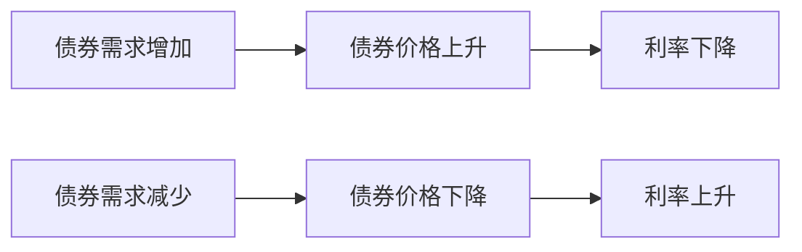

# 8.1 资产需求：财富、预期收益、风险、流动性

来源：

- 主线：Mishkin《货币金融学》Ch.5, Ch.6
- 补充：Mishkin/Eakins Ch.4, Ch.5；Bodie/Kane/Marcus《Investments》Ch.5, Ch.14

## 为什么先讲资产需求

上一章解释了利率是什么意思：债券价格和利率反向变动，到期收益率来自债券未来现金流的现值。现在要进一步问：利率为什么会变？

如果债券价格由市场决定，而债券价格又对应利率，那么理解利率变化就要先理解债券市场上的买卖力量。谁愿意持有债券？什么因素会让人更愿意买债券？什么因素又会让人减少债券持有？这些问题属于资产需求理论。

资产需求不是只针对债券。一个人拥有财富后，可以选择持有现金、银行存款、债券、股票、房地产或其他资产。不同资产的预期收益、风险和流动性不同。投资者会在这些资产之间配置财富。债券需求只是资产选择中的一个具体应用。

本节先建立一个通用框架：决定一种资产需求的四个因素是财富、相对于其他资产的预期收益、相对于其他资产的风险、相对于其他资产的流动性。后面分析债券市场供求和均衡利率时，会反复用到这四个因素。

## 财富：可配置资源越多，资产需求通常越大

**财富**是一个人拥有的总资源，包括各种资产。它不同于收入。收入是单位时间内流入的金额，财富是某个时点已经拥有的资产存量。一个人当年收入很高，但如果负债也高、储蓄很少，财富未必高；一个退休者当年收入不高，但可能拥有大量金融资产和房产，财富很高。

在其他条件不变时，财富增加会提高对资产的需求。原因很直接：可配置资源更多，就能持有更多资产。经济扩张时，收入和财富通常上升，家庭和机构有更多资金购买债券、股票和其他资产。经济衰退时，财富下降，资产需求往往减少。

对债券来说，财富增加通常会提高债券需求。假设某个家庭原来只有少量储蓄，主要需要维持日常支出，就很难购买债券。后来收入增长、储蓄增加，它开始把一部分财富配置到债券基金或国债中。财富增加使它有能力持有更多金融资产。

但财富增加不意味着所有资产需求按同一比例增加。某些资产可能随着财富增加需求增长更快，某些资产增长较慢。本章只需要掌握基本方向：在其他条件相同的情况下，财富增加会提高资产需求；财富减少会降低资产需求。

## 预期收益：人们比较的是相对吸引力

**预期收益**是投资者预计持有某项资产能获得的回报。它包括收入部分，也包括价格变化带来的资本利得或损失。对债券来说，预期收益不仅取决于息票或到期收益率，还取决于未来利率变化对债券价格的影响。

资产需求取决于相对预期收益，而不是孤立收益。投资者不会只问“债券收益是多少”，还会问“债券相对于股票、存款、房地产和其他资产是否更有吸引力”。

如果长期债券投资者预期未来利率会上升，就会预期债券价格下降。即使当前债券有利息收入，未来资本损失可能降低持有债券的预期回报。于是，长期债券需求下降。

相反，如果投资者预期未来利率会下降，就会预期长期债券价格上升。价格上涨带来的资本利得提高债券预期收益，债券需求增加。

其他资产的预期收益也会影响债券需求。如果投资者突然更看好股票市场，预期股票价格会上涨，在债券预期收益不变的情况下，债券相对吸引力下降，债券需求会减少。反过来，如果股票市场前景变差，债券可能相对更有吸引力，需求增加。

预期通胀也会影响债券相对收益。债券通常承诺以货币金额支付固定现金流。如果预期通胀上升，未来货币购买力下降，债券的实际预期收益降低。同时，房屋、汽车等实物资产的名义价格可能随通胀上升，使这些资产更有吸引力。结果是，债券需求下降。

这一点会在 8.3 中发展为费雪效应：预期通胀上升会推高名义利率。现在先记住资产需求角度的机制：预期通胀上升降低固定金额债券的实际吸引力，从而减少债券需求。

## 风险：同样收益下，人们通常不喜欢不确定

**风险**是资产回报的不确定性。两项资产预期收益相同，但一项收益稳定，另一项可能大赚也可能大亏，多数投资者会偏好更稳定的资产。这种偏好称为风险厌恶。

风险厌恶不表示人们永远不买风险资产，而是表示如果风险更高，投资者通常要求更高预期收益作为补偿。如果补偿不够，风险上升会降低资产需求。

对债券来说，风险可以来自多方面。债券价格可能因为市场利率变化而波动，这就是利率风险；发行人可能无法按时还本付息，这就是违约风险；市场流动性变差也可能使卖出价格不利。不同章节会分别展开这些风险。

在本节框架中，只需要掌握相对风险对资产需求的影响。如果债券价格变得更不稳定，债券相对于其他资产更有风险，投资者会减少债券需求。如果股票价格变得更不稳定，而债券风险不变，债券相对更安全，债券需求可能增加。

这说明，需求变化不只取决于债券本身，也取决于其他资产发生了什么。债券市场看似独立，实际上和股票市场、房地产市场、银行存款以及宏观不确定性相互联系。

## 流动性：越容易变现，资产越有吸引力

**流动性**指资产转化为现金的容易程度和速度，以及在转化过程中损失价值的可能性。现金流动性最高，因为它本身就是支付手段。银行活期存款也很高，因为可以直接支付。房屋流动性较低，因为出售需要时间、手续和交易成本。

在其他条件相同的情况下，流动性越高，资产需求越大。投资者喜欢流动性，是因为未来可能需要资金应对消费、投资机会或突发事件。如果某项资产可以快速卖出，并且卖出时价格不容易大幅折让，它就更有吸引力。

债券流动性取决于市场活跃程度、交易成本、买卖便利性和价格透明度。如果某类债券有很多买家和卖家，交易成本低，投资者容易卖出，它的流动性较高，需求也更强。如果某类债券很少有人交易，卖出时可能必须降价，它的流动性较低，投资者会要求更高收益或减少需求。

流动性同样要相对比较。如果股票交易成本下降，股票市场变得更容易买卖，而债券流动性不变，那么债券相对于股票的流动性下降，债券需求可能减少。教材用股票交易佣金下降的例子说明，其他资产流动性提高也会影响债券需求。

从投资学角度看，这四个因素就是资产配置的基本语言。财富决定组合规模，预期收益决定资产的吸引力，风险决定投资者要求的补偿，流动性决定资产在不确定支出和再平衡中的便利程度。一个养老基金、一个银行理财账户和一个家庭应急账户，面对同样的债券收益率，也可能因为负债期限、风险承受能力和流动性需求不同，给出完全不同的需求。

## 四个因素如何共同决定资产需求

可以把资产需求规律整理成一张表。

| 因素 | 变化方向 | 对某资产需求的一般影响 |
| --- | --- | --- |
| 财富 | 财富增加 | 需求增加 |
| 预期收益 | 该资产相对预期收益上升 | 需求增加 |
| 风险 | 该资产相对风险上升 | 需求下降 |
| 流动性 | 该资产相对流动性上升 | 需求增加 |

对债券需求来说，应用如下：

| 情况 | 债券需求变化 |
| --- | --- |
| 经济扩张、财富增加 | 债券需求增加 |
| 预期未来利率上升 | 长期债券预期回报下降，需求减少 |
| 预期通胀上升 | 债券实际预期收益下降，需求减少 |
| 债券市场价格波动加大 | 债券风险上升，需求减少 |
| 股票市场风险上升 | 债券相对更安全，需求增加 |
| 债券市场更容易交易 | 债券流动性提高，需求增加 |
| 其他资产流动性提高 | 债券相对流动性下降，需求减少 |

这套表格不是机械背诵，而是帮助理解资产配置。投资者持有债券，不是因为债券天然应该被持有，而是因为在财富、收益、风险和流动性的综合比较下，债券有一定吸引力。

## “相对”二字为什么重要

资产需求理论反复强调“相对于其他资产”。这是因为投资者的选择总是在多个资产之间进行。

如果债券预期收益上升，但股票预期收益上升更多，债券相对吸引力可能反而下降。如果债券风险没有变，但其他资产风险大幅上升，债券相对风险下降，需求可能增加。如果债券流动性改善，但其他资产流动性改善更明显，债券需求未必上升。

这与消费者选择很像。一个商品价格是否便宜，不只看它自己的价格，还要看替代品价格。一个资产是否有吸引力，也不只看它自己的收益，还要看其他资产提供什么。

因此，分析债券需求时，要问四组相对问题：

```text
债券相对于其他资产，预期收益更高还是更低？
债券相对于其他资产，风险更大还是更小？
债券相对于其他资产，流动性更好还是更差？
投资者整体财富是增加还是减少？
```

这四个问题决定债券需求曲线是否移动。下一节讨论债券市场供求时，会把这些需求变化放入市场均衡，观察债券价格和利率如何调整。

## 从资产需求到利率决定

资产需求影响利率，是通过债券价格实现的。债券需求增加时，在供给不变的情况下，更多人愿意买债券，债券价格上升。由于债券价格和利率反向变动，债券价格上升意味着利率下降。

债券需求减少时，在供给不变的情况下，买方减少，债券价格下降。债券价格下降意味着利率上升。



这条链条把本章和上一章连接起来。上一章说明价格与利率反向关系；本章说明什么因素会推动债券需求和供给变化。两者合在一起，就能解释利率为什么会随经济增长、通胀预期、风险和流动性变化。

## 小结

资产需求理论解释投资者为什么愿意持有某种资产。决定资产需求的四个基本因素是财富、相对预期收益、相对风险和相对流动性。

财富增加通常提高资产需求。某资产相对于其他资产的预期收益上升，会提高它的需求；相对风险上升，会降低需求；相对流动性上升，会提高需求。分析债券需求时，必须始终使用相对视角，因为投资者是在债券、股票、存款、实物资产等多种资产之间配置财富。

债券需求变化会通过债券价格影响利率。债券需求增加会推高债券价格、压低利率；债券需求下降会压低债券价格、推高利率。下一节将把需求和供给放到同一个市场框架中，解释均衡利率如何形成。

## 自测问题

- 为什么分析利率变化要先理解资产需求？
- 财富和收入有什么区别？财富增加为什么通常提高资产需求？
- 为什么资产需求取决于相对预期收益，而不是孤立收益？
- 预期未来利率上升为什么会降低长期债券需求？
- 风险上升如何影响债券需求？其他资产风险上升又会怎样？
- 流动性为什么会提高资产吸引力？
- 为什么同一只债券对不同投资者的吸引力可能不同？
