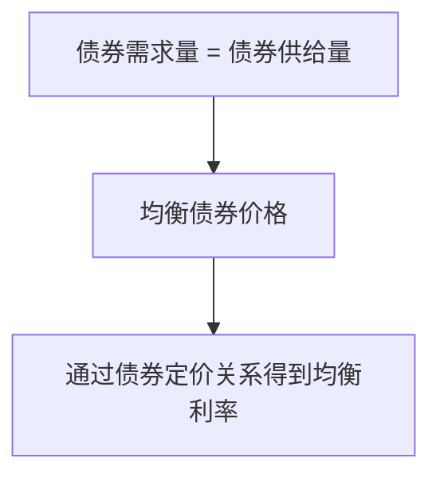

# 8.2 债券市场供求与均衡利率

来源：

- 主线：Mishkin《货币金融学》Ch.5, Ch.6
- 补充：Mishkin/Eakins Ch.4, Ch.5；Bodie/Kane/Marcus《Investments》Ch.14

## 为什么用债券市场分析利率

利率可以从债券市场中看出来。债券价格和利率反向变动：债券价格上升，对应的到期收益率下降；债券价格下降，对应的到期收益率上升。因此，只要解释债券价格如何由供求决定，就能解释利率如何形成。

债券市场的一边是债券需求者，也就是愿意购买并持有债券的人。他们通常是家庭、基金、银行、保险公司、养老金和其他拥有资金的机构。购买债券意味着把资金借给发行人，未来获得利息和本金。

另一边是债券供给者，也就是发行债券借入资金的人。企业、政府和其他机构发行债券，是为了筹集资金。发行债券越多，市场上的债券供给越大。

债券市场均衡，就是愿意购买债券的数量等于愿意发行或出售债券的数量。均衡债券价格确定后，利率也随之确定。

## 债券需求曲线为什么向下倾斜

债券需求曲线表示，在其他条件不变时，不同债券价格下投资者愿意持有多少债券。

这里要特别小心：债券价格越高，利率越低；债券价格越低，利率越高。投资者买债券，关心的是未来现金流相对于今天价格是否划算。当债券价格下降时，同样的未来付款对应更高收益率，债券更有吸引力，需求量增加。当债券价格上升时，同样未来付款对应更低收益率，债券吸引力下降，需求量减少。

因此，以债券价格为纵轴、债券数量为横轴时，债券需求曲线向下倾斜。价格高，需求少；价格低，需求多。

可以用一年期贴现债直观理解。假设债券面值为 1000 元。

| 当前价格 | 到期收到 | 到期收益率近似 | 投资吸引力 |
| --- | --- | --- | --- |
| 950 | 1000 | 约 5.3% | 较低 |
| 900 | 1000 | 约 11.1% | 较高 |
| 850 | 1000 | 约 17.6% | 更高 |
| 750 | 1000 | 约 33.3% | 很高 |

价格越低，未来从价格回到面值的收益越高，投资者愿意买入更多债券。需求曲线的向下倾斜，正是这个逻辑。

## 债券供给曲线为什么向上倾斜

债券供给曲线表示，在其他条件不变时，不同债券价格下发行人愿意发行多少债券。

对发行人来说，债券价格越高，借款成本越低。因为发行人出售债券得到的资金更多，而未来承诺支付的金额相同。价格高，对发行人有利，发行债券更划算，供给量增加。

同样用面值 1000 元的一年期贴现债理解。企业发行这种债券，未来要支付 1000 元。如果今天能以 950 元卖出，它只需为未来 1000 元偿还获得 950 元资金，对应利率较低。如果只能以 750 元卖出，它为未来 1000 元偿还只获得 750 元资金，融资成本很高。价格越低，企业越不愿意发行；价格越高，企业越愿意发行。

因此，以债券价格为纵轴时，债券供给曲线向上倾斜。价格高，供给多；价格低，供给少。

这里的“供给”不是商品生产意义上的新增实物，而是借款人愿意发行并出售的债券数量。企业、政府或其他机构通过发行债券获得资金，所以债券供给也可以理解为借款需求的表现。

## 均衡价格和均衡利率

债券市场均衡发生在债券需求量等于债券供给量的位置：

```text
债券需求量 = 债券供给量
```

这个价格叫均衡价格或市场出清价格。与它对应的到期收益率，就是均衡利率或市场出清利率。

假设在某个债券市场中，价格为 850 元时，投资者愿意购买的债券数量正好等于发行人愿意出售的债券数量。若这是一只一年期、面值 1000 元的贴现债，那么对应利率约为：

```text
i = (1000 - 850) / 850 = 17.6%
```

于是，850 元是均衡债券价格，17.6% 是对应均衡利率。



市场均衡的意义在于，它表示买卖双方计划一致。投资者愿意买的数量，正好等于发行人愿意卖的数量，价格没有继续上升或下降的压力。

## 价格过高时：超额供给推低价格

如果债券价格高于均衡价格，会发生什么？

价格高意味着利率低。对发行人来说，低利率融资很有吸引力，所以愿意发行更多债券。对投资者来说，债券收益率低，吸引力下降，愿意购买的数量减少。于是，债券供给量大于需求量，形成**超额供给**。

在超额供给下，发行人或卖方发现按当前高价卖不出去足够多债券，只能降价吸引买方。债券价格下降，收益率上升，债券对投资者更有吸引力，同时对发行人融资吸引力下降。这个过程会持续到供求重新相等。

例如，均衡价格是 850 元。如果市场价格被推到 950 元，发行人很愿意卖，投资者却不愿买那么多。卖方之间的压力会使价格下跌。价格从 950 元下降时，对应利率上升，市场向均衡利率回归。

所以，价格过高时，债券市场会出现向下的价格压力和向上的利率压力。

## 价格过低时：超额需求推高价格

如果债券价格低于均衡价格，情况相反。

价格低意味着利率高。投资者觉得债券收益率很有吸引力，愿意大量购买；发行人却觉得融资成本太高，不愿意发行太多。于是，债券需求量大于供给量，形成**超额需求**。

在超额需求下，买方竞争有限的债券，会推高债券价格。价格上升后，对应利率下降，债券对投资者的吸引力减弱，同时发行人更愿意供给。这个过程会持续到供求相等。

例如，均衡价格是 850 元。如果市场价格降到 750 元，债券收益率很高，投资者愿意买很多，但发行人不愿按如此高成本融资。买方竞争会把价格推回更高水平，利率随之下降，直到市场回到均衡。

所以，价格过低时，债券市场会出现向上的价格压力和向下的利率压力。

## 债券价格轴和利率轴方向相反

分析债券市场时，最容易出错的地方，是忘记债券价格和利率反向关系。

在普通商品市场中，纵轴价格越高，就是价格越高。但在债券市场图中，如果纵轴标的是债券价格，那么越往上价格越高、利率越低；越往下价格越低、利率越高。

这会让语言变得容易混淆。例如：

```text
债券价格上升 = 利率下降
债券价格下降 = 利率上升
```

因此，当需求增加推高债券价格时，结论是利率下降；当供给增加压低债券价格时，结论是利率上升。

这也是为什么本章先建立价格与利率的联系，再使用供求分析。如果没有上一章的现值和到期收益率基础，很容易把债券市场图读反。

## 存量分析：资产市场看的是某一时点的持有量

债券市场供求分析强调的是资产存量，而不是流量。存量是某个时点存在的数量，例如某一时点公众愿意持有多少债券、市场上有多少债券未偿还。流量是单位时间内发生的数量，例如一年内新发行多少债券。

资产市场分析通常使用存量方法。原因是资产价格取决于人们在某一时点愿意持有的资产组合。投资者比较债券、股票、存款和其他资产时，是在决定自己的财富存量如何配置。发行人供给债券，也影响市场上可持有债券的存量。

这与普通商品市场有些不同。面包市场常分析每天生产多少、每天购买多少；债券市场则更关注在给定价格下，人们愿意持有多少债券，发行人愿意让市场持有多少债券。

理解存量视角，可以避免把债券市场误解为只看当期新发行量。利率由整个资产市场的持有意愿和供给意愿共同决定。

这个存量视角对投资也很重要。市场收益率不是由某一笔新债发行单独决定，而是由所有可替代债券和其他资产的相对吸引力共同决定。投资者买入债券时，看到的收益率可以理解为市场要求的回报率；发行人发行债券时，同一个收益率又是融资成本。于是，债券市场把投资者的 required return 和企业、政府的 capital cost 连接在一起。

## 从均衡到利率变化

均衡分析不仅解释当前利率，还为解释利率变化打基础。

如果债券需求曲线右移，在供给不变时，债券价格上升，利率下降。需求右移可能来自财富增加、债券相对预期收益上升、债券相对风险下降或债券流动性提高。

如果债券需求曲线左移，在供给不变时，债券价格下降，利率上升。

如果债券供给曲线右移，在需求不变时，债券价格下降，利率上升。供给右移意味着发行人愿意在每个价格下发行更多债券，市场需要更低价格、更高利率来吸收这些债券。

如果债券供给曲线左移，在需求不变时，债券价格上升，利率下降。

| 变化 | 债券价格 | 利率 |
| --- | --- | --- |
| 债券需求增加 | 上升 | 下降 |
| 债券需求减少 | 下降 | 上升 |
| 债券供给增加 | 下降 | 上升 |
| 债券供给减少 | 上升 | 下降 |

这张表是后面分析预期通胀、商业周期和政府赤字时的基础。

## 小结

债券市场供求可以解释均衡利率。债券需求来自愿意购买并持有债券的投资者，债券供给来自发行债券融资的借款人。债券需求曲线向下倾斜，因为价格越低、收益率越高，投资者越愿意持有。债券供给曲线向上倾斜，因为价格越高、融资成本越低，发行人越愿意发行。

均衡发生在债券需求量等于债券供给量的位置。均衡债券价格对应均衡利率。价格高于均衡时，会出现超额供给，价格下降、利率上升；价格低于均衡时，会出现超额需求，价格上升、利率下降。

分析债券市场时必须记住：债券价格和利率方向相反。需求增加推高价格、压低利率；供给增加压低价格、推高利率。这个框架将用于解释预期通胀、经济扩张、风险变化和流动性变化如何影响利率。

## 自测问题

- 为什么解释利率变化可以从债券市场供求入手？
- 债券需求曲线为什么向下倾斜？
- 债券供给曲线为什么向上倾斜？
- 什么是债券市场的均衡价格和均衡利率？
- 价格高于均衡时，为什么会出现超额供给？
- 为什么债券需求增加会使利率下降，而债券供给增加会使利率上升？
- 为什么同一个市场利率既是投资者要求的回报率，也是发行人的融资成本？
