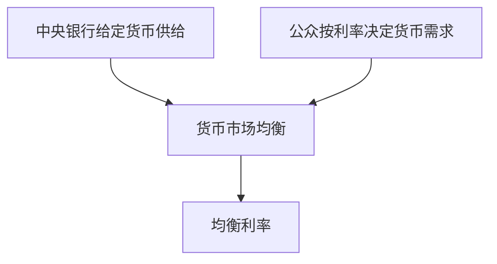

# 8.4 货币市场框架与流动性偏好

来源：

- 主线：Mishkin《货币金融学》Ch.5, Ch.6
- 补充：Mishkin/Eakins Ch.4, Ch.5

## 为什么还要换一个框架看利率

前面用债券市场供求解释利率：债券价格由债券需求和供给决定，债券价格再通过反向关系对应利率。现在换一个角度，从货币市场看利率。

这个框架叫**流动性偏好框架**。它强调人们在货币和债券之间选择。货币流动性最高，可以直接用于交易，但通常不支付利息或收益较低；债券可以带来利息，但不能像货币那样直接支付。利率就是持有货币的机会成本。

如果利率很高，放弃债券而持有货币的代价很大，人们不愿持有太多货币。如果利率很低，持有货币损失的利息较少，人们愿意持有更多货币。因此，货币需求和利率负相关。

这套框架与债券市场框架并不矛盾。一个人如果少持有货币，通常会多持有债券；如果想多持有货币，可能就要卖出债券。货币市场和债券市场通过资产选择联系在一起。

## 货币需求为什么向下倾斜

货币需求指人们在不同利率下愿意持有多少货币余额。这里的货币是最流动的资产，可用于交易和价值储藏。

利率是持有货币的机会成本。假设债券利率是 25%，持有货币意味着放弃较高利息收入。此时人们会尽量少持有闲置货币，把更多财富配置到债券等有收益资产中。货币需求较低。

如果利率降到 5%，持有货币放弃的利息收入很少，人们更愿意持有货币以获得交易便利和流动性。货币需求较高。

因此，以利率为纵轴、货币数量为横轴时，货币需求曲线向下倾斜：

```text
利率上升 -> 持有货币机会成本上升 -> 货币需求减少
利率下降 -> 持有货币机会成本下降 -> 货币需求增加
```

这与债券需求曲线的逻辑不同，但两者通过资产替代相连。利率高时，债券吸引力增强，货币吸引力下降；利率低时，货币相对吸引力提高。

## 货币供给和均衡利率

在简化分析中，可以先假定中央银行控制货币供给，并把货币供给看作一个固定数量。这样，货币供给曲线是一条垂直线。现实中的货币供给过程更复杂，涉及中央银行、商业银行、存款人和借款人，后面章节会展开。本节只保留基本框架。

货币市场均衡发生在货币需求量等于货币供给量的位置：

```text
货币需求量 = 货币供给量
```

如果货币供给为 3000 亿，货币需求曲线在利率 15% 时也对应 3000 亿，那么 15% 就是均衡利率。



均衡利率不是任意数字，而是让公众愿意持有的货币量正好等于经济中货币供给量的利率。

## 利率高于均衡时：超额货币供给

如果市场利率高于均衡利率，持有货币的机会成本很高，人们愿意持有的货币量较少。但货币供给是给定的，于是经济中存在超额货币供给：人们手里的货币余额超过他们想持有的数量。

人们会试图减少多余货币余额。由于在这个简化框架中，非货币资产主要是债券，他们会用多余货币购买债券。买债券的行为推高债券价格。债券价格上升，对应利率下降。

这个过程会持续到利率回到均衡水平。利率下降后，持有货币的机会成本降低，人们愿意持有更多货币，超额供给消失。

逻辑链条是：

```text
利率过高 -> 货币需求低于货币供给 -> 人们买债券减少货币余额 -> 债券价格上升 -> 利率下降
```

## 利率低于均衡时：超额货币需求

如果市场利率低于均衡利率，持有货币的机会成本很低，人们愿意持有很多货币。但货币供给有限，于是出现超额货币需求：人们想持有的货币多于实际可持有的货币。

为了获得更多货币，人们会卖出债券。卖债券会压低债券价格。债券价格下降，对应利率上升。

利率上升后，持有货币的机会成本提高，人们愿意持有的货币减少，超额需求逐渐消失。

逻辑链条是：

```text
利率过低 -> 货币需求高于货币供给 -> 人们卖债券换货币 -> 债券价格下降 -> 利率上升
```

这说明，货币市场也会把利率推向均衡。无论从债券市场还是货币市场看，利率调整都离不开债券价格和资产选择。

## 收入如何影响货币需求和利率

流动性偏好框架中，货币需求曲线会因为收入变化而移动。

收入上升会提高货币需求，原因有两个。第一，经济扩张时，收入和财富增加，人们希望持有更多货币作为价值储藏的一部分。第二，收入上升通常伴随更多交易，家庭和企业需要更多货币用于购买商品、支付工资和结算账款。

因此，在每一个给定利率下，收入上升都会使人们想持有更多货币，货币需求曲线向右移动。在货币供给不变时，货币需求增加会推高均衡利率。


这个结论比债券市场框架下的商业周期分析更直接。在债券市场中，扩张同时提高债券供给和需求，利率方向取决于相对幅度；在流动性偏好框架中，若只考虑收入上升且货币供给不变，货币需求增加明确推高利率。

## 物价水平如何影响货币需求和利率

人们真正关心的是货币能买到多少东西，也就是实际货币余额。如果物价水平上升，同样数量的名义货币购买力下降。为了恢复原来的实际购买力，人们希望持有更多名义货币。

例如，原来每月交易需要持有 1000 元现金和活期余额。若所有价格大致翻倍，维持同样实际交易规模可能需要约 2000 元名义货币。物价越高，完成同样实际交易所需的名义货币越多。

因此，物价水平上升会使货币需求曲线向右移动。在货币供给不变时，均衡利率上升。

```text
物价水平上升 -> 实际货币余额下降 -> 人们要求更多名义货币 -> 货币需求增加 -> 利率上升
```

这与费雪效应不同。费雪效应强调预期通胀率上升；这里强调当前价格水平上升。两者都可能推高利率，但机制不同。

## 货币供给增加如何影响利率

如果中央银行增加货币供给，货币供给曲线向右移动。在货币需求不变时，市场上货币变多，均衡利率下降。

直觉上，货币供给增加后，人们一开始持有的货币超过想持有的数量。为了减少多余货币，他们购买债券，推高债券价格。债券价格上升使利率下降。这个直接效果称为**流动性效应**。

```text
货币供给增加 -> 超额货币余额 -> 买入债券 -> 债券价格上升 -> 利率下降
```

但这只是“其他条件不变”下的短期直接效果。货币供给增加还可能提高收入、推高物价、改变预期通胀。这些后续效应会反过来推高利率。

## 货币增长和利率：不只看流动性效应

如果只看流动性效应，似乎货币供给增长越快，利率就越低。这个结论容易被政策讨论误用。现实中，货币供给增加可能带来四种效应：

| 效应 | 对利率的方向 |
| --- | --- |
| 流动性效应 | 货币供给增加使利率下降 |
| 收入效应 | 收入上升使货币需求增加，利率上升 |
| 物价水平效应 | 物价上升使名义货币需求增加，利率上升 |
| 预期通胀效应 | 预期通胀上升使名义利率上升 |

流动性效应通常较快发生，因为货币供给增加会立即影响资产组合。收入和物价水平效应需要时间。预期通胀效应可能快也可能慢，取决于公众是否迅速调整通胀预期。

如果流动性效应占主导，货币增长上升可能降低利率。如果收入、物价和预期通胀效应占主导，尤其当预期通胀迅速上升时，货币增长反而可能推高利率。

因此，不能简单说“增加货币供给一定降低利率”。短期和长期、直接效应和间接效应可能方向不同。

## 小结

流动性偏好框架从货币市场解释利率。货币需求向下倾斜，因为利率越高，持有货币的机会成本越高，人们愿意持有的货币越少。简化分析中，货币供给由中央银行控制，货币市场均衡发生在货币需求等于货币供给的位置。

利率高于均衡时，存在超额货币供给，人们买债券，债券价格上升，利率下降。利率低于均衡时，存在超额货币需求，人们卖债券，债券价格下降，利率上升。

收入上升和物价水平上升都会增加货币需求，在货币供给不变时推高利率。货币供给增加的直接流动性效应会降低利率，但它也可能通过收入效应、物价水平效应和预期通胀效应推高利率。分析货币和利率关系时，必须区分这些不同机制。

## 自测问题

- 流动性偏好框架为什么把利率看作持有货币的机会成本？
- 货币需求曲线为什么向下倾斜？
- 利率高于均衡时，为什么人们会买债券并推动利率下降？
- 收入上升为什么会增加货币需求？
- 物价水平上升为什么会增加名义货币需求？
- 为什么货币供给增加不一定在所有时期都降低利率？
