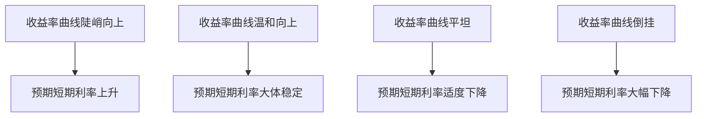

# 8.7 收益率曲线的宏观含义

来源：

- 主线：Mishkin《货币金融学》Ch.5, Ch.6
- 补充：Mishkin/Eakins Ch.4, Ch.5

## 为什么收益率曲线不只是债券图表

收益率曲线表面上只是不同期限债券利率的连线，实际上包含了市场对未来经济的判断。因为长期利率与未来短期利率预期有关，而未来短期利率又与货币政策、通胀和经济周期有关。

当收益率曲线陡峭向上时，长期利率明显高于短期利率。市场可能预期未来短期利率上升，也可能认为未来经济和通胀压力增强。当收益率曲线平坦或倒挂时，长期利率接近或低于短期利率，市场可能预期未来短期利率下降，通常与经济放缓或货币政策将来转向宽松有关。

因此，收益率曲线常被经济预测者、央行观察者和金融市场参与者用作宏观信号。它不是完美预测工具，但它把大量投资者对未来利率、通胀和经济活动的预期浓缩在一条曲线里。

## 收益率曲线首先反映未来短期利率预期

根据流动性溢价理论，长期利率等于未来短期利率预期平均值，加上一个通常为正的期限溢价。因此，收益率曲线斜率包含市场对未来短期利率路径的看法。

如果曲线陡峭向上，说明长期利率比短期利率高很多。考虑到期限溢价本来会让长期利率略高，陡峭上升通常表示市场预期未来短期利率会上升。

如果曲线温和向上，可能表示未来短期利率大体稳定。长期利率略高，主要来自期限溢价。

如果曲线平坦，说明市场预期未来短期利率可能适度下降。因为正的期限溢价本应让长期利率高于短期利率，若二者差不多，说明预期短期利率下降抵消了期限溢价。

如果曲线倒挂，说明市场预期未来短期利率可能大幅下降。只有未来短期利率预期平均值显著低于当前短期利率，才可能在加上期限溢价后仍低于当前短期利率。



这套读法不能机械使用，因为期限溢价本身也会变化。但它提供了理解曲线斜率的基本语言。

## 为什么曲线能预测商业周期

短期利率和经济周期有密切关系。经济扩张强劲、通胀压力上升时，短期利率往往较高或预期会上升。经济放缓或衰退风险上升时，市场常预期央行未来会降低短期利率以支持经济。

因此，收益率曲线会反映商业周期预期。

当收益率曲线陡峭向上时，市场可能预期未来经济活动增强，短期利率将上升。这种情形常与宽松货币政策后的复苏预期有关：当前短期利率较低，但未来经济恢复后利率可能回升。

当收益率曲线平坦或倒挂时，市场可能预期未来短期利率下降。短期利率下降通常与经济放缓、衰退风险或未来货币政策宽松有关。因此，平坦或倒挂收益率曲线常被视为经济走弱的信号。

这并不是说收益率曲线能精确告诉我们衰退何时发生，也不是说每次倒挂都必然马上衰退。它的含义是：债券市场价格中包含了对未来短期利率和经济活动的集体预期，而这些预期与商业周期有关。

## 曲线也包含通胀信息

名义利率可以分解为实际利率和预期通胀。长期名义利率反映未来多年实际利率和通胀预期的综合。收益率曲线因此也包含未来通胀信息。

如果收益率曲线很陡，可能表示市场预期未来短期名义利率上升，而名义利率上升可能来自实际利率上升，也可能来自预期通胀上升。若经济扩张、需求强劲、货币政策宽松，通胀预期可能上升，长期利率会受到推高。

如果收益率曲线平坦或倒挂，可能表示市场预期未来名义短期利率下降，其中可能包含通胀下降或经济活动减弱的预期。

不过，不能只凭曲线形状直接判断通胀。长期利率还受期限溢价、风险偏好、安全资产需求、央行资产购买和全球资本流动等因素影响。本节只保留教材主线：收益率曲线包含未来名义利率信息，而名义利率又包含预期通胀，因此曲线有助于判断通胀趋势。

## 曲线和货币政策姿态

收益率曲线也常被用来观察货币政策姿态。

短期利率受中央银行政策影响较大。若央行把短期政策利率维持在较低水平，而市场预期未来经济恢复、短期利率会上升，收益率曲线可能陡峭向上。这常被理解为货币政策较宽松。

如果短期利率较高，而长期利率没有同步上升，收益率曲线会变平甚至倒挂。这可能表示当前货币政策较紧，市场预期未来经济放缓、央行最终降息。

可以这样概括：

| 曲线形状 | 常见宏观解读 |
| --- | --- |
| 陡峭向上 | 当前短期利率低，未来利率可能上升；政策较宽松或经济复苏预期较强 |
| 平坦 | 市场预期未来短期利率下降一些；政策可能偏紧或经济动能减弱 |
| 倒挂 | 市场预期未来短期利率明显下降；衰退风险或未来宽松预期上升 |

这些解读必须结合当时通胀、央行沟通、财政政策和金融风险。收益率曲线是重要信号，不是单独决策规则。

## 为什么期限溢价会让解读更复杂

如果长期利率只等于未来短期利率平均值，收益率曲线读起来会很简单。但流动性溢价理论告诉我们，长期利率还包含期限溢价。

期限溢价可能变化。若投资者突然更不愿持有长期债券，要求更高补偿，长期利率会上升，曲线变陡。这种变陡不一定表示未来短期利率预期上升，也可能只是期限风险补偿上升。

相反，如果投资者强烈需求长期安全资产，长期债券价格上升、长期利率下降，曲线可能变平。这不一定完全表示未来短期利率预期下降，也可能反映安全资产需求增强或长期债券供需变化。

因此，解释收益率曲线时要把它拆成两部分：

```text
长期利率 = 未来短期利率预期平均值 + 期限溢价
```

曲线变化可能来自预期变化，也可能来自期限溢价变化。教材强调收益率曲线包含预测信息，但也提醒其预测能力并不在所有期限和所有时期都稳定。

## 收益率曲线作为预测工具的限制

收益率曲线有用，但不完美。

第一，它反映的是市场预期，而市场预期可能错误。投资者会根据现有信息定价，但未来政策、战争、疫情、金融危机、技术变化都可能改变经济路径。

第二，期限溢价会波动。如果期限溢价大幅变化，曲线斜率就不再只反映未来短期利率预期。

第三，不同期限的信息含量不同。研究发现，期限结构对很短期和较长期的未来利率变化可能包含较多信息，但对中间期限预测并不总是可靠。

第四，央行政策和金融监管可能改变收益率曲线形状。例如央行购买长期债券，会直接影响长期利率；监管要求金融机构持有安全资产，也可能改变长期债券需求。

因此，收益率曲线应当与其他指标一起使用，如通胀数据、就业、产出、信用利差、金融条件和央行政策信号。

资产需求、债券供求、预期通胀、商业周期、货币市场、风险结构和期限结构，都会进入收益率曲线。曲线的水平受总体利率环境影响，曲线的不同期限受未来短期利率预期和期限溢价影响，曲线与信用利差一起反映风险和宏观预期。

如果你看到“十年期国债收益率上升”，要问：是未来短期利率预期上升，还是期限溢价上升，还是通胀预期上升？如果你看到“收益率曲线倒挂”，要问：市场是否预期未来短期利率下降？这是否来自经济衰退风险？期限溢价是否发生变化？

这样，收益率曲线就不再是一张市场图，而是理解宏观金融环境的入口。

## 小结

收益率曲线有宏观含义，因为长期利率包含未来短期利率预期和期限溢价。陡峭向上的曲线通常表示市场预期未来短期利率上升；温和向上的曲线可能表示短期利率大体稳定；平坦曲线通常表示预期短期利率适度下降；倒挂曲线通常表示预期短期利率大幅下降。

由于短期利率与货币政策、通胀和商业周期相关，收益率曲线可以帮助预测经济活动和通胀。平坦或倒挂曲线常被视为经济放缓或未来降息预期的信号，陡峭曲线常与宽松政策或复苏预期相关。

但收益率曲线不是完美预测工具。期限溢价会变化，市场预期可能错误，央行政策和安全资产需求也会影响曲线形状。正确使用收益率曲线，需要把它与本章的资产需求、债券供求、风险结构和期限结构理论结合起来。

## 自测问题

- 为什么收益率曲线包含未来短期利率预期？
- 陡峭向上的收益率曲线通常意味着什么？
- 为什么倒挂收益率曲线常被视为经济放缓信号？
- 收益率曲线为什么也包含通胀信息？
- 期限溢价变化为什么会让曲线解读更复杂？
- 使用收益率曲线预测宏观经济时有哪些限制？
