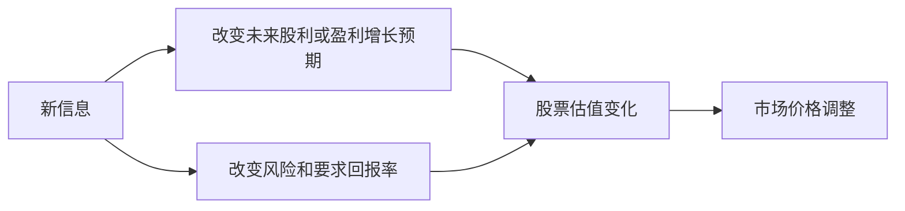

# 9.4 股票价格如何反映预期

来源：

- 主线：Mishkin《货币金融学》Ch.7
- 补充：Mishkin/Eakins Ch.6, Ch.13

## 股票价格为什么不断变化

股票价值来自未来现金流的现值。未来现金流包括股利和未来卖出价格，而这些又取决于公司盈利、增长、风险和投资者要求回报率。只要人们对这些因素的看法变化，股票价格就会变化。

股票价格每天波动，并不一定是公司当天真实经营发生了巨大变化。更常见的是，新信息改变了市场对未来的预期。一个盈利公告、行业政策、利率决定、疫情消息、技术突破、诉讼风险或管理层变化，都可能改变投资者对未来现金流和风险的判断。

因此，股票价格不是只反映过去，也不是只反映当前利润。它主要反映市场对未来的看法。

## 价格由愿意出最高价的买方决定

可以用拍卖理解资产价格。假设两个人都想买同一辆二手车。你试驾后听到异响，担心维修成本，认为最多值 20000 美元。另一位买方知道异响只是刹车片磨损，维修成本很低，因此认为车值 22000 美元。

竞价时，你出到 20000 美元就停止。另一位买方愿意出更高价格，最终以略高于你最高出价的价格买到车。

这个例子说明三点。

第一，市场价格由愿意支付最高价格的买方推动。价格不一定等于资产在所有人眼中的价值，而是由边际上最愿意持有它的人决定。

第二，能更好使用资产的人通常愿意支付更高价格。二手车买方如果能低成本修好问题，车对他更有价值。企业收购另一家公司时，也可能因为相信自己能更有效使用目标公司的资产而支付溢价。

第三，信息会影响估值。更了解资产状况的人，对未来现金流和风险判断不同，愿意支付的价格也不同。

## 信息如何改变股票估值

把二手车例子换成股票。假设某股票预计下一年股利为 2 美元，长期股利增长率为 3%。不同投资者对未来股利稳定性和公司风险的判断不同，因此要求回报率不同。

如果你觉得不确定性较高，要求 15% 回报，用戈登增长模型估值：

```text
P0 = 2 / (0.15 - 0.03) = 16.67
```

另一位投资者更了解行业，觉得风险较低，要求 12% 回报：

```text
P0 = 2 / (0.12 - 0.03) = 22.22
```

第三位投资者掌握更多可靠信息，认为风险更低，只要求 10% 回报：

```text
P0 = 2 / (0.10 - 0.03) = 28.57
```

同样一组预期股利和增长率，仅仅因为风险判断不同，估值就从 16.67 到 28.57。若市场上只有这些买方，股票价格会由愿意支付最高价格的人推动。

这个例子说明，信息通过两个渠道影响股票价格：改变对未来现金流的预期，或改变对这些现金流风险的判断。

## 新信息进入价格的两条路径

第一条路径是现金流预期。若新信息说明公司未来销售更强、成本更低、市场份额更高，投资者会提高未来股利或盈利增长预期。股票价格上升。相反，若新信息说明未来利润下降，价格下跌。

第二条路径是要求回报率。若新信息降低不确定性，投资者要求较低风险补偿，折现率下降，股票价格上升。若新信息提高风险，要求回报率上升，股票价格下降。



这解释了为什么同一条消息可能产生很大价格反应。它不只是影响今年利润，还可能改变未来多年增长路径和风险判断。

## 货币政策如何影响股票价格

货币政策是影响股票价格的重要因素。用戈登增长模型可以清楚看到原因：

```text
P0 = D1 / (ke - g)
```

当中央银行降低利率时，债券等替代资产收益下降。股票投资者可能愿意接受较低权益要求回报率 `ke`。`ke` 下降，分母变小，股票价格上升。

同时，较低利率可能刺激经济活动，降低企业融资成本，提高消费和投资需求。企业未来利润和股利增长率 `g` 可能上升。`g` 上升也会使分母变小，推高股票价格。

因此，宽松货币政策可能通过两个渠道推高股票价格：降低要求回报率，提高未来增长预期。

反过来，紧缩货币政策可能提高债券收益和融资成本，降低未来增长预期，并提高股票要求回报率，从而压低股票价格。

## 疫情冲击为什么会导致股价暴跌

重大宏观冲击可以用同样框架理解。疫情扩散导致经济封锁和社交距离措施，企业收入前景急剧恶化。投资者下调公司未来盈利和股利增长预期，也就是降低 `g`。

同时，不确定性上升。投资者不清楚疫情持续多久、企业能否生存、信用风险是否扩散，于是要求更高风险补偿，`ke` 上升。

在戈登增长模型中，`g` 下降和 `ke` 上升都会使 `ke - g` 变大，股票价格下降。若这两个变化同时发生，价格下跌会非常剧烈。

这个例子说明，股票市场下跌不只是“情绪不好”。它可以来自对未来现金流下调，以及对风险补偿上调。市场价格把这些预期变化迅速反映出来。

## 价格反映预期，但预期可能不同

不同投资者拥有不同信息、不同模型、不同风险承受能力，因此会形成不同估值。市场价格不是所有人估值的简单平均，而是在交易中形成的结果。

愿意买入的人认为价格相对低，愿意卖出的人认为价格相对高。交易发生后，价格不断调整，直到边际买方和边际卖方的判断达到某种平衡。

这也解释了为什么新信息会引起交易。好消息公布后，一些投资者上调估值，愿意以更高价格买入；坏消息公布后，一些投资者下调估值，愿意以更低价格卖出。价格变化是预期重新协调的结果。

## 小结

股票价格反映市场对未来现金流和风险的预期。价格不是只由过去利润决定，而是由投资者对未来股利、盈利增长、卖出价格和要求回报率的判断决定。

资产价格可以用拍卖直觉理解：价格由愿意支付最高价格的买方推动，而信息更充分、能更好使用资产或承担更低风险的人，往往愿意支付更高价格。新信息会通过改变未来现金流预期或风险判断来影响股票价格。

货币政策、宏观冲击和公司消息都可以通过估值模型进入价格。利率下降可能降低权益要求回报率并提高增长预期，从而推高股票；疫情等冲击可能降低增长预期并提高风险补偿，从而压低股票价格。

## 自测问题

- 股票价格为什么主要反映未来预期，而不是只反映过去利润？
- 二手车拍卖例子说明了资产定价的哪三点？
- 信息如何通过现金流预期影响股票价格？
- 信息如何通过要求回报率影响股票价格？
- 货币政策为什么会影响股票价格？
- 为什么重大不确定性上升会压低股票估值？
