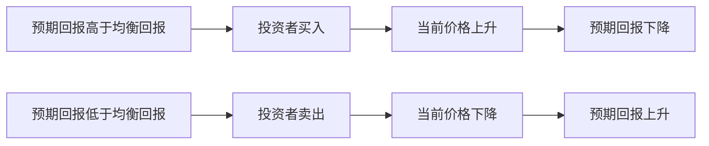

# 9.5 理性预期与有效市场假说

来源：

- 主线：Mishkin《货币金融学》Ch.7
- 补充：Mishkin/Eakins Ch.6, Ch.13

## 为什么股票市场离不开预期

股票价格取决于未来股利、未来卖出价格、增长率和风险。这些变量都发生在未来，因此股票市场本质上是一个预期市场。投资者买卖股票时，不只是在评价公司现在怎样，而是在预测公司未来会怎样。

问题是：预期怎样形成？如果人们只是机械地根据过去推测未来，股票价格会比较迟缓地反映变化。如果人们会利用所有可得信息，并在新信息出现时迅速调整判断，股票价格就会更快变化。

理性预期理论正是为了说明人们怎样形成预期。把理性预期用于金融市场，就得到有效市场假说。

## 适应性预期：只看过去的局限

早期分析常把预期看成由过去经验形成。例如，若过去通胀一直是 5%，人们就预期未来通胀也是 5%；若通胀升到 10%，人们预期会慢慢从 5% 调整到 10%。这种看法称为**适应性预期**。

适应性预期有直观吸引力。人们确实会从过去经验学习。但它的问题是，现实中的人不会只看过去一个变量。预期通胀时，人们会看货币政策、财政政策、能源价格、央行声明和经济数据。预期股票价格时，人们会看公司盈利、行业竞争、利率、政策、技术变化和风险。

如果新信息很重要，人们也可能迅速改变预期，而不是缓慢调整。只看过去数据，会低估信息和政策变化对预期的影响。

## 理性预期：用所有可得信息作最优预测

**理性预期**认为，预期应当等于使用所有可得信息形成的最优预测。这里的“理性”不是说人永远正确，也不是说每个人都拥有全部真相，而是说人在形成预期时不会系统性忽略有用信息。

可以用通勤时间理解。某人平时非高峰期上班平均需要 30 分钟，高峰期平均多花 10 分钟。如果他知道自己今天高峰期出发，最优预测就是 40 分钟。若他仍预期 30 分钟，就没有使用已知信息。

但即使预期 40 分钟，也不保证每天都准确。某天红灯多，实际可能 45 分钟；另一天一路顺畅，可能 35 分钟。理性预期要求预测在可得信息下是最好的，不要求每次完全正确。

如果路上发生严重事故，但他没有办法知道，40 分钟预期仍可能是理性的。若广播已经报告事故而他没有听或听了不管，仍预期 40 分钟就不再理性。理性预期的关键，是使用所有可得且相关的信息。

## 理性预期的两个含义

理性预期有两个重要含义。

第一，如果一个变量的运动方式改变，人们形成预期的方式也会改变。假设利率过去总是回到正常水平，那么当今天利率很高时，合理预期是未来会下降。若经济环境改变，高利率变得会持续很久，那么合理预期也会随之改变，不再机械认为利率一定下降。

第二，预测误差平均应为零，并且不能被提前预测。预测误差是实际结果和预期之间的差额。如果某人每天平均低估通勤时间 5 分钟，他很快会发现自己总迟到，然后把预期提高 5 分钟。调整后，误差不应再系统性偏向一边。

在金融市场中，这个激励更强。预测更好的人能赚钱，预测系统性错误的人会亏钱。利润和亏损推动投资者不断使用信息、修正预期。

## 有效市场假说：理性预期用于证券价格

**有效市场假说**认为，证券价格充分反映所有可得信息。它可以看作理性预期在金融市场中的应用。

对一只证券来说，持有期回报包括现金支付和价格变化：

```text
回报率 = (期末价格 - 期初价格 + 现金支付) / 期初价格
```

期初价格和当期现金支付通常已知，真正不确定的是未来价格。若市场预期是理性的，未来价格预期就是使用所有可得信息作出的最优预测。市场价格会调整到这样一个水平：证券的预期回报等于其风险和流动性所要求的均衡回报。

换句话说，如果某只股票在当前价格下预期回报明显高于它应有的均衡回报，就存在未被利用的盈利机会。投资者会买入，推高当前价格，使预期回报下降。若预期回报低于均衡回报，投资者会卖出，压低当前价格，使预期回报上升。

这个过程会持续到：

```text
使用所有可得信息预测的回报 = 该证券的均衡回报
```

这就是有效市场的核心。

## 套利为什么会消除明显盈利机会

有效市场假说的直觉基础，是套利或寻找未被利用盈利机会的行为。

假设某股票按当前价格计算，最优预测年回报为 50%，但按照它的风险特征，正常均衡回报只有 10%。这意味着股票太便宜，存在异常高收益机会。投资者会买入这只股票，买入需求推高当前价格。当前价格升高后，未来同样价格预期对应的回报下降，直到异常收益消失。

反过来，若某股票最优预测回报为 -5%，但均衡回报应为 10%，说明它太贵。投资者会卖出，当前价格下降。当前价格下降后，未来价格相对于当前价格的预期回报上升，直到回到均衡回报。



重要的是，有效市场并不要求所有人都聪明或信息充分。只要有少数资金充足、信息敏锐的投资者寻找盈利机会，他们的交易就会推动价格反映信息。

## 随机游走：可预测的价格变化会被交易掉

有效市场假说有一个著名含义：股票价格近似随机游走。随机游走不是说价格没有原因，而是说在已知今天信息后，未来价格变化无法被系统预测。

假设所有人都能预测某股票下周会上涨 1%。那就意味着现在买入可以获得异常高收益。投资者会立刻买入，把今天价格推高。今天价格上升后，下周可预测涨幅被消除。最终，价格不会留下“人人都能看见的确定上涨机会”。

若所有人都能预测某股票下周会下跌 1%，投资者会立刻卖出，使今天价格下降。下降后，未来可预测跌幅也被消除。

因此，在有效市场中，价格变化主要来自新的、未预期的信息。既然真正的新信息事先不可预测，由新信息引起的价格变化也不可预测。

## 小结

理性预期认为，人们会利用所有可得信息形成最优预测，但最优预测不等于每次准确。预测误差应平均为零，且不能被系统提前预测。若变量运动方式改变，预期形成方式也会改变。

有效市场假说把理性预期应用到金融市场：证券价格充分反映所有可得信息。价格会调整到使证券预期回报等于其风险和流动性所要求的均衡回报。若存在明显异常收益机会，投资者买卖会迅速消除它。

有效市场假说推出股票价格近似随机游走。可预测的价格变化会被交易行为提前反映到当前价格中，剩下的价格变化主要来自不可预测的新信息。

## 自测问题

- 适应性预期和理性预期有什么区别？
- 理性预期为什么不要求预测每次都准确？
- 预测误差为什么不能系统性可预测？
- 有效市场假说怎样把理性预期应用到证券价格？
- 为什么未被利用的盈利机会会被交易消除？
- 随机游走为什么是有效市场假说的自然结果？
