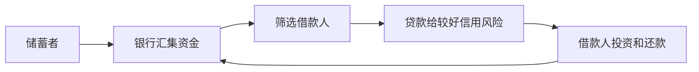

# 10.4 逆向选择、柠檬问题与筛选机制

来源：

- 主线：Mishkin《货币金融学》Ch.8
- 补充：Mishkin/Eakins Ch.7
- 延伸：Bodie/Kane/Marcus《Investments》Ch.11, Ch.18

## 柠檬问题为什么会破坏市场

逆向选择最经典的例子是二手车市场的“柠檬问题”。柠檬指质量差的车。买方很难判断一辆二手车到底是好车还是坏车，卖方却更了解真实质量。

如果买方无法区分质量，只愿意支付反映平均质量的价格。这个价格对坏车卖方很划算，因为高于坏车真实价值；但对好车卖方不划算，因为低于好车真实价值。结果是，好车卖方退出市场，坏车更多留下。

买方看到市场平均质量下降，会进一步压低愿意支付的价格。市场可能越变越差，交易大幅减少。问题不在于没有好车，而在于买方无法识别好车，导致好车难以获得公平价格。

这个逻辑同样适用于金融市场。

## 证券市场中的柠檬问题

投资者购买股票或债券时，也面临类似问题。企业管理者比外部投资者更了解公司真实质量。投资者如果无法区分好公司和坏公司，只能按平均质量出价。

对好公司来说，这个平均价格太低。管理层知道公司前景好，不愿以被低估的价格发行股票或债券。对坏公司来说，平均价格反而偏高，它们更愿意发行证券。

结果是，证券市场中更积极融资的可能是低质量企业。投资者意识到这一点后，会更加谨慎，甚至不愿购买证券。好企业也难以通过市场获得资金。

债券市场中类似。投资者若无法区分好坏借款人，会要求能补偿平均违约风险的高利率。好公司觉得利率太高，不愿借；坏公司愿意借。投资者担心留下来的多是坏公司，可能减少购买债券。

这解释了为什么公开证券市场不是企业外部融资的唯一或主要渠道，也解释了为什么股票融资并没有想象中重要。

## 私人信息生产的作用

解决逆向选择的直接办法，是增加信息。若投资者能区分好公司和坏公司，就愿意给好公司合理价格，好公司也愿意进入市场。

一种办法是私人机构生产和出售信息。评级机构、投资研究公司、财务分析机构可以收集企业资产、负债、利润、现金流和经营信息，帮助投资者判断企业质量。

如果投资者购买信息后能发现被低估的好公司，就可以通过投资获利。信息生产者也能通过出售报告获利。

但私人信息生产面临免费搭车问题。假设你花钱买到一份高质量研究报告，知道某家公司被低估。你开始买入，其他投资者看到你的行动后也跟着买入，即使他们没有为信息付费。大量跟买会迅速推高价格，让你的信息利润消失。

如果购买信息的人无法独享收益，就不愿付费。信息生产者也难以收回成本。结果是，市场私人信息生产不足，逆向选择仍然存在。

## 政府信息披露监管

由于私人信息生产不足，政府可以通过监管提高信息披露。证券监管机构要求发行证券的公司按标准会计原则披露财务信息，接受独立审计，并公开销售、资产、利润等数据。

信息披露监管降低投资者识别企业质量的成本，有助于缓解逆向选择。若公司必须披露真实财务状况，坏公司更难伪装成好公司，好公司也更容易获得合理价格。

但监管不能完全消除信息不对称。公司管理层仍然比外部投资者知道更多。坏公司也有动机修饰披露信息，使自己看起来更好。安然等会计丑闻说明，即使存在监管和审计，企业仍可能通过复杂交易隐藏债务和风险。

因此，政府监管可以减轻柠檬问题，但不能根除它。

## 金融中介怎样解决逆向选择

金融中介尤其是银行，可以更有效地处理逆向选择。银行专门生产借款人信息，筛选好坏信用风险，然后把资金贷给较可靠借款人。

银行与普通投资者不同。它发放的是私人贷款，不是在公开市场上买卖的证券。其他投资者无法通过观察银行买了什么证券来免费搭车。银行生产的信息不会立刻被市场价格公开消化，因此银行能从信息优势中获利。

这类似二手车经销商。经销商擅长识别好车和坏车，买入后再出售，并通过声誉或保修让买方放心。银行在信贷市场中扮演类似角色：识别好借款人，提供贷款，并通过利差获得收益。

这解释了为什么间接融资和银行贷款重要。金融中介通过信息生产缓解逆向选择，让资金能够流向证券市场难以服务的企业。

## 大企业为什么更容易直接融资

逆向选择还解释了为什么大型成熟企业更容易进入证券市场。

大企业经营历史长，财务报表多，媒体、分析师和评级机构关注度高。投资者更容易获得信息，判断企业质量。信息不对称较小，投资者更愿意直接购买其证券。

小企业和新企业信息少、经营记录短、前景不确定。外部投资者难以判断其质量，因此更依赖银行贷款、风险投资或私人融资。

这形成一种融资层级：信息越透明、声誉越强的企业，越能使用公开证券市场；信息越不透明、规模越小的企业，越依赖金融中介。

风险投资和私募股权正是这种逻辑下的信息密集型中介。创业企业通常没有稳定利润、没有长期信用记录，也没有可供公开市场定价的大量信息；风险投资机构通过尽职调查、分阶段投资、董事会席位、可转换优先股和清算优先权来筛选和保护自己。它们投资的不是“市场已经看清楚的资产”，而是公开市场暂时难以评估、但可以通过专业筛选和治理改善的信息不透明资产。

## 抵押品和净值怎样缓解逆向选择

抵押品也能减轻逆向选择。贷款人担心借款人质量不好，是因为违约会造成损失。若借款人提供抵押品，即使违约，贷款人也可以出售抵押品弥补损失。

例如，住房贷款以房屋作为抵押。若借款人不还款，贷款人可以取得房屋并出售。抵押品降低贷款人的损失，因此贷款人更愿意发放贷款。

净值也有类似作用。净值是企业资产减去负债后的差额。净值高说明企业有更多自有资本作为缓冲，也说明企业违约时仍有资产可供贷款人追索。净值越高，贷款人越愿意借款。

这解释了常见现象：越不缺钱的人越容易借到钱。因为高净值和充足抵押品降低了贷款人的逆向选择损失。

## 小结

逆向选择会导致柠檬问题：信息较少的买方无法区分好坏质量，只愿支付平均价格，结果好质量退出、坏质量留下，市场萎缩。在证券市场中，投资者若无法区分好公司和坏公司，好公司不愿以低估价格发行证券，坏公司更愿意融资，市场运行受阻。

缓解逆向选择的工具包括私人信息生产、政府信息披露监管、金融中介、抵押品和净值。私人信息生产受到免费搭车问题限制；政府监管能提高披露但不能完全消除信息差；银行通过私人贷款避免免费搭车，专门筛选借款人；抵押品和高净值降低贷款人违约损失。

## 自测问题

- 二手车柠檬问题为什么会让好车退出市场？
- 证券市场中的柠檬问题如何发生？
- 私人信息生产为什么会受到免费搭车问题限制？
- 政府信息披露监管能解决什么问题？为什么不能完全解决？
- 银行为什么比公开证券市场更适合处理部分逆向选择？
- 抵押品和净值如何缓解逆向选择？
- 风险投资为什么适合融资信息不透明的创业企业？
