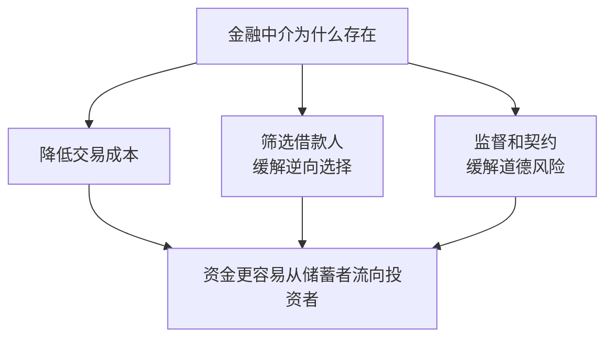

# 10.6 债务契约、抵押品与金融中介的价值

来源：

- 主线：Mishkin《货币金融学》Ch.8
- 补充：Mishkin/Eakins Ch.7
- 延伸：Bodie/Kane/Marcus《Investments》Ch.14, Ch.16

## 债务合同也有道德风险

债务合同减少了股权合同中的监督问题，但并不消除道德风险。债务合同规定借款人支付固定金额。若项目成功，超过还款额的收益归借款人；若项目失败，贷款人可能承担损失。

这种结构会鼓励借款人在拿到贷款后承担贷款人不喜欢的风险。借款人享有上行收益，贷款人承担较多下行损失。

假设你借给朋友 9000 元开冰淇淋店，约定利率 10%。冰淇淋店是稳健项目，按计划经营能还款。但朋友拿到钱后，可能改去投资一种高风险研发项目。若成功，他可能变成富翁；若失败，你的贷款可能收不回来。因为你只能按合同得到固定利息，即使研发成功也不能分享巨大收益，所以你不希望他这样冒险。

这就是债务市场中的道德风险。

## 抵押品和净值：让借款人有切身利益

降低债务道德风险的第一种工具，是提高借款人自己的损失风险。抵押品和净值都能做到这一点。

抵押品是借款人承诺给贷款人的财产。若借款人违约，贷款人可以取得或出售抵押品。借款人不愿失去房屋、汽车、设备或其他资产，因此更有动力按约还款并避免过度冒险。

净值是资产减去负债。借款人净值越高，自己投入项目的资本越多。若项目失败，借款人损失也更大。这样，借款人更像在用自己的钱经营，而不是只用别人的钱冒险。

这常被称为“有切身利益”。当借款人有足够自有资本或抵押品时，他的激励更接近贷款人：都希望项目稳健、贷款能偿还。

## 激励相容的债务合同

如果合同安排使借款人愿意采取贷款人希望的行为，就称为激励相容。抵押品和高净值使借款人承担更多风险后果，因此有助于实现激励相容。

借款人净值低、抵押品少时，道德风险更严重。因为失败时借款人损失有限，成功时却可能获得较大收益，他更有动力冒险。贷款人预见这种行为，会减少贷款或提高利率。

这解释了为什么经济下行时信贷可能收缩。企业资产价值下降、净值减少，抵押品价值也下降。即使投资项目本身仍有价值，贷款人也更担心道德风险和损失，放款意愿下降。

## 限制性契约：写进合同的行为约束

抵押品和净值还不够。贷款人还会在债务合同中写入**限制性契约**，约束借款人行为。限制性契约是合同条款，规定借款人可以做什么、不能做什么、必须维持什么条件。

限制性契约的目的，是降低借款人拿到钱后改变行为的风险。它们通常分为四类。

第一，禁止不受欢迎的行为。例如，规定贷款只能用于购买特定设备或存货，不得用于高风险收购或投机项目。

第二，鼓励有利行为。例如，要求企业维持最低净值或一定流动资产比例，要求家庭主要收入者购买人寿保险以保障房贷偿还。

第三，保护抵押品价值。例如，汽车贷款要求购买碰撞和盗窃保险，不得在贷款未清偿前出售汽车；住房贷款要求维持房屋保险并在出售房产时还清贷款。

第四，要求提供信息。例如，企业必须定期提供财务报表，允许贷款人检查账簿。信息披露使贷款人更容易监督借款人。

| 契约类型 | 目的 |
| --- | --- |
| 禁止不良行为 | 防止资金用于高风险或不符合合同目的的项目 |
| 鼓励良好行为 | 保持借款人偿债能力和净值 |
| 保护抵押品 | 防止贷款保障物贬值或消失 |
| 提供信息 | 降低监督成本，及时发现问题 |

这解释了为什么债务合同往往很复杂。复杂条款不是装饰，而是为了减少道德风险。

在债券投资中，这些安排最终会进入价格。投资者要求的信用利差不只补偿预期违约概率，还补偿违约后的损失率、流动性不足、契约保护弱、抵押品价值不确定和系统性风险暴露。抵押品充足、契约强、信息披露及时的债务，通常风险溢价较低；契约宽松、债务结构复杂、抵押品变现困难的债务，即使票面利率较高，也可能隐藏更大的下行风险。

## 监督和执行仍然有成本

限制性契约只有被监督和执行时才有意义。若借款人违反契约而贷款人不检查、不处罚，条款就只是纸面文字。

监督和执行需要成本。贷款人要阅读财务报表、检查抵押品、审计账户、聘请律师，必要时还要诉讼。公开债券市场中，债券持有人很多，每个持有人都希望别人去监督，自己免费搭车。结果可能是监督不足。

这就是债券市场中的免费搭车问题。即使合同写得很完整，分散投资者也可能缺乏足够激励监督和执行。

## 银行为什么仍然重要

银行和其他金融中介可以更好地解决监督问题。银行发放私人贷款，贷款不在公开市场广泛交易，其他投资者难以免费搭车。银行自己承担贷款收益和损失，也能获得监督带来的好处。

因此，银行有动力审查借款人、设计契约、监督财务状况、要求抵押品并在违约时执行合同。相比公开债券市场中分散投资者，银行更适合处理信息不透明和需要持续监督的借款人。

这解释了为什么银行在企业融资中长期重要。银行不是简单转手资金，而是在生产信息、筛选项目、设计激励、监督行为和执行合同。

## 金融中介的价值总结

金融中介的价值可以从三方面理解。

第一，降低交易成本。通过规模经济和专业化，金融中介让小储蓄者和小借款人也能参与金融体系。

第二，解决逆向选择。金融中介生产私人信息，筛选好坏借款人，避免公开市场中的免费搭车问题。

第三，缓解道德风险。金融中介监督借款人，设计和执行限制性契约，要求抵押品和净值，使借款人激励更接近贷款人。

## 小结

债务合同虽然比股权合同减少监督需求，但仍有道德风险。借款人可能在拿到资金后选择更高风险项目，因为成功收益主要归自己，失败损失部分由贷款人承担。

抵押品和净值让借款人有更多切身利益，降低冒险激励。限制性契约通过禁止不良行为、鼓励良好行为、保护抵押品和要求信息披露来约束借款人。由于契约监督和执行有成本，公开债券市场会出现免费搭车问题。

银行等金融中介通过私人贷款避免免费搭车，能够筛选、监督、执行合同，因此在金融体系中具有核心价值。金融机构存在的根本原因，是降低交易成本并缓解信息不对称带来的逆向选择和道德风险。

## 自测问题

- 为什么债务合同仍然存在道德风险？
- 抵押品和净值为什么能降低借款人冒险激励？
- 什么是激励相容？
- 限制性契约主要有哪几类？
- 为什么限制性契约需要监督和执行？
- 金融中介在降低交易成本、逆向选择和道德风险方面分别有什么作用？
- 为什么债券投资者不能只看票面利率，还要看抵押品、契约和违约损失率？
