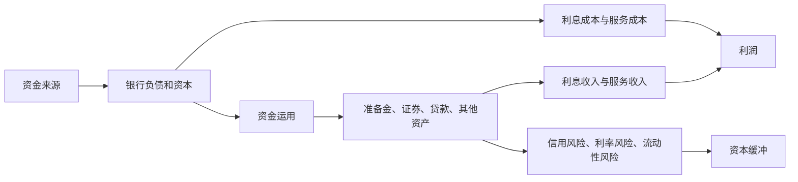

# 11.1 银行资产负债表

来源：

- 主线：Mishkin《货币金融学》Ch.9
- 补充：Mishkin/Eakins Ch.17
- 延伸：Bodie/Kane/Marcus《Investments》Ch.14, Ch.18

理解银行，不能从“银行是什么机构”这种抽象问题开始，而要先看一张表：银行的资产负债表。因为银行的经营几乎都可以翻译成资产负债表上的变化。吸收存款、发放贷款、持有证券、应对取款、补充资本、承担风险，最后都会落到“钱从哪里来”和“钱用到哪里去”这两个问题上。

资产负债表之所以叫“平衡表”，是因为它必须满足一个基本关系：

```text
总资产 = 总负债 + 银行资本
```

这个公式看起来像会计恒等式，但它背后正是银行经营的经济逻辑。负债和资本说明银行取得资金的来源，资产说明银行把这些资金用在了哪里。普通企业也有资产和负债，但银行的特殊之处在于：它的主要业务就是不断发行负债、购买资产，并从两者之间的收益差和服务收入中获得利润。

## 银行的负债：资金从哪里来

从银行自己的角度看，存款不是“银行的钱”，而是银行欠客户的钱。客户把钱存入银行后，客户拥有一项资产，因为这笔存款是客户财富的一部分；银行则承担一项负债，因为客户可以要求银行付款。这个视角很重要。生活中我们常说“银行有很多存款”，容易误以为存款是银行的资产。准确地说，存款是银行获得资金的一种方式，是银行的负债。

银行负债中最直观的一类是支票存款，也就是账户持有人可以开支票或通过类似方式向第三方付款的账户。它的特点是可以随时支取，银行必须在客户提出支付要求时履行付款义务。正因为支票存款非常便利，存款人愿意接受较低利息，甚至在某些时期接受零利息。对银行来说，这类存款通常是成本较低的资金来源。不过低利息不等于没有成本，银行还要承担账户维护、支付清算、人工服务、网点和系统运营等费用。

另一类重要负债是非交易存款。账户持有人通常不能直接用它开支票付款，但能获得比支票存款更高的利息。它包括储蓄账户和定期存款。储蓄账户的资金可以存入或取出，交易和利息记录会通过账单或存折反映。定期存款有固定期限，提前取出通常要支付罚息。大额定期存单还可以转让，因而类似一种短期债务工具，常被企业、货币市场基金和其他金融机构持有。

银行还可以通过借款取得资金。它可以向中央银行借款，也可以向其他银行、金融机构、企业或母公司借款。例如银行之间会在隔夜市场互相借出准备金，以满足支付和准备金需求。这里容易混淆的一点是，某些同业资金市场的名称看起来像“政府资金”，但实际借贷主体往往是银行和金融机构本身。

最后一项重要来源是银行资本。银行资本等于资产减去负债，也就是银行的净值。资本可以来自发行股票，也可以来自留存收益。资本不是银行“借来的钱”，而是所有者投入或银行积累下来的自有资金。它的作用像缓冲垫：如果贷款坏账或证券价值下跌，损失先冲减资本；只有当资产价值跌到低于负债时，银行才会资不抵债。

| 负债项目 | 对银行意味着什么 | 关键特征 |
| --- | --- | --- |
| 支票存款 | 银行欠客户的可随时支付款项 | 流动性高，利息成本较低，但服务成本存在 |
| 非交易存款 | 银行较稳定的资金来源 | 利息通常更高，不能直接开支票 |
| 借款 | 银行主动从外部融资 | 可用于补足准备金或扩大资产 |
| 银行资本 | 资产减负债后的净值 | 吸收损失，防止资不抵债 |

## 银行的资产：资金用到哪里去

银行取得资金后，会购买能带来收入或保证流动性的资产。资产是资金的用途。银行的利润主要来自资产端的利息收入，尤其是贷款和证券的利息。

第一类资产是准备金。准备金包括银行存在中央银行账户里的资金，以及银行金库中实际持有的现金。准备金收益通常较低，但银行仍然必须持有。原因有两个：一是监管可能要求银行按存款的一定比例持有法定准备金；二是银行需要额外准备金来应对客户取款或支票支付。额外准备金虽然牺牲收益，却提供最直接的流动性保障。

第二类资产是正在托收过程中的现金项目。假设客户把一张由别的银行账户开出的支票存入本银行，在资金真正从另一家银行转来之前，本银行拥有一项对另一家银行的索取权。这项索取权会在几天内变成可用资金，所以被记为资产。

第三类是存放在其他银行的存款。小银行常在大银行存放资金，以换取支票托收、外汇交易、证券购买协助等服务。这属于代理行关系的一部分。

第四类是证券。商业银行持有的证券通常是债务工具，例如政府债券、机构债券、地方政府债券和其他债券。政府和机构证券通常流动性强，容易以较低交易成本变现，因此短期政府证券常被称为二级准备金。它们不像准备金那样立即可用，但在需要现金时比较容易出售。地方政府和其他证券流动性较差、违约风险更高，因此需要更高收益来补偿风险。

第五类是贷款。银行的主要利润来源通常是贷款。贷款对借款人来说是负债，因为借款人要还本付息；对银行来说是资产，因为它带来利息收入。贷款往往比证券更不流动，因为银行不能随时无成本地把贷款变成现金；贷款也有更高违约风险。因此，银行通常能在贷款上获得较高收益。

最后还有其他资产，例如银行大楼、电脑设备和其他物理资本。这些资产支持银行运营，但通常不是银行主要收入来源。

| 资产项目 | 对银行的作用 | 流动性与收益特征 |
| --- | --- | --- |
| 准备金 | 满足支付和监管要求 | 流动性最高，收益较低 |
| 托收中现金项目 | 对其他银行的短期索取权 | 很快变现 |
| 存放同业款项 | 换取其他银行服务 | 兼具服务和流动性功能 |
| 证券 | 赚取利息，也可作为二级准备金 | 收益和流动性取决于证券类型 |
| 贷款 | 银行主要收入来源 | 收益较高，流动性较低，违约风险较高 |
| 其他资产 | 支持日常经营 | 通常不直接产生金融收益 |

## 同一笔钱，在客户和银行账上含义相反

银行资产负债表最容易让初学者困惑的地方，是同一笔金融工具在不同主体账上方向相反。客户的存款是客户的资产，却是银行的负债；客户的贷款是客户的负债，却是银行的资产。金融体系里所谓“资产”和“负债”不是物品本身的固定属性，而是取决于谁拥有索取权、谁承担付款义务。

例如，一个人把 100 美元存进支票账户。他拥有对银行的 100 美元索取权，所以资产增加；银行承诺在他取款或付款时支付 100 美元，所以负债增加。如果银行把这 100 美元中的一部分贷给企业，这笔贷款对企业是负债，对银行则是资产。

这也是银行经营为什么要同时看两边。只看负债，会看到银行从存款人和资金市场获得资金；只看资产，会看到银行把资金投向准备金、证券和贷款。两边合起来，才是银行的商业模式：以一种特征的负债取得资金，再持有另一种特征的资产。

## 资产负债表为什么是后面所有问题的起点

银行的每个经营问题，都能回到资产负债表。

客户集中取款时，银行的存款负债减少，准备金资产也减少。如果准备金不够，银行就要借款、卖证券、向中央银行借款，或者压缩贷款。银行想多赚钱时，会希望增加贷款和高收益证券，但这会降低流动性、增加风险。银行想更安全时，会增加资本和流动资产，但这可能降低股东收益。银行遭遇坏账时，贷款资产减少，资本被冲减。银行参与表外业务时，某些承诺不直接出现在资产负债表上，却可能在未来变成真实损失。

可以用一张简化图表示这种关系：



读懂资产负债表之后，银行就不再是一个模糊的“吸收存款、发放贷款”的机构，而是一组持续变化的索取权和付款义务。银行经营的核心问题也变得清楚：怎样用较低成本取得资金，怎样把资金放到较高收益但可控风险的资产上，怎样保留足够流动性和资本，以免一次冲击就使整个机构失去支付能力。

从投资者角度看，银行资产负债表也是分析银行股票和银行债券的起点。贷款质量、证券久期、存款稳定性、批发融资依赖和资本厚度，会共同决定银行未来利润、违约风险和估值。宏观上，许多金融周期也先表现为银行表内结构变化：资产端贷款扩张过快、负债端短期批发融资增加、资本相对资产变薄，往往意味着银行体系把更多信用风险和流动性风险积累到了资产负债表里。

## 小结

银行资产负债表把银行经营分成两面：负债和资本是资金来源，资产是资金用途。支票存款、非交易存款、借款和资本构成银行资金来源；准备金、托收中现金项目、同业存款、证券、贷款和其他资产构成资金用途。存款对客户是资产，对银行是负债；贷款对借款人是负债，对银行是资产。银行利润来自资产收益高于负债成本，但这种利润必须和流动性、违约风险、利率风险以及资本安全之间保持平衡。

## 自测问题

- 为什么客户存款对客户是资产，对银行却是负债？
- 银行资本为什么能防止银行因资产价值下跌而立即破产？
- 准备金和贷款同样是银行资产，为什么它们在收益和流动性上差别很大？
- 为什么说银行资产负债表是理解银行经营、监管和危机的起点？
- 投资者分析银行股票或债券时，为什么必须先看资产负债表结构？
