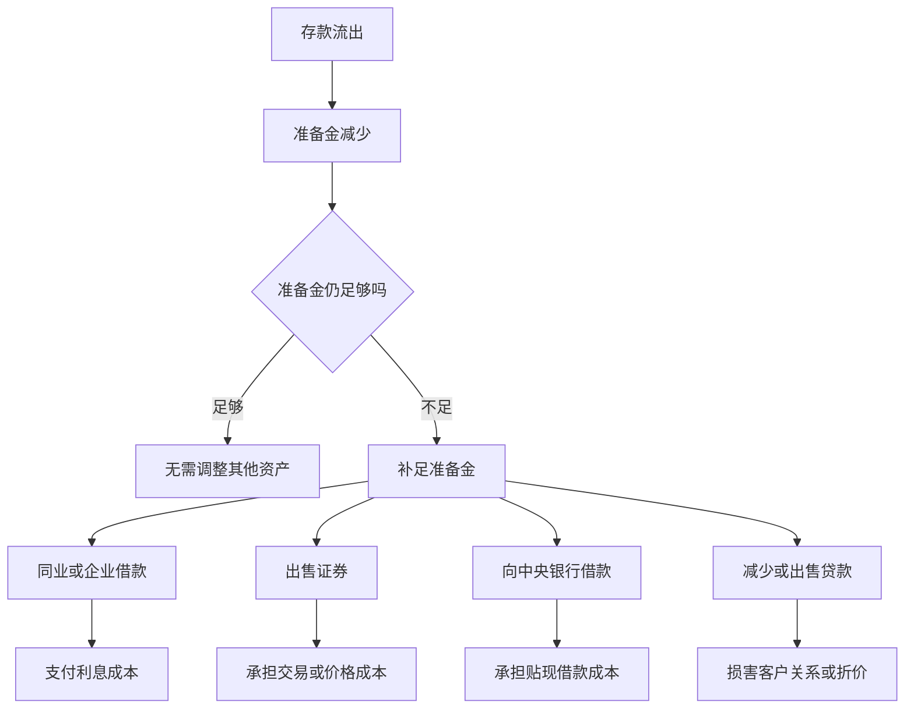

# 11.3 准备金、存款流出与流动性管理

来源：

- 主线：Mishkin《货币金融学》Ch.9
- 补充：Mishkin/Eakins Ch.17

银行最怕的日常问题之一，不一定是贷款马上违约，而是客户今天就要取钱。贷款可能一年后才到期，证券出售可能有成本，但存款人和收款银行要求支付时，银行必须马上拿出现金或准备金。这就是流动性管理要处理的问题：银行怎样保证自己在存款流出时仍能履行付款义务。

存款流出可以有两种形式。客户直接从账户取现金，银行准备金减少；客户写支票或电子付款给另一家银行的客户，准备金也会从本银行转到收款银行。无论形式如何，对本银行来说，结果通常是存款负债减少，同时准备金资产减少。

## 有超额准备金时，冲击可以被吸收

先看一个简化银行。First National Bank 初始资产负债表如下：

| First National Bank | 资产 | 负债和资本 |
| --- | ---: | ---: |
| 初始状态 | 准备金 2000 万，贷款 8000 万，证券 1000 万 | 存款 1 亿，银行资本 1000 万 |

假设所有存款适用 10% 的准备金率。存款为 1 亿美元时，法定准备金是 1000 万美元。银行实际持有准备金 2000 万美元，所以超额准备金是 1000 万美元。

现在发生 1000 万美元存款流出。客户取走或转走资金后，银行存款负债减少 1000 万美元，准备金资产也减少 1000 万美元：

| First National Bank | 资产 | 负债和资本 |
| --- | ---: | ---: |
| 存款流出后 | 准备金 1000 万，贷款 8000 万，证券 1000 万 | 存款 9000 万，银行资本 1000 万 |

此时法定准备金是 9000 万存款的 10%，即 900 万美元。银行仍有 1000 万美元准备金，仍高于要求。因此，它不需要出售证券、借款或收缩贷款。超额准备金像保险垫一样吸收了存款流出。

## 没有超额准备金时，同样流出会变成管理问题

再看另一种情况。假设银行一开始没有超额准备金，它把原本多余的 1000 万美元都贷出去了。初始状态变成：

| First National Bank | 资产 | 负债和资本 |
| --- | ---: | ---: |
| 初始状态 | 准备金 1000 万，贷款 9000 万，证券 1000 万 | 存款 1 亿，银行资本 1000 万 |

同样发生 1000 万美元存款流出后：

| First National Bank | 资产 | 负债和资本 |
| --- | ---: | ---: |
| 存款流出后 | 准备金 0，贷款 9000 万，证券 1000 万 | 存款 9000 万，银行资本 1000 万 |

现在银行需要为 9000 万美元存款持有 900 万美元准备金，但实际准备金为 0。它出现 900 万美元准备金缺口。银行没有破产，因为资产仍然大于负债；但它流动性不足，因为不能满足准备金要求和支付需要。

## 银行补足准备金的四种办法

面对 900 万美元准备金缺口，银行有四种基本选择。每一种都能解决问题，但成本不同。

第一，向其他银行或企业借入准备金。银行可以在同业市场借入资金，补足准备金缺口。这样资产端准备金增加 900 万美元，负债端增加同业或其他借款 900 万美元。成本是借款利息，例如同业隔夜资金利率。

第二，出售证券。银行可以卖出 900 万美元证券，把 proceeds 存入中央银行账户，变成准备金。短期政府证券流动性强，出售成本较低，因此常被称为二级准备金；但其他证券流动性较弱，出售时可能需要承担更高交易成本或价格损失。

第三，向中央银行借款。银行可以取得贴现贷款，准备金增加，同时负债端增加对中央银行的借款。成本是向中央银行支付的利率，也可能包含声誉或监管关注方面的顾虑。

第四，减少贷款。银行可以不续作到期贷款，或者把贷款卖给其他银行，从而把资金转成准备金。这通常是最昂贵的方式。若不续贷，客户可能认为银行突然收紧关系，未来转向别的金融机构。若出售贷款，买方不了解这些贷款的真实风险，可能要求折价，这就是信息不对称下“柠檬问题”的表现。

| 补足准备金方式 | 怎样改变资产负债表 | 主要成本 |
| --- | --- | --- |
| 向其他银行或企业借款 | 准备金增加，借款负债增加 | 支付市场利息 |
| 出售证券 | 证券减少，准备金增加 | 交易成本或价格损失 |
| 向中央银行借款 | 准备金增加，对央行借款增加 | 贴现借款成本 |
| 减少或出售贷款 | 贷款减少，准备金增加 | 损害客户关系，可能折价出售 |

## 为什么银行愿意持有低收益准备金

如果贷款和证券收益更高，银行为什么还要持有超额准备金？答案是：超额准备金是一种保险。它的收益较低，所以有机会成本；但它可以让银行在存款流出时避免更高成本。

这个逻辑和普通保险类似。一个人买保险，是因为愿意支付保费来避免意外损失。银行持有超额准备金，是因为愿意放弃部分贷款或证券收益，以避免突然取款时被迫高成本借款、低价卖证券、向中央银行借款，或者伤害客户关系地收缩贷款。

准备金越低，银行平时收益可能越高；但一旦资金流出，调整成本就越高。准备金越高，银行越安全；但闲置资金越多，盈利能力越弱。流动性管理就是在这两者之间权衡。

## 二级准备金的作用

银行除了持有超额准备金，还会持有流动性较强的证券，尤其是短期政府证券。这些证券不是准备金本身，但在需要资金时容易出售，交易成本较低，因此具有“二级准备金”的功能。

二级准备金让银行不必把所有流动性都放在低收益准备金中。银行可以持有一部分收益略高、但仍较容易变现的资产。这样既保留一定流动性，又减少完全闲置的机会成本。当然，二级准备金仍然不是无风险的完美现金替代物，出售时仍可能受市场价格和交易条件影响。

## 小结

流动性管理的核心问题是：当存款流出导致准备金减少时，银行能否低成本履行支付和准备金义务。若银行有足够超额准备金，存款流出可以被直接吸收；若准备金不足，银行必须借款、出售证券、向中央银行借款，或减少贷款。超额准备金和二级准备金收益较低，但能降低存款流出时的调整成本，因此像保险一样保护银行。

## 自测问题

- 为什么存款流出通常会同时减少银行负债和准备金资产？
- 有超额准备金和没有超额准备金时，同样的存款流出对银行有什么不同影响？
- 银行补足准备金的四种方式分别有什么成本？
- 为什么说超额准备金是一种有机会成本的保险？
