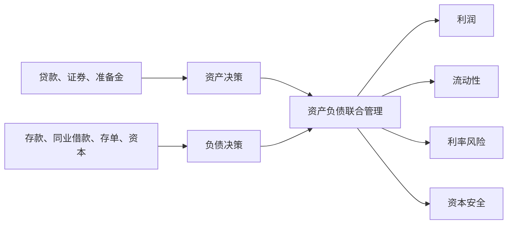

# 11.4 资产管理与负债管理

来源：

- 主线：Mishkin《货币金融学》Ch.9
- 补充：Mishkin/Eakins Ch.17
- 延伸：Bodie/Kane/Marcus《Investments》Ch.14, Ch.16

银行经理面对的任务不是单纯“多放贷款”或“多吸收存款”。银行要赚钱，必须同时管理资产端和负债端。资产端决定资金投向哪里、获得多少收益、承担多少风险、保留多少流动性；负债端决定资金从哪里来、成本多少、稳定性如何。现代银行经营把两边一起管理，原因就在于资产和负债并不是独立的。

如果银行发现一个很好的贷款机会，却没有资金来源，就无法放款；如果银行吸收了大量高成本资金，却找不到收益足够的资产，利润会被压缩；如果银行资产期限很长、负债期限很短，利率和流动性变化会放大风险。

## 资产管理的三个目标

银行资产管理首先要解决三个目标：尽可能提高收益、降低风险、保留足够流动性。

第一，银行要寻找愿意支付较高利率且违约概率较低的借款人。高利率本身不一定是好事，因为愿意支付很高利率的人可能正是风险很高的人。银行必须筛选借款人，判断其还款能力和还款意愿。贷款人员会审查借款人的收入、资产、负债、经营情况、抵押品和外部经济环境。商业贷款还要考察企业未来计划、行业竞争、资金用途和管理能力。

第二，银行要购买收益较高而风险较低的证券。证券通常比贷款更容易变现，但不同证券差异很大。短期政府证券流动性强、违约风险低，但收益较低；风险更高或流动性更弱的证券通常需要更高收益作为补偿。

第三，银行要分散风险。贷款集中在少数行业、少数地区或少数客户身上，会让银行暴露在同一冲击下。若一家银行过度集中于能源企业、房地产开发商或农业贷款，当能源价格、房地产价格或农产品价格下跌时，损失会同时出现。分散化并不能消除所有风险，但能避免“把太多鸡蛋放在一个篮子里”。

第四，银行还要保留足够流动性。这里看似和追求高收益矛盾。贷款收益高，但不易变现；准备金和短期政府证券收益低，却能应对存款流出。银行不能极端保守，把所有资产都放在准备金里；那样收入不足以覆盖负债和运营成本。它也不能极端激进，把资金全部放进高收益但不流动的贷款里；那样一旦出现存款流出，就可能被迫以高成本调整。资产管理就是在收益、风险和流动性之间找平衡。

| 资产管理目标 | 银行要做什么 | 如果忽视会怎样 |
| --- | --- | --- |
| 提高收益 | 寻找优质贷款和证券 | 资产收益不足，利润下降 |
| 控制信用风险 | 筛选、监督、分散贷款 | 坏账增加，资本被侵蚀 |
| 保持流动性 | 持有准备金和流动证券 | 存款流出时被迫高成本筹资 |
| 避免过度保守 | 不把资产全放在低收益项目 | 收入不足以覆盖成本 |

## 负债管理为什么后来变得重要

早期银行经营更强调资产管理，因为银行常把负债看成相对固定。原因主要有两个。

第一，过去支票存款占银行资金来源的大部分，而且很多时期不能支付利息。银行难以通过提高利息主动争夺这类存款，单个银行能获得多少存款很大程度上被动决定。第二，银行之间的隔夜资金市场并不发达，银行很少依靠从其他银行借款来满足准备金需求。

从 20 世纪 60 年代开始，大型银行开始更主动地管理负债。金融中心的大银行探索如何通过负债端快速取得准备金和流动性。隔夜资金市场扩张，可转让大额存单等工具发展，使银行能够更灵活地获得资金。

这种变化改变了银行管理方式。银行不再只是被动接受存款规模，然后在资产端寻找最佳配置；它们可以先设定资产增长目标，再主动发行负债来筹资。例如，一家大型银行看到有吸引力的贷款机会，可以发行可转让存单取得资金；如果出现准备金短缺，可以在同业市场借入资金，而不必马上出售资产或压缩贷款。

## 从“资产端优化”到“资产负债联合管理”

负债管理的发展，使银行经营变成两边共同决策。银行不能只问“买什么资产收益最高”，还要问“用什么资金支持这些资产最合适”。

如果银行用很短期、利率可变的负债支持长期固定利率贷款，一旦市场利率上升，负债成本可能很快上升，而资产收益仍固定，利润会被挤压。如果银行用稳定但成本较高的长期资金支持短期资产，流动性压力小一些，但收益可能不足。资产负债联合管理要同时考虑期限、利率敏感性、流动性和风险。

现代银行通常通过资产负债管理委员会统一考虑这些问题。它会评估贷款增长、证券组合、存款结构、批发融资、利率敏感性、流动性缺口和资本水平。这样做的原因不是增加管理形式，而是银行任何一边的变化都会影响另一边。

对银行证券投资者来说，资产负债联合管理决定了银行利差的稳定性。若银行大量持有长期固定利率资产，却用短期市场化负债融资，利率上升会同时打击利润表和资产估值；若银行资产负债期限匹配较好，净息差和资本就更不容易被利率冲击侵蚀。因此，投资银行股或银行债时，不能只看当前利润率，还要看资产和负债的重定价速度是否匹配。

## 高利润目标不能脱离约束

银行当然希望资产收益高、负债成本低。但如果只追求这个目标，银行会倾向于多发放高收益贷款、少持有准备金、用便宜但不稳定的资金来源支持资产。这会提高短期利润，却可能放大未来风险。

因此，银行管理有四个基本关切：第一，流动性管理，确保有足够现金或可迅速变现资产应对存款流出；第二，资产管理，在收益和信用风险之间权衡；第三，负债管理，以较低成本取得资金；第四，资本充足管理，决定银行需要多少资本来吸收损失并满足监管要求。

这四个关切彼此牵制。更多资本提高安全性，但可能降低股东回报；更多流动资产降低流动性风险，但会压低收益；更多贷款提高收入，但会增加信用风险和流动性压力；更多短期借款增强资金弹性，但也增加再融资风险。

## 小结

资产管理关注银行如何配置资金：寻找高收益且风险可控的贷款和证券，分散风险，并保持足够流动性。负债管理关注银行如何取得资金：过去银行较被动地接受存款，后来随着同业资金市场和可转让存单发展，银行能够更主动地筹资。现代银行必须进行资产负债联合管理，因为资产收益、负债成本、流动性、期限结构和利率风险相互影响。银行经营的目标不是单纯最大化某一项收益，而是在盈利、安全和流动性之间持续权衡。

## 自测问题

- 银行资产管理为什么不能只追求最高贷款利率？
- 为什么分散化对银行贷款组合很重要？
- 20 世纪 60 年代以后，负债管理为什么变得更主动？
- 资产负债联合管理要同时考虑哪些约束？
- 利率上升时，为什么资产负债重定价速度会影响银行估值？
