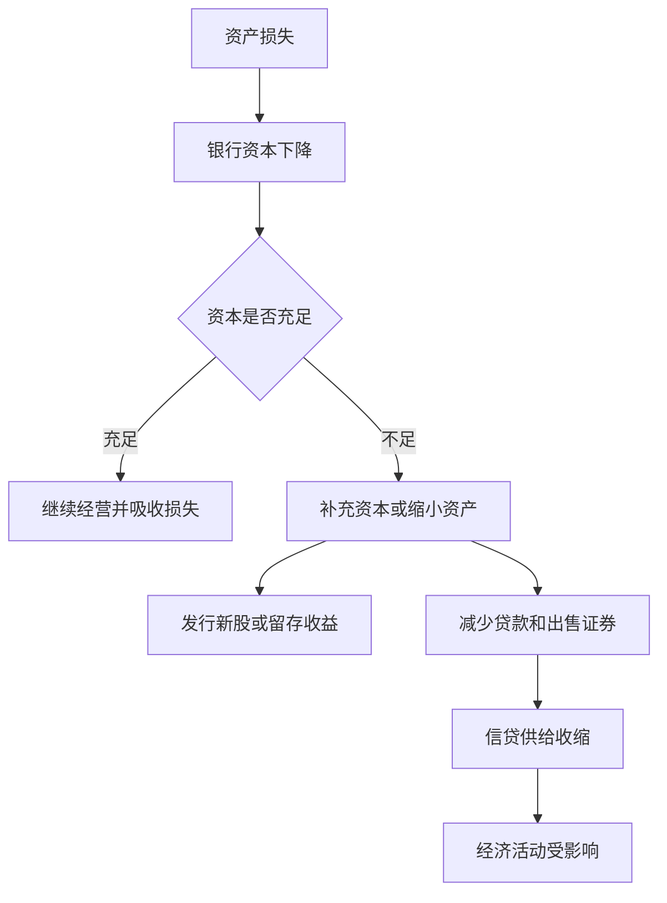

# 11.5 银行资本与资本充足

来源：

- 主线：Mishkin《货币金融学》Ch.9
- 补充：Mishkin/Eakins Ch.17
- 延伸：Bodie/Kane/Marcus《Investments》Ch.18, Ch.24

银行资本看起来只是资产负债表右侧的一项，但它决定银行能承受多大损失。银行吸收存款、借入资金、发放贷款、购买证券，这些活动都会带来风险。只要资产价值下降，损失就必须由某一方承担。资本的作用就是先由银行所有者承担损失，保护存款人和其他债权人，并降低银行倒闭的可能性。

资本充足管理要回答三个问题：资本为什么能防止银行失败？资本多少会怎样影响股东收益？为什么监管者要求银行持有最低资本？

## 资本怎样吸收损失

看两家简化银行。它们资产规模相同，都是 1 亿美元；资产结构也相同，1000 万美元准备金和 9000 万美元贷款。不同之处在于资本比例。

| 银行 | 资产 | 负债和资本 |
| --- | ---: | ---: |
| 高资本银行 | 准备金 1000 万，贷款 9000 万 | 存款 9000 万，资本 1000 万 |
| 低资本银行 | 准备金 1000 万，贷款 9000 万 | 存款 9600 万，资本 400 万 |

高资本银行资本占资产 10%，低资本银行资本占资产 4%。假设两家银行都经历住房贷款损失，其中 500 万美元贷款变成坏账。贷款资产减少 500 万，资本也要减少 500 万，因为负债仍要偿还。

| 银行 | 损失后资产 | 损失后负债和资本 |
| --- | ---: | ---: |
| 高资本银行 | 准备金 1000 万，贷款 8500 万 | 存款 9000 万，资本 500 万 |
| 低资本银行 | 准备金 1000 万，贷款 8500 万 | 存款 9600 万，资本 -100 万 |

高资本银行虽然受损，但仍有正资本 500 万美元，资产仍大于负债。低资本银行则出现负资本，资产低于负债，已经资不抵债。此时即使它还有准备金和贷款，也不足以偿还所有负债，监管者通常会关闭银行、处置资产并更换管理层。

这个例子说明资本不是装饰项，而是银行吸收资产损失的缓冲垫。资本越厚，同样规模的资产损失越不容易把银行推向破产。

## 资本越多越安全吗？是，但不是没有代价

如果资本能提高安全性，银行是否应该持有越多越好？从稳定性看，资本越多，银行越能承受损失。但从股东收益看，资本也有成本。

衡量银行经营效率的一个基本指标是资产收益率：

```text
ROA = 税后净利润 / 资产
```

资产收益率说明每一美元资产平均产生多少利润。它衡量银行资产使用得是否有效。

股东更关心的是权益收益率：

```text
ROE = 税后净利润 / 权益资本
```

权益收益率说明每一美元股东资本产生多少利润。ROA 和 ROE 之间由权益乘数连接：

```text
权益乘数 EM = 资产 / 权益资本
ROE = ROA × EM
```

如果两家银行经营效率相同，ROA 都是 1%，高资本银行资产 1 亿、资本 1000 万，权益乘数是 10，ROE 为 10%。低资本银行资产 1 亿、资本 400 万，权益乘数是 25，ROE 为 25%。在没有损失发生时，低资本银行股东获得更高回报，因为同样的资产利润由更少资本分享。

这就是资本管理的核心权衡：更多资本提高安全性，却会在给定 ROA 下降低 ROE；更少资本提高股东回报，却让银行更脆弱。

## 安全与股东回报之间的取舍

资本有明显好处：它降低银行倒闭概率，保护股东不至于在小规模损失后立刻被清零，也保护债权人和存款体系稳定。但资本也有机会成本：如果银行用更多股东资金支持同样资产，杠杆下降，股东收益率通常下降。

在经济更不确定、贷款损失可能上升时，银行管理者会倾向于持有更多资本。这样即使坏账增加，也有缓冲空间。相反，如果管理者相信贷款损失较低，可能希望降低资本比例、提高权益乘数，从而提高 ROE。

这种取舍不能只由银行自己决定。银行倒闭会影响存款人、支付体系和信贷供给，成本可能外溢到整个经济。因此监管者会设定最低资本要求，防止银行为了提高股东收益而把资本压得过低。

## 资本不足会导致信贷收缩

如果银行资本太多、股东认为 ROE 太低，银行可以减少资本比例。方法包括回购股票、提高分红减少留存收益，或在资本不变时扩大资产规模，例如发行存单筹资后增加贷款和证券。

如果银行资本太少，选择正好相反。它可以发行新股补充资本，可以降低分红增加留存收益，也可以在资本不变时缩小资产规模，例如减少贷款、卖出证券、用回收资金偿还负债。

资本不足时，发行新股未必容易。银行股价低迷时，新股发行代价高；降低分红也可能遭到股东反对。于是银行常选择缩小资产，尤其是压缩贷款增长。这样一来，资本问题就会变成信贷问题：银行为了恢复资本比例减少放贷，企业和家庭更难获得信用，经济活动受到拖累。

2007 年后金融危机中的信贷紧缩可以用这个逻辑理解。住房市场繁荣破裂后，银行持有的住房相关资产发生巨大损失，资本被冲减。资本短缺迫使银行要么补充资本，要么限制资产增长。由于经济疲弱时筹资困难，许多银行提高贷款标准、减少放贷。资本短缺于是传导为信贷紧缩，并进一步削弱经济。

这也是宏观经济、金融学和投资学交汇最明显的地方。银行资本不是单家银行的内部指标，而会影响经济中的信用供给；信用供给又影响企业投资、房地产需求、就业和资产价格。对投资者来说，银行资本充足率既是违约风险指标，也是未来 ROE 的约束：资本太少时，银行可能被迫缩表或增发稀释股东；资本很厚时，安全性较高，但杠杆回报可能下降。



## 小结

银行资本是资产减负债后的净值，是吸收资产损失、防止资不抵债的缓冲垫。资本越多，银行越安全；但在给定资产收益率下，资本越多，权益乘数越低，股东权益收益率越低。银行资本管理因此要在安全和股东回报之间权衡。监管者要求最低资本，是因为银行资本不足不仅影响股东，还可能引发信贷收缩和金融不稳定。

## 自测问题

- 为什么同样 500 万美元贷款损失会让低资本银行资不抵债，却不会击垮高资本银行？
- ROA、ROE 和权益乘数之间是什么关系？
- 为什么股东可能不希望银行持有“过多”资本？
- 资本不足为什么会导致银行减少贷款？
- 银行资本为什么既是宏观信贷约束，也是投资者估值约束？
