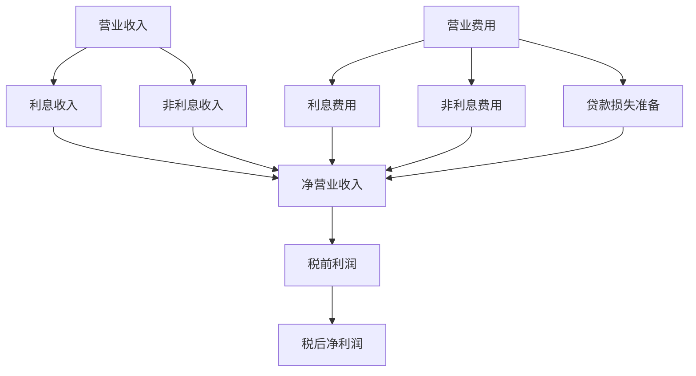
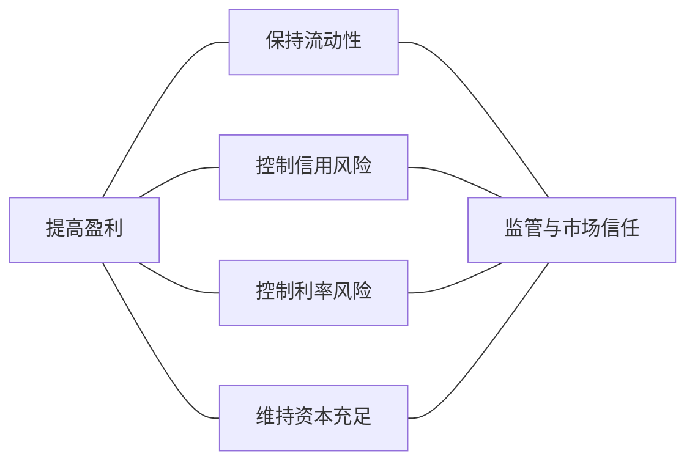

# 11.7 银行业绩指标与经营约束

来源：

- 主线：Mishkin《货币金融学》Ch.9
- 补充：Mishkin/Eakins Ch.17
- 延伸：Bodie/Kane/Marcus《Investments》Ch.18, Ch.24

看一家银行经营得好不好，不能只看“赚了多少钱”。大银行赚 10 亿美元和小银行赚 1000 万美元，不能直接比较；同一家银行今年利润很高，也可能是因为承担了过多风险，未来损失还没有出现。银行绩效指标的作用，是把利润放回资产规模、资本规模和利差结构中理解。

资产负债表告诉我们银行在某一时点有什么资产、负债和资本；利润表则告诉我们一段时期内收入和费用如何形成利润。理解银行经营约束，需要把两张表连起来看。

## 银行收入从哪里来

银行营业收入主要分为利息收入和非利息收入。

利息收入来自银行资产，尤其是贷款和证券。贷款通常是银行最大的收益来源，因为贷款收益率较高，也占资产较大比重。证券也产生利息收入，但收益通常低于贷款，尤其是高流动性政府证券。

非利息收入来自服务收费和表外业务。例如账户服务费、贷款承诺费、证券服务费、支付服务费、外汇服务收入、担保费用和交易收益等。随着银行竞争加剧和表外业务发展，非利息收入在银行收入中的重要性上升。

## 银行费用从哪里来

银行营业费用也可以分为利息费用和非利息费用。

利息费用是银行为负债支付的成本，包括存款利息、同业借款成本、存单利息和其他融资成本。市场利率上升时，银行负债成本通常上升；若资产收益调整较慢，利润会被压缩。

非利息费用是经营银行业务所需的成本，包括员工薪酬、网点租金、设备、技术系统、清算服务、合规和管理成本。即使某些存款利率很低，维护这些账户也需要付出大量运营成本。

还有一项重要费用是贷款损失准备。当银行预计某些贷款可能变成坏账，或已经出现坏账时，会把预期损失计入费用。贷款损失准备会直接降低当期利润。很多时期银行盈利恶化，并不是因为利差突然消失，而是因为此前发放的高风险贷款集中变坏，贷款损失准备大幅上升。



## ROA：资产使用得是否有效

净利润本身不能比较不同规模银行。资产收益率解决这个问题：

```text
ROA = 税后净利润 / 总资产
```

ROA 表示每一美元资产创造多少税后利润。它衡量银行管理者使用资产的效率。若两家银行资产规模不同，ROA 能帮助比较哪家银行更有效地把资产转化为利润。

但是 ROA 仍然不是股东最关心的指标。股东投入的是资本，不是全部资产。银行的大部分资产由存款和借款支持，因此股东会问：我的资本获得了多少回报？

## ROE：股东资本获得多少回报

权益收益率定义为：

```text
ROE = 税后净利润 / 权益资本
```

ROE 表示每一美元股东资本创造多少税后利润。它直接反映股东投资回报。

ROE 和 ROA 的关系是：

```text
ROE = ROA × 权益乘数
权益乘数 = 总资产 / 权益资本
```

这个关系解释了为什么银行资本管理如此敏感。若 ROA 不变，资本比例越低，权益乘数越高，ROE 越高。但这不是免费午餐。资本比例越低，银行承受资产损失的缓冲越薄，资不抵债风险越高。

| 指标 | 公式 | 回答的问题 | 局限 |
| --- | --- | --- | --- |
| 净利润 | 收入 - 费用 - 税 | 银行赚了多少钱 | 不考虑银行规模 |
| ROA | 税后净利润 / 总资产 | 资产使用效率如何 | 不直接反映股东杠杆回报 |
| ROE | 税后净利润 / 权益资本 | 股东资本回报如何 | 可能因高杠杆而虚高 |

## NIM：银行资产负债管理的利差表现

另一个常用指标是净息差：

```text
NIM = (利息收入 - 利息费用) / 总资产
```

净息差衡量银行资产收益和负债成本之间的差额。银行的一项核心中介功能，是发行负债取得资金，再购买产生利息收入的资产。如果银行能以较低成本取得资金，并把资金投向较高收益资产，净息差较高，盈利能力通常较好。若负债成本相对资产收益上升，净息差下降，利润会承压。

净息差尤其能帮助判断银行利润变化的原因。如果 ROA 和 ROE 下降，但净息差稳定，问题可能不是利率收入和资金成本的差额，而是贷款损失准备、非利息费用或其他损失增加。教材中对银行历史表现的分析就强调过这一点：有些时期银行盈利下降，并非因为利差恶化，而是因为此前的风险贷款变坏，贷款损失准备上升。

## 指标必须和经营约束一起看

ROA、ROE 和 NIM 都有用，但不能孤立使用。

高 ROE 可能来自优秀经营，也可能来自过低资本和过高杠杆。短期 ROA 很高，可能是因为银行大量发放高收益高风险贷款，而坏账尚未暴露。NIM 较高，可能反映资产收益强，也可能反映银行承担了更高信用风险或流动性风险。非利息收入增加，可能说明服务业务扩展，也可能说明表外业务风险上升。

因此，银行绩效必须放在约束中理解。第一是流动性约束，银行必须能应对存款流出。第二是信用风险约束，贷款必须经过筛选和监督。第三是利率风险约束，资产和负债对利率变化的敏感性不能失衡。第四是资本约束，银行必须有足够资本吸收损失。第五是监管约束，银行经营会影响存款人、支付体系和整体信贷，因此不能完全按股东短期收益最大化来运行。

用于投资分析时，这些指标还要放进同业和周期比较中。经济扩张后期，银行 ROE 和 NIM 可能看起来很好，但如果贷款增长过快、拨备不足、资本缓冲下降，真实风险可能正在上升；衰退初期，利润可能因拨备增加而恶化，但资本充足、存款稳定、资产质量可控的银行反而更有长期价值。因此，银行估值不能只用单年盈利倍数，还要结合资产质量、资本、流动性和宏观信用周期判断盈利的可持续性。

## 经营银行是一组相互牵制的选择

到这里，第 11 章的逻辑可以收束为一条线：银行从负债和资本取得资金，把资金配置到准备金、证券和贷款；通过资产转换创造流动性和利润；通过准备金和流动证券管理存款流出；通过资产管理、负债管理和资本管理平衡收益与风险；通过筛选、监督和内部控制处理信用风险、利率风险和表外风险；最后用 ROA、ROE、NIM 等指标评估经营结果。

银行经营没有单一最优按钮。提高贷款比例可能提高收益，也可能提高坏账和流动性风险；降低资本比例可能提高 ROE，也可能降低抗损失能力；更多表外业务可能增加手续费收入，也可能增加隐性风险；更多准备金提高安全性，却压低收益。银行管理的难点正在于这些目标彼此冲突。



## 小结

银行绩效不能只看净利润。ROA 衡量资产使用效率，ROE 衡量股东资本回报，NIM 衡量利息收入和利息费用之间的利差表现。利润表显示银行收入来自利息收入和非利息收入，费用来自利息成本、运营成本和贷款损失准备。任何绩效指标都必须结合风险和约束理解：高回报可能来自有效管理，也可能来自高杠杆、低流动性或高风险资产。银行经营的本质是在盈利、流动性、风险、资本和监管之间持续权衡。

## 自测问题

- 为什么净利润不能直接用来比较不同规模银行的经营好坏？
- ROA 和 ROE 分别回答什么问题？
- 为什么较低资本比例会提高 ROE，但也提高银行脆弱性？
- NIM 能帮助我们判断银行利润变化的哪些原因？
- 为什么银行估值不能只看单年 ROE 或市盈率？
