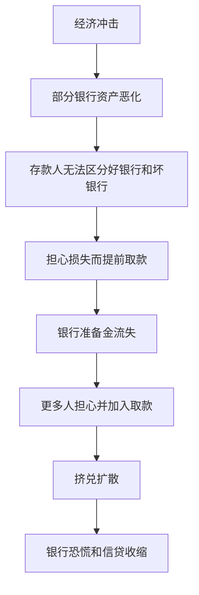

# 12.1 金融监管的经济学理由

来源：

- 主线：Mishkin《货币金融学》Ch.10, Ch.11
- 补充：Mishkin/Eakins Ch.18, Ch.19

金融监管不是因为金融机构天然“应该被管”，而是因为金融交易里存在普通市场难以自行解决的问题。银行和其他金融中介最重要的工作，是处理信息不对称：借款人比贷款人更了解自己的风险，金融机构比存款人更了解自己资产的质量，管理者比外部债权人更了解自己是否在冒险。只要这些信息差存在，金融体系就可能出现逆向选择、道德风险和恐慌。

监管的经济学理由，就是减少这些信息问题造成的过度风险承担，并降低单个机构问题向整个金融体系扩散的可能性。

## 存款人为什么难以监督银行

银行能够解决借款市场的信息问题，是因为它发放私人贷款、筛选借款人、监督贷款使用。但这又产生了另一层信息问题：存款人很难知道银行贷款质量到底如何。

如果一家银行把资金贷给许多企业和家庭，普通存款人没有能力逐笔检查贷款是否安全。即使存款人想监督，也会遇到成本过高和搭便车问题：一个存款人花费时间和金钱调查银行，调查结果却可能被其他存款人免费利用。于是多数存款人不会主动生产信息。

这会产生两个后果。第一，存款人可能不愿意把钱放进银行，金融中介功能受损。第二，一旦出现关于银行体系健康状况的坏消息，存款人可能无法分辨自己的银行是好银行还是坏银行，只能选择先取款保护自己。

## 银行恐慌为什么会发生

假设没有存款保险，经济遭遇一次冲击，5% 的银行因为贷款损失太大而资不抵债。问题是，存款人无法准确判断自己的银行是否属于这 5%。他们知道如果银行倒闭，自己可能不能拿回全部存款。

银行支付存款通常遵循先到先得的顺序。越早取款，越可能拿回资金；越晚排队，银行现金和准备金可能已经耗尽。因此，即使一个存款人并不确定银行有问题，也有强烈动机先跑去取钱。只要很多人这样想，好银行也会被挤兑。

这就是银行挤兑和银行恐慌的逻辑。单个银行被挤兑可能来自对其资产质量的怀疑；许多银行同时被挤兑，则会演变为银行恐慌。银行恐慌会迫使银行收缩贷款、出售资产、减少信用供给，进而损害整个经济。

## 监管为什么围绕逆向选择和道德风险展开

金融监管的很多形式，都可以从逆向选择和道德风险理解。

逆向选择发生在交易前。最希望进入金融行业的人，可能不是最稳健的人，而是愿意利用他人资金冒险的人，甚至可能是准备欺诈的人。如果没有准入审查，不合适的经营者可能控制金融机构。

道德风险发生在交易后。一旦银行获得存款、借款或政府保护，管理者可能选择更高风险资产。若投资成功，股东和管理层获得收益；若失败，损失可能由存款人、保险基金或纳税人承担。风险收益不对称会鼓励过度冒险。

因此，监管要做的不是替银行经营每一笔业务，而是限制那些信息不对称下最容易恶化的行为：谁能开银行，银行能持有哪些资产，资本必须有多少，信息必须披露到什么程度，风险管理是否有效，消费者是否理解金融产品。

## 八类金融监管的基本逻辑

教材把金融监管概括为八类。它们表面上各不相同，背后目标都是减少信息问题和过度风险承担。

| 监管类型 | 要解决的问题 | 基本作用 |
| --- | --- | --- |
| 资产持有限制 | 银行用受保护资金购买过高风险资产 | 限制风险资产和集中暴露 |
| 资本要求 | 银行资本太薄，失败成本外溢 | 增加损失缓冲和股东风险承担 |
| 及时纠正行动 | 监管介入太晚，损失扩大 | 资本下降时更早限制银行行为 |
| 准入和检查 | 不合适经营者进入金融业 | 筛选经营者并持续监督 |
| 风险管理评估 | 账面健康不等于未来安全 | 检查管理流程、限额和内部控制 |
| 信息披露 | 外部投资者和债权人信息不足 | 增强市场约束 |
| 消费者保护 | 消费者不了解复杂金融条款 | 要求透明说明成本和风险 |
| 竞争限制 | 过度竞争可能诱发风险承担 | 在某些时期保护机构稳定，但也可能降低效率 |

这些监管不是完美工具。限制太松，风险可能累积；限制太严，金融体系效率会下降。监管设计的难点正在于：既要让金融机构有动力提供服务和创新，又要避免它们把风险转嫁给存款人、保险基金或整个经济。

## 监管为什么总是追赶变化

金融监管还有一个现实困难：监管对象会变化。金融机构追求利润，会寻找新产品、新组织形式和新交易方式，有时也会寻找监管漏洞。监管者制定规则后，金融机构可能改变业务结构绕开规则；监管者再修改规则，形成持续的猫鼠游戏。

这不是偶然现象，而是金融创新和监管之间的内在张力。金融创新可能提高效率、降低成本、满足客户需求；也可能把风险转移到监管较弱的地方。监管者必须理解金融机构的激励，否则规则可能只改变风险出现的位置，而不能真正降低风险。

## 小结

金融监管的核心经济学理由是信息不对称。存款人难以判断银行资产质量，容易在不确定时挤兑；金融机构在政府保护或外部债权人监督不足时，可能过度承担风险。监管通过准入、检查、资本要求、资产限制、披露、消费者保护和风险管理评估，试图减少逆向选择、道德风险和系统性扩散。但监管面对的是不断创新和不断绕开规则的金融体系，因此监管本身也必须持续调整。

## 自测问题

- 为什么普通存款人很难有效监督银行资产质量？
- 银行挤兑为什么可能同时冲击好银行和坏银行？
- 逆向选择和道德风险分别对应监管中的哪些问题？
- 为什么金融监管既需要限制风险，又不能把金融创新完全压死？
