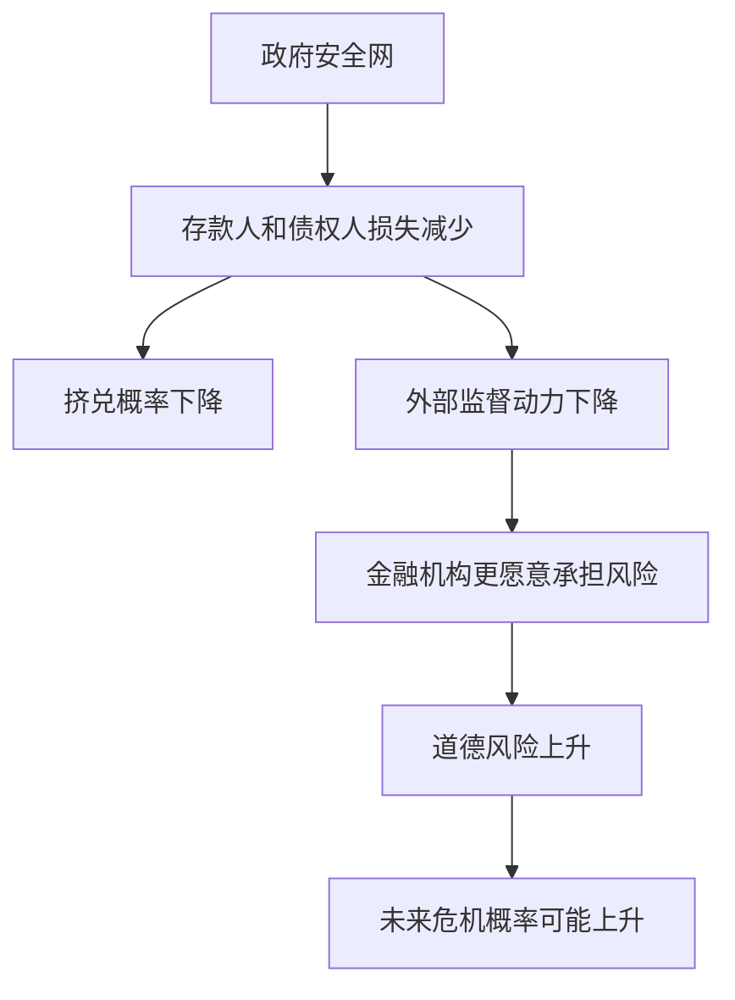

# 12.2 存款保险、政府安全网与道德风险

来源：

- 主线：Mishkin《货币金融学》Ch.10, Ch.11
- 补充：Mishkin/Eakins Ch.18, Ch.19
- 延伸：Bodie/Kane/Marcus《Investments》Ch.1, Ch.18

存款保险的出发点很直接：如果存款人相信即使银行倒闭也能拿回受保护存款，他们就没有必要在听到坏消息时立刻挤兑银行。这样，政府安全网可以切断银行恐慌的传播链条，让金融体系更稳定。

但同一项制度也会制造新的问题。存款人被保护后，监督银行的动力下降；银行知道资金来源更稳定，也可能承担更大风险。存款保险因此是一把双刃剑：它减少恐慌，却可能增加道德风险。

## 没有存款保险时，银行倒闭为什么伤害大

在美国 FDIC 于 1934 年开始运行之前，银行倒闭意味着存款人必须等待银行清算。银行资产变现后，存款人通常只能按比例收回部分存款。由于普通存款人无法判断银行管理层是否过度冒险，甚至无法判断是否存在欺诈，他们会对把钱放进银行保持警惕。

更严重的是，一家银行的问题可能引发对其他银行的怀疑。存款人不知道自己的银行是不是安全，只知道如果排在后面，银行可能已经没有足够现金支付。因此，挤兑具有自我强化特征：大家越担心，越要先取；越多人先取，银行越危险。

历史上，美国 19 世纪和 20 世纪初经常发生银行恐慌。大萧条期间 1930 到 1933 年银行倒闭数量尤其严重。存款保险正是在这种背景下成为政府安全网的核心制度。

## 存款保险怎样阻断挤兑

存款保险承诺，在银行倒闭时，保险机构会在规定限额内赔付存款人。以美国 FDIC 为例，它保证符合条件的存款人在保险限额内得到赔付。这样，受保护存款人即使担心银行健康，也不必急着取款，因为取款与否不改变受保存款的回收价值。

政府处理倒闭银行通常有两类方式。

第一种是赔付方式。保险机构允许银行倒闭，按保险限额赔付存款人，然后在银行清算中和其他债权人一起分配资产变现收入。超过保险限额的存款人可能需要等待较长时间，并可能只能收回部分金额。

第二种是购买与承接方式。保险机构寻找另一家愿意接收倒闭银行资产和负债的机构，使存款人和其他债权人不中断地获得服务。为了促成交易，保险机构可能提供补贴贷款或购买问题资产。实际效果常常是保护范围超过正式保险限额。

| 处理方式 | 基本做法 | 对存款人影响 | 成本特点 |
| --- | --- | --- | --- |
| 赔付方式 | 银行清算，保险机构按限额赔付 | 受保存款较快获得赔付，超额部分不确定 | 成本较可控 |
| 购买与承接 | 找机构承接倒闭银行负债和资产 | 服务连续性强，损失更少 | 可能成本更高 |

## 政府安全网不只包括存款保险

存款保险只是政府安全网的一种形式。政府还可能通过中央银行最后贷款人功能向困难机构提供流动性，也可能由财政部门直接注资、担保债务、接管问题机构，或在危机中保证债权人得到偿付。

政府这样做的原因是，某些金融机构太大、太复杂，或与其他机构联系太紧密。它们倒闭不只是自身股东和债权人的问题，还可能冲击支付、信贷和金融市场。2008 年危机中，投资银行、保险公司和其他非银行金融机构的困境显示，系统性风险并不限于传统商业银行。

## 道德风险：保护越强，监督越弱

政府安全网最严重的缺陷是道德风险。保险会改变人的行为。一个司机如果知道事故损失大部分由保险公司承担，可能开车更不谨慎。金融机构也是如此。

当存款人和债权人相信自己不会承担损失，他们就较少关注银行是否冒险。市场约束减弱后，银行更容易选择高风险高收益策略。成功时收益归股东和管理层，失败时损失由保险基金或纳税人承担。这种激励可以概括为：盈利归自己，亏损由别人承担。

道德风险还会吸引风险偏好更强的人进入金融业。若存款保险和政府保护使资金来源更容易获得，那些愿意进行高风险活动的人更有动力控制金融机构。更极端的情况下，欺诈者也可能被吸引，因为受保护存款人不会充分监督机构行为。

## “大而不能倒”的特殊问题

政府安全网在大型金融机构上会进一步扩大为“大而不能倒”问题。监管者担心大型机构倒闭会引发金融危机，因此不愿让其债权人承担损失。于是，不仅受保存款人可能被保护，未受保险覆盖的大额债权人也可能被保护。

这一政策最早在 Continental Illinois 案例中变得突出。监管者不仅保护保险限额内存款人，也保护大额存款人和债券持有人。随后市场逐渐相信，某些大型银行和复杂金融机构在危机中会得到特殊处理。

这种预期会加重道德风险。大额债权人如果知道自己不会亏损，就不会认真监督大型机构；大型机构也知道资金不会因为风险上升而迅速流失，于是更可能承担高风险。金融机构合并和规模扩张还会让这个问题更严重，因为更多机构可能变得具有系统重要性。

在投资分析中，政府安全网会形成隐性期权。银行股东持有的是带杠杆的剩余索取权：风险越高，上行收益越大；若下行部分由存款保险、中央银行或财政救助吸收，股东和管理层就像获得了一部分免费看涨期权。银行债权人则可能因为预期保护而接受较低收益率。这会压低大型机构融资成本，但也意味着市场价格可能低估真实系统性风险。

## 小结

存款保险和政府安全网可以阻断挤兑、保护存款人、稳定金融体系。它们通过让存款人相信受保存款安全，减少先到先得引发的恐慌。但安全网也削弱市场监督，鼓励金融机构承担更高风险，并可能吸引风险偏好强或不诚实的人进入金融业。“大而不能倒”进一步扩大这种问题，因为大型机构的债权人预期会被保护，从而减少监督。监管的难点是既要防止恐慌，又要限制安全网带来的道德风险。

## 自测问题

- 存款保险为什么能减少银行挤兑？
- 政府安全网为什么会削弱存款人和债权人的监督动力？
- “大而不能倒”为什么会让大型机构更容易承担过度风险？
- 存款保险为什么需要配合资本要求、检查和风险限制？
- 为什么政府安全网会被理解为大型金融机构的一种隐性融资补贴？
