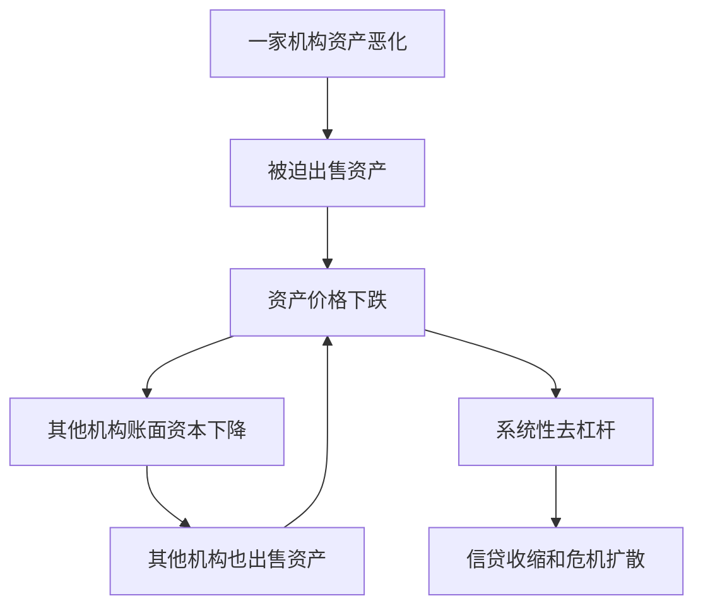

# 12.4 微观审慎监管与宏观审慎监管

来源：

- 主线：Mishkin《货币金融学》Ch.10, Ch.11
- 补充：Mishkin/Eakins Ch.18, Ch.19
- 延伸：Bodie/Kane/Marcus《Investments》Ch.1, Ch.24

金融危机以前，监管更多关注单个金融机构是否安全。这种思路叫微观审慎监管。它问的是：这家银行资本够不够？资产质量怎样？流动性是否充足？是否遵守披露和风险管理要求？

全球金融危机说明，只盯着单个机构不够。许多机构单独看似乎资本充足，但如果整个金融体系同时去杠杆、同时出售资产、同时失去短期融资，系统仍然会陷入危机。于是监管视角需要扩大到宏观审慎监管：不仅看单个机构，还要看整个金融体系是否脆弱。

## 微观审慎监管关注单个机构

微观审慎监管把每家金融机构分开看。监管者检查其资本比率、资产质量、风险暴露、信息披露和合规情况。如果资本不足，就要求及时纠正；如果风险太高，就限制业务；如果严重资不抵债，就关闭机构。

这种监管非常必要。没有单体监管，银行可以用过低资本支持高风险资产，或通过不透明业务隐藏风险。微观审慎监管相当于银行层面的体检，确保每家机构不明显带病运行。

但它有一个局限：系统风险不是单个机构风险的简单相加。每家机构为了自保采取的行为，合在一起可能伤害系统。

## 为什么单体安全不等于系统安全

假设一家金融机构遇到问题，被迫出售资产以满足资本或融资要求。大量出售会压低资产价格。其他机构持有同类资产，价格下跌后账面资本也下降，于是它们也被迫出售资产。更多出售进一步压低价格，形成连锁反应。

从单家机构角度看，卖资产是降低风险、补充流动性的理性选择；从系统角度看，所有机构同时卖资产会制造恶性循环。这就是宏观审慎监管要关注的问题。

影子银行体系的挤兑也说明了这个问题。某些机构不是传统银行，却依赖短期融资持有较长期资产。一旦投资者不愿续借，机构必须迅速出售资产或收缩信用，压力会扩散到其他市场和机构。微观监管若只看传统银行，就可能低估这种系统性脆弱。

## 宏观审慎监管关注整个金融体系

宏观审慎监管关注金融体系整体的安全和稳健。它问的问题是：整个体系杠杆是否过高？资产价格是否因为信用扩张被推高？短期融资依赖是否过重？许多机构是否持有相似资产并可能同时出售？如果发生冲击，体系是否有足够资本和流动性吸收损失？

它不只看资本，也看流动性。危机中，一些机构看似资本不低，却突然无法获得短期资金。融资来源一断，机构被迫卖资产，危机迅速扩散。因此，宏观审慎监管会关注稳定资金来源、短期融资占比和全系统流动性。

## 杠杆周期与逆周期监管

金融繁荣时，信用扩张推动资产价格上升；资产价格上升使金融机构资本看起来更充足；资本充足又支持更多贷款和投资；更多信用继续推高资产价格。这形成杠杆周期的上升阶段。

衰退时过程反向。资产价格下跌，资本减少，机构削减贷款和出售资产，进一步压低价格，导致更深的去杠杆和信贷收缩。

宏观审慎政策试图打断这个循环。一个思路是逆周期资本要求：在繁荣期提高资本要求，让机构多积累缓冲；在衰退期允许缓冲被使用，避免银行为了满足资本比率而过度收缩贷款。另一类工具是繁荣期收紧信用标准或限制信用增长，防止杠杆过快累积。

这和宏观投资环境直接相连。信用扩张期，企业盈利、房地产价格和风险资产估值往往一起上升，违约率看起来很低，信用利差也会被压窄；但这可能恰恰是系统性风险正在积累。宏观审慎监管试图让金融体系在好时期多留缓冲，本质上是在逆着市场顺周期乐观情绪行事。投资者若只根据当前低违约率定价，很容易在杠杆周期顶部低估未来损失。

| 监管视角 | 关注对象 | 主要问题 | 典型工具 |
| --- | --- | --- | --- |
| 微观审慎 | 单个金融机构 | 这家机构是否安全 | 资本比率、检查、及时纠正、风险管理评估 |
| 宏观审慎 | 整个金融体系 | 系统是否会共同失稳 | 逆周期资本、流动性要求、系统性机构监管、信用增长约束 |

## 微观和宏观不是替代关系

宏观审慎监管不是要取代微观审慎监管。单个银行如果资本不足、资产质量差、内部控制失效，仍然会成为危机源头。微观监管是基础。

但只做好微观监管也不够。即使每家机构都试图保护自己，如果它们在同一时间采取相同收缩行为，系统仍然可能崩溃。宏观审慎监管补充的是“相互作用”和“共同周期”视角。

因此，完整监管体系需要两层问题同时回答：每家机构是否健康？整个体系是否因为杠杆、流动性、相似资产和相互连接而脆弱？

## 小结

微观审慎监管关注单个金融机构安全，检查资本、资产质量、流动性、风险管理和合规情况。全球金融危机表明，单个机构看似安全并不保证系统安全，因为资产抛售、短期融资中断和共同去杠杆会在机构之间传播。宏观审慎监管关注金融体系整体，试图通过逆周期资本、流动性要求和系统性风险监测，削弱信用繁荣与资产价格上涨之间的反馈循环。两者是互补关系，而不是替代关系。

## 自测问题

- 微观审慎监管为什么不能完全防止金融危机？
- 单个机构出售资产自保，为什么可能加剧系统风险？
- 什么是杠杆周期？
- 逆周期资本要求怎样帮助缓和信贷繁荣和收缩？
- 为什么信用利差很窄、违约率很低时，系统性风险反而可能正在上升？
