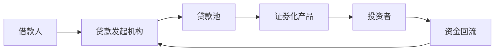

# 12.5 金融创新、影子银行与监管套利

来源：

- 主线：Mishkin《货币金融学》Ch.10, Ch.11
- 补充：Mishkin/Eakins Ch.18, Ch.19
- 延伸：Bodie/Kane/Marcus《Investments》Ch.2, Ch.14, Ch.24

金融体系不是静止的。只要经济环境、技术和监管发生变化，金融机构就会寻找新的产品、组织形式和融资方式。金融创新可以提高效率、降低交易成本、满足客户需求，但也可能把风险推向监管较弱的位置。影子银行体系的扩张，正是金融创新、证券化和监管约束共同作用的结果。

理解这一节，要抓住一个简单逻辑：金融机构为了利润，会对环境变化作出反应；监管也是环境的一部分。

## 金融创新来自需求、供给和监管变化

金融创新有三类主要动力。

第一是需求条件变化。利率波动加大后，投资者和金融机构更需要管理利率风险，于是可调利率抵押贷款、金融衍生品等工具发展起来。它们的出现并不是偶然，而是因为市场更需要能转移或降低利率风险的产品。

第二是供给条件变化，尤其是信息技术进步。计算机和通信技术降低了处理交易、收集信息和评估风险的成本，使信用卡、借记卡、自动柜员机、网上银行、虚拟银行和证券化等业务更容易推广。

第三是规避监管。金融机构如果发现某些规则提高了成本或限制了利润，会寻找合法或接近合法的替代结构绕开限制。这种“寻找漏洞”的过程会推动新工具和新组织形式出现。

| 创新动力 | 环境变化 | 典型结果 |
| --- | --- | --- |
| 需求变化 | 利率波动和风险管理需求上升 | 可调利率贷款、衍生品 |
| 供给变化 | 信息技术降低交易和信息成本 | 银行卡、电子银行、证券化 |
| 监管压力 | 原有规则限制盈利模式 | 新型账户、表外结构、非银行融资渠道 |

## 传统银行业务为什么相对下降

传统银行业务是用存款支持贷款。银行吸收存款，发放贷款，并把贷款留在资产负债表上。近几十年，这种模式的重要性相对下降。一部分贷款活动转向证券市场和非银行机构，形成影子银行体系。

影子银行并不是“非法银行”，而是指在传统商业银行之外完成类似信用中介功能的体系。它可能包括证券化机构、货币市场基金、投资银行、融资公司和其他市场型中介。它们也把资金从投资者传递给借款人，但不一定像商业银行那样受到同等存款保险、准备金和资本监管。

## 证券化怎样推动影子银行体系

证券化把贷款转化为可出售证券。传统银行发放住房贷款后，通常把贷款留在自己资产负债表上，等待借款人按月还款。证券化模式下，贷款被打包，现金流被重新分配给证券投资者。银行或贷款发起机构可以出售贷款，回收资金，再发放新贷款。

这个过程改变了信用中介结构。贷款发起、贷款持有、证券设计、信用评级、资金投资和风险承担可以分散在不同机构之间。好处是资金来源更广，贷款可以更快转化为市场证券；问题是责任链条变长，激励可能扭曲。发起贷款的人如果不长期持有风险，可能降低筛选借款人的谨慎程度。

## 影子银行的脆弱性

影子银行体系的一个关键问题是，它也可能发生类似银行挤兑的现象。传统银行的存款人可能挤兑银行；影子银行体系中，短期资金提供者也可能拒绝续借或要求更高抵押折扣。一旦融资中断，机构必须出售资产或缩减信用。

如果许多机构持有相似资产，资产出售会压低价格，引发更大范围的损失和去杠杆。这正是宏观审慎监管关注的机制。影子银行的风险不在于名字，而在于它承担了信用中介和期限转换功能，却可能没有同等强度的安全网和监管约束。

## 监管套利为什么难以避免

监管套利是金融机构利用规则差异降低监管成本的行为。例如，如果某类资产在资本规则下权重较低但真实风险较高，银行可能更多持有这类资产；如果某些活动放在表外或非银行机构中监管更轻，业务可能被转移到这些结构中。

监管套利的根源在于规则总是简化现实。监管必须把复杂风险分门别类，设置权重、限额和定义；金融机构则会研究这些定义，寻找资本占用较低、限制较少的路径。规则越复杂，可能越贴近风险，也越可能产生新的套利空间。

这并不意味着监管无用，而是说明监管必须持续更新。金融创新和监管套利会让风险位置变化，监管者需要跟踪风险真实承担者，而不能只看形式上是否属于传统银行。

## 创新不是坏事，问题在激励

金融创新能带来真实好处。可调利率贷款可以把部分利率风险从贷款机构转移出去；电子银行降低交易成本；证券化可以扩大资金来源；新支付工具提高便利性。问题不在于“新”，而在于风险是否被正确识别、定价和承担。

如果创新让风险更透明、更分散、更易管理，它能提高金融效率。如果创新让风险隐藏、责任分散、资本要求降低、监督减弱，它可能增加系统脆弱性。监管需要区分这两种情况。

对投资者来说，金融创新最危险的地方通常不是产品名字复杂，而是现金流、杠杆和流动性承诺不匹配。证券化产品可能把贷款现金流切成不同优先级，使高评级部分看起来安全；货币市场基金和回购融资可能让短期投资者以为自己持有近似现金的资产。但如果底层资产相关性上升、市场流动性消失或抵押品折扣提高，原本被分散的风险会重新集中到卖方、担保方和短期资金提供者身上。

## 小结

金融创新来自需求变化、信息技术进步和规避监管的激励。它推动传统存款贷款模式的一部分业务转向证券市场和非银行机构，形成影子银行体系。证券化扩展了资金来源，却也拉长了责任链条，可能削弱贷款筛选激励。影子银行也会发生类似挤兑的融资中断，并通过资产抛售和去杠杆传播风险。监管套利说明金融机构会寻找规则缝隙，因此监管必须跟踪真实风险，而不是只看机构名称或账面形式。

## 自测问题

- 金融创新的三类主要动力是什么？
- 影子银行为什么也属于信用中介体系？
- 证券化怎样改变传统银行“发放并持有贷款”的模式？
- 监管套利为什么会让监管者不断追赶金融机构？
- 分析金融创新产品时，为什么要同时看底层资产、杠杆和流动性承诺？
