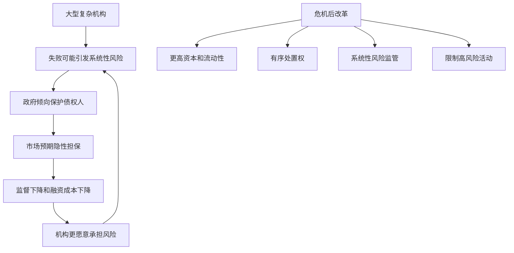

# 12.7 大而不能倒与危机后的监管改革

来源：

- 主线：Mishkin《货币金融学》Ch.10, Ch.11
- 补充：Mishkin/Eakins Ch.18, Ch.19

“大而不能倒”不是说大型金融机构不会倒，也不是说管理层和股东一定会被保护。它真正指的是：当一家大型或高度关联的金融机构陷入困境时，监管者担心其倒闭会引发系统性危机，因此不愿让所有债权人承担正常市场损失。结果是，市场预期大型机构会获得特殊保护。

这种预期会改变行为。债权人监督减弱，机构融资更容易，管理层更敢承担风险。危机后的监管改革，很大一部分都是围绕如何削弱“大而不能倒”带来的道德风险展开。

## 为什么“大而不能倒”会形成

大型金融机构的失败可能通过多条渠道扩散。它可能欠许多机构钱，也可能为许多合同提供担保，还可能持有大量相似资产，或者承担支付、融资和市场信心方面的重要角色。监管者担心，如果让它突然破产，其他机构会遭受损失，市场会恐慌，短期融资会中断，资产价格会下跌。

因此，监管者在危机中可能选择保护大额债权人、安排并购、提供流动性或注入资本。短期看，这样能避免恐慌；长期看，它会让市场相信大型机构享有隐性担保。

这种隐性担保本质上是一种风险补贴。债权人相信自己受保护，就愿意以较低成本向大型机构提供资金；大型机构的融资优势又鼓励其继续扩大规模和复杂性。

## 金融合并如何加重大而不能倒

银行跨州经营、金融服务融合和大型并购，使金融机构规模更大、业务更复杂。商业银行、证券、保险、资产管理和其他业务可能处在同一金融集团内。规模和复杂性越高，监管者越担心其失败的系统影响。

这带来两个问题。第一，更多机构可能被视为具有系统重要性，从而扩大隐性安全网范围。第二，政府安全网可能从传统存款业务延伸到证券、保险或其他活动，鼓励这些业务也承担更高风险。

2008 年危机中，Bear Stearns、Lehman Brothers、AIG 等非传统商业银行机构的困境说明，系统性风险已经不局限于受保存款银行。大型独立投资银行最终消失或转型为银行控股公司，也表明金融服务结构在危机中发生了重大变化。

## Dodd-Frank 改革的主要方向

2010 年 Dodd-Frank 法案是大萧条以来美国最全面的金融改革之一。它试图减少危机重演概率，主要覆盖几个方面。

第一，消费者保护。法案设立消费者金融保护机构，加强对住房抵押贷款和其他金融产品的监管，要求贷款人核实借款人的还款能力，限制把借款人推向高价贷款的激励，并提高存款保险覆盖。

第二，处置权。危机前，政府有权处置倒闭银行，但对大型金融控股公司缺乏类似工具。Dodd-Frank 提供了对系统性金融公司的处置权，使政府能接管并有序清算这类机构，而不是只能在救助和无序破产之间选择。

第三，系统性风险监管。法案设立金融稳定监督委员会，监测资产价格泡沫和系统性风险，识别系统重要性金融机构。被认定为系统重要的机构将接受更严格监管，包括更高资本标准、更严格流动性要求，以及提交“生前遗嘱”，说明困境中如何有序清算。

第四，Volcker 规则。受保存款和政府安全网保护的银行，不应大量用自有资金承担高风险交易，也不应大比例拥有对冲基金和私募股权基金。该规则试图限制银行把安全网用于支持高风险活动。

第五，衍生品监管。危机显示，某些衍生品合约可能放大相互连接和违约风险。改革要求许多标准化衍生品通过集中清算和更透明平台处理，定制化产品则需要更高资本和保证金，并增加信息披露。

| 改革方向 | 试图解决的问题 |
| --- | --- |
| 消费者保护 | 借款人不理解复杂贷款条款 |
| 处置权 | 大型金融公司无法有序关闭 |
| 系统性风险监管 | 风险在机构之间积累和传播 |
| Volcker 规则 | 安全网支持下的高风险自营活动 |
| 衍生品监管 | 合约不透明和交易对手风险 |

## 解决“大而不能倒”的三种思路

危机后围绕“大而不能倒”有三类主要方案。

第一，拆分大型系统重要性金融机构。若没有机构大到足以威胁系统，监管者就不必救助它们，市场纪律可以恢复。做法可以是重新分离不同金融业务，或限制单个机构资产规模。但如果大型机构确实有范围经济、规模经济或更好的风险分散能力，强行拆分也可能降低效率。

第二，对系统重要性机构施加更高资本要求。更高资本提供更厚损失缓冲，也让股东有更多资金承担风险，减少道德风险。资本要求还可以逆周期调整，在信用繁荣时提高，在信用收缩时允许缓冲释放，以减弱信用周期。

第三，依靠 Dodd-Frank 的处置权、系统性监管和 Volcker 规则。有观点认为这些措施已经显著降低“大而不能倒”；也有观点认为，只要市场仍相信政府危机时会保护大型机构债权人，问题就没有完全消失。

## 改革之后仍然留下的问题

监管改革不可能一次性解决所有问题。薪酬激励仍可能鼓励短期收益和长期风险错配；政府支持企业和住房金融体系仍涉及隐性担保；复杂金融集团的跨国处置仍需要国际协调；新金融创新也可能把风险转移到监管框架之外。

更深层的难题是，危机时监管者面对的是两种坏选择：不救助可能引发系统崩溃，救助则加重未来道德风险。危机后的监管改革试图提前建立资本、流动性、处置和信息披露机制，让下一次遇到大型机构困境时，不必只能在这两种坏选择中二选一。

## 小结

“大而不能倒”源于大型或高度关联金融机构失败可能引发系统性危机。政府为避免危机而保护债权人，会削弱市场监督并增加道德风险。金融合并和业务融合使这一问题更加突出。Dodd-Frank 改革通过消费者保护、系统性风险监管、有序处置权、Volcker 规则和衍生品监管，试图降低危机重演概率。解决“大而不能倒”的方案包括拆分大型机构、提高系统重要性机构资本要求，以及依靠危机后监管框架。但只要市场相信大型机构在危机中会被保护，道德风险就仍需持续约束。

## 自测问题

- “大而不能倒”为什么不是简单地说大型机构不会失败？
- 隐性政府保护怎样降低债权人监督动力？
- Dodd-Frank 法案主要从哪些方面回应金融危机？
- 拆分大型机构和提高资本要求分别有什么优点和代价？
