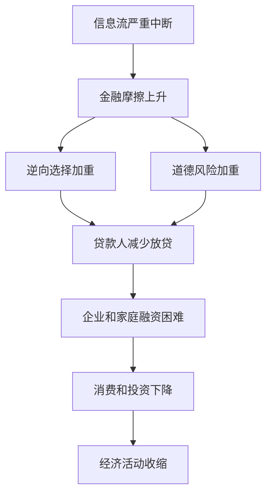

# 13.1 金融危机的定义：信息问题和信用中断

来源：

- 主线：Mishkin《货币金融学》Ch.12, Ch.13
- 补充：Mishkin/Eakins Ch.8, Additional Ch.25

金融危机不是简单的“股市下跌”，也不是某几家金融机构亏损。资产价格下跌、银行倒闭、企业破产、失业上升，都是危机中常见的现象，但它们不是定义本身。要理解金融危机，必须回到金融体系的基本功能：把储蓄者的资金引导给有生产性投资机会的家庭和企业。

正常情况下，金融市场和金融中介通过收集信息、筛选借款人、监督贷款使用、设计合同和分散风险，使资金能够流向更有价值的用途。可是这些过程从来不是无摩擦的。借款人比贷款人更了解自己的风险，金融机构比外部投资者更了解资产质量，管理层比债权人更了解自己是否在冒险。这些信息问题会造成金融摩擦。

金融摩擦指的是阻碍资金有效配置的各种信息和激励障碍。当金融摩擦上升时，金融体系把资金从储蓄者转移给借款者的能力下降。金融危机就是金融市场中的信息流出现严重中断，金融摩擦急剧上升，金融市场和金融机构无法正常发挥资金融通功能，经济活动随之收缩。

## 为什么信息中断会变成信用中断

贷款和投资依赖信息。贷款人需要判断借款人能不能还钱、愿不愿还钱、借款用途是否过于冒险。若信息变得不可靠，贷款人就很难区分好借款人和坏借款人。为了避免把钱借给坏风险，贷款人会减少放贷，或者只愿意以更苛刻条件放贷。

这会使逆向选择和道德风险同时恶化。逆向选择是交易前的问题：风险最高的借款人往往最愿意借钱，也最愿意接受高利率。道德风险是交易后的问题：借款人拿到资金后，可能把钱投向贷款人不希望承担的高风险项目。

当金融体系信心下降时，即使有好项目、好企业、好家庭，也可能得不到资金。金融危机的破坏性就在这里：它不是只惩罚坏借款人，而是会使整个信用筛选机制失灵，连本来可以创造产出的活动也被迫停止。

## 金融危机为什么比普通衰退更危险

普通经济衰退中，需求下降、企业销售减少、失业上升，但金融体系未必失去功能。只要银行和市场仍能评估风险、提供信贷，经济就有恢复通道。金融危机则直接损害这条通道。

金融危机发生时，银行资本下降、资产价格下跌、抵押品价值下降、资金提供者撤回资金，金融机构被迫收缩资产。借款人想借钱，贷款人不敢贷；银行想保命，不愿扩张；投资者想避险，资金流向最安全资产。于是，经济中的支付、借贷和投资链条同时收紧。

这就是为什么金融危机之后常伴随严重经济收缩。金融系统本应帮助经济吸收冲击，危机中却变成冲击的放大器。

## 发达经济体和新兴市场危机的共同核心

发达经济体和新兴市场危机的具体路径不同。发达经济体危机常从信用繁荣、资产价格泡沫、金融机构资产负债表恶化和银行危机开始；新兴市场危机常叠加货币危机、外币债务和资本外流。

但共同核心相同：金融摩擦上升，逆向选择和道德风险恶化，信贷收缩，经济活动下降。无论危机表现为银行挤兑、影子银行融资中断、房地产泡沫破裂、货币贬值还是主权债务违约，最终都会通过信用渠道影响企业、家庭和就业。

| 现象 | 为什么重要 | 如何连接金融危机定义 |
| --- | --- | --- |
| 资产价格下跌 | 减少抵押品和净值 | 借款人信用质量下降 |
| 银行资本受损 | 银行损失吸收能力下降 | 银行减少贷款 |
| 不确定性上升 | 风险更难判断 | 贷款人停止筛选并收缩信用 |
| 存款或短期资金撤离 | 金融机构流动性恶化 | 被迫出售资产和去杠杆 |
| 债务实际负担上升 | 借款人净值下降 | 逆向选择和道德风险更严重 |

## 小结

金融危机的本质是信息流严重中断，使金融摩擦急剧上升，金融体系不能有效把资金从储蓄者转移给有生产性机会的借款者。危机中，逆向选择和道德风险加重，贷款人减少放贷，企业和家庭融资困难，消费和投资下降，经济活动收缩。资产价格下跌、银行倒闭和货币贬值都是危机的重要表现，但它们之所以危险，是因为它们破坏了信用配置机制。

## 自测问题

- 什么是金融摩擦？它为什么会影响资金配置？
- 为什么信息中断会导致贷款收缩？
- 金融危机和普通经济衰退的区别在哪里？
- 为什么不同类型金融危机最终都会影响消费、投资和就业？
