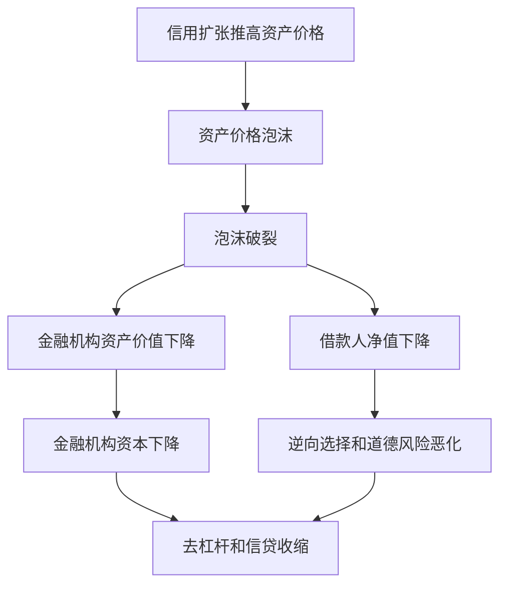

# 13.2 初始冲击：资产价格下跌、不确定性上升、资产负债表恶化

来源：

- 主线：Mishkin《货币金融学》Ch.12, Ch.13
- 补充：Mishkin/Eakins Ch.8, Additional Ch.25

金融危机通常不是突然从天而降。它往往先经历一段看似繁荣的时期：贷款快速增长，资产价格上升，金融创新扩张，风险被低估。危机的第一阶段，就是这种繁荣被打断后，资产负债表、抵押品和信息环境同时恶化。

发达经济体金融危机的初始阶段通常有三类触发因素：信用繁荣后的破裂，资产价格泡沫破裂，以及不确定性突然上升。它们会相互强化，共同推高金融摩擦。

## 信用繁荣怎样埋下危机种子

信用繁荣常出现在金融创新或金融自由化之后。新贷款产品、新证券结构、新融资渠道出现，金融机构发现可以更快扩张业务。长期看，金融创新和自由化可能提高资本配置效率；短期看，如果监管、风险管理和信息筛选跟不上，它们会推动过度贷款。

贷款扩张初期，违约还没有暴露，资产价格上升，金融机构利润增加，市场容易相信风险降低。银行和其他金融机构可能放松贷款标准，进入自己不熟悉的业务领域。政府安全网又会削弱资金提供者的监督，因为存款人和债权人相信自己受保护，愿意继续给银行提供资金。

问题在于，信用繁荣终会超出金融机构筛选和监督风险的能力。坏贷款开始增加，贷款价值下降，金融机构资产减少，而负债仍要偿还。资本下降后，金融机构必须去杠杆：收缩贷款、出售资产、减少风险暴露。贷款繁荣于是转为贷款崩塌。

## 资产价格泡沫为什么会放大金融摩擦

资产价格泡沫指资产价格被推高到超过其基本价值的水平。基本价值来自资产未来收入流的现实预期；泡沫价格则更多受乐观心理、信用扩张和持续上涨预期推动。股票和房地产都可能出现泡沫。

当泡沫破裂，资产价格下跌会通过两条路径加剧危机。

第一，企业和家庭净值下降。净值是资产减负债。资产价格下跌后，借款人抵押品价值下降，自己承担损失的空间变小。贷款人会认为借款人“自己押在里面的钱”少了，违约和冒险动机上升，于是提高贷款标准或减少贷款。

第二，金融机构资产价值下降。银行、投资银行、保险公司和基金若持有相关资产，资产价格下跌会直接冲减其资本。资本受损后，金融机构必须收缩资产，进一步减少信贷。

## 不确定性上升为什么会冻结贷款

金融危机常发生在不确定性突然上升之后。例如经济衰退开始、股市崩盘、重要金融机构失败，都会使投资者和贷款人难以判断真实风险。历史上，美国多次危机都出现在大型金融机构失败或市场崩盘后。

不确定性上升会使信息问题更严重。贷款人不知道哪些借款人可靠，也不知道金融机构资产是否真实安全。既然判断困难，最直接的反应就是少贷、短贷、提高要求，或者只持有最安全资产。这会使好借款人也得不到资金，经济活动开始收缩。

不确定性和资产价格下跌还会互相强化。价格下跌让人怀疑资产质量，怀疑又促使投资者出售资产，进一步压低价格。

## 资产负债表恶化为什么是关键传导环节

金融危机分析反复强调资产负债表，是因为金融交易依赖净值和资本。企业净值越高，贷款人越相信其会谨慎行动，也越容易取得融资；银行资本越厚，债权人越相信银行能吸收损失，也越愿意提供资金。

当资产价格下跌或贷款损失增加，企业净值和银行资本都会下降。企业净值下降，借款能力下降；银行资本下降，放贷能力下降。借款人更需要资金时，贷款人却更不愿提供资金。经济收缩由此开始。

这一逻辑可以用三层资产负债表理解：

| 主体 | 初始冲击 | 资产负债表变化 | 结果 |
| --- | --- | --- | --- |
| 企业和家庭 | 房价、股价或收入下降 | 净值下降、抵押品减少 | 借款更难，支出下降 |
| 银行和金融机构 | 贷款和证券价值下降 | 资本下降 | 去杠杆、减少贷款 |
| 投资者和债权人 | 不确定性上升 | 更偏好安全资产 | 撤回资金、提高融资条件 |

## 小结

金融危机的初始阶段通常由信用繁荣破裂、资产价格下跌和不确定性上升共同触发。信用繁荣使贷款标准下降并积累坏账；资产价格泡沫破裂会削弱借款人净值和金融机构资本；不确定性上升使贷款人难以筛选风险。三者通过资产负债表恶化推高逆向选择和道德风险，导致信贷收缩和经济活动下降。

## 自测问题

- 为什么金融创新和金融自由化可能先带来信用繁荣，再埋下危机风险？
- 资产价格下跌怎样同时影响借款人和金融机构？
- 不确定性上升为什么会使好借款人也难以融资？
- 为什么资产负债表是理解金融危机传导的核心？
