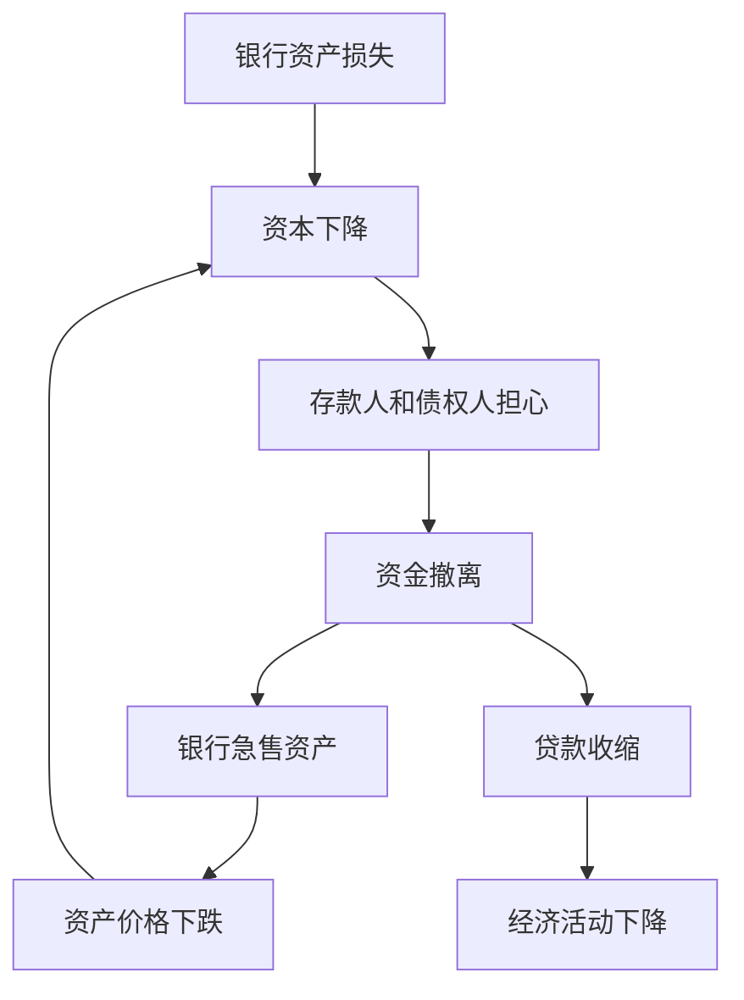
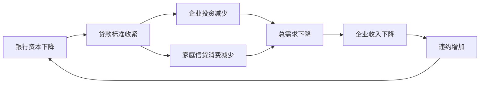

# 13.3 银行危机、流动性危机与信用收缩

来源：

- 主线：Mishkin《货币金融学》Ch.12, Ch.13
- 补充：Mishkin/Eakins Ch.8, Additional Ch.25
- 延伸：Bodie/Kane/Marcus《Investments》Ch.2, Ch.14

金融危机进入第二阶段时，问题不再只是资产价格下跌或贷款标准收紧，而是金融机构本身开始失去偿付能力或流动性。银行和类银行机构一旦陷入困境，信用中介功能会迅速受损。它们不再积极筛选借款人、发放贷款和支持投资，而是忙于保住现金、出售资产和减少负债。

这就是银行危机和流动性危机的核心：金融机构本来应当把资金送到需要资金的人手里，危机中却变成资金流动的堵点。

## 银行危机怎样从资产负债表恶化开始

银行资产主要包括贷款和证券，负债主要包括存款和借款。当贷款坏账增加、证券价格下跌，银行资产价值下降；负债却不会自动减少。资产跌到低于负债时，银行资本变成负数，银行资不抵债。

即使银行还没有资不抵债，只要资本大幅下降，市场也会担心它无法承受进一步损失。存款人、同业债权人和其他资金提供者可能撤回资金。银行为了应对资金流出，被迫出售资产或减少贷款。若许多机构同时这样做，资产价格进一步下跌，更多银行资本受损。

## 银行恐慌为什么会传染

银行恐慌的传染源是信息不对称。存款人不知道银行贷款组合质量，也不知道哪家银行安全。若他们怀疑某些银行有问题，就可能同时从好银行和坏银行取款。

银行按先到先得方式支付存款。每个存款人都知道，越早取款越安全，越晚可能什么也拿不到。于是，即使存款人无法确认银行真的有问题，也会为了自保提前取款。好银行也可能因挤兑被迫出售资产，甚至陷入困境。

资产急售会让问题更严重。金融机构急着换取现金，通常必须降低价格出售资产。低价出售使资产价格进一步下跌，其他机构持有的同类资产也被重新定价，资本继续下降。银行恐慌因此不仅是存款人排队取款，也是资产价格、资本和流动性之间的连锁反应。

## 流动性危机不只发生在传统银行

2007-2009 年危机显示，类似银行挤兑的机制也会发生在影子银行体系。许多非存款金融机构依赖短期融资购买长期或复杂资产。它们没有传统存款，却同样存在“短借长投”和流动性错配。

回购融资就是一个关键例子。金融机构用抵押贷款支持证券等资产作为抵押，取得短期借款。当市场相信抵押品安全时，贷款人要求的折扣很低；当抵押品质量被怀疑时，贷款人要求更多抵押品。这个折扣上升意味着同样资产能借到的钱减少。

如果折扣从接近 0 上升到很高水平，机构无法续借足够资金，只能出售资产。资产出售压低价格，抵押品价值下降，贷款人要求更高折扣，机构进一步缺钱。这和传统银行挤兑很像，只是排队取款的人换成了短期资金提供者。

## 信用收缩怎样传到实体经济

银行危机最终伤害实体经济，是因为信用收缩。银行和其他金融机构停止或减少贷款后，企业无法为库存、工资、设备投资和扩张计划融资；家庭难以获得住房、汽车或消费信贷；地方政府和项目融资也会受阻。

更严重的是，金融机构在正常时期生产了大量关于借款人的私人信息。银行倒闭或收缩时，这些信息关系也会消失。新的贷款人无法立刻替代原银行，因为它们不了解借款人的历史、现金流和风险。金融体系重新建立信息渠道需要时间，因此危机后的信贷恢复往往很慢。

信用收缩还会反过来加剧银行损失。企业得不到资金，经营恶化，违约增加；家庭收入下降，贷款违约增加；资产价格继续下跌，银行抵押品价值下降。银行危机和实体经济衰退互相强化。

## 银行危机怎样改变总需求

从宏观支出法看，银行危机最直接压低投资和消费。企业投资需要外部融资，尤其是中小企业更依赖银行贷款。大企业可以发行债券或股票，小企业往往没有这个渠道。银行收缩贷款时，中小企业首先削减库存、设备投资和雇用计划。投资下降会使 GDP 中的 `I` 下降。

家庭消费中的一部分也依赖信贷。住房贷款、汽车贷款、信用卡额度和消费分期，都取决于金融机构愿不愿放贷。银行危机中，家庭即使愿意消费，也可能因为贷款条件收紧而无法支出。消费 `C` 因此下降。

政府购买 `G` 在短期可能起到缓冲作用，但金融危机往往也会打击财政收入。失业上升使税收下降，救助金融体系和自动稳定器支出上升，政府预算压力增加。如果政府被迫紧缩，财政政策缓冲能力也会受限。

因此，银行危机不是一个独立金融事件，而是总需求冲击的放大器：

这条链条解释了为什么中央银行在银行危机中不仅关注银行本身，还关注宏观稳定。银行体系如果不能恢复放贷，即使政策利率下降，总需求也可能难以恢复。

在投资组合层面，流动性危机会让“可卖资产”和“应卖资产”发生错配。机构为了满足赎回、保证金或短期融资要求，往往先卖最容易交易的资产，而不是最差的资产。这会把压力传导到原本质量较高的市场，使流动性溢价上升。危机中的价格下跌因此不一定完全代表基本面恶化，也可能代表现金需求和资产可交易性的重新定价。

## 危机什么时候开始缓和

危机缓和通常需要不良机构被关闭、重组或出售，市场不确定性下降，资产价格稳定，银行资本修复。公共部门和私人部门可能介入：监管者关闭资不抵债机构，政府或中央银行提供流动性，健康机构收购问题机构，银行筹集新资本。

一旦金融市场重新能评估风险、金融机构重新有能力放贷，金融摩擦下降，信用中介功能恢复，经济才有复苏基础。

## 小结

银行危机从资产负债表恶化开始，资本下降引发存款人和债权人担忧，资金撤离迫使银行出售资产并收缩贷款。银行恐慌会通过信息不对称传染给好银行，资产急售又会压低价格、进一步削弱资本。流动性危机也会发生在影子银行体系，短期融资中断和抵押品折扣上升会迫使机构去杠杆。最终，信用收缩使企业和家庭融资困难，消费和投资下降，经济衰退加深。

## 自测问题

- 银行资产负债表恶化为什么会引发资金撤离？
- 银行恐慌为什么会同时冲击好银行和坏银行？
- 影子银行挤兑和传统银行挤兑有什么相似之处？
- 为什么银行危机会使实体经济的融资渠道受损？
- 为什么危机中优质流动资产也可能被抛售并出现价格压力？
