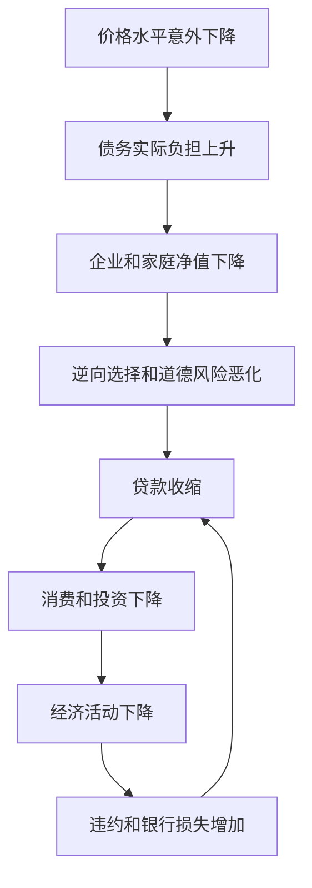

# 13.4 债务通缩、去杠杆与经济衰退

来源：

- 主线：Mishkin《货币金融学》Ch.12, Ch.13
- 补充：Mishkin/Eakins Ch.8, Additional Ch.25
- 延伸：Bodie/Kane/Marcus《Investments》Ch.14, Ch.16

金融危机如果只停留在银行危机阶段，随着问题机构被清理、资产价格稳定、信用逐步恢复，经济可能开始复苏。但如果经济下滑引发价格水平大幅下降，危机就会进入更深一层：债务通缩。

债务通缩不是普通的物价下降。它危险在于，许多债务合同用名义金额固定下来，价格水平意外下降后，债务的实际负担上升。借款人的资产价值不一定上升，负债的实际价值却增加，净值被进一步压缩。金融摩擦因此继续恶化，经济衰退被拉长。

## 名义债务为什么会在通缩中变重

大多数债务合同约定的是固定名义金额。企业欠银行 9000 万美元，不会因为整体物价下降而自动减少欠款。若物价下降 10%，每一美元的实际购买力上升，债务的实际负担也上升。

假设一家企业在 2022 年有资产 1 亿美元，长期负债 9000 万美元，净值是 1000 万美元。2023 年价格水平意外下降 10%。用 2022 年购买力衡量，9000 万美元名义负债的实际价值变成 9900 万美元，而企业资产的实际价值没有同步上升。企业实际净值从 1000 万美元降到 100 万美元。

| 项目 | 通缩前 | 价格水平下降 10% 后 |
| --- | ---: | ---: |
| 资产实际价值 | 1 亿美元 | 1 亿美元 |
| 负债实际价值 | 9000 万美元 | 9900 万美元 |
| 净值 | 1000 万美元 | 100 万美元 |

净值下降后，企业承担损失的空间变小，贷款人更担心违约和冒险行为。逆向选择和道德风险加重，贷款进一步收缩。

## 债务通缩怎样加剧去杠杆

去杠杆指借款人和金融机构减少债务、压缩资产负债表。危机中，银行资本受损会去杠杆，企业净值下降也会去杠杆。债务通缩会让这个过程更痛苦。

价格下降使债务实际负担上升，企业和家庭不得不用更多收入偿债，减少消费和投资。收入下降又使更多借款人违约，银行损失增加。银行为了保资本，继续减少贷款或出售资产。资产出售压低价格，抵押品价值下降，进一步加剧融资困难。

## 大萧条为什么是典型案例

大萧条展示了债务通缩的破坏力。1928 到 1929 年美国股价快速上升，随后 1929 年 10 月股市崩盘，到 1929 年底跌幅约 40%，之后继续大幅下跌。资产价格下跌很快传导到其他国家，股票和大宗商品价格普遍下滑。

资产价格下跌使银行资产负债表承压，并引发多国银行恐慌。美国、意大利、比利时、德国、瑞士、奥地利等都出现银行挤兑或大量银行失败。美国在 1931 年 8 月到 1932 年 1 月之间就有大量银行倒闭。

银行失败和资产价格下跌使信贷收缩，世界贸易急剧下降，经济活动恶化。随后债务通缩开始发挥作用。价格继续下降，新贷款停止，因为贷款人担心借款人净值下降；价格又因为信用收缩和需求下降继续下跌。经济陷入相互强化的下降过程。

## 为什么债务通缩会让复苏被“短路”

金融危机缓和需要资产负债表修复。企业需要恢复净值，银行需要恢复资本，贷款人需要重新相信借款人质量。但债务通缩会同时破坏这些条件。

对企业和家庭来说，价格下降提高债务实际负担，削弱净值。对银行来说，借款人更容易违约，贷款损失增加，资本被侵蚀。对经济整体来说，消费和投资下降，收入减少，进一步提高违约概率。复苏所需的信用扩张因此迟迟不能出现。

这也是为什么防止通缩螺旋常成为危机政策的重要目标。若价格水平持续下降，货币和财政政策即使想刺激经济，也可能被沉重债务负担抵消。

## 和物价、实际变量的连接

前面宏观章节区分了名义变量和实际变量。债务通缩正是这个区分在危机中的应用。债务合同写的是名义金额，但借款人的偿债能力取决于实际收入和实际资产价值。价格水平下降时，同一笔名义债务代表更多实际购买力，债务负担变重。

这也解释了为什么通缩不只是“东西变便宜”。如果工资、收入和资产价格同时下降，而债务名义金额不变，借款人的实际处境可能变差。家庭为了偿债减少消费，企业为了偿债减少投资，银行因为违约增加而减少贷款。总需求进一步下降后，价格水平还可能继续下行。

从 AD-AS 角度看，债务通缩会把一次总需求下降变成更持久的收缩。总需求下降使产出和价格下降；价格下降提高实际债务负担；实际债务负担上升又压低消费和投资，使总需求继续下降。后面学习总需求总供给时，这条反馈链会成为理解深度衰退的重要基础。

固定收益投资中，债务通缩会同时改变无风险利率和信用风险。通缩压力可能压低名义安全利率，使高质量国债价格上升；但企业和家庭实际债务负担上升，会推高违约概率和信用利差。于是同样是“利率下降”，对国债和信用债的含义完全不同：前者可能受益于避险和低通胀，后者可能因违约损失预期上升而下跌。

## 小结

债务通缩发生在价格水平意外大幅下降时。由于债务合同以名义金额固定，通缩会提高债务实际负担，使企业和家庭净值下降。净值下降加重逆向选择和道德风险，贷款收缩，消费和投资下降，违约增加，银行资本继续受损。大萧条是典型债务通缩危机：资产价格下跌、银行失败、信用收缩和物价下降互相强化，使经济陷入长期严重收缩。

## 自测问题

- 为什么名义债务在通缩中会变得更沉重？
- 债务通缩怎样影响企业净值和贷款人的放贷意愿？
- 去杠杆为什么会和资产价格下跌相互强化？
- 大萧条中债务通缩怎样加深经济衰退？
- 为什么通缩环境下，高质量国债和信用债可能出现相反表现？
