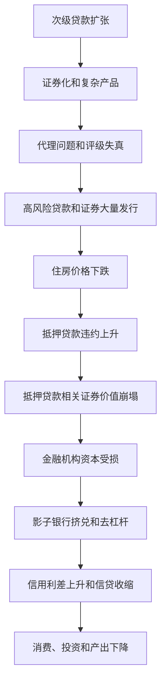

# 13.5 2007-2009 金融危机机制

来源：

- 主线：Mishkin《货币金融学》Ch.12, Ch.13
- 补充：Mishkin/Eakins Ch.8, Additional Ch.25
- 延伸：Bodie/Kane/Marcus《Investments》Ch.2, Ch.14, Ch.24

2007-2009 年金融危机证明，类似大萧条时期的金融危机并没有从发达经济体中消失。危机起点在美国住房金融市场，但它很快扩散到整个美国金融体系和其他国家。理解这场危机，不能只说“房价下跌”，而要看金融创新、激励扭曲、信用评级、影子银行融资和全球金融联系怎样连成一条危机链。

## 住房金融创新怎样扩大风险

2000 年代初，信息技术和证券化发展使次级抵押贷款更容易被打包出售。次级贷款面向信用较弱、传统上难以获得贷款的借款人。住房价格持续上涨时，这种业务看起来很有吸引力：借款人可以再融资或卖房还款，投资者能获得较高收益，贷款机构能不断扩大业务。

金融工程进一步创造出复杂结构性产品，其中最典型的是 CDO。它把一组抵押贷款支持证券或其他债务现金流分成不同层级。优先层先获得支付，风险较低、利率较低；较低层级后获得支付，风险更高、收益更高。这种结构似乎能把风险重新分配给不同偏好的投资者。

问题在于，结构越复杂，投资者越难看清基础资产质量，也越难判断风险到底由谁承担。金融创新本可以改善风险分配，但在这里反而减少了市场中的有效信息，加重了信息不对称。

## “发放并出售”模式中的代理问题

传统贷款模式下，银行发放贷款并持有贷款，因此有动力认真审查借款人。危机前的抵押贷款市场中，许多贷款经纪人采用“发放并出售”模式。他们发放贷款后很快把贷款卖给证券化链条中的其他机构，自己主要赚取手续费。

这制造了委托代理问题。最终投资者希望贷款质量好，贷款经纪人却按发放数量赚钱。一旦手续费到手，经纪人未必关心借款人未来是否还款。结果是贷款标准下降，风险较高的购房者和房地产投机者更容易获得贷款。

这种激励还鼓励误导和欺诈。有些借款人被引导到自己负担不起的贷款，有些申请材料被美化甚至伪造。监管松弛使问题进一步扩大。

商业银行和投资银行也有类似激励。它们通过承销抵押贷款支持证券和结构性产品赚取高额费用，却未必长期持有风险。保险公司和其他机构通过信用违约互换等合约承担大量信用风险，也从手续费和保费中受益。

## 信用评级为什么没有解决信息问题

投资者本可以依靠信用评级机构判断复杂证券风险。但评级机构也存在利益冲突。它们一方面为客户设计复杂产品提供建议，另一方面又给这些产品评级，并从发行人处获得费用。

如果评级过低，客户可能转向其他机构；如果评级较高，产品更容易卖出，评级机构也能获得更多业务。这种结构削弱了评级准确性的激励。许多复杂产品获得了过高评级，投资者低估了真实风险。

评级失真让高风险资产看起来像安全资产，扩大了需求，也使风险在全球金融体系中扩散。

## 房价下跌如何引爆资产负债表恶化

住房价格上涨时，次级借款人即使还款困难，也可以通过再融资或卖房解决问题。住房价格下跌后，这条路关闭。许多借款人的房屋价值低于未偿贷款余额，贷款“水下化”。挣扎中的房主有动力放弃房屋，违约和止赎迅速增加。

违约上升使抵押贷款支持证券和 CDO 价值下跌。持有这些资产的银行、投资银行、保险公司和基金资产价值下降，资本受损。资本下降后，金融机构开始去杠杆，卖出资产、压缩贷款、限制信用。

这正是金融危机的典型机制：住房价格下跌不是孤立事件，它通过证券化资产进入金融机构资产负债表，再通过资本和信贷渠道影响整个经济。

## 影子银行挤兑和全球扩散

危机中，影子银行体系发生了类似银行挤兑的融资中断。投资银行、基金和其他非存款机构依赖回购等短期融资购买抵押贷款相关资产。抵押品价值被怀疑后，资金提供者要求更高折扣。同样抵押品能借到的钱减少，机构被迫出售资产。

资产急售压低价格，抵押品价值进一步下降，折扣继续上升，更多机构缺乏流动性。这形成影子银行挤兑。2007 年 8 月，BNP Paribas 暂停部分货币市场基金赎回，被视为危机扩散的重要信号。随后 Northern Rock 等依赖短期融资的机构遭遇挤兑或倒闭。

危机迅速全球化，是因为非美国金融机构也大量持有美国抵押贷款相关资产或与其相关的衍生品。全球资本市场相互连接，使美国某一市场的损失扩散到欧洲和其他地区。

## 高峰：大型机构失败与信用利差飙升

2008 年危机达到高峰。Bear Stearns 因次级相关资产和回购融资压力被迫出售给 J.P. Morgan。Fannie Mae 和 Freddie Mac 因巨大抵押贷款相关风险被政府接管。Lehman Brothers 于 2008 年 9 月 15 日申请破产，成为美国历史上最大破产案之一。AIG 因信用违约互换风险和评级下调遭遇极端流动性危机，最终获得政府救助。

Lehman 破产后，市场恐慌急剧上升。信用利差大幅扩大，借款人面对更高融资成本，消费和投资急剧下降。美国实际 GDP 在 2008 年后期和 2009 年初大幅收缩，失业率在 2009 年升至 10% 以上。这场衰退成为二战后美国最严重的经济收缩之一，被称为“大衰退”。

## 为什么它变成“大衰退”

这场危机之所以从住房金融问题变成宏观经济衰退，关键在于金融链条最终压低了总需求。家庭财富因房价和股票价格下跌而减少，住房贷款和消费信贷变紧，消费下降。企业面对销售下滑、信用利差上升和贷款收缩，削减投资和雇用。金融机构去杠杆又使这些收缩更严重。

用支出法看，危机同时冲击 `C` 和 `I`。消费下降来自财富缩水、收入不确定性和信贷收缩；投资下降来自融资成本上升、需求预期恶化和银行贷款减少。净出口也受到全球危机拖累，因为其他国家同时衰退，外部需求下降。政府购买和财政转移虽然能缓冲部分下降，但难以完全抵消私人支出的急剧收缩。

失业率上升则是产出下降的结果。企业销售减少和融资困难后，先削减投资、减少工时，再裁员。失业上升使家庭收入下降，贷款违约增加，进一步损害银行和抵押贷款证券。金融危机因此形成金融变量和宏观变量之间的双向反馈。

| 金融机制 | 对宏观变量的影响 |
| --- | --- |
| 房价下跌和财富缩水 | 消费下降，住房支出下降 |
| 信用利差上升 | 企业融资成本上升，投资下降 |
| 银行和影子银行去杠杆 | 贷款供给收缩，消费和投资受限 |
| 全球金融联系 | 危机跨国传播，净出口和资本流动受影响 |
| 失业上升 | 收入下降、违约增加、需求继续下降 |

因此，大衰退不是“金融市场亏损较大”这么简单，而是金融体系中介功能失灵后，消费、投资、就业和国际贸易同时受到冲击。

这场危机也说明，信用评级和分散化不能替代对底层风险的理解。许多结构化产品在模型中看似通过分层和资产池分散了风险，但当房价全国性下跌、融资市场冻结、评级被集中下调时，相关性和流动性假设同时失效。投资学中的组合分散化要求风险来源不完全相同；如果不同证券都依赖同一个房价周期、同一批短期资金和同一套评级模型，表面分散并不是真正分散。

## 小结

2007-2009 年金融危机由住房金融创新、发放并出售模式、评级机构利益冲突和全球资本联系共同推动。住房价格上涨掩盖了次级贷款风险，复杂证券化产品把风险扩散到全球投资者。房价下跌后，违约上升，抵押贷款相关证券价值崩塌，金融机构资本受损。影子银行短期融资中断引发急售和去杠杆，大型机构失败放大恐慌，信用利差上升，最终导致消费、投资和产出急剧下降。

## 自测问题

- “发放并出售”模式为什么削弱贷款审查激励？
- CDO 等复杂产品为什么可能加重信息不对称？
- 房价下跌怎样传导为金融机构资产负债表恶化？
- 影子银行挤兑为什么会使危机迅速恶化？
- 2007-2009 年危机为什么说明评级分散不等于经济风险分散？
