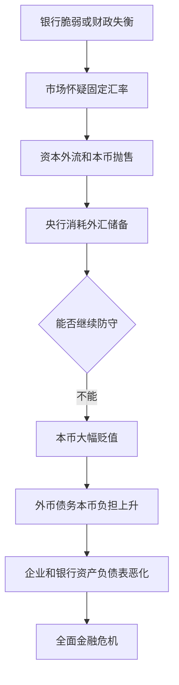
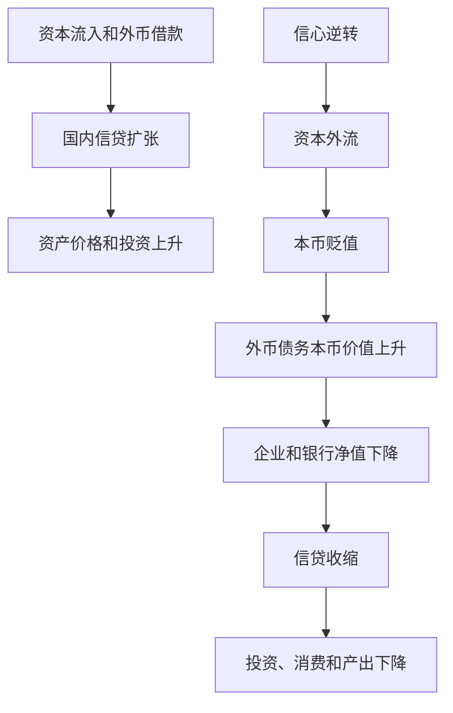

# 13.6 新兴市场危机：货币错配、资本流动与汇率崩盘

来源：

- 主线：Mishkin《货币金融学》Ch.12, Ch.13
- 补充：Mishkin/Eakins Ch.8, Additional Ch.25
- 延伸：Bodie/Kane/Marcus《Investments》Ch.23, Ch.24

新兴市场金融危机和发达经济体危机有共同核心：金融摩擦上升，逆向选择和道德风险恶化，信贷收缩，经济活动下降。但新兴市场危机常多出一个关键环节：货币危机。银行和企业大量用外币借款，本币突然贬值后，债务负担以本币计算急剧上升，资产负债表瞬间恶化。

这就是货币错配的危险。收入和资产主要以本币计价，债务却以美元等外币计价。一旦汇率崩盘，债务实际负担会跳升，危机从金融系统扩散到整个经济。

## 两条常见起点：自由化失控和财政失衡

新兴市场危机通常沿两条路径展开。

第一条是金融自由化和金融全球化管理不当。一个国家放开金融市场和资本流动后，国内银行可以更容易从国外借钱，再把资金贷给国内企业。资本流入、固定汇率和乐观预期会推动信贷繁荣。如果银行监管薄弱，筛选和监督借款人的能力不足，贷款会快速流向高风险项目。

新兴市场金融体系通常证券市场和非银行金融部门不够成熟，银行在信用中介中更关键。一旦银行资产负债表恶化，没有足够替代渠道接手融资，信贷收缩对经济伤害更大。

第二条是严重财政失衡。政府赤字过大、债务难以融资时，可能强迫或诱导国内银行购买大量政府债券。投资者一旦怀疑政府偿债能力，就抛售政府债券，债券价格下跌，持有这些债券的银行资产价值大幅下降。银行资本受损后减少贷款，金融摩擦上升。

## 为什么弱监管会使自由化变危险

金融自由化本身并不必然导致危机。长期看，它可以促进金融发展、扩大融资渠道、提高资本配置效率。问题在于，如果在监管和制度基础薄弱时快速自由化，风险会过快积累。

新兴市场常存在较弱的信用文化：贷款筛选不充分、借款人监督不足、银行监管资源有限、政治和商业利益影响监管。银行所有者和大型企业可能推动放松监管，以便快速扩张贷款和投资。若成功，收益归私人；若失败，政府可能救助银行，成本由纳税人承担。

因此，自由化是否安全，取决于资本监管、风险管理、信息披露、监管独立性和法律制度是否先建立起来。

## 货币危机怎样爆发

当银行资产负债表恶化、财政状况失控、利率上升、资产价格下跌或政治不确定性上升时，外汇市场参与者会开始怀疑固定汇率能否维持。

若一个国家承诺本币对美元固定，中央银行必须在市场卖出本币、买入外币时用外汇储备支撑汇率。问题是，如果银行体系已经脆弱，政府很难通过大幅提高利率来保卫汇率。提高利率虽然可能吸引资本流入，却会提高银行和企业融资成本，使它们更容易破产。

投机者看到这种两难处境，会押注本币贬值，大量卖出本币。中央银行消耗外汇储备买入本币。储备耗尽后，政府只能放弃固定汇率，本币贬值或崩盘。

## 货币错配为什么使危机变成“孪生危机”

发达经济体多数债务以本币计价，本币贬值未必直接增加国内借款人的名义债务。但许多新兴市场企业和银行借的是美元债或其他外币债。

假设一家企业收入和资产主要以本币计价，却欠 100 万美元债务。本币兑美元贬值一半后，这笔美元债务用本币计算翻倍。企业资产没有同步翻倍，净值大幅下降，甚至资不抵债。银行持有这些企业贷款，也会遭受损失。

货币贬值还会推高进口价格，引发通胀。若中央银行缺乏抗通胀信誉，预期通胀也会上升，国内利率随之上升。更高利率降低企业现金流，进一步加重违约风险。银行资产端因贷款损失下降，负债端若有外币负债则上升，资产负债表两边同时受压。

这种货币危机和金融危机同时出现的情况，常被称为孪生危机。

## 韩国、阿根廷和冰岛说明了什么

韩国 1997-1998 年危机体现了自由化管理不当路径。金融全球化带来大量资本流入，银行和企业借入外币资金，监管未能有效限制风险。资本流动逆转和本币贬值后，企业和银行资产负债表迅速恶化，经济大幅收缩。

阿根廷 2001-2002 年危机体现了财政失衡路径。政府长期赤字，银行被迫持有大量政府债务。投资者失去信心后，政府债价格下跌，银行资产负债表恶化，银行挤兑出现。固定汇率制度最终崩溃，比索大幅贬值，美元债务以比索计算急剧上升，经济陷入严重萧条。

冰岛 2008 年危机说明，即使是高收入经济体，如果金融自由化、外币融资、巨大银行体系和监管不足同时出现，也会呈现类似新兴市场危机的机制。银行资产规模远超本国政府救助能力，外币债务沉重，货币贬值后企业和家庭净值被严重冲击。

## 和开放经济宏观的连接

前面开放经济基础会讲到汇率、资本流动和国际收支。新兴市场危机把这些变量和金融资产负债表连在一起。资本流入时，经常伴随国内信贷扩张和资产价格上涨；资本突然流出时，本币贬值、外汇储备下降、国内利率上升，银行和企业同时承压。

固定汇率制度下，中央银行为了维持汇率，需要动用外汇储备，甚至提高利率吸引资金。但提高利率会压低投资和消费，也会增加借款人的偿债压力。如果银行体系已经脆弱，保汇率和救银行可能互相冲突。这就是开放经济中的政策约束：国内金融稳定、汇率稳定和货币政策独立性不能总是同时满足。

货币错配还会改变汇率贬值的宏观效果。普通开放经济模型中，本币贬值可能通过提高出口竞争力改善净出口。但如果企业和银行有大量外币债务，贬值会先破坏资产负债表，导致信贷收缩和投资下降。此时，贬值的扩张性出口效应可能被资产负债表收缩效应压过。

对国际投资者来说，新兴市场危机提醒我们，汇率风险和信用风险不能分开看。一个美元债券投资者似乎不承担本币贬值损失，因为债券以美元计价；但发行人的收入和资产若以本币计价，本币贬值会提高其偿债压力，美元债违约风险反而上升。股票投资者也类似，汇率贬值可能提高出口企业收入，却会压低有外币债务企业的股权价值。

## 小结

新兴市场金融危机常由金融自由化和全球化管理不当，或严重财政失衡引发。弱监管和资本流入会推动信用繁荣，财政失衡会损害银行资产负债表。银行脆弱、资本外流和固定汇率压力会诱发货币危机。本币贬值通过货币错配提高外币债务的本币负担，压缩企业和银行净值，引发信贷崩塌、通胀上升、利率上升和经济收缩。货币危机与银行危机相互强化，形成孪生危机。

## 自测问题

- 新兴市场危机的两条常见起点是什么？
- 为什么金融自由化需要强监管和信息披露配合？
- 固定汇率下，银行体系脆弱为什么会使投机攻击更容易成功？
- 货币错配怎样把本币贬值转化为企业和银行的资产负债表危机？
- 为什么持有新兴市场美元债仍然需要分析发行人的本币收入和外币债务？
